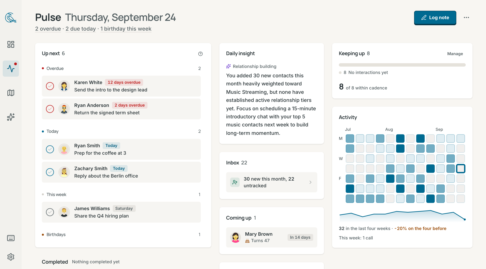
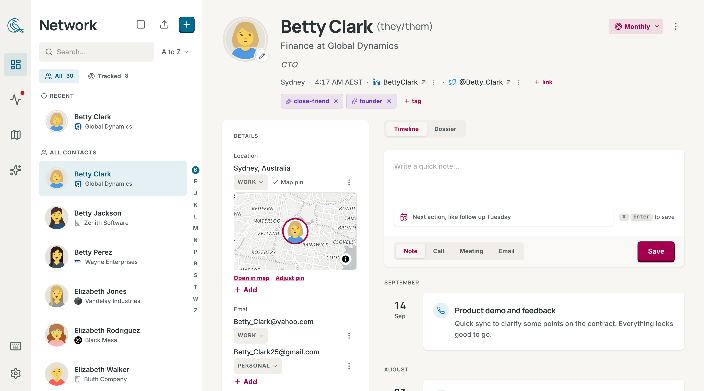
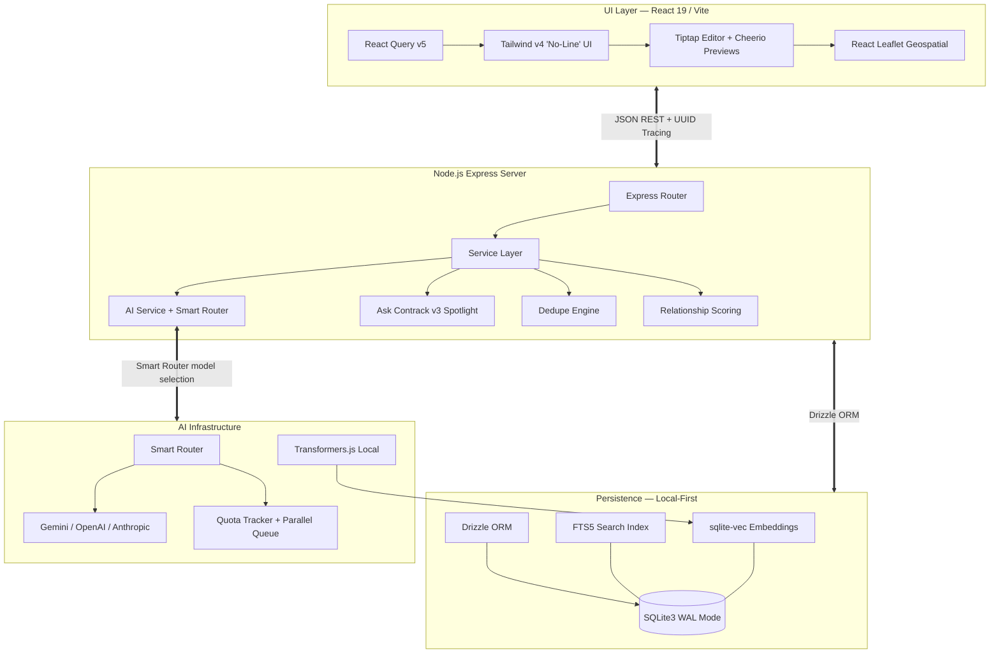

<div align="center">
  <h1>🤝 Contrack</h1>
  <p><b>The Personal AI Relational Engine for High-Leverage Individuals</b></p>
  
  [](https://www.gnu.org/licenses/agpl-3.0)
  [](https://nodejs.org/)
  [](https://sqlite.org/)
  [](https://react.dev/)
  [](https://tailwindcss.com/)
  [](https://www.typescriptlang.org/)
  [](https://vitest.dev/)
  [](http://makeapullrequest.com)
</div>

<br/>

<!-- Hero screenshot — contact list + profile detail -->
<!--  -->

Contrack isn't just an address book — it's a **Personal AI Relational Engine**. Paste raw meeting notes, drag in email exports, or brain-dump unstructured text and watch the AI parse it into structured, richly-typed contact profiles. The system autonomously deduplicates, scores relationships, extracts entity networks, and surfaces proactive intelligence so you never lose track of who matters.

**Built for** creative directors, freelancers, founders, and executives who need a CRM that works as fast as they do.

---

## ✨ Features

<table>
<tr>
<td width="50%">

### 🔍 Ask Contrack (AI Search)
Hybrid RAG pipeline combining FTS5 + local vector KNN via Reciprocal Rank Fusion. Results stream in two phases: instant retrieval (<15ms) then AI-enriched reasons (~500ms).

<!--  -->

</td>
<td width="50%">

### ⌘ Command Palette (Cmd+K)
GitHub-style command center with faceted filters (`role:`, `company:`, `tag:`), action sub-menus, inline note composer, zero-state CRM intelligence, and deep profile peek.

<!--  -->

</td>
</tr>
<tr>
<td width="50%">

### ⚡ Intelligent Deduplication
Multi-pass engine using phonetic matching, Levenshtein distance, E.164 phone normalization, and AI embeddings. Swipeable card review with configurable auto-merge thresholds and one-click undo.

<!--  -->

</td>
<td width="50%">

### 💓 Relationship Pulse
Proactive intelligence dashboard with automated scoring (frequency × recency × depth), action item swimlanes, network health metrics, and AI-generated daily insights.

<!--  -->

</td>
</tr>
<tr>
<td width="50%">

### 🗺️ Geospatial Mapping
Interactive cluster map via React Leaflet with Mapbox/Nominatim geocoding. Click pins to open contact detail overlays.

<!--  -->

</td>
<td width="50%">

### 👤 Rich Contact Profiles
Timeline with @mention network weaving, AI briefings, Ghost entity extraction, multi-value fields, vibe colors, and data age halos.

<!--  -->

</td>
</tr>
</table>

### More Capabilities

- **Magic Paste** — Paste unstructured text, AI extracts a structured contact
- **Multi-Provider AI** — Gemini (default), OpenAI, or Anthropic via provider-agnostic adapters
- **Smart Router** — Automatic Gemini model selection (Lite/Flash/Pro) per use case
- **Batch Enrichment** — AI-powered web research to hydrate contact profiles
- **Custom Lists** — Unlimited groups with icons, drag-to-reorder, bulk membership
- **Doc2Query** — Write-time search expansion via AI for better recall
- **Ghost Detection** — Passive entity extraction from notes creates ghost contacts
- **@Mentions** — Bi-directional relationship graph via Tiptap rich text
- **AI Cache Telemetry** — Multi-tiered LRU caching with full transparency dashboard
- **Enterprise Virtualization** — <20ms page transitions for 100K+ contacts
- **Quick Note** (`Cmd+Shift+I`) — Log interactions from anywhere
- **Link Unfurling** — Zero-Chromium OpenGraph extraction via Cheerio
- **Logo Proxy** — Heuristic company logo discovery with local caching

---

## 🚀 Quick Start

### Option 1: Docker (Recommended)

The easiest way to run Contrack is via Docker Compose. This ensures all native dependencies (like `sqlite-vec`) work perfectly.

```bash
git clone https://github.com/arvarik/contrack.git
cd contrack
cp .env.example .env
# Add your API key (GEMINI_API_KEY, OPENAI_API_KEY, or ANTHROPIC_API_KEY)
docker-compose up -d
```

Open **http://localhost:3210**. Data is automatically persisted to `./data`.

### Option 2: Native Installation

```bash
git clone https://github.com/arvarik/contrack.git
cd contrack
npm install
cp .env.example .env
# Add your API key (GEMINI_API_KEY, OPENAI_API_KEY, or ANTHROPIC_API_KEY)
npm run dev
```

Open **http://localhost:3210**. The server auto-initializes the database, loads embedding models, and starts background tasks.

> **Seed data:** Run `npm run seed` to populate with demo contacts.

---

## 🛠️ Technology Stack

| Domain | Technology |
|--------|-----------|
| **Frontend** | React 19, Vite 6, React Query v5, Tailwind CSS v4, Tiptap, Motion |
| **Backend** | Node.js 22, Express, TypeScript (tsx), Zod validation |
| **Database** | SQLite3 (WAL mode), Drizzle ORM, FTS5, sqlite-vec |
| **AI** | Gemini / OpenAI / Anthropic (provider-agnostic adapter pattern) |
| **Search** | Hybrid RAG: FTS5 keyword + 384-dim local vector KNN (Transformers.js) |
| **Mapping** | React Leaflet + Leaflet Cluster, Mapbox/Nominatim geocoding |
| **Testing** | Vitest — 180 tests, <600ms |

---

## 📚 Documentation

Full documentation lives in the [`docs/`](docs/) directory:

| Guide | Description |
|-------|-------------|
| [Getting Started](docs/getting-started.md) | Installation, first boot, scripts, keyboard shortcuts |
| [Configuration](docs/configuration.md) | Environment variables, AI provider setup, tier tuning |
| [Architecture](docs/architecture.md) | System overview, data flow, schema, caching |
| [API Reference](docs/api-reference.md) | Complete REST API with curl and JavaScript examples |

### Feature Guides

| Feature | Guide |
|---------|-------|
| Contact Management | [docs/features/contact-management.md](docs/features/contact-management.md) |
| Command Palette | [docs/features/command-palette.md](docs/features/command-palette.md) |
| AI Search | [docs/features/ai-search.md](docs/features/ai-search.md) |
| Deduplication | [docs/features/deduplication.md](docs/features/deduplication.md) |
| Pulse Dashboard | [docs/features/dashboard-pulse.md](docs/features/dashboard-pulse.md) |
| Map View | [docs/features/map-view.md](docs/features/map-view.md) |
| Lists | [docs/features/lists.md](docs/features/lists.md) |

---

## 🔐 Environment Variables

| Variable | Description | Default |
|----------|-------------|---------|
| `AI_PROVIDER` | LLM provider: `gemini`, `openai`, `anthropic` | `gemini` |
| `GEMINI_API_KEY` | Gemini API key | — |
| `OPENAI_API_KEY` | OpenAI API key | — |
| `ANTHROPIC_API_KEY` | Anthropic API key | — |
| `AI_TIER` | `FREE` or `PAID` rate limit profile | `FREE` |
| `PORT` | Express listening port | `3210` |
| `MAPBOX_API_KEY` | Mapbox geocoding (optional, higher accuracy) | — |

See [Configuration Guide](docs/configuration.md) for full details.

---

## ⚡ System Architecture



---

## 🤝 Contributing

See [CONTRIBUTING.md](CONTRIBUTING.md) for development standards, code style, and PR process.

---

## 📜 License

This project is licensed under the [GNU Affero General Public License v3.0](LICENSE). This means you can use, modify, and distribute the code, but any modified versions — including those offered as a network service (SaaS) — must also be open-sourced under AGPL v3.
