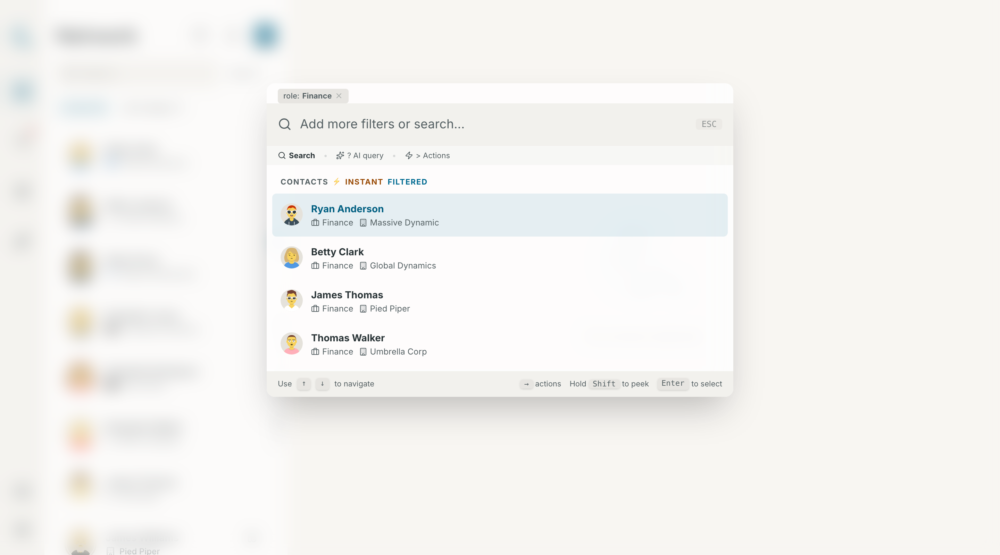
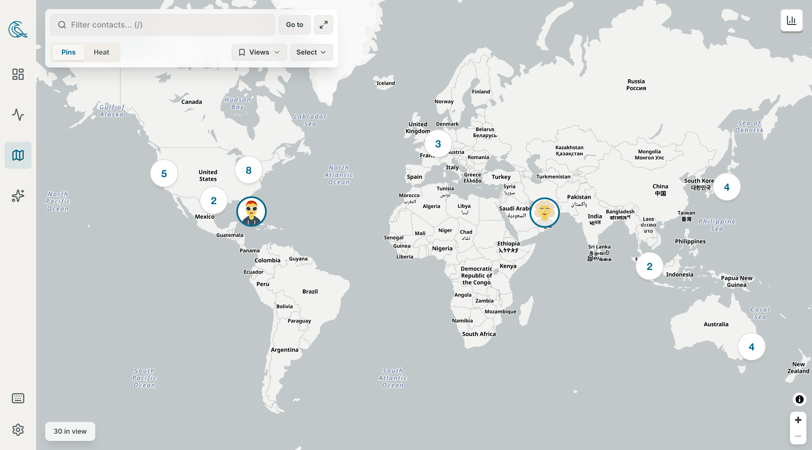
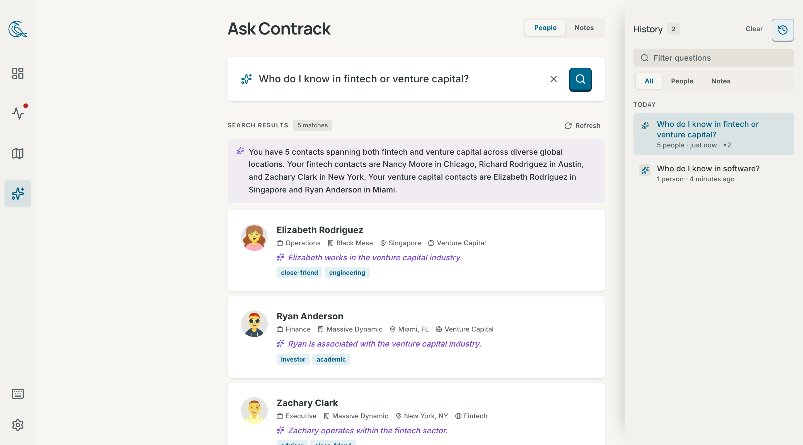
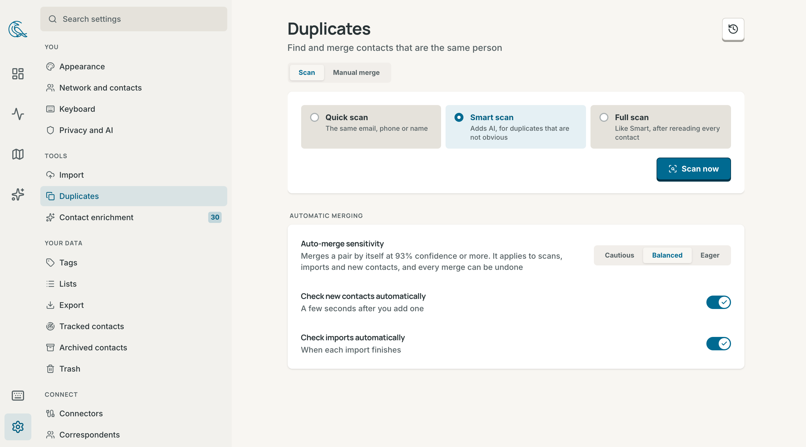
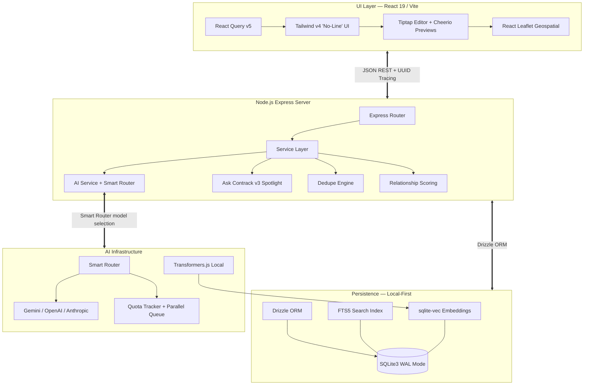

<div align="center">
  <h1>🤝 Contrack</h1>
  <p><b>People Relationship Manager for Proactive Networking</b></p>

[](https://www.gnu.org/licenses/agpl-3.0)
[](https://nodejs.org/)
[](https://sqlite.org/)
[](https://react.dev/)
[](https://tailwindcss.com/)
[](https://www.typescriptlang.org/)
[](https://vitest.dev/)
[](http://makeapullrequest.com)
</div>

<br/>

Relationships are your most valuable asset, but they're also the hardest thing to keep track of. Contacts scattered across Apple, Google, and LinkedIn. Names you recognize but can't quite place. Introductions you meant to follow up on but never did. **Contrack fixes that.**

Sync your contacts from every source into one unified network with automatic dedupe across platforms. Let AI enrichment research your connections across the web and fill in the context you never had time to enter. Behind the scenes, proactive intelligence keeps watch over your network and nudges you to reconnect before important relationships go quiet.

---

## ✨ Features

<table>
<tr>
<td width="30%" valign="top">

### 👤 Rich Contact Profiles

Get a complete picture of every connection instantly. View their interaction history, personal details, and relationship context all in one beautifully designed profile card.

Built with a timeline architecture featuring @mention network weaving, AI briefings, Ghost entity extraction, multi-value fields, and data age halos.

</td>
<td width="70%">


</td>
</tr>
<tr>
<td width="30%" valign="top">

### ⌘ Command Palette (Cmd+K)

Navigate your entire network at lightning speed without ever touching your mouse. Instantly search contacts, log new notes, or jump to specific views using keyboard shortcuts.

A GitHub-style command center featuring faceted filters (`role:`, `company:`, `tag:`), action sub-menus, and an inline note composer for zero-state CRM intelligence.

</td>
<td width="70%">



</td>
</tr>
<tr>
<td width="30%" valign="top">

### 💓 Relationship Pulse

Never let an important connection slip through the cracks again. This proactive dashboard automatically tracks your network health and suggests who you should reach out to next.

Runs on an automated scoring engine (frequency × recency × depth) to power action item swimlanes and generate daily AI insights.

</td>
<td width="70%">


</td>
</tr>
<tr>
<td width="30%" valign="top">

### 🗺️ Geospatial Mapping

Visualize your network geographically to plan trips or coordinate local meetups. See exactly where your connections are clustered around the globe at a glance.

Interactive cluster map powered by React Leaflet, utilizing Mapbox and Nominatim for accurate backend geocoding and detail overlays.

</td>
<td width="70%">



</td>
</tr>
<tr>
<td width="30%" valign="top">

### 🔍 Ask Contrack (AI Search)

Query your CRM using natural language just like you're talking to an assistant. Ask complex questions like "Who do I know in San Francisco that works in tech?" and get precise answers.

Driven by a Hybrid RAG pipeline combining FTS5 + local vector KNN via Reciprocal Rank Fusion, with instant retrieval (<15ms) and streaming AI-enriched reasoning.

</td>
<td width="70%">



</td>
</tr>
<tr>
<td width="30%" valign="top">

### ⚡ Intelligent Deduplication

Keep your database impeccably clean with an automated assistant that spots duplicate contacts for you. Review merged suggestions quickly with an intuitive swipe interface.

Multi-pass engine utilizing Double Metaphone phonetic matching, Levenshtein distance, E.164 phone normalization, and 768-dim AI embeddings with one-click undo.

</td>
<td width="70%">



</td>
</tr>
</table>

### More Capabilities

- **Magic Paste** — Paste unstructured text, AI extracts a structured contact
- **Capability-Based AI** — connect Gemini, OpenAI, Anthropic, or any OpenAI-compatible server (Ollama, vLLM, LM Studio); assign a model per task from Settings, or just set one key and let it choose
- **Smart Router** — Automatic Gemini model selection (Lite/Flash/Pro) per use case
- **Batch Enrichment** — AI-powered web research to hydrate contact profiles
- **Custom Lists** — Unlimited groups with icons, drag-to-reorder, bulk membership
- **Doc2Query** — Write-time search expansion via AI for better recall
- **Ghost Detection** — Passive entity extraction from notes creates ghost contacts
- **@Mentions** — Bi-directional relationship graph via Tiptap rich text
- **AI Cache Telemetry** — Multi-tiered LRU caching with full transparency dashboard
- **Enterprise Virtualization** — <20ms page transitions for 100K+ contacts
- **Quick Note** (`Cmd+Shift+I`) — Log interactions from anywhere
- **Link Unfurling** — Zero-Chromium OpenGraph extraction via Cheerio
- **Logo Proxy** — Heuristic company logo discovery with local caching
- **Trash & Undo** — Deletes are soft: restore from Settings → Trash within 30 days
- **Automatic Backups** — Scheduled SQLite snapshots with rotation, plus one-click JSON/CSV export
- **Accounts** — Optional sign-in with username/password, server-side sessions you can revoke per device, plus a bearer token for scripts and MCP

---

## 🚀 Quick Start

**AI is optional at install time.** Add one API key (Gemini, OpenAI, or Anthropic), point Contrack at a self-hosted OpenAI-compatible server (Ollama, vLLM, LM Studio) from **Settings → AI** after first boot, or run with no AI at all — contact management and semantic search work offline on the built-in local embedding model.

### Option 1: Docker, prebuilt image (fastest)

CI publishes a multi-arch image (amd64 + arm64) on every release:

```bash
docker run -d --name contrack \
  -p 3210:3210 \
  -v "$PWD/contrack-data":/app/data \
  -e GEMINI_API_KEY=your-key \
  ghcr.io/arvarik/contrack:latest
```

Open **http://localhost:3210**. Everything that must survive a restart — database, uploads, backups, the embedding-model cache — lives in `/app/data`, so that one volume is the whole persistence story. The container reports its own health (`docker ps` shows `healthy` once the app answers), and `docker stop` shuts down cleanly.

Authentication is off by default, on the assumption that the container is reached from this machine only — set `-e AUTH_REQUIRED=true` if the port is reachable by anything else, and the first visit will walk you through creating an account.

### Option 2: Docker Compose (build from source)

```bash
git clone https://github.com/arvarik/contrack.git
cd contrack
cp .env.example .env
# Optional: add an API key — or skip this and connect a provider in Settings → AI
docker compose up -d
```

Same behavior as Option 1; data persists to `./data`. The first build compiles native modules and takes a few minutes.

### Option 3: Native installation

```bash
git clone https://github.com/arvarik/contrack.git
cd contrack
npm install
cp .env.example .env
# Optional: add an API key — or skip this and connect a provider in Settings → AI
npm run dev
```

Open **http://localhost:3210**. The server auto-initializes the database, loads embedding models, and starts background tasks. Requires Node.js 22+.

> **Demo data:** Run `npm run db:seed` to generate ~30 realistic demo contacts, or `npm run seed` to add a single example contact to an empty database. Neither deletes existing data.

---

## 🛠️ Technology Stack

| Domain       | Technology                                                            |
| ------------ | --------------------------------------------------------------------- |
| **Frontend** | React 19, Vite 6, React Query v5, Tailwind CSS v4, Tiptap, Motion     |
| **Backend**  | Node.js 22, Express, TypeScript (tsx), Zod validation                 |
| **Database** | SQLite3 (WAL mode), Drizzle ORM, FTS5, sqlite-vec                     |
| **AI**       | Gemini / OpenAI / Anthropic / any OpenAI-compatible endpoint          |
| **Search**   | Hybrid RAG: FTS5 keyword + 384-dim local vector KNN (Transformers.js) |
| **Mapping**  | React Leaflet + Leaflet Cluster, Mapbox/Nominatim geocoding           |
| **Testing**  | Vitest — 500+ unit & integration tests, no API keys needed            |

---

## 📚 Documentation

Full documentation lives in the [`docs/`](docs/) directory:

| Guide                                      | Description                                           |
| ------------------------------------------ | ----------------------------------------------------- |
| [Getting Started](docs/getting-started.md) | Installation, first boot, scripts, keyboard shortcuts |
| [Configuration](docs/configuration.md)     | Environment variables, AI provider setup, tier tuning |
| [Architecture](docs/architecture.md)       | System overview, data flow, schema, caching           |
| [API Reference](docs/api-reference.md)     | Complete REST API with curl and JavaScript examples   |
| [CI & Release](docs/ci-and-release.md)     | Pipeline, published images, release procedure         |

### Feature Guides

| Feature            | Guide                                                                      |
| ------------------ | -------------------------------------------------------------------------- |
| Contact Management | [docs/features/contact-management.md](docs/features/contact-management.md) |
| Command Palette    | [docs/features/command-palette.md](docs/features/command-palette.md)       |
| AI Search          | [docs/features/ai-search.md](docs/features/ai-search.md)                   |
| Deduplication      | [docs/features/deduplication.md](docs/features/deduplication.md)           |
| Pulse Dashboard    | [docs/features/dashboard-pulse.md](docs/features/dashboard-pulse.md)       |
| Map View           | [docs/features/map-view.md](docs/features/map-view.md)                     |
| Lists              | [docs/features/lists.md](docs/features/lists.md)                           |

---

## 🔐 Environment Variables

| Variable                | Description                                               | Default      |
| ----------------------- | --------------------------------------------------------- | ------------ |
| `AI_PROVIDER`           | Preferred provider for capabilities set to Auto           | `gemini`     |
| `GEMINI_API_KEY`        | Gemini API key                                            | —            |
| `OPENAI_API_KEY`        | OpenAI API key                                            | —            |
| `ANTHROPIC_API_KEY`     | Anthropic API key                                         | —            |
| `AI_TIER`               | `FREE` or `PAID` rate limit profile                       | `FREE`       |
| `PORT`                  | Express listening port                                    | `3210`       |
| `HOST`                  | Bind interface (`0.0.0.0` to expose on LAN)               | `127.0.0.1`  |
| `AUTH_REQUIRED`         | `true` = require sign-in with an account                  | `false`      |
| `API_TOKEN`             | Machine credential for scripts/MCP (`Bearer`); also gates API access | — (off)      |
| `DATA_DIR`              | Root for runtime data (DB, uploads, backups, model cache) | project root |
| `MAPBOX_API_KEY`        | Mapbox geocoding (optional, higher accuracy)              | —            |
| `BACKUP_INTERVAL_HOURS` | Hours between automatic DB snapshots (`0` disables)       | `24`         |
| `BACKUP_KEEP`           | Rotation depth for automatic snapshots                    | `7`          |

More variables (per-capability model pins, CORS, trash retention, background-job control) in the [Configuration Guide](docs/configuration.md). A liveness probe lives at `GET /healthz` — always reachable without a credential, used by the Docker `HEALTHCHECK`, and safe to point an uptime monitor at.

---

## ⚡ System Architecture



---

## 🤝 Contributing

See [CONTRIBUTING.md](CONTRIBUTING.md) for development standards, code style, and PR process.

---

## 📜 License

This project is licensed under the [GNU Affero General Public License v3.0](LICENSE). This means you can use, modify, and distribute the code, but any modified versions — including those offered as a network service (SaaS) — must also be open-sourced under AGPL v3.
