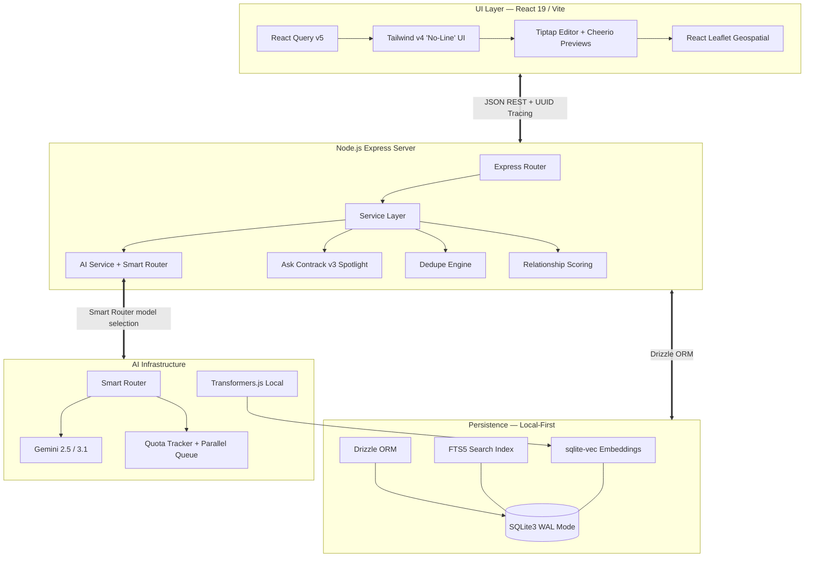

<div align="center">
  <h1>🤝 Contrack CRM</h1>
  <p><b>The Personal AI Relational Engine for High-Leverage Individuals</b></p>
  
  [](https://opensource.org/licenses/MIT)
  [](https://nodejs.org/)
  [](https://sqlite.org/)
  [](https://react.dev/)
  [](https://tailwindcss.com/)
  [](https://www.typescriptlang.org/)
  [](http://makeapullrequest.com)
</div>

<br/>

## 📖 Table of Contents
- [Philosophy & Vision](#-philosophy--vision)
- [System Architecture](#-system-architecture)
- [Key Capabilities](#-key-capabilities--engineering-specs)
- [Technology Stack](#-technology-stack)
- [Database Overview](#-database-overview)
- [UI/UX Architecture](#-uiux-architecture-the-no-line-hierarchy)
- [API Reference](#-api-reference)
- [Getting Started](#-getting-started)
- [Environment Variables](#-environment-variables)
- [Available Scripts](#-available-scripts)
- [Keyboard Shortcuts](#-keyboard-shortcuts)
- [Roadmap](#-roadmap)
- [Contributing](#-contributing)
- [License](#-license)

---

## 🧭 Philosophy & Vision

Contrack isn't just an address book; it is a **Personal AI Relational Engine**. Engineered for creative directors, freelancers, and executives, Contrack intelligently weaves context, deduplicates massive datasets locally, and autonomously uncovers hidden network connections. 

By combining the blazing speed of local-first SQLite architecture with the analytical power of modern Edge LLMs (Gemini 2.5 Flash / 3.1), Contrack ensures your professional network is tracked seamlessly without the heavy cognitive load of manual data entry. **You write the notes—the AI builds the relational graph.**

Gone are the days of manually typing out structured `First Name`, `Last Name`, `Company` forms. Paste raw unstructured text, drag in an email export, or just brain-dump your meeting notes into the timeline. Contrack parses chaotic unstructured inputs into highly structured, strictly-typed data models under the hood.

---

## ⚡ System Architecture



---

## 🚀 Key Capabilities & Engineering Specs

### 1. "Ask Contrack" AI Search (v3 Spotlight)
A local-first hybrid retrieval-augmented generation (RAG) pipeline that finds anyone in your network in under 50ms. Combines FTS5 keyword search with local vector KNN (Transformers.js, 384-dim `all-MiniLM-L6-v2`) via Reciprocal Rank Fusion. Results stream progressively: Phase 1 (instant retrieval) appears in <15ms, Phase 2 (AI-enriched reasons) streams via NDJSON ~500ms later.

### 2. Cmd+K Command Center
A full-featured command palette powered by `cmdk` that acts as the CRM's operating system:

- **Latency Masking (Slim Cache)**: Client-side filtering delivers 0ms instant results while FTS5 server results load in the background. A `⚡ instant` indicator shows the source.
- **Faceted Filters**: GitHub-style prefix operators (`role:`, `company:`, `tag:`, `score:>80`, `updated:>3m`) with autocomplete sourced from the contact cache. Active filters display as color-coded pills.
- **Action Sub-Menu**: Press `→` on any result (or tap `>>` on mobile) to drill into a keyboard-first action panel — Log Note (N), Log Call (C), Catch Me Up (B), Add to List (L), View Profile (↵).
- **Inline Note Composer**: Compose and save notes/calls without leaving the palette, with `Cmd+Enter` to save.
- **Zero-State Intelligence**: CRM insights (action items due, at-risk contacts, ghosts) surface before you type.
- **Search History**: Terminal-style `↑/↓` history navigation, recent query pills, and 30-second re-populate.
- **Deep Profile Peek**: Hold `Space` on a focused result for a 200ms peek tooltip with score, last contact, and tags.
- **Data Age Halos**: Colored rings on avatars indicate data freshness (🟢<3mo, 🟡3-6mo, 🔴>6mo) with inline refresh.
- **Group Synthesis**: "✨ Synthesize" button generates an executive brief from AI search results via streaming NDJSON.
- **Mobile-First**: All keyboard hints hidden on mobile, touch-friendly tap targets, responsive pill layout.

### 3. Intelligent Deduplication Engine
A multi-pass, cluster-based deduplication system that finds and merges duplicate contacts using phonetic matching (Double Metaphone), Levenshtein distance, Jaccard similarity, E.164 phone normalization, and 768-dim Gemini embeddings. Features configurable auto-merge thresholds (Conservative / Default / Aggressive) and a swipeable review UI for manual decisions.

### 4. Relationship Pulse Dashboard
A proactive intelligence engine that surfaces relationship health through automated scoring (frequency, recency, depth weighted), action item swimlanes, daily AI insights, and network composition analytics. Scores recompute on startup and hourly via background sweeps.

### 5. "Catch-Me-Up" AI Briefing
Walking into a meeting? The briefing pipeline feeds up to 3 years of timeline data into Gemini, producing a structured 3-bullet executive summary (Wins, Projects, Open Loops) with strict JSON bounding to prevent hallucination.

### 6. Bi-Directional Network Weaving
Type `@someone` in any interaction via the **Tiptap Rich Interaction Composer**. The system's async AI parser identifies names and executes exact-match queries, generating bi-directional connections in the `interaction_mentions` junction table.

### 7. "Ghost" Entity Extraction
The AI passively observes notes, silently registering unrecognized entities as Ghost nodes (`isGhost = 1`). When you eventually interact with them, their profile upgrades to a formal node, pre-hydrated with historical mentions.

### 8. AI Search Enrichment (Web Grounding)
Background batch processor that hydrates contact profiles with internet-sourced data via Gemini's search grounding. Uses a two-pass strategy (discover → merge) with persistent progress tracking and a dedicated settings UI.

### 9. Quick Note Modal (`Cmd+Shift+I`)
A system-wide glass-panel modal for rapid interaction logging. Features a fuzzy-search contact picker, type selector pills (Note / Call / Meeting / Email), auto-growing textarea, and `Cmd+Enter` submission with automatic cache invalidation and relationship score recomputation.

### 10. Doc2Query Write-Time Enrichment
When contacts are created or updated, an async background job generates synthetic search terms (e.g., "fintech, payments, developer" for a Stripe engineer) using Gemini Lite, stored in a `searchExpansion` column indexed by FTS5.

### 11. Smart AI Router
All AI calls are routed through a `SmartRouter` that selects the optimal Gemini model (Lite, Flash, or Pro) based on the use case, manages quota tracking per model, and handles automatic retry with fallback to lower-tier models on rate limits.

### 12. Custom Lists & Smart Grouping
Create unlimited, user-defined contact lists with curated icons, drag-to-reorder, bulk member management, and membership inheritance during deduplication merges.

### 13. Geospatial Mapping
Automatically geocodes contact addresses (via Mapbox or Nominatim fallback) and renders an interactive cluster map using React Leaflet.

### 14. Zero-Chromium Link Unfurling
Uses `cheerio` HTML parsers for lightweight OpenGraph extraction (`og:title`, `og:image`, `og:description`) without Puppeteer or headless browsers.

### 15. Enterprise UI Virtualization
Guarantees <20ms page transitions and 60 FPS scrolling regardless of list size (from 10 to 100,000+ contacts) using `@tanstack/react-virtual`. Eliminates DOM bloat and main-thread blocking by recycling the exact DOM nodes currently visible in the viewport.

### 16. AI Cache Telemetry & Quota Optimization
A unified, multi-tiered LRU caching layer (`aiCache`) intercepts redundant AI calls (Mentions, Insights, Briefings, Search, Synthesis) with TTLs ranging from 12 to 24 hours. The AI Stats dashboard provides 100% transparency into cache hits, misses, hit rates, and evictions, proving the system's quota-saving efficacy.

### 17. Local Logo Proxy & Heuristic Discovery
Intelligently guesses company domains from plain text names (stripping legal suffixes) when emails are missing. Routes logo requests through a custom Node.js proxy that fetches from Google S2 Favicons, caches the image binaries directly to your local file system for permanent offline access, and serves them with zero-latency headers.

---

## 🛠️ Technology Stack

| Domain | Technology | Justification |
|---|---|---|
| **Frontend Framework** | `React 19` + `Vite 6` | Concurrent rendering, instant HMR. |
| **Data Fetching** | `@tanstack/react-query v5` | Declarative cache invalidation, query deduplication. |
| **Styling** | `Tailwind CSS v4` | Utility classes with strict "No-Line" design system tokens. |
| **Rich Text** | `Tiptap` + `@tiptap/pm` | Block-based headless editor with @mention support. |
| **Animation** | `Motion (Framer)` | Micro-interactions, layout transitions, staggered entry. |
| **Backend** | `Node.js 22` + `Express` + `tsx` | TypeScript-first, zero-transpile dev server. |
| **Database** | `Better-SQLite3` + `Drizzle ORM` | WAL-mode, FTS5 full-text search, synchronous perf. |
| **Vector Search** | `sqlite-vec` + `Transformers.js` | Local 384-dim embeddings for <5ms semantic search. |
| **AI** | `@google/genai` (Gemini 2.5/3.1) | Smart Router with model-class routing (Lite/Flash/Pro). |
| **Mapping** | `Leaflet` + `React-Leaflet` | Client-side cluster rendering with geocoded coordinates. |
| **Testing** | `Vitest` | Fast unit and integration tests (72 tests, <500ms). |

---

## 🗄️ Database Overview

Contrack uses a highly normalized Drizzle ORM schema on SQLite with WAL mode. Key tables:

| Table | Purpose |
|---|---|
| `contacts` | Primary entity — demographics, AI briefings, `isGhost`, `canonicalId`, `searchExpansion` |
| `contact_emails`, `contact_phones` | 1:N multi-value fields with deduplication support |
| `contact_tags`, `contact_interests` | Tagging and interest taxonomy |
| `contact_education`, `contact_experience` | Chronological career/education history |
| `contact_social_links`, `contact_sources` | Social profiles and import provenance |
| `contact_addresses` | Multi-value addresses with geocoding |
| `interactions` | Timeline events (calls, notes, emails, meetings) |
| `interaction_mentions` | Junction table for bi-directional @mention graph |
| `lists`, `list_members` | User-created contact groups with sort order |
| `action_items` | Follow-up tasks with due dates and completion tracking |
| `contacts_fts` | FTS5 virtual table — full-text search index |
| `contact_embeddings` | `vec0` — 768-dim Gemini embeddings for deduplication |
| `search_embeddings` | `vec0` — 384-dim local embeddings for Ask Contrack search |
| `dedupe_suggestions` | Pending deduplication clusters |
| `dedupe_exclusions` | User-dismissed pairs (never suggest again) |
| `merge_log` | Audit trail for merge operations (supports undo) |
| `embedding_metadata` | Tracks embedding staleness per contact |

Schema definition: `src/db/schema.ts`. Virtual tables and triggers: `server/db.ts`.

---

## 🎨 UI/UX Architecture: The "No-Line" Hierarchy

The CRM follows strict Tailwind CSS v4 design tokens (see `.agent/workflows/design-system.md`):

- **Zero Borders Rule**: No `border-gray-200`. Containment is expressed through surface shifts:
  - `surface` → Base layer
  - `surface-container-low` → Secondary sections
  - `surface-container-lowest` → Cards, modals, high-focus
- **Glassmorphism & Z-Depth**: Modals use backdrop blurs on opaque backgrounds.
- **Micro-Animations**: `motion` for staggered entry, fade transitions, and layout animation.
- **Progressive Disclosure**: Two-phase search results, enriching indicators, and skeleton loaders.

---

## 🔌 API Reference

All endpoints are prefixed with `/api`. Payloads are `application/json` unless noted.

### Contacts
| Method | Endpoint | Description |
|---|---|---|
| `GET` | `/contacts` | Fetch all contacts. `?q=` for FTS5 search, `?view=slim` for lightweight. |
| `GET` | `/contacts/:id` | Hydrate a single contact with all child arrays. |
| `POST` | `/contacts` | Create a contact. |
| `PUT` | `/contacts/:id` | Full update with nested child arrays. |
| `PATCH` | `/contacts/:id` | Partial scalar update. |
| `DELETE` | `/contacts/:id` | Cascade delete (including vec0 embeddings). |
| `POST` | `/contacts/bulk` | Bulk create from import. |
| `POST` | `/contacts/bulk-delete` | Bulk delete by ID array. |
| `PUT` | `/contacts/bulk-update` | Bulk update shared fields. |
| `POST` | `/parse-contact` | AI-parse unstructured text into structured contact. |

### Timeline & Interactions
| Method | Endpoint | Description |
|---|---|---|
| `GET` | `/contacts/:id/timeline` | Fetch chronological timeline with @mention links. |
| `POST` | `/contacts/:id/interactions` | Log interaction, triggers async mention extraction. |
| `PATCH` | `/interactions/:id` | Edit an interaction. |
| `DELETE` | `/interactions/:id` | Remove an interaction. |
| `POST` | `/contacts/:id/briefing` | Generate AI Catch-Me-Up briefing. |
| `POST` | `/contacts/:id/promote` | Promote Ghost → explicit contact. |

### Ask Contrack (Search)
| Method | Endpoint | Description |
|---|---|---|
| `GET` | `/search?q=` | FTS5 keyword search (sidebar). |
| `POST` | `/search/semantic` | v3 hybrid search. `Accept: application/x-ndjson` for streaming. |
| `POST` | `/search/synthesize` | Synthesize search results into an executive brief (NDJSON stream). |

### Deduplication
| Method | Endpoint | Description |
|---|---|---|
| `POST` | `/dedupe/scan` | Trigger a full dedupe scan. |
| `GET` | `/dedupe/suggestions` | Fetch pending clusters. |
| `GET` | `/dedupe/suggestions/count` | Count of pending suggestions. |
| `POST` | `/dedupe/suggestions/:id/merge` | Merge a suggestion cluster. |
| `POST` | `/dedupe/suggestions/:id/dismiss` | Dismiss a suggestion. |
| `POST` | `/contacts/merge` | Manual 2-contact merge. |
| `POST` | `/contacts/merge-cluster` | Merge an N-contact cluster. |
| `GET` | `/dedupe/merge-log` | Audit trail of past merges. |
| `POST` | `/dedupe/merge-log/:id/undo` | Undo a merge. |

### Action Items & Dashboard
| Method | Endpoint | Description |
|---|---|---|
| `GET` | `/action-items` | Fetch pending action items. |
| `POST` | `/contacts/:id/action-items` | Create an action item. |
| `PATCH` | `/action-items/:id/complete` | Mark an action item complete. |
| `GET` | `/dashboard` | Relationship Pulse Dashboard metrics. |
| `GET` | `/dashboard/insight` | AI-generated daily insight. |
| `GET` | `/command-palette/zero-state` | CRM intelligence signals for command palette zero-state. |

### Lists
| Method | Endpoint | Description |
|---|---|---|
| `GET` | `/lists` | Fetch all lists with member counts. |
| `POST` | `/lists` | Create a list. |
| `PUT` | `/lists/reorder` | Reorder via `orderedIds` array. |
| `POST` | `/lists/:id/members` | Add a contact to a list. |
| `POST` | `/lists/:id/members/bulk` | Bulk add contacts. |

### Utilities
| Method | Endpoint | Description |
|---|---|---|
| `GET` | `/utils/unfurl` | OpenGraph link preview extraction. |
| `GET` | `/contacts/map` | Geocoded contacts for map view. |
| `GET` | `/ai/diagnostics` | AI model routing and quota diagnostics. |
| `GET` | `/ai/grounding-capacity` | AI Search grounding RPD quota check. |
| `POST` | `/contacts/:id/enrich` | Single-contact enrichment via web grounding. |

---

## 🚀 Getting Started

### Prerequisites
- Node.js 22+
- A Gemini API key from [Google AI Studio](https://aistudio.google.com/apikey)
- Git

### Quick Start
```bash
git clone https://github.com/arvarik/contrack.git
cd contrack
npm install
cp .env.example .env
# Edit .env to add your GEMINI_API_KEY
npm run dev
```

Navigate to `http://localhost:3000`. The server auto-applies database migrations, loads the local embedding model, and backfills search embeddings on first boot.

### Seed Data
```bash
npm run seed
```

### Production
```bash
npm run build
NODE_ENV=production npx tsx server.ts
```

> **Docker note:** Mount a persistent volume for the SQLite `.db` file. Ephemeral containers will destroy data on restart.

---

## 🔐 Environment Variables

| Variable | Description | Default |
|---|---|---|
| `GEMINI_API_KEY` | Required for all AI operations. | — |
| `APP_URL` | Host URL for self-referential links. | `http://localhost:3000` |
| `PORT` | Express listening port. | `3000` |
| `MAPBOX_API_KEY` | Optional. Enables Mapbox geocoding (higher accuracy than Nominatim). | — |
| `AI_PROVIDER` | LLM provider adapter. | `gemini` |
| `AI_TIER` | `FREE` (conservative routing) or `PAID` (full model access). | `FREE` |

---

## 💻 Available Scripts

| Script | Description |
|---|---|
| `npm run dev` | Start Vite + Express dev server with HMR. |
| `npm run build` | Compile production bundle via Vite. |
| `npm run preview` | Preview production build locally. |
| `npm run seed` | Clear DB and repopulate with demo data. |
| `npm run lint` | TypeScript type-check (`tsc --noEmit`). |
| `npm test` | Run Vitest test suite (72 tests). |
| `npm run db:generate` | Generate a Drizzle Kit migration after schema changes. |
| `npm run clean` | Purge `dist/` build cache. |

---

## ⌨️ Keyboard Shortcuts

### Global
| Shortcut | Action |
|---|---|
| `Cmd+K` / `Ctrl+K` | Toggle Command Palette |
| `Cmd+Shift+I` | Quick Note Modal |
| `Cmd+Shift+N` | Navigate to Network |
| `Cmd+Shift+P` | Navigate to Pulse |
| `Cmd+Shift+M` | Navigate to Map |
| `Cmd+Shift+S` | Navigate to AI Search |
| `Cmd+Shift+,` | Navigate to Settings |
| `Cmd+[` / `Cmd+]` | Browser back / forward |
| `/` | Focus active search bar |
| `?` | Toggle Keyboard Shortcuts Reference |
| `Escape` | Unfocus / close modals |

### Command Palette
| Shortcut | Action |
|---|---|
| `↑ / ↓` | Navigate results |
| `Enter` | Select / navigate to contact |
| `→` | Open Action Sub-Menu for focused contact |
| `←` or `Escape` | Go back one layer (sub-menu → results → close) |
| `Space` (hold) | Peek contact details (200ms delay) |
| `↑ / ↓` (empty input) | Browse search history |
| `Backspace` (empty input) | Remove last facet filter pill |
| `role:`, `company:`, etc. | Activate faceted filter autocomplete |

### Action Sub-Menu (inside Command Palette)
| Shortcut | Action |
|---|---|
| `↵` Enter | View Profile |
| `N` | Log Note (inline composer) |
| `C` | Log Call (inline composer) |
| `B` | Catch Me Up (AI briefing) |
| `L` | Add to List (inline picker) |

### Contact List
| Shortcut | Action |
|---|---|
| `↓` or `j` | Next contact |
| `↑` or `k` | Previous contact |
| `c` | New Contact modal |
| `v` | Magic Paste (AI extraction) |
| `Enter` | Focus interaction composer |

### Rich Interaction Composer
| Shortcut | Action |
|---|---|
| `Cmd+Enter` | Save interaction |

### @Mentions
| Shortcut | Action |
|---|---|
| `↑ / ↓` | Navigate suggestions |
| `Enter` | Select contact |
| `Escape` | Close dropdown |

---

## 🗺️ Roadmap

### ✅ Completed
- [x] Phase 1 — "The Nervous System": Search history, zero-state CRM intelligence, global nav shortcuts, deep profile peek, data age indicators
- [x] Phase 2 — "The Power Tools": Cmd+K surface overhaul, Quick Note Modal, group synthesis, latency masking, faceted filters, action sub-menu

### 🔴 Phase 3 — "The Visionary" (Planned)
- [ ] SearchView Renaissance — full research workbench with persistent query sidebar and result analytics
- [ ] Orbit Map — interactive force-graph visualization of contact network topology
- [ ] Constraint Locking — compositional multi-pill queries with Tab-to-lock
- [ ] Agentic CLI — `> create`, `> tag`, `> remind` macro commands in Cmd+K

### 🔮 Future
- [ ] End-to-End Encryption (E2EE) for at-rest databases
- [ ] Calendar CalDAV sync for automatic meeting hydration
- [ ] iOS/Android PWA optimized layout
- [ ] Enhanced Network Visualization (Canvas/d3 graph rendering)
- [ ] Multi-provider AI support (OpenAI, Anthropic, Ollama)

---

## 🤝 Contributing

See [CONTRIBUTING.md](CONTRIBUTING.md) for development standards, code style, and PR process.

---

## 📜 License

This project is open-sourced under the [MIT License](https://opensource.org/licenses/MIT).
