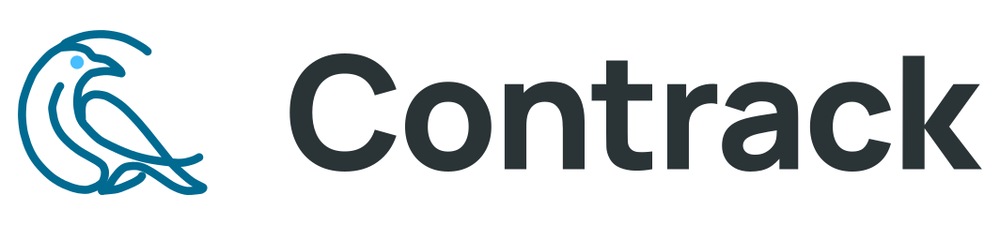
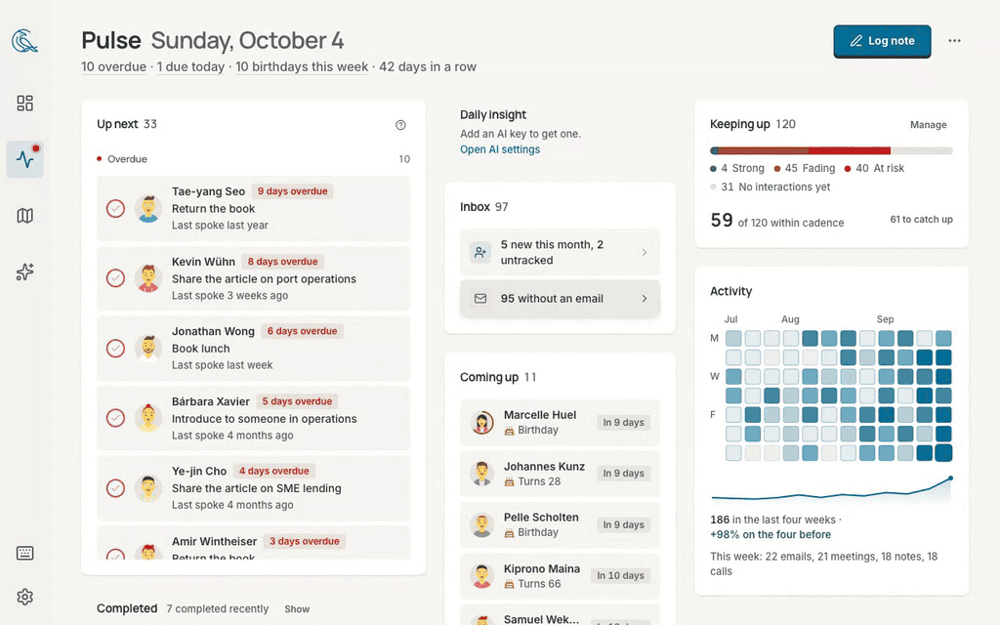
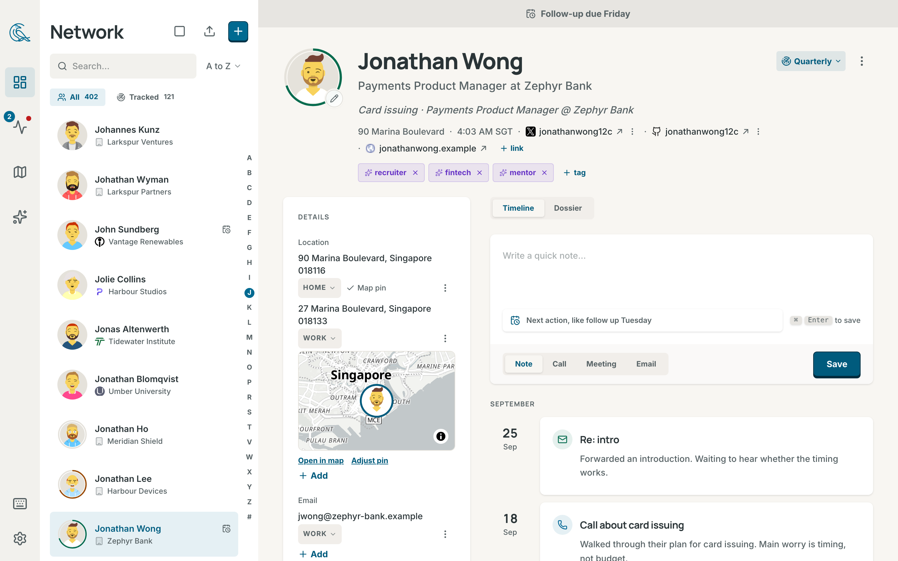
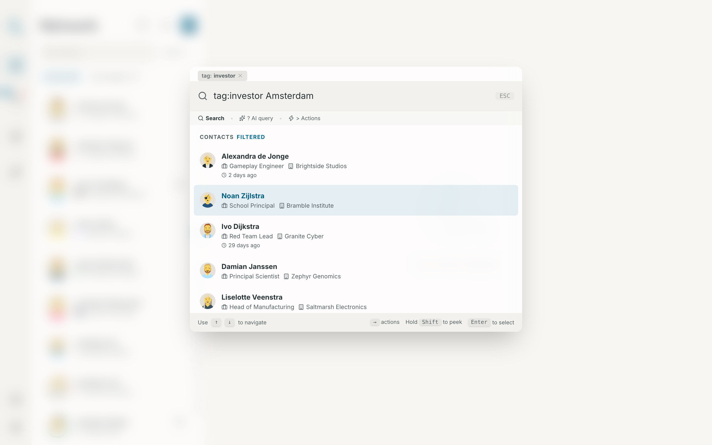
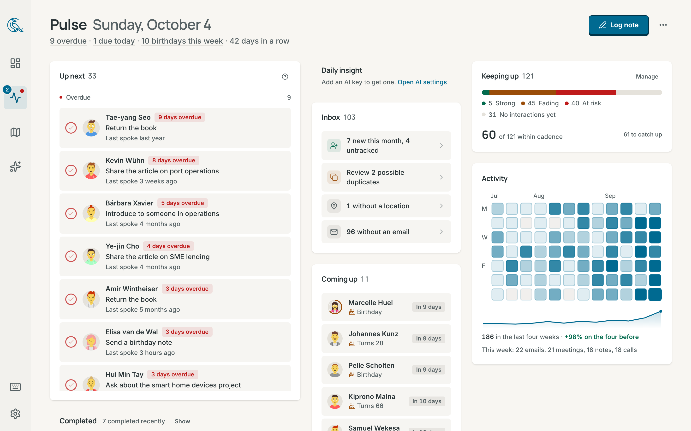
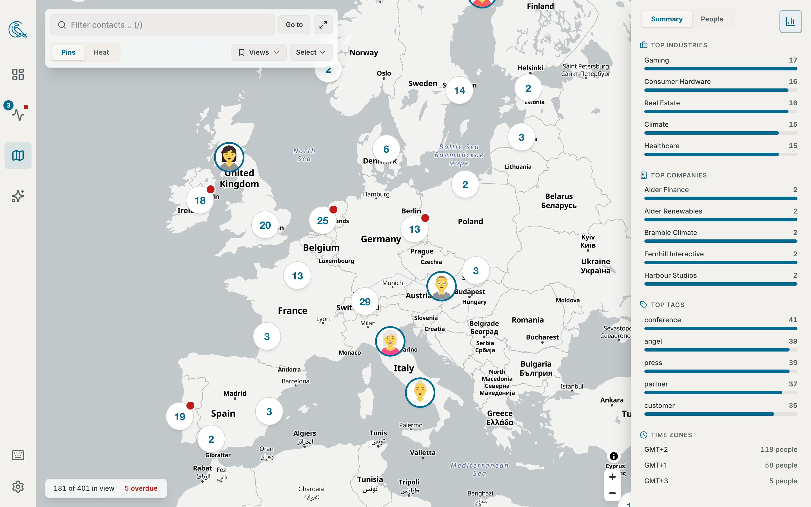
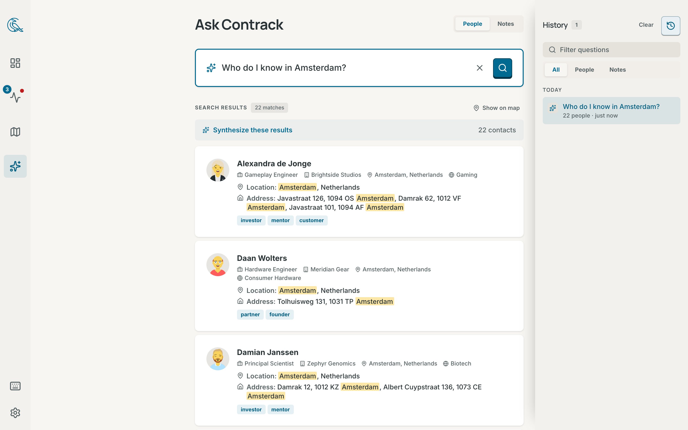
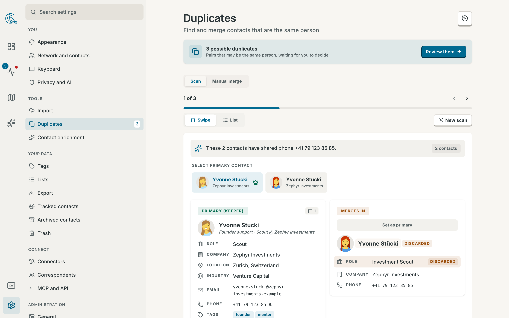
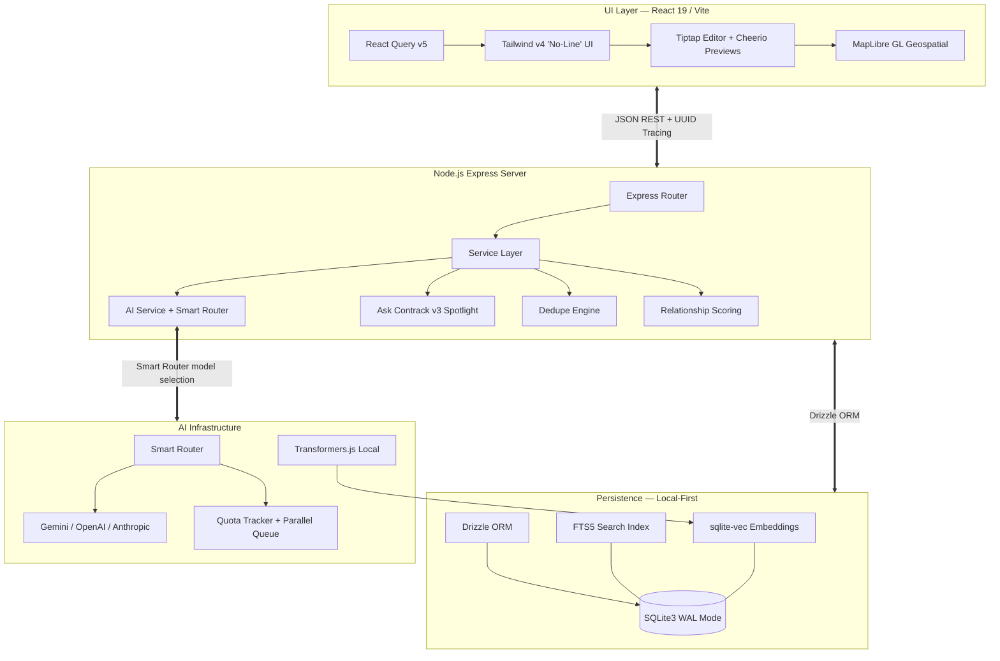

<div align="center">
  <h1>
    <picture>
      <source media="(prefers-color-scheme: dark)" srcset="docs/brand/contrack-lockup-animated-dark.svg" />
      
    </picture>
  </h1>
  <p><b>People Relationship Manager for Proactive Networking</b></p>

[](https://github.com/arvarik/contrack/actions/workflows/ci.yml)
[](https://github.com/arvarik/contrack/releases)
[](https://github.com/arvarik/contrack/pkgs/container/contrack)
[](https://nodejs.org/)
[](LICENSE)
[](https://scorecard.dev/viewer/?uri=github.com/arvarik/contrack)

</div>

<br/>

<p align="center">
  
</p>

Relationships are your most valuable asset, but they're also the hardest thing to keep track of. Contacts scattered across Apple, Google, and LinkedIn. Names you recognize but can't quite place. Introductions you meant to follow up on but never did. **Contrack fixes that.**

Sync your contacts from every source into one unified network with automatic dedupe across platforms. Let AI enrichment research your connections across the web and fill in the context you never had time to enter. Behind the scenes, proactive intelligence keeps watch over your network and nudges you to reconnect before important relationships go quiet.

---

## ✨ Features

<table>
<tr>
<td width="30%" valign="top">

### 👤 Rich Contact Profiles

Get a complete picture of every connection instantly. View their interaction history, personal details, and relationship context all in one beautifully designed profile card.

Built with a timeline architecture featuring @mention network weaving, AI briefings, Ghost entity extraction and multi-value fields.

</td>
<td width="70%">



</td>
</tr>
<tr>
<td width="30%" valign="top">

### ⌘ Command Palette (Cmd+K)

Navigate your entire network at lightning speed without ever touching your mouse. Instantly search contacts, log new notes, or jump to specific views using keyboard shortcuts.

A GitHub-style command center featuring faceted filters (`role:`, `company:`, `tag:`), action sub-menus, and an inline note composer for zero-state CRM intelligence.

</td>
<td width="70%">



</td>
</tr>
<tr>
<td width="30%" valign="top">

### 💓 Pulse

Your daily relationship office. A responsive three-column workspace (Focus, Network, Intelligence) that organizes your morning workflow.

The day is the headline: one sentence says what is due, and a field under it asks your network a question. A ranked Up next queue with one-key keyboard shortcuts and a Catch up group for the tracked people past their cadence, a Keeping up card for the state and the trend of the people you track, a twelve-week activity heatmap that fills its card, a cleanup inbox whose first row is the people you have not decided to track yet, a daily insight, what is coming up, a composition donut, and account-persisted layout customization. A card with nothing to show is one line.

</td>
<td width="70%">



</td>
</tr>
<tr>
<td width="30%" valign="top">

### 🗺️ Geospatial Mapping

Visualize your network geographically to plan trips or coordinate local meetups. See exactly where your connections are clustered around the globe at a glance.

Interactive cluster map powered by MapLibre GL JS on OpenFreeMap vector tiles, with no API key to obtain. Switch between pins and a heat map, save views, select contacts with box or lasso tools, search places, and filter by facets. The People pane lists everyone in view, and the overdue come first.

</td>
<td width="70%">



</td>
</tr>
<tr>
<td width="30%" valign="top">

### 🔍 Ask Contrack

Query your CRM using natural language just like you're talking to an assistant. Ask complex questions like "Who do I know in San Francisco that works in tech?" and get precise answers.

Driven by a Hybrid RAG pipeline combining FTS5 + local vector KNN via Reciprocal Rank Fusion, with instant retrieval (<15ms) and streaming AI-enriched reasoning.

</td>
<td width="70%">



</td>
</tr>
<tr>
<td width="30%" valign="top">

### ⚡ Intelligent Deduplication

Keep your database impeccably clean with an automated assistant that spots duplicate contacts for you. Review merged suggestions quickly with an intuitive swipe interface.

Multi-pass engine utilizing Double Metaphone phonetic matching, Levenshtein distance, E.164 phone normalization, and 768-dim AI embeddings with one-click undo.

</td>
<td width="70%">



</td>
</tr>
</table>

### More Capabilities

- **MCP Server** — Built-in Model Context Protocol server (`POST /api/mcp`) running Streamable HTTP with 18 tools, prompts (`catch_me_up`, `weekly_review`), and resources. **Settings → MCP and API** sets up Claude Code, Claude Desktop, Cursor, VS Code, Codex and Gemini CLI in a few steps. Claude and ChatGPT connect to a public instance with OAuth: you approve read or write access on a consent page. A read-only token or grant sees only the read-only tools
- **Add from text** — Paste unstructured text, AI extracts a structured contact
- **Capability-Based AI** — connect Gemini, OpenAI, Anthropic, or any OpenAI-compatible server (Ollama, vLLM, LM Studio); assign a model per task from Settings, or just set one key and let it choose
- **Automatic model choice** — With one key, every task runs on a fitting model from that provider. Pin a model per task when you want to
- **Batch Enrichment** — AI-powered web research to hydrate contact profiles
- **Custom Lists** — Unlimited groups with icons, drag-to-reorder, bulk membership
- **Note Search** — "Who discussed hiring last month?" answered from your own notes, locally: the person, the date and the passage, with date phrases read in your time zone
- **Ghost Detection** — Passive entity extraction from notes creates ghost contacts
- **@Mentions** — Bi-directional relationship graph via Tiptap rich text
- **AI Cache Telemetry** — Multi-tiered LRU caching with full transparency dashboard
- **Enterprise Virtualization** — <20ms page transitions for 100K+ contacts
- **Quick Note** (`Cmd+Shift+I`) — Log interactions from anywhere
- **Link Unfurling** — Zero-Chromium OpenGraph extraction via Cheerio
- **Logo Proxy** — Heuristic company logo discovery with local caching
- **Themes** — Light, dark, or follow the machine, plus an accent colour that derives a readable palette of its own
- **Trash & Undo** — Deletes are soft: restore from Settings → Trash until the retention an admin sets runs out, 30 days by default
- **Export** — vCard, CSV and JSON, each covering only your own contacts. vCard reads back in, so moving out and back in is honest
- **Automatic Backups** — Scheduled SQLite snapshots with rotation. Every snapshot is reopened, checked and counted against the live database, and the answer shows per file
- **Accounts** — Optional sign-in with username/password, server-side sessions you can revoke per device, plus personal API tokens for scripts and MCP
- **Administration** — Member and admin roles, invitations, instance settings, an audit log and a health panel. Every query is scoped to one account, which a lint rule and a verification script both enforce
- **Settings follow the account** — Theme, accent, list density, recent contacts, search history and dedupe thresholds live on the server, so a phone and a laptop agree

---

## 🚀 Quick Start

**AI is optional at install time.** Add one API key (Gemini, OpenAI, or Anthropic), point Contrack at a self-hosted OpenAI-compatible server (Ollama, vLLM, LM Studio) from **Settings → Administration → AI** after first boot, or run with no AI at all. Contact management and semantic search then run on two small local models, which the Docker image ships and a native install fetches once with `npm run models:fetch`. After that, search needs no network.

### Option 1: Docker, prebuilt image (fastest)

CI publishes a multi-arch image (amd64 + arm64) on every release:

```bash
docker run -d --name contrack \
  -p 127.0.0.1:3210:3210 \
  -v "$PWD/contrack-data":/app/data \
  -e GEMINI_API_KEY=your-key \
  ghcr.io/arvarik/contrack:latest
```

Contrack 2 is a new start: it does not open a data folder from Contrack 1, so give it an empty one.

Open **http://localhost:3210**. Everything that must survive a restart — database, uploads, backups — lives in `/app/data`, so that one volume is the whole persistence story. The search models are inside the image, so the container never downloads them. The container reports its own health (`docker ps` shows `healthy` once the app answers), and `docker stop` shuts down cleanly.

Authentication is off by default, on the assumption that the container is reached from this machine only, which is why the port is published on `127.0.0.1`. To reach it from other devices, set `-e AUTH_REQUIRED=true` first, and the first visit will walk you through creating an account. Then publish the port as `-p 3210:3210`, or put a reverse proxy in front and set `TRUST_PROXY_HOPS=1` and `PUBLIC_URL`.

### Option 2: Docker Compose (build from source)

```bash
git clone https://github.com/arvarik/contrack.git
cd contrack
cp .env.example .env
# Optional: add an API key — or skip this and connect a provider in Settings → Administration → AI
docker compose up -d
```

Same behavior as Option 1; data persists to `./data`. The first build compiles native modules and takes a few minutes.

### Option 3: Native installation

```bash
git clone https://github.com/arvarik/contrack.git
cd contrack
npm install
cp .env.example .env
# Optional: add an API key — or skip this and connect a provider in Settings → Administration → AI
npm run dev
```

Open **http://localhost:3210**. The server auto-initializes the database, loads embedding models, and starts background tasks. Requires Node.js 26.10 or later.

`npm run dev` listens on this machine only. To reach Contrack from other machines, run the production build: `npm run build`, then `NODE_ENV=production HOST=0.0.0.0 node server.ts`, and turn on sign-in first. See [Remote access](docs/self-hosting.md#remote-access).

The first start downloads the two search models (28 MB) from Hugging Face. To keep the server off the network, run `npm run models:fetch` once, then set `MODEL_DOWNLOADS=false` in `.env`. See [Model files and offline installs](docs/configuration.md#model-files-and-offline-installs).

> **Demo data:** Run `npm run db:seed` to generate ~30 realistic demo contacts, or `npm run seed` to add a single example contact to an empty database. Neither deletes existing data.

### Option 4: GitHub Codespaces (try it in the browser)

[](https://codespaces.new/arvarik/contrack?quickstart=1)

The Codespace installs Node.js 26.10, the dependencies and about 30 fictional demo contacts. Run `npm run dev` in its terminal, and the browser opens Contrack. The same setup works in VS Code with the Dev Containers extension, from [`.devcontainer/`](.devcontainer/devcontainer.json).

---

## 🛠️ Technology Stack

| Domain       | Technology                                                            |
| ------------ | --------------------------------------------------------------------- |
| **Frontend** | React 19, Vite 8, React Query v5, Tailwind CSS v4, Tiptap, Motion     |
| **Backend**  | Node.js 26 (runs the TypeScript itself), Express, Zod validation      |
| **Database** | SQLite3 (WAL mode), Drizzle ORM, FTS5, sqlite-vec                     |
| **AI**       | Gemini / OpenAI / Anthropic / any OpenAI-compatible endpoint          |
| **Search**   | Hybrid RAG: FTS5 keyword + 384-dim local vector KNN (Transformers.js) |
| **Mapping**  | MapLibre GL JS + OpenFreeMap tiles, Nominatim geocoding               |
| **Testing**  | Vitest unit, integration and eval tests, Playwright, no API keys      |

---

## 📚 Documentation

Full documentation lives in the [`docs/`](docs/README.md) directory:

| Guide                                                  | Description                                               |
| ------------------------------------------------------ | --------------------------------------------------------- |
| [Getting Started](docs/getting-started.md)             | Installation, first steps, the main screens               |
| [Self-Hosting](docs/self-hosting.md)                   | Docker, remote access, backups, upgrades, troubleshooting |
| [Configuration](docs/configuration.md)                 | Environment variables, AI provider setup, model choice    |
| [Architecture](docs/architecture.md)                   | System overview, data flow, schema, search and AI         |
| [API Reference](docs/api-reference.md)                 | Complete REST API with curl examples                      |
| [CI & Release](CONTRIBUTING.md#continuous-integration) | Pipeline, published images, release procedure             |

### Feature Guides

| Feature            | Guide                                                                    |
| ------------------ | ------------------------------------------------------------------------ |
| Contact Management | [docs/contacts.md](docs/contacts.md)                                     |
| Command Palette    | [docs/search.md#command-palette](docs/search.md#command-palette)         |
| Ask Contrack       | [docs/search.md#ask-contrack](docs/search.md#ask-contrack)               |
| Contact enrichment | [docs/ai.md#research-contacts](docs/ai.md#research-contacts)             |
| Note Search        | [docs/search.md#search-your-notes](docs/search.md#search-your-notes)     |
| Deduplication      | [docs/duplicates.md](docs/duplicates.md)                                 |
| Pulse              | [docs/pulse.md](docs/pulse.md)                                           |
| Map View           | [docs/map.md](docs/map.md)                                               |
| Lists              | [docs/contacts.md#lists](docs/contacts.md#lists)                         |
| Connectors         | [docs/import-and-sync.md#connectors](docs/import-and-sync.md#connectors) |
| MCP Server         | [docs/mcp.md](docs/mcp.md)                                               |

---

## 🔐 Configuration

Contrack runs with no configuration. To change a default, set an environment variable in `.env` or in the container. The variables most installs touch:

- An AI key: `GEMINI_API_KEY`, `OPENAI_API_KEY` or `ANTHROPIC_API_KEY`. Each one is optional, and **Settings → Administration → AI** can connect a provider instead.
- `AUTH_REQUIRED=true` before anything but this machine can reach the port.
- `PUBLIC_URL` and `TRUST_PROXY_HOPS=1` behind a reverse proxy.
- `SMTP_URL` and `MAIL_FROM` for invitations, password resets and sign-in links.

The [Configuration reference](docs/configuration.md) lists every variable and its default. A liveness probe lives at `GET /healthz` — always reachable without a credential, used by the Docker `HEALTHCHECK`, and safe to point an uptime monitor at.

---

## ⚡ System Architecture


```mermaid
graph TD
    subgraph Frontend ["UI Layer — React 19 / Vite"]
        RQ["React Query v5"] --> TW["Tailwind v4 'No-Line' UI"]
        TW --> TT["Tiptap Editor + Cheerio Previews"]
        TT --> Map["MapLibre GL Geospatial"]
    end

    subgraph Backend ["Node.js Express Server"]
        EX["Express Router"] --> SVC["Service Layer"]
        SVC --> AI["AI Service + Smart Router"]
        SVC --> SRCH["Ask Contrack v3 Spotlight"]
        SVC --> DDP["Dedupe Engine"]
        SVC --> REL["Relationship Scoring"]
    end

    subgraph Storage ["Persistence — Local-First"]
        SQL[("SQLite3 WAL Mode")]
        DZ["Drizzle ORM"] --> SQL
        FTS["FTS5 Search Index"] --- SQL
        VEC["sqlite-vec Embeddings"] --- SQL
    end

    subgraph AILayer ["AI Infrastructure"]
        SR["Smart Router"] --> Adapters["Gemini / OpenAI / Anthropic"]
        SR --> QT["Quota Tracker + Parallel Queue"]
        LE["Transformers.js Local"] --> VEC
    end

    Frontend <===>|"JSON REST + UUID Tracing"| Backend
    AI <===>|"Smart Router model selection"| AILayer
    Backend <===>|"Drizzle ORM"| Storage
```

---

## 💬 Get help

- Ask a question in [Discussions](https://github.com/arvarik/contrack/discussions/categories/q-a).
- Report a bug or ask for a feature in [Issues](https://github.com/arvarik/contrack/issues/new/choose).
- Email the maintainer at [arvind.arikatla@gmail.com](mailto:arvind.arikatla@gmail.com).
- Report a security problem privately, as the [security policy](SECURITY.md) says.

---

## 🤝 Contributing

See [CONTRIBUTING.md](CONTRIBUTING.md) for development standards, code style, and PR process. Coding agents start at [AGENTS.md](AGENTS.md). Everyone who takes part follows the [Code of Conduct](CODE_OF_CONDUCT.md). Each release is summarized in the [changelog](CHANGELOG.md).

---

## 📜 License

This project is licensed under the [GNU Affero General Public License v3.0](LICENSE). This means you can use, modify, and distribute the code, but any modified versions — including those offered as a network service (SaaS) — must also be open-sourced under AGPL v3.
