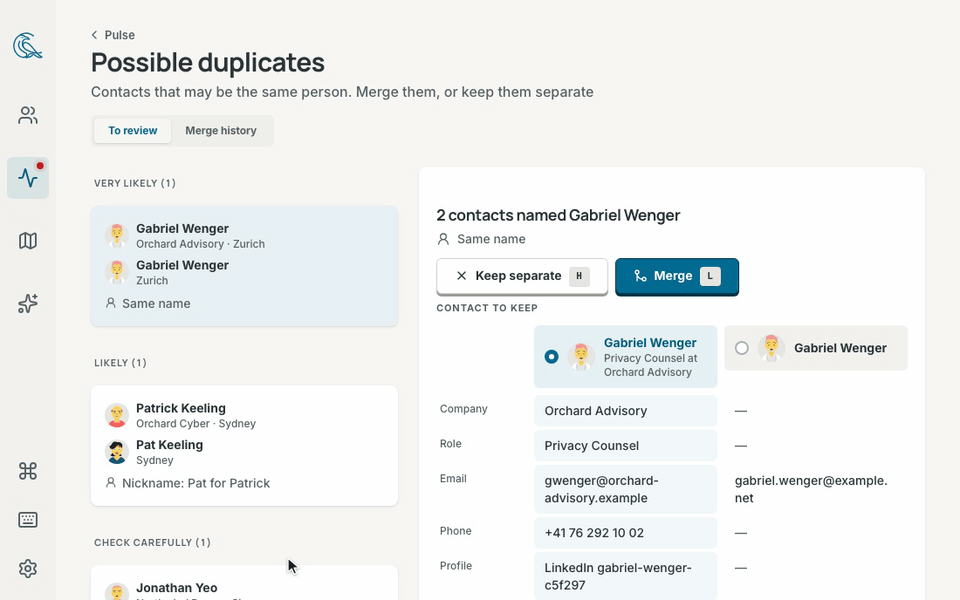
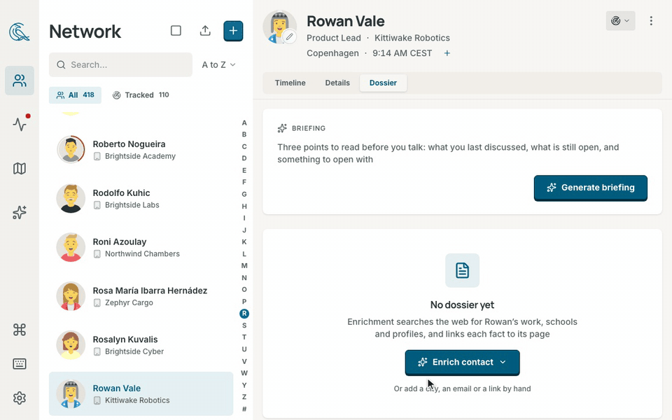
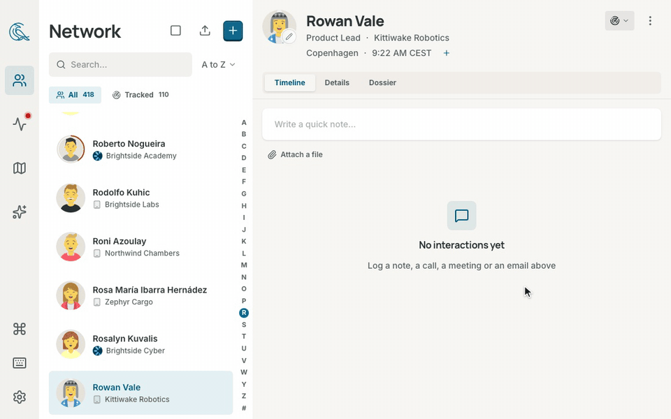
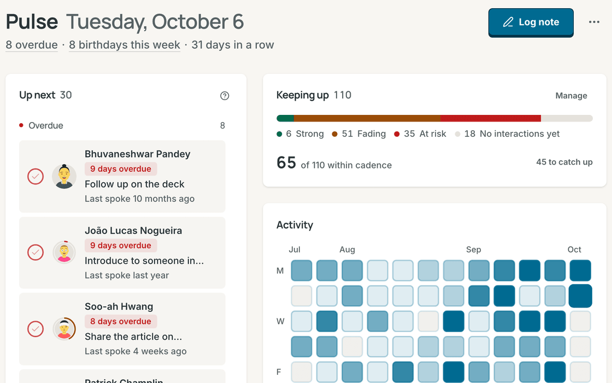
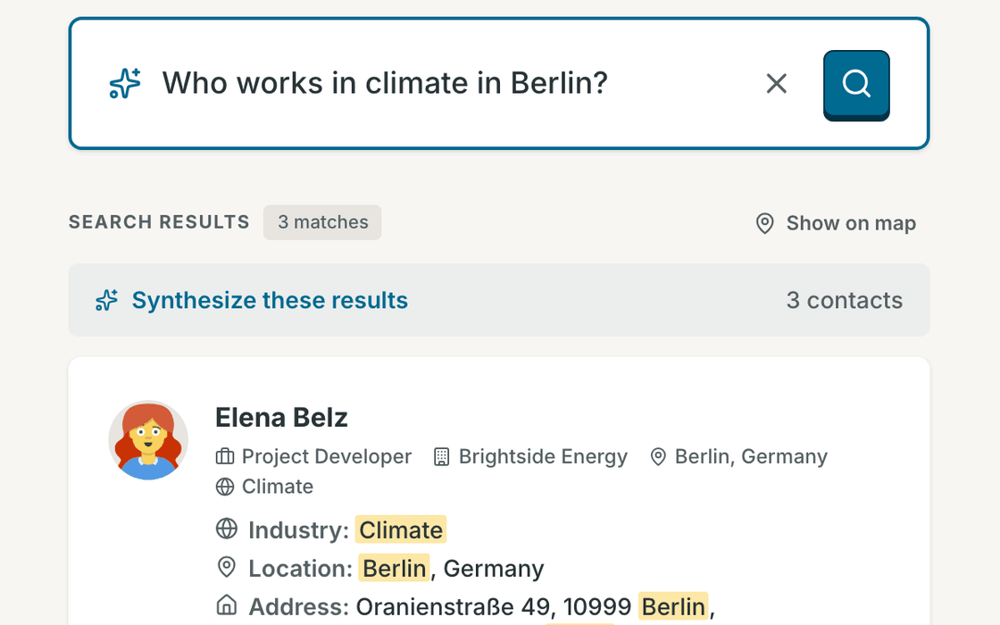
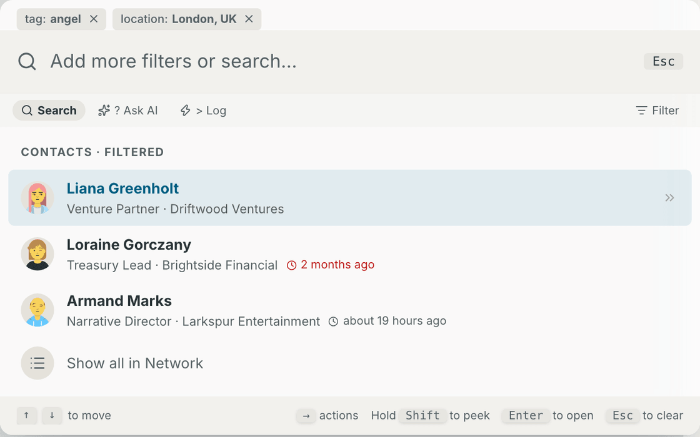
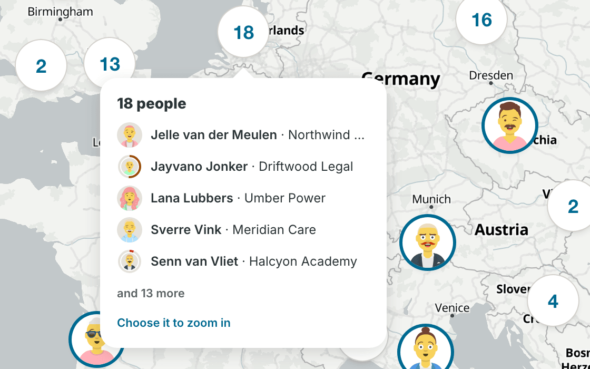
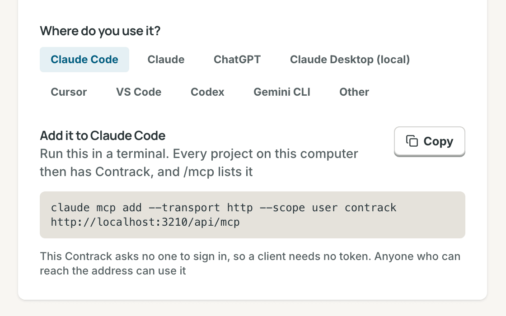
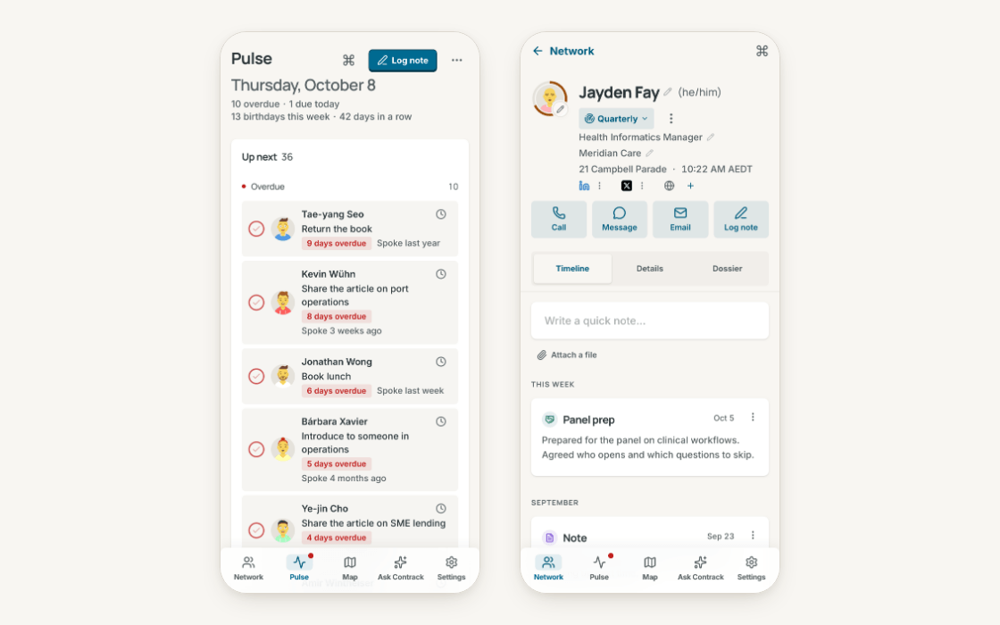

<div align="center">
  <h1>
    <picture>
      <source media="(prefers-color-scheme: dark)" srcset="docs/brand/contrack-lockup-animated-dark.svg" />
      
    </picture>
  </h1>
  <p><b>People Relationship Manager for Proactive Networking</b></p>

[](https://github.com/arvarik/contrack/actions/workflows/ci.yml)
[](https://github.com/arvarik/contrack/releases)
[](https://github.com/arvarik/contrack/pkgs/container/contrack)
[](https://nodejs.org/)
[](LICENSE)
[](https://scorecard.dev/viewer/?uri=github.com/arvarik/contrack)

</div>

<br/>

<p align="center">
  
</p>

Relationships are your most valuable asset, and the hardest thing to keep track of. Your contacts are scattered across Apple, Google and LinkedIn. A name looks familiar, but you can't place it. You meant to follow up, and you never did. **Contrack fixes that.**

Contrack is a personal CRM that you run yourself. Your network stays on your machine, search runs on small local models, and AI is optional: bring a Gemini, OpenAI or Anthropic key, point it at a model server of your own, or use none at all.

## Import → Dedupe → Enrich → Track

<p align="center">
  <picture>
    <source media="(prefers-color-scheme: dark)" srcset="docs/brand/readme-flow-dark.svg" />
    
  </picture>
</p>

### 1. Import

**Everyone, from everywhere.** Drop in a vCard from any address book, or your LinkedIn and Google exports. Connect Google, a calendar or a mailbox, and your meetings and email land on each person's timeline.


### 2. Dedupe

**One person, one contact.** The same friend from three sources becomes one record. Contrack merges the sure matches by itself and asks you about the rest in one review list. Each pair says why it matched and shows what a merge keeps, and every merge can be undone for 90 days.



### 3. Enrich

**The context you never had time to type.** With an AI provider connected, Contrack researches a contact on the web, fills in roles, companies and links, and cites a source for every fact. Paste a bio or an email signature, and it becomes a contact.



### 4. Track

**Never let a relationship go quiet.** Log a note in one line, and "next Tuesday" becomes a follow-up. Choose who to keep up with and how often. Each morning, Pulse shows who is due, who is drifting and what is coming up.



## Highlights

<table>
<tr>
<td width="50%" valign="top">

<h3>Pulse</h3>
Your morning page: follow-ups that are due, people to catch up with, birthdays, and how your network is doing.
</td>
<td width="50%" valign="top">

<h3>Ask Contrack</h3>
Ask in plain words, such as "Who do I know in Lisbon?" Answers come from your own contacts and notes, and search runs on your machine.
</td>
</tr>
</table>

<table>
<tr>
<td width="50%" valign="top">

<h3>Command palette</h3>
Press <kbd>Cmd</kbd>+<kbd>K</kbd> to find anyone, filter by company or tag, or run any action without touching the mouse.
</td>
<td width="50%" valign="top">

<h3>Map</h3>
See where your network lives. Draw around a city to select everyone in it, then track them or add them to a list.
</td>
</tr>
</table>

<table>
<tr>
<td width="50%" valign="top">

<h3>Works with your AI assistant</h3>
A built-in MCP server lets Claude, ChatGPT, Cursor and other clients search and update your network. Give them read-only access if you prefer.
</td>
<td width="50%" valign="top">

<h3>On your phone</h3>
Install it on your home screen. A contact is one tap from a call, a message or an email.
</td>
</tr>
</table>

**Also:** note search, @mentions that link people, lists and tags, passkeys, several accounts on one server, a trash with undo, vCard, CSV and JSON export, verified backups, and light and dark themes.

## Quick start

Run Contrack with Docker:

```bash
docker run -d --name contrack -p 127.0.0.1:3210:3210 \
  -v contrack-data:/app/data ghcr.io/arvarik/contrack:latest
```

Then open [http://localhost:3210](http://localhost:3210). There is no account to create and no key to add. Your data lives in the `contrack-data` volume. To turn on AI later, open **Settings → Administration → AI** and add a key.

<details>
<summary><b>Other ways to run it</b></summary>

<br/>

**Docker Compose** builds the image from this repository:

```bash
git clone https://github.com/arvarik/contrack.git && cd contrack
docker compose up -d
```

**From source**, with Node.js 26.10 or later:

```bash
git clone https://github.com/arvarik/contrack.git && cd contrack
npm install
npm run dev
```

**On a server or for other devices:** turn on sign-in first with `-e AUTH_REQUIRED=true`. The first visit then creates the admin account. [Self-hosting](docs/self-hosting.md) covers remote access, reverse proxies, backups and upgrades.

</details>

## Try it in your browser

[](https://codespaces.new/arvarik/contrack?quickstart=1)

A Codespace builds Contrack, fills it with 400 fictional people, starts it and opens it in a new tab, with no sign-in and no key. The first start takes a few minutes, and it runs on your GitHub account's Codespaces hours.

<br/>

<table>
<tr>
<td width="33%" align="center" valign="top">
<picture>
<source media="(prefers-color-scheme: dark)" srcset="docs/brand/readme-perch-help-dark.svg" />

</picture>
<h3>Get help</h3>
<a href="docs/README.md">Read the docs</a><br/>
<a href="https://github.com/arvarik/contrack/discussions/categories/q-a">Ask a question</a><br/>
<a href="https://github.com/arvarik/contrack/issues/new/choose">Report a bug or ask for a feature</a><br/>
<a href="SECURITY.md">Report a security problem privately</a><br/>
<a href="mailto:arvind.arikatla@gmail.com">Email the maintainer</a>
</td>
<td width="33%" align="center" valign="top">
<picture>
<source media="(prefers-color-scheme: dark)" srcset="docs/brand/readme-perch-contribute-dark.svg" />

</picture>
<h3>Contribute</h3>
<a href="CONTRIBUTING.md">Set up and send a change</a><br/>
<a href="AGENTS.md">Instructions for coding agents</a><br/>
<a href="CODE_OF_CONDUCT.md">Code of Conduct</a><br/>
<a href="CHANGELOG.md">What changed in each release</a>
</td>
<td width="33%" align="center" valign="top">
<picture>
<source media="(prefers-color-scheme: dark)" srcset="docs/brand/readme-perch-license-dark.svg" />

</picture>
<h3>License</h3>
Free software under the <a href="LICENSE">GNU AGPL v3</a>. Use it, change it and share it. If you offer a changed version as a network service, share its source too.
</td>
</tr>
</table>
