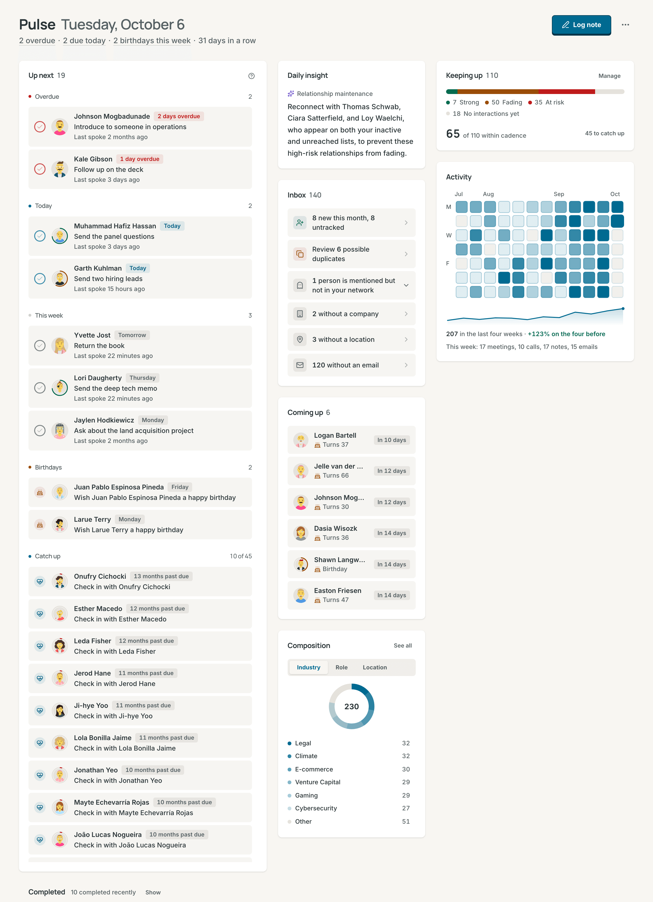

# Contrack documentation

Contrack is a self-hosted personal CRM. It brings your contacts from every
source into one network, keeps a timeline of what you talk about, and shows
you each morning who needs your attention. It runs on your own machine, and AI
is optional.

## Start here

- [Getting started](getting-started.md): install Contrack, add your people, and learn the main screens

## Use Contrack

- [Contacts](contacts.md): the Network list, the contact page, notes, follow-ups, lists, tags, archive, and trash
- [Pulse and tracking](pulse.md): choose who to keep up with, read the score, and work through each day
- [Search and Ask Contrack](search.md): the command palette, filters, questions in plain words, and note search
- [Map](map.md): see your network by place, select people, and plan a trip
- [Duplicates](duplicates.md): find and merge contacts that are the same person
- [Import, sync, and export](import-and-sync.md): bring contacts in from files, calendars, mail, and Google, and take them out again
- [AI](ai.md): what AI does, how to connect a provider, how to research contacts, and how to turn AI off
- [Keyboard shortcuts](keyboard-shortcuts.md): every key, by page
- [Accessibility](accessibility.md): keyboard, screen reader, motion, and text size support

## Run Contrack

- [Self-hosting](self-hosting.md): install, remote access, backups, upgrades, and troubleshooting
- [Accounts and sign-in](accounts.md): sign-in, passkeys, API tokens, and administration
- [Privacy](privacy.md): what the server keeps, what leaves it, who can see what, and what a delete removes
- [Configuration reference](configuration.md): every environment variable and setting

## Build on Contrack

- [MCP and API tokens](mcp.md): connect Claude, Cursor, and scripts to your CRM
- [REST API reference](api-reference.md): every endpoint, with examples
- [Architecture](architecture.md): how the system fits together
- [Contributing](../CONTRIBUTING.md): set up, test, and ship a change
- [Brand kit](brand/README.md): the corvid, the lockup, and the colours

## About these pages

- Each page is plain Markdown with relative links. The folder reads the same
  on GitHub, in an editor such as Obsidian, and in a wiki.
- `npm run docs:wiki -- <folder>` writes the pages as a GitHub wiki:
  `Home.md`, a `_Sidebar.md` built from this index, and one page per entry,
  with every link rewritten for the wiki.
- Screenshots show fictional people and live in `images/`.
- What changed in each release is in the [changelog](../CHANGELOG.md).
