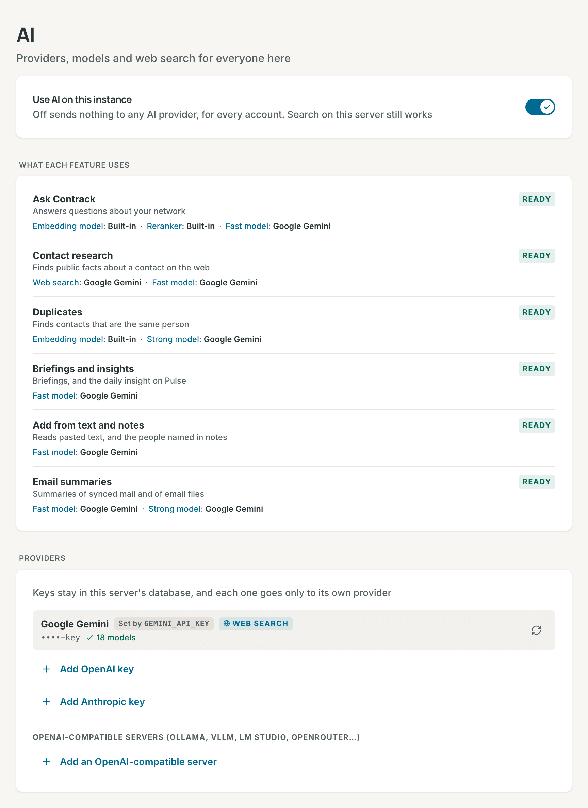
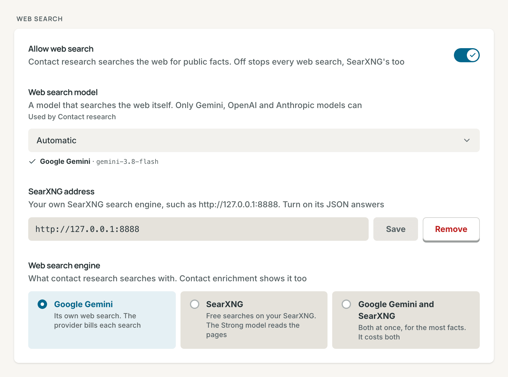

# AI

AI in Contrack is optional. This page says what each AI feature does and
sends, how to connect a provider and research contacts, and how to turn AI off.

## What AI does

Each AI feature runs on one or two models. An admin picks each model once, and
every feature that uses it follows (see [Models](#models)).

| Feature                                | What it does                                                                                                                             | Model                       | What it sends                                                                                                                                  |
| -------------------------------------- | ---------------------------------------------------------------------------------------------------------------------------------------- | --------------------------- | ---------------------------------------------------------------------------------------------------------------------------------------------- |
| [Ask Contrack](search.md#ask-contrack) | Plans the search for a question, checks each match, and gives the reason                                                                 | Fast model                  | The question, and the profile fields, addresses and matching note passages of up to 30 candidates                                              |
| Group brief                            | **Synthesize these results** writes a short brief about the people a question found                                                      | Fast model                  | The question, and each match's name, role, company, industry, location and reason                                                              |
| Briefing                               | Writes three points to read before a conversation, on the contact's **Dossier** tab                                                      | Fast model                  | The contact's name, role, company, headline, summary, location and last contact date, and its latest 15 notes                                  |
| Daily insight                          | Writes one observation about your network on **Pulse**                                                                                   | Fast model                  | Contact counts, the industry mix, and the names of your most and least active contacts and of those not reached in 60 days                     |
| **Add from text**                      | Reads pasted text, such as an email signature, into the new contact form                                                                 | Fast model                  | The text you paste                                                                                                                             |
| People named in notes                  | Finds the people a saved note names, and links each one to a contact or a new [ghost](contacts.md#ghosts)                                | Fast model                  | The note text                                                                                                                                  |
| Email file summary                     | Summarizes an `.eml` file that you attach to a contact's timeline                                                                        | Strong model                | The email's text                                                                                                                               |
| Mail summaries                         | Writes a short note for each matched email, when a **Mailbox (IMAP)** or **Google Workspace** connector has **Generate AI summaries** on | Fast model                  | Each email's subject and body                                                                                                                  |
| [Contact research](#research-contacts) | Searches the web for a contact and fills empty fields                                                                                    | Web search, then Fast model | The contact's name, role, company, headline, city, addresses, industry, website, summary, emails, profiles, jobs, schools, interests and facts |
| Duplicate checks                       | **AI scan** and **Full AI scan** ask about pairs that look alike but are not certain                                                     | Strong model                | Both contacts' names, companies, roles, locations, emails, phones and import sources                                                           |
| Search by meaning                      | Turns each contact into numbers, so Ask Contrack and duplicate checks can compare people by meaning                                      | Embedding model             | Nothing with the built-in model. A hosted model gets each contact's profile text, but not for an account with AI off                           |

Research never sends your notes or phone numbers.

## What works without AI

With no provider connected, Contrack keeps working. Ask Contrack answers from
the local index with the built-in model, and marks its answers **Not verified
by AI**. The command palette, facets and
[note search](search.md#search-your-notes) run on the server. Duplicate checks
run, and **AI scan** and **Full AI scan** skip their AI step.

The other features in the table need a provider. Without one, an `.eml` file
that you attach is saved with no summary.

## The AI page

Every AI setting of the instance is on one page, **Settings → Administration →
AI**. Only an admin opens it. With sign-in off, you are the admin.

The page has five parts, in this order:

1. **Use AI on this instance**: the switch that overrules everything below it
   (see [Turn AI off](#turn-ai-off)).
2. **What each feature uses**: each feature, whether it works now, and what it
   runs on. A feature is **Ready**, **Limited** (it works with less, such as
   Ask Contrack with local search only), **Off**, or **Needs setup**. Each part
   links to the control that changes it, and a reason links to its fix, such
   as **Choose a Fast model**. With no provider, it says that only the local
   features work, and links to **Add a key**.
3. **Providers**: the keys, and the OpenAI-compatible servers.
4. **Models**: the Fast model, the Strong model, the embedding model and the
   reranker (see [Models](#models)).
5. **Web search**: what contact research searches with (see
   [Web search](#web-search)).

Settings search finds each control by its name, and by its old one, such as
"Quick tasks" for the Fast model.

## Connect a provider

Only an admin can connect a provider.

### Add a key

1. Open **Settings → Administration → AI**.
2. Under **Providers**, choose **Add Google Gemini key**, **Add OpenAI key** or
   **Add Anthropic key**.
3. Paste the key and choose **Connect**. Contrack checks the key by loading
   the provider's model list.

One key is enough: every task then runs on **Automatic**. Get a key from
[Google AI Studio](https://aistudio.google.com/apikey), the
[OpenAI Platform](https://platform.openai.com/api-keys) or the
[Anthropic Console](https://console.anthropic.com/settings/keys). Contrack
stores the key encrypted and sends it only to its own provider.

A provider row shows the end of the key, the number of models, and **Web
search** when the provider's models can search the web. A key in
`GEMINI_API_KEY`, `OPENAI_API_KEY` or `ANTHROPIC_API_KEY` wins over a saved
key, and its row says which, such as **Set by GEMINI_API_KEY** (see
[Environment Variables](configuration.md#environment-variables)).

> **Note:** On Google's free tier, Google may use prompts and responses,
> contacts' details included, to improve its products. When Google says that a
> key is on the free tier, its row shows a warning. Use a key from a Google
> Cloud project with billing.

### Add an OpenAI-compatible server

An OpenAI-compatible server speaks the OpenAI API format, such as Ollama, vLLM,
LM Studio, llama.cpp, OpenRouter, xAI or Mistral. A model server on your own
network is always one.

1. Under **OpenAI-compatible servers**, choose **Add an OpenAI-compatible
   server**.
2. Fill in **ID** (letters, numbers and hyphens), **Name** and **Base URL**,
   such as `http://alpha:11434/v1`. Fill in **API key (optional)** only when
   the server needs one.
3. Choose **Connect**. Contrack loads the server's model list.

When the row says "No models found", check two things, then choose **Refresh
the model list**:

- **The base URL ends with `/v1`.** Ollama serves its OpenAI API at
  `http://<host>:11434/v1`, not at the root.
- **In Docker, `localhost` is the container.** Use
  `http://host.docker.internal:11434/v1` or the host's network address. On
  Linux, start the container with `--add-host=host.docker.internal:host-gateway`
  to make that name work. Ollama must listen beyond its own machine: set
  `OLLAMA_HOST=0.0.0.0` where it runs.

An OpenAI-compatible server can run the **Fast model**, the **Strong model**
and the **Embedding model**. It cannot be the **Web search model**, but
[SearXNG](#web-search) can search the web in its place.

## Models

Each model serves several features. Choose it once, under **Models**, and every
feature that uses it follows. Each row says which features use it.

| Model               | What it serves                                                                                                                                                         | Default                    |
| ------------------- | ---------------------------------------------------------------------------------------------------------------------------------------------------------------------- | -------------------------- |
| **Fast model**      | Quick, frequent work: Ask Contrack, briefings, the daily insight, **Add from text**, people named in notes, mail summaries, and filling the fields of contact research | **Automatic**              |
| **Strong model**    | Rarer, harder work: email file summaries, the AI duplicate checks, and reading [SearXNG](#web-search)'s pages                                                          | **Automatic**              |
| **Embedding model** | Search by meaning, and close matches in duplicate checks                                                                                                               | **Built-in (recommended)** |
| **Reranker**        | Puts Ask Contrack's best matches first. It runs on this server, and only `SEARCH_RERANK_MODEL` changes it                                                              | Built-in                   |

The **Web search model** is under **Web search**, with the switch and SearXNG
it works with.

**Automatic** tries the provider in `AI_PROVIDER` first (`gemini` by default),
then the others. A built-in provider takes its newest small model for the
**Fast model**, and its newest mid-size model for the others. An
OpenAI-compatible server uses the first chat model in its list. The line under
each select names the model that runs. Model lists load when you save a key and
once a day, so new models appear without an update.

To pin a model, choose it and then **Save**. For Gemini, OpenAI and Anthropic,
Contrack first sends the model one small test request, and keeps the old
choice when the model does not answer. When a pinned model cannot run later,
the line under it says so, and names what runs in its place.

The `AI_QUICK_MODEL`, `AI_DEEP_MODEL`, `AI_RESEARCH_MODEL` and
`AI_EMBEDDINGS_MODEL` variables set a model from the environment. A set
variable takes the place of the default, so the Fast model's select reads
**From AI_QUICK_MODEL** in place of **Automatic**. A model pinned in the app
wins over the variable (see [AI](configuration.md#ai)).

### Change the embedding model

The built-in model runs on the server, costs nothing and works offline. A
hosted model can rank better on a large network, but it gets every contact's
profile text. With Gemini, Contrack says what each text is for, a question, a
contact or a duplicate check, so the model ranks each one the right way. When
you save a different model, Contrack rebuilds the search
and duplicate indexes in the background, and results are incomplete until it
finishes. The **Search by meaning** card under the model shows the progress. With a
hosted model, new and changed contacts wait until you choose **Index missing**
or **Refresh index**, then **Confirm & refresh**. The provider bills each one.
A hosted model never gets the contacts of an account with its AI switch off.
Ask Contrack finds that account's people by their words only.

## Research contacts

Contact research searches the web for a person and fills empty fields: roles,
schools, a city, profiles and other facts. It needs a web search model
(Gemini, OpenAI or Anthropic), or [SearXNG](#web-search). It never runs for
archived contacts or ghosts.

| Depth        | What it does                                     | Time and cost per contact |
| ------------ | ------------------------------------------------ | ------------------------- |
| **Standard** | One search for roles, schools, city and profiles | About 40 s and $0.15      |
| **Deep**     | Adds a longer search, for a complete profile     | About 1 min and $0.32     |

The depth tiles show time and cost only while Gemini's own search runs
research. The question mark beside **Depth** compares the cost per contact on
Google, Anthropic and OpenAI, at 2026 list prices. Google's figures were
measured, and the other two are estimates from the same searches and tokens.
Only Google gives free web searches: the first 5,000 each month.

### Research many contacts

1. Open **Settings → Contact enrichment**.
2. Check the **Web search engine** at the top of the page (see
   [Choose the web search engine](#choose-the-web-search-engine)). Every
   research you start searches with it.
3. Choose the **Depth**. It starts at **Standard** each time.
4. Narrow the list. The **Contacts** row offers **All**, **Tracked**, **Has
   links**, **Has email** and **No data**. The **Research** row offers **Any**,
   **Not yet**, **6+ months ago** and **Found nothing**. A contact shows when
   it matches both rows.
5. Select contacts, or choose **Select all**.
6. Read the time and cost under the button, and choose **Start enrichment**.
   Check the dialog, and choose **Search** with the number of contacts. With
   SearXNG or both, the dialog names the engine and what it costs.

A row's badge says **New**, the date of the last research, **No page** or
**Error**. The progress panel opens at the bottom right, and each update saves
as its contact finishes. **Stop research** stops the batch, but a provider may
still bill a request that it already took.

### Research one contact, or every new one

- In the contact's actions menu, choose **Enrich contact** (Standard) or
  **Enrich deeply** (Deep). On the **Dossier** tab, **Enrich contact** and
  **Enrich again** open a menu with both depths. One contact needs no
  confirmation. When research searches with SearXNG or both, the menu's
  heading names it, such as "Depth · with SearXNG".
- Turn on **Enrich new contacts automatically** on the **Contact enrichment**
  page, and Contrack researches each contact that you add yourself, in the app
  or through the REST API, at Standard depth, with the web search engine. It
  leaves out the contacts that a file import, a connector sync or an MCP client
  adds. It is off by default.

### What research adds

Research fills only empty fields and adds new list entries. It never changes a
value that you already have, and it does not add back an entry that you
removed. It keeps what a page about the person states, with no topic left
out: every email, phone number and home or office address, and any other fact
the page gives. When you edit the contact while research runs, Contrack drops
the result.

The **Research** card on the **Dossier** tab lists each run, each fact beside
its page, and every page under **Sources**. Check a fact against its page.

When research finds no page, the card says **No web page matched** and offers
**Add a city**, **Add a work email** or **Add a link**. Add a detail, then
choose **Enrich again**, or **Deep** after a Standard run. **Enrich again**
looks in new places and adds only new facts.

Research says no page matched only after the web search model reports a web
search. When the model answers without one, Contrack records nothing and
shows "The web search model did not report a web search for this contact".
Try again, choose another **Web search model**, or search with SearXNG or
both. A contact never researched stays under **Not yet**.

Research searches the name the way pages write it. It leaves out
credentials such as ", CPA", tries the name without a middle initial, and
spells a surname from the LinkedIn handle when the name ends in an initial.
It never searches a placeholder employer such as "Stealth Startup".

### Limits

- A batch holds up to 100 contacts, and they run one after another. One
  contact may take up to 4 minutes at Standard and 5 minutes at Deep.
- One batch runs on the instance at a time, because every account shares the
  provider key. Your next start joins your batch. Another account's start
  waits: "Another user's enrichment is running. Try again in a moment".

## Turn AI off

Contrack calls a provider only when every switch allows it.

- **For your account:** in **Settings → Privacy and AI**, turn off **Use AI
  for my account**. The **What each feature uses** card on that page shows
  what runs each feature, read-only.
- **For the whole instance:** an admin turns off **Use AI on this instance** in
  **Settings → Administration → AI**. Then no call to an AI provider leaves the
  server, for any account. Stored keys stay. `AI_DISABLED=true` holds this
  switch off.
- **For web search only:** an admin turns off **Allow web search** (see
  [Web search](#web-search)). Contact research then refuses to start, and
  every other feature keeps working.

On an instance with one account, that account is the admin, so two switches
would do one job. **Privacy and AI** then shows one switch, **Use AI**, which
is the instance's switch. Turning it on also turns the account's own switch
back on.

With a hosted embedding model, turning AI off for the instance moves search to
the built-in model. Turning it on again embeds every contact with the provider.

With AI off for you or for the instance:

- Ask Contrack still answers from the local index, and the built-in embedding
  model keeps working.
- The other features in the table do not run. Their controls are hidden, or
  they say that AI is off.
- On the **Duplicates** page, **AI scan** and **Full AI scan** show as
  unavailable, with the reason, and **Exact scan** runs. The automatic checks
  of new contacts and imports still run.
- Link previews in notes do not load.
- An `.eml` file that you attach is saved with no summary.
- A search that an MCP client runs with your token answers from the local
  index, as Ask Contrack does.

## Costs and usage

Each provider bills its own key. The app shows estimates at list prices.

- A member opens **Settings → AI usage**, or **View usage** on the **Privacy
  and AI** page.
- An admin opens **Settings → Administration → AI usage**. **Mine** shows the
  admin's own use, and **All users** adds a **By account** table.

The page shows **Invocations**, **Tokens used** with an estimated cost, and
**Cache hit rate**. A cached answer costs nothing. The **Activity feed** lists
each call of the last 30 days. Admins also see **Research runs, last 24
hours** on the **Contact enrichment** page.

Limits and busy answers:

- Each account can send 30 AI requests a minute, and each network address 60.
  Past that, Contrack says "Too many requests" and how many seconds to wait.
- The server runs two AI calls at a time, and Ask Contrack has two more of its
  own. Up to 16 more calls wait. Past that, Contrack says "AI is busy. Please
  try again shortly."
- When Gemini says that a model is over its limit, Contrack pauses that model
  for the time that Google asks, and uses another model. **Instance health**
  shows **Models paused** and **Gemini web searches today**.

## Privacy

### What leaves this machine

- A provider gets data only when an AI feature runs, and only for its own task.
  [What AI does](#what-ai-does) lists what each feature sends.
- Full-text search and search by meaning run on this server, unless an admin
  picks a hosted embedding model.
- For web search, the provider searches the web with the contact's details.
  With SearXNG, your SearXNG runs the searches, and Contrack reads the pages.
  Research reads both AI switches before every model call and every web
  search, and again when a model call leaves the AI queue. When AI is turned
  off during a run, the run stops at its next call, and a batch researches no
  more contacts.
- A download of the local search models sends no contact data.
- With **Use AI for my account** off, nothing goes to a provider for you,
  even while AI is on for the instance. This includes the notes that you save,
  the `.eml` files that you attach, the searches that an MCP client runs with
  your token, and your contacts' text for a hosted embedding model.

### How Contrack guards prompts and answers

- Contact fields, notes, email files and web pages go into a prompt inside a
  marked block. The model is told that the block is data, never instructions.
- Each answer must match the shape that Contrack asks for. Contrack cleans each
  value and cuts it to length before it saves it, and drops a value that
  repeats injected instructions.
- For each Ask Contrack match, the model quotes one of the contact's fields.
  The server checks the quote and writes the reason from it.

## Web search

Contact research searches the web with an engine. The **Web search** part of
**Settings → Administration → AI** holds everything it needs:

| Setting               | What it does                                                                                             |
| --------------------- | -------------------------------------------------------------------------------------------------------- |
| **Allow web search**  | Off stops every web search: the web search model's and SearXNG's. Contact research then refuses to start |
| **Web search model**  | A model that searches the web itself. Only Gemini, OpenAI and Anthropic models can                       |
| **SearXNG address**   | Your own SearXNG search engine. `SEARXNG_URL` sets it and locks the field                                |
| **Web search engine** | What contact research searches with: the web search model, SearXNG, or both                              |

### Choose the web search engine

| Engine                                      | What it does                                                | What it costs                                                  |
| ------------------------------------------- | ----------------------------------------------------------- | -------------------------------------------------------------- |
| The provider, such as **Google Gemini**     | The web search model's own search                           | The provider bills each search                                 |
| **SearXNG**                                 | Your SearXNG searches, and the Strong model reads the pages | The searches are free. A hosted Strong model bills the reading |
| Both, such as **Google Gemini and SearXNG** | Both at once, and the facts of both are kept                | Both                                                           |

The engine is one choice, shown where it is set and where it is used:

- An admin sets the instance's engine under **Web search**.
- **Contact enrichment** shows it too. On an instance with one account, it is
  the same value: change it on either page. With more than one account, each
  account chooses its own there, and **Instance default** follows the admin's.

An engine that cannot run stays in the list, dimmed, and says what it lacks,
such as "Needs a SearXNG address". The line under the tiles says what research
does about it, with a link for an admin and "Ask your admin to set it up" for
a member. When the chosen engine cannot run, research searches with one that
can, and does not fail.

### SearXNG

SearXNG is a search engine that you host yourself. With an OpenAI-compatible
server and the built-in embedding model, Contrack then needs no cloud AI.

1. Run SearXNG with JSON answers on: add `json` to `search.formats` in its
   `settings.yml`. Without it, every search answers 403, and research fails
   with "SearXNG returned 403 Forbidden". For a SearXNG that only Contrack
   calls, turn its bot limiter off (`server.limiter: false`).
2. Under **Web search**, enter its address in **SearXNG address**, such as
   `http://127.0.0.1:8888`, and choose **Save**. A cloud metadata or a
   link-local address is refused. `SEARXNG_URL` sets it from the environment
   instead, and wins over a saved address.
3. Choose a **Strong model**, such as one on an OpenAI-compatible server.
4. Under **Web search engine**, choose **SearXNG**, or the engine that names
   both, such as **Google Gemini and SearXNG**.

For each contact, SearXNG runs the searches that research with a provider
would start with: three at Standard and six at Deep, all at once. Contrack
takes the results from each search in turn and reads only the ones whose title
or snippet names the person, and whose address, title, snippet or page shares
a detail with the contact: an employer, a school, the city, a role of two
words or more, or the LinkedIn handle. When the contact has a LinkedIn
profile, another person's LinkedIn profile is left out. It reads up to five
pages in full at Standard and ten at Deep, from public addresses, and up to
twenty more by their snippet. A page that does not load, such as a LinkedIn
profile, keeps its snippet and gives its place to the next result, up to three
tries for each page. The **Strong model** reads them into facts, each beside
the address of its page, and the **Fast model** fills the fields. The
**Research** card shows those facts and pages, as it does for a provider.

A model on an OpenAI-compatible server reads within its context window: the
window that the server reports, as vLLM does, or 4,096 tokens when it reports
none, as Ollama does. When the results do not fit in one call, it reads them
in up to three calls, the snippets first. A larger window reads more pages
in fewer calls.

With both, research runs the web search model's search and SearXNG's at once,
and keeps the facts of both. One is enough: when the model does not search, SearXNG's
facts stand alone, and when SearXNG finds nothing, the model's do. Research
records no web page only when one of them searched and matched nobody. Each
search stops 40 seconds before the run's time ends, so a slow one leaves time
to read the other's facts.

## Related

- [Search and Ask Contrack](search.md#ask-contrack)
- [Contacts](contacts.md#the-contact-page)
- [Configuration reference](configuration.md#ai)
- [Self-hosting](self-hosting.md)
- [Architecture](architecture.md#ai)
