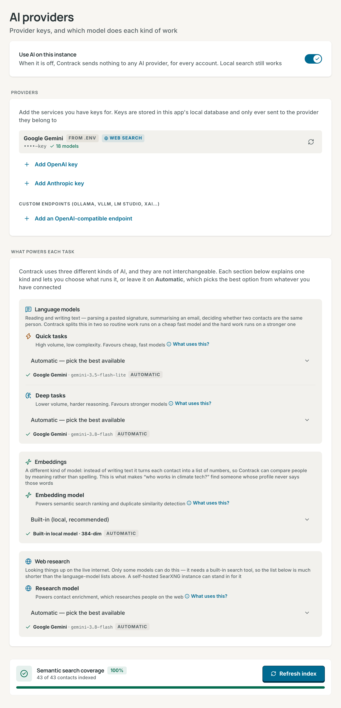
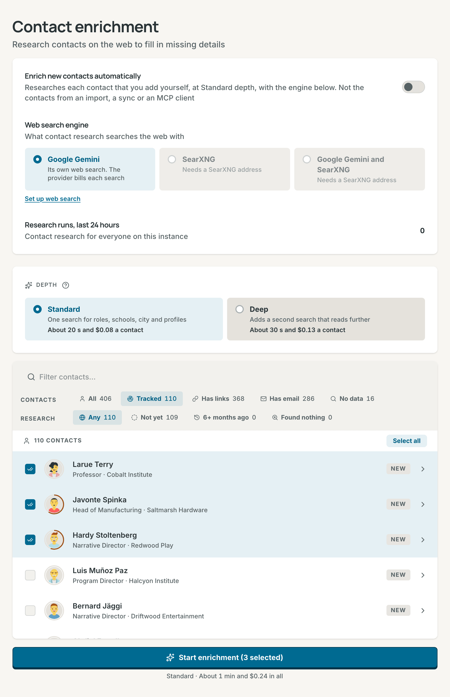
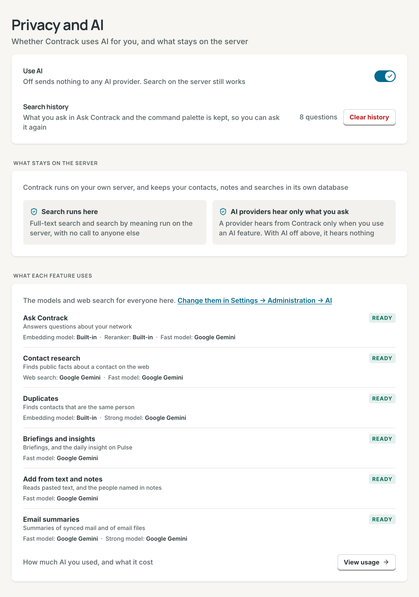

# AI

AI in Contrack is optional. This page says what each AI feature does and
sends, how to connect a provider and research contacts, and how to turn AI off.

## What AI does

Each AI feature runs one kind of task. An admin picks the model for each task
(see [Models for each task](#models-for-each-task)).

| Feature                                | What it does                                                                                                                             | Task                           | What it sends                                                                                                                                  |
| -------------------------------------- | ---------------------------------------------------------------------------------------------------------------------------------------- | ------------------------------ | ---------------------------------------------------------------------------------------------------------------------------------------------- |
| [Ask Contrack](search.md#ask-contrack) | Plans the search for a question, checks each match, and gives the reason                                                                 | Quick tasks                    | The question, and the profile fields and matching note passages of up to 30 candidates                                                         |
| Group brief                            | **Synthesize these results** writes a short brief about the people a question found                                                      | Quick tasks                    | The question, and each match's name, role, company, industry, location and reason                                                              |
| Briefing                               | Writes three points to read before a conversation, on the contact's **Dossier** tab                                                      | Quick tasks                    | The contact's name, role, company, headline, summary, location and last contact date, and its latest 15 notes                                  |
| Daily insight                          | Writes one observation about your network on **Pulse**                                                                                   | Quick tasks                    | Contact counts, the industry mix, and the names of your most and least active contacts and of those not reached in 60 days                     |
| **Add from text**                      | Reads pasted text, such as an email signature, into the new contact form                                                                 | Quick tasks                    | The text you paste                                                                                                                             |
| People named in notes                  | Finds the people a saved note names, and links each one to a contact or a new [ghost](contacts.md#ghosts)                                | Quick tasks                    | The note text                                                                                                                                  |
| Email file summary                     | Summarizes an `.eml` file that you attach to a contact's timeline                                                                        | Deep tasks                     | The email's text                                                                                                                               |
| Mail summaries                         | Writes a short note for each matched email, when a **Mailbox (IMAP)** or **Google Workspace** connector has **Generate AI summaries** on | Quick tasks                    | Each email's subject and body                                                                                                                  |
| [Contact research](#research-contacts) | Searches the web for a contact and fills empty fields                                                                                    | Web research, then Quick tasks | The contact's name, role, company, headline, city, industry, website, summary, emails, profile links, jobs, schools, interests and other facts |
| Duplicate checks                       | **Smart scan** and **Full scan** ask about pairs that look alike but are not certain                                                     | Deep tasks                     | Both contacts' names, companies, roles, locations, emails, phones and import sources                                                           |
| Search by meaning                      | Turns each contact into numbers, so Ask Contrack and duplicate checks can compare people by meaning                                      | Embeddings                     | Nothing with the built-in model. A hosted model gets each contact's profile text, but not for an account with AI off                           |

Research never sends your notes or phone numbers.

## What works without AI

With no provider connected, Contrack keeps working. Ask Contrack answers from
the local index with the built-in model, and marks its answers **Not verified
by AI**. The command palette, facets and
[note search](search.md#search-your-notes) run on the server. Duplicate checks
run, and **Smart scan** and **Full scan** skip their AI step.

The other features in the table need a provider. Without one, an `.eml` file
that you attach is saved with no summary.

## Connect a provider

Only an admin can connect a provider. With sign-in off, you are the admin.

### Add a key

1. Open **Settings → Administration → AI providers**.
2. Under **Providers**, choose **Add Google Gemini key**, **Add OpenAI key** or
   **Add Anthropic key**.
3. Paste the key and choose **Connect**. Contrack checks the key by loading
   the provider's model list.

One key is enough: every task then runs on **Automatic**. Get a key from
[Google AI Studio](https://aistudio.google.com/apikey), the
[OpenAI Platform](https://platform.openai.com/api-keys) or the
[Anthropic Console](https://console.anthropic.com/settings/keys). Contrack
stores the key encrypted and sends it only to its own provider.

A provider row shows the end of the key, the number of models, and **web
search** when the provider can do web research. A key in `GEMINI_API_KEY`,
`OPENAI_API_KEY` or `ANTHROPIC_API_KEY` wins over a saved key, and its row
shows **from .env** (see
[Environment Variables](configuration.md#environment-variables)).

> **Note:** On Google's free tier, Google may use prompts and responses,
> contacts' details included, to improve its products. When Google says that a
> key is on the free tier, its row shows a warning. Use a key from a Google
> Cloud project with billing.

### Add a custom endpoint

A custom endpoint is a server that speaks the OpenAI API format, such as
Ollama, vLLM, LM Studio, llama.cpp, xAI or Mistral. A model server on your own
network is always a custom endpoint.

1. Under **Custom endpoints**, choose **Add an OpenAI-compatible endpoint**.
2. Fill in **ID** (letters, numbers and hyphens), **Name** and **Base URL**,
   such as `http://alpha:11434/v1`. Fill in **API key (optional)** only when
   the server needs one.
3. Choose **Connect**. Contrack loads the endpoint's model list.

When the row says "no models found", check two things, then choose **Refresh
model list**:

- **The base URL ends with `/v1`.** Ollama serves its OpenAI API at
  `http://<host>:11434/v1`, not at the root.
- **In Docker, `localhost` is the container.** Use
  `http://host.docker.internal:11434/v1` or the host's network address. On
  Linux, start the container with `--add-host=host.docker.internal:host-gateway`
  to make that name work. Ollama must listen beyond its own machine: set
  `OLLAMA_HOST=0.0.0.0` where it runs.

A custom endpoint can serve **Quick tasks**, **Deep tasks** and the
**Embedding model**. It cannot do web research.

## Models for each task

The **What powers each task** section has three groups:

| Group               | Task                | What it powers                                                                                                                                                  | Default                           |
| ------------------- | ------------------- | --------------------------------------------------------------------------------------------------------------------------------------------------------------- | --------------------------------- |
| **Language models** | **Quick tasks**     | Ask Contrack, the group brief, briefings, the daily insight, **Add from text**, people named in notes, mail summaries, and reading research results into fields | **Automatic**                     |
|                     | **Deep tasks**      | Email file summaries, duplicate checks, and reading [SearXNG](#web-research-with-searxng) results                                                               | **Automatic**                     |
| **Embeddings**      | **Embedding model** | Search by meaning and duplicate matching                                                                                                                        | **Built-in (local, recommended)** |
| **Web research**    | **Research model**  | The web search step of contact research                                                                                                                         | **Automatic**                     |

**Automatic — pick the best available** tries the provider in `AI_PROVIDER`
first (`gemini` by default), then the others. A built-in provider takes its
newest small model for **Quick tasks**, and its newest mid-size model for the
other tasks. A custom endpoint uses the first chat model in its list. The line
under each select names the model that runs. Model lists load when you save a
key and once a day, so new models appear without an update.

To pin a model, choose it and then **Save**. For Gemini, OpenAI and Anthropic,
Contrack first sends the model one small test request, and keeps the old
choice when the model does not answer.
The **Research model** list shows only models with their provider's own web
search. The `AI_*_MODEL` variables pin models from the environment, and a pin
saved in the app wins (see [AI](configuration.md#ai)).

### Change the embedding model

The built-in model runs on the server, costs nothing and works offline. A
hosted model can rank better on a large network, but it gets every contact's
profile text. When you save a different model, Contrack rebuilds the search
and duplicate indexes in the background, and results are incomplete until it
finishes. The **Semantic search coverage** card shows the progress. With a
hosted model, new and changed contacts wait until you choose **Index missing**
or **Refresh index**, then **Confirm & refresh**. The provider bills each one.
A hosted model never gets the contacts of an account with **Use AI for this
account** off. Ask Contrack finds that account's people by their words only.

## Research contacts

Contact research searches the web for a person and fills empty fields: roles,
schools, a city, profiles and other facts. It needs a provider with web search
(Gemini, OpenAI or Anthropic), or [SearXNG](#web-research-with-searxng). It
never runs for archived contacts or ghosts.

| Depth        | What it does                                     | Time and cost per contact |
| ------------ | ------------------------------------------------ | ------------------------- |
| **Standard** | One search for roles, schools, city and profiles | About 40 s and $0.15      |
| **Deep**     | Adds a longer search, for a complete profile     | About 1 min and $0.32     |

The depth tiles show time and cost only while Gemini runs research. The
question mark beside **Research depth** compares the cost per contact on
Google, Anthropic and OpenAI, at 2026 list prices. Google's figures were
measured, and the other two are estimates from the same searches and tokens.
Only Google gives free web searches: the first 5,000 each month.

### Research many contacts

1. Open **Settings → Contact enrichment**.
2. Choose the **Research depth**. It starts at **Standard** each time.
3. Narrow the list. The **Contacts** row offers **All**, **Tracked**, **Has
   links**, **Has email** and **No data**. The **Research** row offers **Any**,
   **Not yet**, **6+ months ago** and **Found nothing**. A contact shows when
   it matches both rows.
4. Select contacts, or choose **Select all**.
5. Read the time and cost under the button, and choose **Start enrichment**.
   Check the dialog, and choose **Search** with the number of contacts.

A row's badge says **New**, the date of the last research, **No page** or
**Error**. The progress panel opens at the bottom right, and each update saves
as its contact finishes. **Stop research** stops the batch, but a provider may
still bill a request that it already took.

### Research one contact, or every new one

- In the contact's actions menu, choose **Enrich contact** (Standard) or
  **Enrich deeply** (Deep). On the **Dossier** tab, **Enrich contact** and
  **Enrich again** open a menu with both depths. One contact needs no
  confirmation.
- Turn on **Enrich new contacts automatically** on the **Contact enrichment**
  page, and Contrack researches each contact that you add yourself, in the app
  or through the REST API, at Standard depth. It leaves out the contacts that
  a file import, a connector sync or an MCP client adds. It is off by default.

### What research adds

Research fills only empty fields and adds new list entries. It never changes a
value that you already have, and it does not add back an entry that you
removed. It adds an email or a phone number only when the person or their
employer published it. It leaves out relatives, health, religion, politics,
sexuality, home addresses and home purchases. When you edit the contact while
research runs, Contrack drops the result.

The **Research** card on the **Dossier** tab lists each run, each fact beside
its page, and every page under **Sources**. Check a fact against its page.

When research finds no page, the card says **No web page matched** and offers
**Add a city**, **Add a work email** or **Add a link**. Add a detail, then
choose **Enrich again**, or **Deep** after a Standard run. **Enrich again**
looks in new places and adds only new facts.

### Limits

- A batch holds up to 100 contacts, and they run one after another. One
  contact may take up to 4 minutes at Standard and 5 minutes at Deep.
- One batch runs on the instance at a time, because every account shares the
  provider key. Your next start joins your batch. Another account's start
  waits: "Another user's enrichment is running. Try again in a moment".

## Turn AI off

There are two switches. Contrack calls a provider only when both allow it.

- **For your account:** in **Settings → Privacy and AI**, turn off **Use AI
  for this account**. The **AI on this instance** card on that page shows
  which tasks your admin set up.
- **For the whole instance:** an admin turns off **Use AI on this instance** in
  **Settings → Administration → AI providers**. Then no call to an AI provider
  leaves the server, for any account. Stored keys stay. `AI_DISABLED=true`
  holds this switch off.

With a hosted embedding model, turning AI off for the instance moves search to
the built-in model. Turning it on again embeds every contact with the provider.

With either switch off:

- Ask Contrack still answers from the local index, and the built-in embedding
  model keeps working.
- The other features in the table do not run. Their controls are hidden, or
  they say that AI is off.
- The **Duplicates** page offers only **Quick scan**, which asks no AI
  provider. A Smart scan and a Full scan do not run. The automatic checks of
  new contacts and imports still run.
- Link previews in notes do not load.
- An `.eml` file that you attach is saved with no summary.
- A search that an MCP client runs with your token answers from the local
  index, as Ask Contrack does.

## Costs and usage

Each provider bills its own key. The app shows estimates at list prices.

- A member opens **Settings → AI usage**, or **View usage** on the **Privacy
  and AI** page.
- An admin opens **Settings → Administration → AI usage**. **Mine** shows the
  admin's own use, and **All users** adds a **By account** table.

The page shows **Invocations**, **Tokens used** with an estimated cost, and
**Cache hit rate**. A cached answer costs nothing. The **Activity feed** lists
each call of the last 30 days. Admins also see **Research runs, last 24
hours** on the **Contact enrichment** page.

Limits and busy answers:

- Each account can send 30 AI requests a minute, and each network address 60.
  Past that, Contrack says "Too many requests" and how many seconds to wait.
- The server runs two AI calls at a time, and Ask Contrack has two more of its
  own. Up to 16 more calls wait. Past that, Contrack says "AI is busy. Please
  try again shortly."
- When Gemini says that a model is over its limit, Contrack pauses that model
  for the time that Google asks, and uses another model. **Instance health**
  shows **Models paused** and **Gemini web searches today**.

## Privacy

### What leaves this machine

- A provider gets data only when an AI feature runs, and only for its own task.
  [What AI does](#what-ai-does) lists what each feature sends.
- Full-text search and search by meaning run on this server, unless an admin
  picks a hosted embedding model.
- For web research, the provider searches the web with the contact's details.
  With SearXNG, your SearXNG runs the searches, and Contrack reads the pages.
- A download of the local search models sends no contact data.
- With **Use AI for this account** off, nothing goes to a provider for you,
  even while AI is on for the instance. This includes the notes that you save,
  the `.eml` files that you attach, the searches that an MCP client runs with
  your token, and your contacts' text for a hosted embedding model.

### How Contrack guards prompts and answers

- Contact fields, notes, email files and web pages go into a prompt inside a
  marked block. The model is told that the block is data, never instructions.
- Each answer must match the shape that Contrack asks for. Contrack cleans each
  value and cuts it to length before it saves it, and drops a value that
  repeats injected instructions.
- For each Ask Contrack match, the model quotes one of the contact's fields.
  The server checks the quote and writes the reason from it.

## Web research with SearXNG

SearXNG is a search engine that you host yourself. Contrack uses it for
contact research when no connected provider offers web search. With a custom
endpoint and the built-in embedding model, Contrack then needs no cloud AI.

1. Run SearXNG with JSON answers on: add `json` to `search.formats` in its
   `settings.yml`.
2. In **Settings → Administration → General**, enter the base URL under
   **Self-hosted search (SearXNG)**, such as `http://searxng.local:8080`, and
   choose **Save**. `SEARXNG_URL` sets it from the environment instead.
3. Connect a model for **Deep tasks**, such as a custom endpoint.

For each contact, Contrack runs up to three searches built from the name,
company, role and location. It reads up to five result pages from public
addresses, and the **Deep tasks** model reads them into fields.

A **Research model** of **Off — never research online** stops SearXNG
research too.

## Related

- [Search and Ask Contrack](search.md#ask-contrack)
- [Contacts](contacts.md#the-contact-page)
- [Configuration reference](configuration.md#ai)
- [Self-hosting](self-hosting.md)
- [Architecture](architecture.md#ai)
