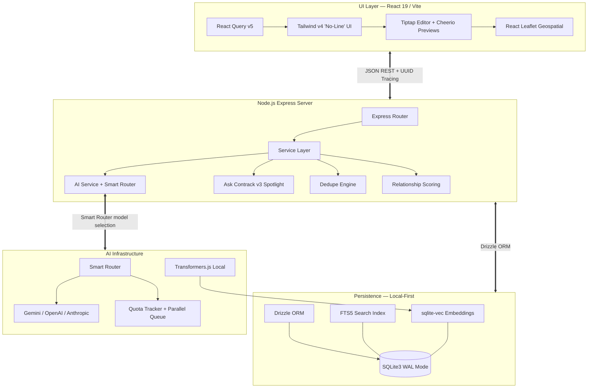

# Architecture

A technical deep-dive into Contrack's system design, data flow, and key infrastructure components.

## System Overview



---

## Frontend Architecture

| Layer              | Technology              | Role                                                            |
| ------------------ | ----------------------- | --------------------------------------------------------------- |
| **Framework**      | React 19 + Vite 6       | Concurrent rendering, instant HMR                               |
| **Data Fetching**  | React Query v5          | Declarative cache invalidation, query deduplication             |
| **Styling**        | Tailwind CSS v4         | "No-Line" design system — no borders, surface shift containment |
| **Rich Text**      | Tiptap + ProseMirror    | Block-based editor with @mention extension                      |
| **Animation**      | Motion (Framer)         | Micro-interactions, layout transitions, staggered entry         |
| **Routing**        | React Router v7         | Nested routes with animated transitions                         |
| **Virtualization** | @tanstack/react-virtual | <20ms page transitions for 100K+ contacts                       |

### Design System: "No-Line" Hierarchy

The UI follows strict Tailwind CSS v4 tokens:

- **Zero Borders Rule** — No `border-gray-200`. Containment through surface background shifts:
  - `surface` → Base layer
  - `surface-container-low` → Secondary sections
  - `surface-container-lowest` → Cards, modals, high-focus
- **Glassmorphism** — Modals use backdrop blurs on opaque backgrounds
- **Micro-Animations** — Motion for staggered entry, fade transitions, layout animation
- **Progressive Disclosure** — Two-phase search results, enriching indicators, skeleton loaders

### Key Hooks

| Hook                    | Purpose                                                            |
| ----------------------- | ------------------------------------------------------------------ |
| `useInstantSearch`      | 0ms client-side search with FTS5 server handover                   |
| `useQueryTokenizer`     | Parses faceted filter prefix operators (`role:`, `company:`, etc.) |
| `useSearchHistory`      | Terminal-style ↑/↓ history with 30-second re-populate              |
| `useGlobalNavShortcuts` | Cmd+Shift+\* keyboard navigation                                   |
| `useRecentContacts`     | Tracks and displays recently visited contacts                      |
| `useFocusTrap`          | Accessible modal focus management                                  |
| `useLongPress`          | Mobile long-press for context menus                                |
| `useCompanyLogo`        | Heuristic logo discovery via local proxy                           |

---

## Backend Architecture

### Layer Pattern

```
Route (thin controller) → Service (business logic) → Repository (data access) → SQLite
```

- **Routes** (`server/routes/`) — Express handlers, validation, response formatting
- **Services** (`server/services/`) — Core business logic, orchestration
- **Repositories** (`server/repositories/`) — Data access, SQL queries, hydration
- **Utils** (`server/utils/`) — Shared helpers: NLP, logging, caching, validators

### Key Services

| Service               | Role                                               |
| --------------------- | -------------------------------------------------- |
| `contactService`      | CRUD, bulk operations, Magic Paste parsing         |
| `interactionService`  | Timeline events, @mention extraction, briefings    |
| `searchService`       | FTS5 keyword + vector KNN hybrid search            |
| `dedupeService`       | Multi-pass deduplication with merge/undo           |
| `relationshipService` | Scoring algorithm, hourly recompute                |
| `dashboardService`    | Network health metrics, composition analytics      |
| `aiStatsService`      | Token tracking, cache performance, cost estimation |
| `zeroStateService`    | CRM intelligence signals for Cmd+K                 |

### Error Handling

All errors flow through a centralized Express error handler using the `AppError` class:

- **Operational errors** — Known, recoverable (400, 404, 429) — logged as warnings
- **Programmer errors** — Unknown, 500 — full stack trace logged
- **SQLite-specific** — `SQLITE_CONSTRAINT` → 400, `SQLITE_BUSY` → 503

---

## AI Module Architecture

### Provider-Agnostic Adapter Pattern

```
server/ai/
├── adapters/        # Concrete implementations
│   ├── gemini.ts    # Gemini 2.5 Flash / 3.1 Pro with SmartRouter
│   ├── openai.ts    # GPT-4o / GPT-4o-mini
│   └── anthropic.ts # Claude Sonnet / Haiku
├── provider.ts      # Abstract AIProvider interface
├── singleton.ts     # Factory — reads AI_PROVIDER, returns singleton
├── types.ts         # Shared types (DiagnosticsSnapshot, etc.)
└── index.ts         # Exports configured provider as `ai`
```

Every adapter implements the `AIProvider` interface:

```typescript
interface AIProvider {
  parseContact(text: string): Promise<ParsedContact>;
  enrichContact(name: string, context: string): Promise<EnrichedData>;
  generateBriefing(name: string, timeline: string): Promise<string>;
  semanticSearch(query: string, contacts: SlimContact[]): Promise<SearchResult>;
  extractMentions(text: string, contacts: SlimContact[]): Promise<string[]>;
  generateInsight(metrics: DashboardMetrics): Promise<string>;
  // ... and more
}
```

### Smart Router (Gemini only)

The `SmartRouter` selects the optimal Gemini model per use case:

| Use Case                     | Model Class                  | Reasoning                      |
| ---------------------------- | ---------------------------- | ------------------------------ |
| Contact parsing, mentions    | Lite (Gemini 2.0 Flash-Lite) | Low latency, simple extraction |
| Search, briefings, insights  | Flash (Gemini 2.5 Flash)     | Balance of speed and quality   |
| Complex synthesis, grounding | Pro (Gemini 2.5 Pro)         | Maximum quality                |

### Quota Tracker

Tracks per-model RPM (requests per minute) and RPD (requests per day) limits. Automatic retry with fallback to lower-tier models on rate limits.

### Parallel Queue

Manages concurrent AI requests with configurable concurrency limits to avoid exceeding provider rate limits during batch operations.

---

## Database Schema

Contrack uses a highly normalized Drizzle ORM schema on SQLite with WAL mode.

### Core Tables

| Table                  | Purpose                                                                                  |
| ---------------------- | ---------------------------------------------------------------------------------------- |
| `contacts`             | Primary entity — demographics, AI briefings, `isGhost`, `canonicalId`, `searchExpansion` |
| `contact_emails`       | 1:N email addresses with label and primary flag                                          |
| `contact_phones`       | 1:N phone numbers with label and primary flag                                            |
| `contact_tags`         | Contact → tag associations                                                               |
| `contact_interests`    | Interest taxonomy (including AI-generated)                                               |
| `contact_education`    | Chronological education history                                                          |
| `contact_experience`   | Chronological career history                                                             |
| `contact_social_links` | Social profiles (LinkedIn, GitHub, Twitter, etc.)                                        |
| `contact_sources`      | Import provenance tracking                                                               |
| `contact_addresses`    | Multi-value addresses with geocoding                                                     |

### Relationship Tables

| Table                  | Purpose                                                |
| ---------------------- | ------------------------------------------------------ |
| `interactions`         | Timeline events (calls, notes, emails, meetings)       |
| `interaction_mentions` | Junction table for bi-directional @mention graph       |
| `action_items`         | Follow-up tasks with due dates and completion tracking |
| `lists`                | User-created contact groups                            |
| `list_members`         | Contact → list membership with sort order              |

### AI & Search Tables

| Table                | Purpose                                                   |
| -------------------- | --------------------------------------------------------- |
| `contacts_fts`       | FTS5 virtual table — full-text search index               |
| `contact_embeddings` | `vec0` — 768-dim Gemini embeddings for deduplication      |
| `search_embeddings`  | `vec0` — 384-dim local embeddings for Ask Contrack search |
| `embedding_metadata` | Tracks embedding staleness per contact                    |

### Deduplication Tables

| Table                | Purpose                                          |
| -------------------- | ------------------------------------------------ |
| `dedupe_suggestions` | Pending deduplication clusters with status       |
| `dedupe_exclusions`  | User-dismissed pairs (never suggest again)       |
| `merge_log`          | Audit trail for merge operations (supports undo) |

Schema definition: [`src/db/schema.ts`](../src/db/schema.ts). Virtual tables and triggers: [`server/db.ts`](../server/db.ts).

---

## Caching

### AI Cache (`aiCache`)

A multi-tiered LRU caching layer that intercepts redundant AI calls:

| Tier           | TTL | Max Entries | Use Case                 |
| -------------- | --- | ----------- | ------------------------ |
| `briefing`     | 24h | 100         | Catch-Me-Up briefings    |
| `rerank`       | 12h | 200         | Search result re-ranking |
| `synthesis`    | 12h | 100         | Group synthesis briefs   |
| `mentions`     | 24h | 200         | @mention extraction      |
| `dailyInsight` | 24h | 1           | Dashboard AI insight     |

### React Query Cache

Frontend caching via React Query v5 with:

- Stale-while-revalidate pattern
- Optimistic updates for mutations
- Automatic cache invalidation on related mutations

---

## Search Pipeline

Ask Contrack v3 uses a hybrid retrieval-augmented generation (RAG) pipeline:

```
User Query
    │
    ├──→ FTS5 Keyword Search (SQLite)     ──→ Top-N results
    │                                          │
    ├──→ Vector KNN Search (sqlite-vec)   ──→ Top-N results
    │    (384-dim MiniLM local embeddings)     │
    │                                          │
    └──→ Reciprocal Rank Fusion (RRF)    ←────┘
              │
              ▼
         Fused Results (Phase 1 — <15ms)
              │
              ▼
         AI Re-ranking + Reason Generation (Phase 2 — ~500ms)
              │
              ▼
         Streamed via NDJSON to client
```

### Write-Time Enrichment (Doc2Query)

When contacts are created or updated, an async background job generates synthetic search terms using Gemini Lite. For example, a "Stripe Engineer" gets expansion terms like `fintech, payments, developer`. Stored in a `searchExpansion` column indexed by FTS5.
