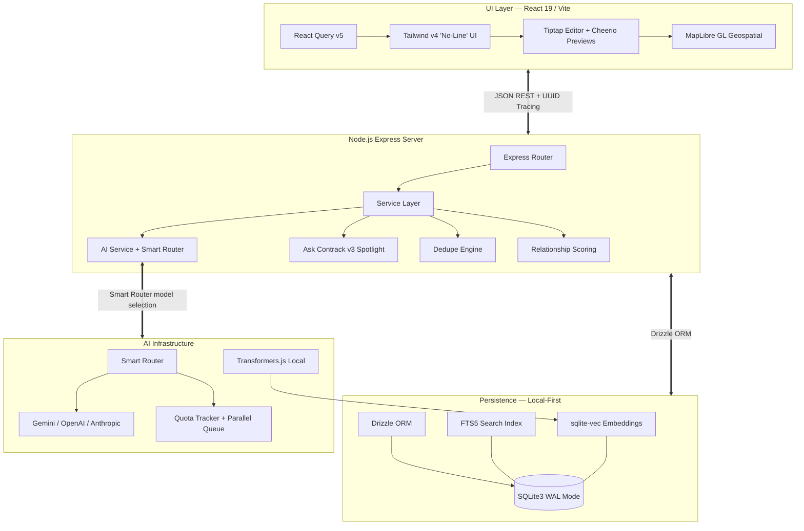

# Architecture

A technical deep-dive into Contrack's system design, data flow, and key infrastructure components.

## System Overview


```mermaid
graph TD
    subgraph Frontend ["UI Layer — React 19 / Vite"]
        RQ["React Query v5"] --> TW["Tailwind v4 'No-Line' UI"]
        TW --> TT["Tiptap Editor + Cheerio Previews"]
        TT --> Map["MapLibre GL Geospatial"]
    end

    subgraph Backend ["Node.js Express Server"]
        EX["Express Router"] --> SVC["Service Layer"]
        SVC --> AI["AI Service + Smart Router"]
        SVC --> SRCH["Ask Contrack v3 Spotlight"]
        SVC --> DDP["Dedupe Engine"]
        SVC --> REL["Relationship Scoring"]
    end

    subgraph Storage ["Persistence — Local-First"]
        SQL[("SQLite3 WAL Mode")]
        DZ["Drizzle ORM"] --> SQL
        FTS["FTS5 Search Index"] --- SQL
        VEC["sqlite-vec Embeddings"] --- SQL
    end

    subgraph AILayer ["AI Infrastructure"]
        SR["Smart Router"] --> Adapters["Gemini / OpenAI / Anthropic"]
        SR --> QT["Quota Tracker + Parallel Queue"]
        LE["Transformers.js Local"] --> VEC
    end

    Frontend <===>|"JSON REST + UUID Tracing"| Backend
    AI <===>|"Smart Router model selection"| AILayer
    Backend <===>|"Drizzle ORM"| Storage
```

---

## Frontend Architecture

| Layer              | Technology                           | Role                                                            |
| ------------------ | ------------------------------------ | --------------------------------------------------------------- |
| **Framework**      | React 19 + Vite 6                    | Concurrent rendering, instant HMR                               |
| **Data Fetching**  | React Query v5                       | Declarative cache invalidation, query deduplication             |
| **Styling**        | Tailwind CSS v4                      | "No-Line" design system — no borders, surface shift containment |
| **Rich Text**      | Tiptap + ProseMirror                 | Block-based editor with @mention extension                      |
| **Animation**      | Motion (Framer)                      | Micro-interactions, layout transitions, staggered entry         |
| **Routing**        | React Router v7                      | Nested routes with animated transitions                         |
| **Virtualization** | @tanstack/react-virtual              | <20ms page transitions for 100K+ contacts                       |
| **Mapping**        | MapLibre GL + @vis.gl/react-maplibre | Vector basemap from OpenFreeMap, clustering done by the map     |

### Code Loading

The Network list and the contact page are in the first bundle. Every other view is its own module: the map, Pulse, Ask Contrack, Settings, and each settings page. Two rules make a view open at once all the same:

1. **Warm in idle moments.** The app loads the map's code, then Settings' shell and the code of each settings page the viewer can open, one per idle moment (`src/lib/idle.ts`, `src/views/settings/warm.ts`). All of Settings is about 106 KB gzipped. Pointing at, focusing or pressing a link to Settings or to a settings page starts its code too, and its first data when the page exports a `prefetch` (the Account page reads its devices, tokens and passkeys). A browser told to save data is left alone.
2. **Render at once when loaded.** `React.lazy` suspends on its first render even when the module is in memory, and in a Suspense boundary that is new on screen React shows the fallback and holds the content back until 300 ms after it. `src/lib/preloadable.tsx` keeps the loaded module, so the view renders in the same frame. Settings has one Suspense boundary for all its pages, which stays on screen from page to page: a page whose code is still on its way keeps the last page up until it arrives.

Measured on 5,824 contacts with a production build: Settings opens from the Network page in 52 to 103 ms (365 ms before), and each settings page opens from the rail in 13 to 63 ms, with no "Loading…".

### Long Lists

A list that can hold every contact draws only the rows near the screen, with `@tanstack/react-virtual`: the Network list, the map's list, the Tracked contacts page, and past 200 rows the Duplicates picker and the Enrichment list (`src/components/ui/VirtualRows.tsx`). `VirtualRows` finds the nearest ancestor that scrolls, the page's one scroller or a box of its own, and up to 200 rows it is a plain list.

### Design System: "No-Line" Hierarchy

The UI follows strict Tailwind CSS v4 tokens:

- **Zero Borders Rule** — No `border-gray-200`. Containment through surface background shifts:
  - `surface` → Base layer
  - `surface-container-low` → Secondary sections
  - `surface-container-lowest` → Cards, modals, high-focus
- **Glassmorphism** — Modals use backdrop blurs on opaque backgrounds
- **Micro-Animations** — Motion for staggered entry, fade transitions, layout animation
- **Progressive Disclosure** — Two-phase search results, enriching indicators, skeleton loaders

### Key Hooks

| Hook                    | Purpose                                                            |
| ----------------------- | ------------------------------------------------------------------ |
| `useInstantSearch`      | 0ms client-side search with FTS5 server handover                   |
| `useQueryTokenizer`     | Parses faceted filter prefix operators (`role:`, `company:`, etc.) |
| `useSearchHistory`      | Terminal-style ↑/↓ history with 30-second re-populate              |
| `useGlobalNavShortcuts` | Cmd+Shift+\* keyboard navigation                                   |
| `useRecentContacts`     | Tracks and displays recently visited contacts                      |
| `useFocusTrap`          | Accessible modal focus management                                  |
| `useLongPress`          | Mobile long-press for context menus                                |
| `useCompanyLogo`        | Heuristic logo discovery via local proxy                           |

---

## Backend Architecture

### Layer Pattern

```
Route (thin controller) → Service (business logic) → Repository (data access) → SQLite
```

- **Routes** (`server/routes/`) — Express handlers, validation, response formatting
- **Services** (`server/services/`) — Core business logic, orchestration
- **Repositories** (`server/repositories/`) — Data access, SQL queries, hydration
- **Utils** (`server/utils/`) — Shared helpers: NLP, logging, caching, validators

### Key Services

| Service               | Role                                                        |
| --------------------- | ----------------------------------------------------------- |
| `contactService`      | CRUD, bulk operations, Magic Paste parsing                  |
| `interactionService`  | Timeline events, @mention extraction, briefings             |
| `searchService`       | FTS5 keyword + vector KNN hybrid search                     |
| `dedupeService`       | Multi-pass deduplication with merge/undo                    |
| `relationshipService` | Scoring algorithm, hourly incremental and daily full sweeps |
| `dashboardService`    | Network health metrics, composition analytics               |
| `aiStatsService`      | Token tracking, cache performance, cost estimation          |
| `zeroStateService`    | CRM intelligence signals for Cmd+K                          |

### Error Handling

All errors flow through a centralized Express error handler using the `AppError` class:

- **Operational errors** — Known, recoverable (400, 404, 429) — logged as warnings
- **Programmer errors** — Unknown, 500 — full stack trace logged
- **SQLite-specific** — `SQLITE_CONSTRAINT` → 400, `SQLITE_BUSY` → 503

---

## AI Module Architecture

### Provider-Agnostic Adapter Pattern

```
server/ai/
├── adapters/                # Concrete implementations
│   ├── gemini.ts            # Gemini via @google/genai, with SmartRouter + usage meter
│   ├── openai.ts            # OpenAI
│   ├── anthropic.ts         # Anthropic
│   └── openaiCompatible.ts  # Any OpenAI-format server (Ollama, vLLM, LM Studio…)
├── provider.ts      # Abstract AIProvider interface
├── capabilities.ts  # Capability → provider+model resolution (quick/deep/research/embeddings)
├── embeddings.ts    # Embeddings capability + vector dimension lifecycle
├── gateway.ts       # generateFor(capability, opts) — the entry point for all generation
├── providerRegistry.ts # Every configured provider (env keys, stored keys, custom endpoints)
├── schemaTranslation.ts # One JSON-schema translator, per-dialect options
├── services/        # Domain business logic behind the aiService.ts barrel
│   ├── contactParsing.ts    # Magic Paste, bulk import parsing
│   ├── relationshipIntel.ts # Briefings, EML digests, daily insight
│   ├── mentions.ts          # @mention entity extraction
│   ├── searchIntel.ts       # Query planning, HyDE, rerank, synthesis
│   └── shared.ts            # isMockMode, safeParseJson
├── aiService.ts     # Stable import path — re-exports services/
├── singleton.ts     # Default-provider proxy (back-compat surface)
├── types.ts         # Shared types (DiagnosticsSnapshot, etc.)
└── index.ts         # Exports configured provider as `ai`
```

Every adapter implements the `AIProvider` interface:

```typescript
interface AIProvider {
  parseContact(text: string): Promise<ParsedContact>;
  enrichContact(name: string, context: string): Promise<EnrichedData>;
  generateBriefing(name: string, timeline: string): Promise<string>;
  semanticSearch(query: string, contacts: SlimContact[]): Promise<SearchResult>;
  extractMentions(text: string, contacts: SlimContact[]): Promise<string[]>;
  generateInsight(metrics: DashboardMetrics): Promise<string>;
  // ... and more
}
```

### Smart Router (Gemini only)

The `SmartRouter` picks the Gemini model for each task class: the newest
generation in the class, stable before preview, cheaper as the tie-break.

| Use Case                                   | Model Class                   | Reasoning                      |
| ------------------------------------------ | ----------------------------- | ------------------------------ |
| Contact parsing, mentions, search planning | Lite (Gemini 3.5 Flash-Lite)  | Low latency, simple extraction |
| Email summaries, duplicate checks          | Flash (Gemini 3.8 Flash)      | Balance of speed and quality   |
| Web research                               | Flash, with Google Search     | Balance of speed and quality   |
| Pinned only                                | Pro (Gemini 3.1 Pro, preview) | Maximum quality                |

A model that answers 429, a 5xx or a timeout sits out for the delay Google
names in the error (30 seconds when it names none), and the retry goes to the
next model. There are no guessed free or paid limits.

### Quota Tracker

Counts what this process sent to each Gemini model: requests and tokens in the
last minute, requests today, and grounded requests today. The admin Health
page shows it. It counts only and blocks nothing.

### Parallel Queue

Manages concurrent AI requests with configurable concurrency limits to avoid exceeding provider rate limits during batch operations.

---

## Database Schema

Contrack uses a highly normalized Drizzle ORM schema on SQLite with WAL mode.

### Core Tables

| Table                  | Purpose                                                                                  |
| ---------------------- | ---------------------------------------------------------------------------------------- |
| `contacts`             | Primary entity — demographics, AI briefings, `isGhost`, `canonicalId`, `searchExpansion` |
| `contact_emails`       | 1:N email addresses with label and primary flag                                          |
| `contact_phones`       | 1:N phone numbers with label and primary flag                                            |
| `contact_tags`         | Contact → tag associations                                                               |
| `contact_interests`    | Interest taxonomy (including AI-generated)                                               |
| `contact_education`    | Chronological education history                                                          |
| `contact_experience`   | Chronological career history                                                             |
| `contact_social_links` | Social profiles (LinkedIn, GitHub, Twitter, etc.)                                        |
| `contact_sources`      | Import provenance tracking                                                               |
| `contact_addresses`    | Multi-value addresses with geocoding                                                     |

### Relationship Tables

| Table                  | Purpose                                                |
| ---------------------- | ------------------------------------------------------ |
| `interactions`         | Timeline events (calls, notes, emails, meetings)       |
| `interaction_mentions` | Junction table for bi-directional @mention graph       |
| `action_items`         | Follow-up tasks with due dates and completion tracking |
| `lists`                | User-created contact groups                            |
| `list_members`         | Contact → list membership with sort order              |

### AI & Search Tables

| Table                | Purpose                                                   |
| -------------------- | --------------------------------------------------------- |
| `contacts_fts`       | FTS5 virtual table — full-text search index               |
| `contact_embeddings` | `vec0` — 768-dim Gemini embeddings for deduplication      |
| `search_embeddings`  | `vec0` — 384-dim local embeddings for Ask Contrack search |
| `embedding_metadata` | Tracks embedding staleness per contact                    |

### Deduplication Tables

| Table                | Purpose                                          |
| -------------------- | ------------------------------------------------ |
| `dedupe_suggestions` | Pending deduplication clusters with status       |
| `dedupe_exclusions`  | User-dismissed pairs (never suggest again)       |
| `merge_log`          | Audit trail for merge operations (supports undo) |

### Connector Tables

| Table             | Purpose                                                              |
| ----------------- | -------------------------------------------------------------------- |
| `connectors`      | Configured sync integrations (kind, name, status, config, interval)  |
| `connector_runs`  | Historical sync run execution logs, duration, error text, and stats  |
| `connector_links` | Deduplication links mapping external feed items to internal entities |
| `upcoming_events` | Future meetings synced from calendar feeds for Pulse and dashboard   |
| `oauth_states`    | Ephemeral cryptographic states for OAuth handshakes (15-min TTL)     |

Schema definition: [`src/db/schema.ts`](../src/db/schema.ts). Virtual tables and triggers: [`server/db.ts`](../server/db.ts).

---

## Caching

### AI Cache (`aiCache`)

A multi-tiered LRU caching layer that intercepts redundant AI calls:

| Tier           | TTL | Max Entries | Use Case                 |
| -------------- | --- | ----------- | ------------------------ |
| `briefing`     | 24h | 100         | Catch-Me-Up briefings    |
| `rerank`       | 12h | 200         | Search result re-ranking |
| `synthesis`    | 12h | 100         | Group synthesis briefs   |
| `mentions`     | 24h | 200         | @mention extraction      |
| `dailyInsight` | 24h | 1           | Dashboard AI insight     |

### React Query Cache

Frontend caching via React Query v5 with:

- Stale-while-revalidate pattern
- Optimistic updates for mutations
- Automatic cache invalidation on related mutations

---

## Search Pipeline

Ask Contrack sends the local hybrid list (keyword and vector) before it calls AI.
A name, an email, a phone number or a quoted phrase uses only the local index.
The model never runs for these queries.

1. The query planner produces bounded hard filters and optional traits.
2. The retrieval engine applies those filters before keyword and vector limits.
3. It combines local keyword rankings and local vector rankings.
4. When the filters hold every constraint, the filtered contacts are the answer.
   The reranker does not run.
5. Otherwise the reranker checks at most 30 compact profiles.
6. The server verifies claimed field values and hard constraints, and builds
   each reason from the proven fields.
7. The response ends with verified matches, an empty result, or the local
   list, marked unverified.

A shared 12-second deadline bounds refinement. Client disconnects cancel active work.
Search caches include the data revision, model, and a five-minute time bucket.
Concurrent edits prevent old evidence from entering the result cache.

### Index Refreshes

SQLite triggers maintain the keyword index during contact and child-record changes.
A coalesced local queue refreshes built-in embeddings after edits.
Automatic index refreshes do not generate AI search terms.
Explicit backfill commands remain available for configured provider embeddings.
