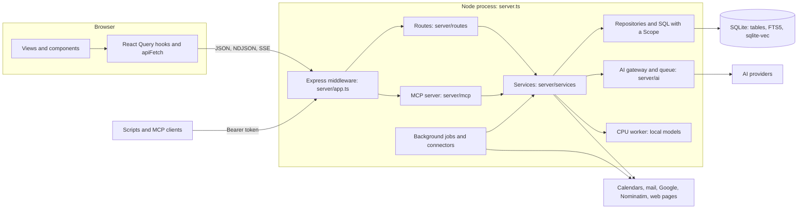

# Architecture

This page explains how Contrack is built, for contributors. It covers the
parts, the path of one request, the data model, and the rules that keep each
account's data apart.

## Overview

Contrack is one Node.js process. It serves the React app and the JSON API on
one port, 3210 by default, and it keeps all data in one SQLite file.

```mermaid
flowchart LR
  subgraph Browser
    Views["Views and components"]
    Hooks["React Query hooks and apiFetch"]
  end
  Clients["Scripts and MCP clients"]
  subgraph Server["Node process: server.ts"]
    MW["Express middleware: server/app.ts"]
    Routes["Routes: server/routes"]
    MCP["MCP server: server/mcp"]
    Jobs["Background jobs and connectors"]
    Services["Services: server/services"]
    Data["Repositories and SQL with a Scope"]
    Gateway["AI gateway and queue: server/ai"]
    Worker["CPU worker: local models"]
  end
  DB[("SQLite: tables, FTS5, sqlite-vec")]
  Providers["AI providers"]
  Web["Calendars, mail, Google, Nominatim, web pages"]
  Views --> Hooks
  Hooks -->|"JSON, NDJSON, SSE"| MW
  Clients -->|"Bearer token"| MW
  MW --> Routes & MCP
  Routes & MCP & Jobs --> Services
  Services --> Data --> DB
  Services --> Gateway --> Providers
  Services --> Worker
  Services & Jobs --> Web
```

| Part     | Built with                                                                                                                                      |
| -------- | ----------------------------------------------------------------------------------------------------------------------------------------------- |
| Runtime  | Node 26.10 or later, which runs the `.ts` files itself. `npm run dev` runs `node server.ts` with Vite as middleware. Production serves `dist/`. |
| Frontend | React 19, Vite 8, React Router 7, TanStack Query 5, Tailwind CSS 4, Motion, Tiptap, cmdk and MapLibre GL.                                       |
| Backend  | Express 5, Zod 4, multer, sharp, nodemailer, SimpleWebAuthn and the MCP SDK.                                                                    |
| Database | SQLite through better-sqlite3 and Drizzle ORM, in WAL mode, with FTS5 and sqlite-vec.                                                           |
| AI       | The Gemini, OpenAI and Anthropic SDKs, any OpenAI-compatible server, and Transformers.js for the local models.                                  |

## Repository layout

| Folder                                              | What it holds                                                                                                                                                                         |
| --------------------------------------------------- | ------------------------------------------------------------------------------------------------------------------------------------------------------------------------------------- |
| `src/`                                              | The React app: `api/` (query hooks and `apiFetch`), `views/` (pages), `components/`, `hooks/` and `lib/`.                                                                             |
| `shared/`                                           | Code that the server and the browser both run: the API contracts and event payloads (`contracts/`), facets, search history, dates, cadence, score bands, vCard and the MCP tool list. |
| `server/modules/`                                   | One module for each area: its routers, MCP tools, jobs and event subscribers, and the ordered list that the core reads.                                                               |
| `server/routes/`                                    | The Express routers, one file for each area.                                                                                                                                          |
| `server/middleware/`                                | Authentication, rate limits, the AI switch, cache headers, compression, the uploads guard and the error handler.                                                                      |
| `server/services/`                                  | The business logic, with `search/`, `dedupe/`, `research/` and `aiSearch/` (contact research), and `geocoding/`.                                                                      |
| `server/repositories/`                              | Contact reads and writes, and the hydration of child records.                                                                                                                         |
| `server/ai/`                                        | Capabilities, the gateway, the queue, the provider adapters, prompt safety, and the AI features in `services/`.                                                                       |
| `server/connectors/`                                | Calendar, mailbox and Google sync: adapters, the scheduler and the ingest step.                                                                                                       |
| `server/mcp/`, `server/tenancy/`, `server/workers/` | The MCP server; `Scope`, the request context and the route manifest; the CPU worker for local models.                                                                                 |
| `server/utils/`                                     | Errors, validators, paths, the secret box, URL safety, the AI cache and the logger.                                                                                                   |
| `server/db/`                                        | The migrations and their runner, the derived indexes and their versions, and the Drizzle schema.                                                                                      |
| `server/events/`, `server/jobs/`                    | The event log and its dispatcher; the job runner.                                                                                                                                     |
| `server/db.ts`, `server/app.ts`                     | The connection and the steps that run on every boot; the Express app that `server.ts` starts.                                                                                         |
| `scripts/`                                          | Command-line tools: seed data, `db:enrich` (a test network), `reset-password`, `fetch-models`, the tenant lint, eval recorders and benchmarks.                                        |
| `tests/`                                            | `unit/`, `integration/`, `eval/`, `contract/`, `e2e/` and `fixtures/`.                                                                                                                |
| `public/`                                           | Icons, fonts and the web manifest.                                                                                                                                                    |

## A request from click to database

This is the path of one edit, from a click to a saved row.

1. A view calls a React Query hook in `src/api/`, such as `useUpdateContact()`.
   The hook calls `apiFetch` in `src/api/client.ts`. A unit test fails when a
   module in `src/api/` calls `fetch` directly.
2. The browser sends the session cookie. A script sends a personal token.
3. `server/app.ts` runs the middleware in this order:
   1. A request id (`X-Request-Id`) and the security headers, then
      compression (`server/middleware/compression.ts`): brotli or gzip, as
      the request's `Accept-Encoding` allows. It comes before everything
      that can answer, so it covers the static files and `dist/` too.
      Streams, byte ranges, photos and fonts, and bodies under 1 KB go out
      as they are.
   2. The JSON parser: 1 MB, or 50 MB for `POST /api/contacts/bulk`.
   3. The AI rate limit for each client address.
   4. `GET /healthz`, which sits outside the credential gate.
   5. `attachPrincipal`: a token, a cookie, or the local owner. Then
      `refuseCrossSiteWrites`: a write with the cookie from another site's
      page gets `403`.
   6. `attachRequestContext`, which puts the caller in AsyncLocalStorage.
   7. The AI rate limit for each account, and `requireAiAllowed`.
   8. `Cache-Control: no-store` for four prefixes.
   9. The `/api/auth` router, then `requireAuth` and `requirePasswordCurrent`.
   10. The uploads guard and the static files, then the API routers.
4. The route checks its input with a Zod schema from `shared/contracts/`
   (`validateBody` or `parseQuery` in `server/utils/validators.ts`), reads
   `scopeOf(req)`, and calls a service.
5. The service does the work. Every read and write takes the Scope and names
   the owner in the same SQL statement as the id.
6. SQLite triggers update the derived data in the same transaction: the
   full-text rows, `updatedAt`, `trackedAt`, `nextFollowUpAt`, the score's
   dirty flag and the search revision.
7. The route answers with JSON. A thrown error goes to `errorHandler`, which
   writes the error envelope with the request id.
8. `apiFetch` turns an error answer into an `ApiError`. A `401`, a disabled
   account or a password-change answer makes the whole app change screen. A
   mutation invalidates the queries whose data it changed.

## Frontend

- **Shell.** `src/main.tsx` mounts the app inside an `ErrorBoundary`, the
  `QueryClientProvider` and `AuthGate` (`src/components/auth/`), which shows
  setup, sign-in, a password reset or the app.
- **Routes.** `src/App.tsx` declares `/` and `/contact/:id` (the Network),
  `/pulse/*`, `/search` (Ask Contrack), `/map`, `/map/contact/:id` and
  `/settings/*`. One registry, `src/views/settings/registry.ts`, declares every
  settings page, its group and its searchable rows.
- **Code loading.** The Network list and the contact page are in the first
  bundle. The map, Pulse, Ask Contrack, the note composer and each settings
  page are chunks of their own. The app warms them in idle moments
  (`src/views/pages.ts`, `src/views/settings/warm.ts`, `src/lib/idle.ts`),
  and pointing at a link starts its page's code and first data, except in a
  browser that asks to save data. `src/lib/preloadable.tsx` renders a loaded
  view in the same frame.
- **Page switches.** One Suspense boundary in `src/App.tsx` holds every route.
  A navigation is a transition, so the last page stays on screen until the
  next one is ready, and the two swap in one frame. The sidebar and the tab
  bar mark the pressed link at once (`src/lib/pendingNav.ts`). The Network
  list starts at its saved scroll position, and the pictures it showed stay
  in memory (`src/lib/keptImages.ts`). Long lists draw only the rows near the
  screen (`src/components/ui/VirtualRows.tsx`).
- **Data.** All server data goes through TanStack Query. The defaults in
  `src/main.tsx` keep data fresh for 30 seconds and cached for 10 minutes, with
  no refetch on window focus. `src/lib/queryConfig.ts` holds longer fresh times
  for some queries.
- **Design system.** The tokens live in `src/index.css` and `src/lib/styles.ts`.
  The visual and code rules, and the tests that hold them, are in the
  [style guide](../.agent/STYLE.md).
- **The corvid** is the animated bird in the logo. Views ask it to move through
  `src/lib/corvid.ts`. It stays still when the **Corvid motion** or **Motion**
  setting, or the operating system, asks for less motion.

## Backend

| Layer              | Folder                                                          | Rule                                                                                                    |
| ------------------ | --------------------------------------------------------------- | ------------------------------------------------------------------------------------------------------- |
| Module             | `server/modules/`                                               | One folder for each area. It lists its routers, MCP tools, jobs and event subscribers.                  |
| Route              | `server/routes/`                                                | Validate the request, read the Scope, call a service, answer. No business logic.                        |
| Service            | `server/services/`, `server/connectors/`, `server/ai/services/` | The work itself. Take a Scope as the first argument.                                                    |
| Repository and SQL | `server/repositories/`, and prepared statements in services     | Name the owner in every statement on an owned table.                                                    |
| Database           | `server/db.ts`, `server/db/`                                    | The connection, the migrations, the derived indexes and the schema. A schema change is a new migration. |

- **Errors.** A service throws an `AppError` (`server/utils/AppError.ts`) or a
  subclass: `NotFoundError`, `ValidationError`, `ConflictError`,
  `RateLimitedError`, `ServiceUnavailableError` or `UpstreamTimeoutError`. Each
  carries a status, a stable `code`, a message and optional `details`.
- **The error handler.** `server/middleware/errorHandler.ts` writes one JSON
  envelope for every error, and handlers run inside `asyncHandler` so a
  rejected promise reaches it. It maps Zod errors, bad JSON, size limits,
  upload limits and SQLite errors (`DB_CONSTRAINT`, `DB_BUSY`, `DB_READONLY`).
  An unknown error answers `500 INTERNAL` with a generic message, and only a
  server outside production adds the stack. An unknown `/api` path answers
  `404 ROUTE_NOT_FOUND`.
- **Validation.** The request schemas live in `shared/contracts/`.
  `server/utils/validators.ts` runs them: `validateBody(schema)` replaces
  `req.body` with the parsed value or throws a `ValidationError`, and
  `parseQuery(schema, req.query)` reads a query string the same way.
  `parseInteractionSearchQuery` reads the note search's query. The schemas
  cap names, child arrays (100 items) and id lists (5,000 ids).

For the envelope and the codes, see [Conventions](api-reference.md#conventions).

## API contract

A route's contract is one Zod schema for each thing it reads and for what it
answers. The server, the app, the MCP tools and the OpenAPI file read the same
contract, so they cannot disagree.

- **Where.** `shared/contracts/<area>.ts` declares each route with
  `route({ method, path, summary, status, query, body, response })`
  (`shared/contracts/route.ts`). The path is written as the route manifest
  writes it, such as `/api/contacts/:id`. `shared/contracts/index.ts` collects
  the contracts in `CONTRACTS`, and `contractFor("GET /api/contacts/:id")`
  finds one.
- **The server** validates a request with its contract's `body` or `query`.
  It never parses its own answer: the tests check the answers.
- **The app** takes its types from the contracts. `src/types.ts` re-exports
  `Contact`, `Interaction`, `ActionItem`, `ContactList` and their parts under
  the names the views use. `apiJson(contract, path, init)` in
  `src/api/client.ts` sends the contract's method and types the answer by its
  `response`. `apiJson<T>(path, init)` still works for a route with no
  contract.
- **The MCP tools** build their inputs from the same field schemas, plus
  fields of their own such as `allowDuplicate` and `mentionContactIds`. A tool
  checks a name, a date or an id list exactly as the REST route that does the
  same write.
- **The OpenAPI file.** `npm run api:openapi` (`scripts/openapi.ts`) writes
  `docs/openapi.json`, OpenAPI 3.1, version `1.0.0`, from the contracts with
  `z.toJSONSchema`. A test fails when the committed file is out of date.
- **Answers are strict.** A response schema lists every field the server
  sends, internal columns such as `ownerId` included, and has no transforms
  and no defaults. Every integration test that builds its app with
  `makeTestApp()` (`tests/integration/helpers.ts`) checks each 2xx JSON
  answer of a contracted route against it, and its status too, so an
  undeclared or a missing field fails the test that caused it.
- **What has a contract.** The contacts, notes, follow-ups, lists, tags and
  personal tokens, the read-only query routes beside them
  (`/api/query/contacts`, `/api/industries`, `/api/timeline`), and the
  background jobs route (`GET /api/admin/jobs`). `UNCONTRACTED` in `index.ts` lists
  every other route in the manifest, and `UNCONTRACTED_CEILING` stops the list
  from growing: a new route gets a contract. The request schemas that were in
  `server/utils/validators.ts` are in the same folder already, as named
  exports, those of routes with no contract yet included. A few of those
  routes still check a body that their route file writes itself.
- **Paths stay `/api`.** A breaking change to a route adds a new path beside
  the old one. There is no `/api/v1`.

## Data model

The Drizzle schema is `server/db/schema.ts`. It names every table and column
that the migrations create, and `tests/integration/db.migrations.test.ts`
holds the two equal. At boot, `server/db.ts` applies the migrations in
`server/db/migrations/` that the database has not run, then installs the
derived indexes. [Migrations, events and jobs](#migrations-events-and-jobs)
says how.

| Group            | Tables                                                                                                                                                                                                                                                                                                        |
| ---------------- | ------------------------------------------------------------------------------------------------------------------------------------------------------------------------------------------------------------------------------------------------------------------------------------------------------------- |
| Accounts         | `users` (the local owner has `credentialState = 'none'`), `sessions` (keyed by the SHA-256 of the cookie secret), `api_tokens` (the SHA-256 of each token), `passkeys`, `auth_challenges`, `auth_links` (reset and sign-in links), `invitations`, `user_settings` (one row for each preference), `audit_log`. |
| Instance         | `app_settings`: instance settings, and saved AI keys sealed by the secret box.                                                                                                                                                                                                                                |
| Contacts         | `contacts`, with the flags `isGhost`, `isArchived`, `isTracked`, `deletedAt` (the trash) and `canonicalId` (the losing side of a merge).                                                                                                                                                                      |
| Contact details  | `contact_emails`, `contact_phones`, `contact_addresses`, `contact_social_links`, `contact_education`, `contact_experience`, `contact_sources` (import origin and raw payload), `contact_tags`, `contact_interests`, `contact_attributes`.                                                                     |
| Timeline         | `interactions`, `interaction_mentions` (@mention links), `action_items` (follow-ups).                                                                                                                                                                                                                         |
| Lists and scores | `lists`, `list_members`, `score_snapshots` (one score a week for each tracked contact).                                                                                                                                                                                                                       |
| Duplicates       | `dedupe_suggestions`, `dedupe_exclusions` (pairs never to suggest again), `dedupe_merge_log` (with the data an undo needs), `dedupe_embedding_meta`.                                                                                                                                                          |
| Search           | `search_passages` (slices of long fields, with offsets and a source hash), `search_passage_state` (the marker of a finished index), `search_index_queue`, `search_revision` (a counter for each owner), `search_history`.                                                                                     |
| Imports and sync | `imports`, `import_rows`, `connectors` (secret sealed), `connector_runs`, `connector_links` (external ids and correspondents), `upcoming_events`, `oauth_states`.                                                                                                                                             |
| Other            | `map_views`, `ai_invocations` (the AI usage log), `geocode_cache`.                                                                                                                                                                                                                                            |

| Virtual table            | Kind | What it holds                                                                                                                                                                                     |
| ------------------------ | ---- | ------------------------------------------------------------------------------------------------------------------------------------------------------------------------------------------------- |
| `contacts_fts`           | FTS5 | One row for every visible contact: name, company, role, headline, location, about, industry, tags, interests, emails, phone digits, addresses and the owner token. Prefixes of 2 to 4 characters. |
| `interactions_fts`       | FTS5 | The title and the plain text of each note, with an owner token. The tokenizer stems and folds accents.                                                                                            |
| `search_passages_fts`    | FTS5 | The text of each search passage, with an owner token.                                                                                                                                             |
| `search_embeddings`      | vec0 | One int8 vector for each contact, partitioned by `ownerId`. 384 dimensions with the built-in model.                                                                                               |
| `search_passage_vectors` | vec0 | One int8 vector for each passage, partitioned by `ownerId`.                                                                                                                                       |
| `contact_embeddings`     | vec0 | One vector for each contact, for duplicate detection. Its width follows the embeddings model.                                                                                                     |

`schema_migrations` records the version of each derived index: `contacts_fts`
is 6, and covers `interactions_fts` too. A new version rebuilds both FTS
tables once at boot. A new embeddings model rebuilds the vector tables and
embeds every contact again.

The triggers that matter:

- **Full text.** Triggers on `contacts` delete and insert the FTS row by rowid.
  A change to a tag, interest, email, phone, job or school refreshes the
  contact's row. A trashed, merged, archived or ghost contact has no row.
- **Notes.** Three triggers keep `interactions_fts` in step. They call the SQL
  function `contrack_note_text`, so no HTML tag becomes a search word.
- **Vectors.** A change to a searchable field deletes the contact's vectors and
  passages and queues it for indexing. Status triggers copy the ghost, archive
  and trash flags into the vector tables.
- **Search revision.** A contact change bumps its owner's `search_revision`.
  The search caches include the revision, so an edit makes older answers stale.
- **Stamps and derived columns.** Triggers stamp `updatedAt`, and set or clear
  `trackedAt` with `isTracked`. `nextFollowUpAt` is always the earliest due
  date of the open follow-ups. Writes set `scoreDirty` for the hourly sweep.

## Migrations, events and jobs

### Migrations

A schema change is a numbered file in `server/db/migrations/`, and
`server/db/migrations/index.ts` lists the files in order. At boot,
`runMigrations` in `server/db/runner.ts` applies each listed migration that
has no row in `schema_migrations`.

- A migration and its row commit in one transaction. A migration that throws
  keeps nothing, and the boot stops with an error that names it.
- A database that holds a migration this build does not have refuses to
  start. A newer build wrote it.
- `0001_baseline` is the schema of a new database: its tables, indexes and
  triggers, and the local owner.
  `tests/fixtures/schema/v2.0-d67c8a9.sql` is that schema, and the migration
  test compares the stored SQL of every table, index and trigger with it.
- A database that has tables but no `schema_migrations` refuses to start,
  before anything is written. Contrack 1, or another program, made it.
- `npm run db:new <name>` writes the next file from a template and adds it to
  the list. A migration writes its own SQL and imports no service.
- The derived structures are rebuilt from code, not migrated: the FTS tables,
  the vector stores, the passage index and the triggers that feed them.
  `server/db/indexes.ts` runs their installers on every boot, after the
  migrations, and records the version of each as an `index` row in
  `schema_migrations`. A new version rebuilds the structure.
- Four steps run on every boot, after the installers, because live code
  needs them: the `nextFollowUpAt` backfill, the check that every owned table
  has `ownerId`, `ANALYZE` with `PRAGMA optimize`, and the phonetic hash of
  new ghost contacts.
- Drizzle stays for typed queries. It does not manage the schema.

### Events

A write records what it changed in its own transaction.
`recordEvent(scope, type, subjectId, payload)` (`server/events/record.ts`)
inserts one row in `events`. A write that rolls back leaves no row, and a
crash after the commit loses nothing.

- `shared/contracts/events.ts` holds the types and their payload schemas:
  `contact.created`, `contact.updated` (with `changed`, the names of the
  fields the write set), `contact.deleted`, `contact.restored`,
  `contact.merged`, `interaction.created`, `interaction.updated`,
  `interaction.deleted`, `action_item.created`, `action_item.updated`,
  `action_item.completed`, `action_item.deleted` and `list.members_changed`.
  A payload holds ids and field names, never a name or an email.
- After its transaction, and before it reads its own answer, the write calls
  `dispatchEvents()` (`server/events/dispatcher.ts`). The dispatcher gives
  each subscriber the events of its types that it has not seen, in order,
  from the subscriber's cursor in `event_cursors`. At boot it catches up
  from the cursors.
- A subscriber is synchronous and short. It schedules work, such as the
  search index queue or a job, and returns. A subscriber that throws runs
  again at the next dispatch, three times at most, and then skips that event
  with an error log. A throw never undoes the write.
- A new subscriber starts from now. Never rename the id of a subscriber that
  has shipped: the new id would skip every event before it.
- The reactions to a contact write are subscribers
  (`server/events/contactSubscribers.ts`): the search index, the dedupe
  vector, the duplicate check, the geocoder, the score, the owner's AI caches
  and auto-enrichment. Each one decides from the event, so every write path
  that records the event gets the same reactions. An import
  (`origin: "import"`) and a bulk edit (`bulk: true`) skip the per-row work,
  as they did before.
- The write paths that record events are `contactService`,
  `interactionService`, `actionItemService`, `listService` and the merge in
  `dedupe/merging.ts`. Some writers do not record one yet, and keep their own
  follow-up calls: the ghost contacts a connector adds, tag edits
  (`tagService`), the research merge (`aiSearch/mergeEngine.ts`), and the list
  memberships a merge or an undo moves.
- Daily maintenance deletes events older than 30 days that every cursor has
  passed.

### Jobs

Background work is a row in `jobs`, and `server/jobs/runner.ts` runs it.

- A kind is declared once with
  `defineJob({ kind, run, every, atStart, maxAttempts })`, and a module lists
  it. `every` makes the job recurring. `atStart` runs it when the server
  starts, at once or after a delay.
- With background jobs on, the runner polls every second and runs at most
  `JOB_CONCURRENCY` jobs at once, 2 by default. It takes turns between
  accounts, and the instance's own jobs take one turn together. An account's
  job runs in that account's scope.
- A job that throws runs again after a wait that starts at 30 seconds and
  doubles, up to its `maxAttempts` (3 by default). Then it ends `failed`,
  with its error.
- At boot, a row left `running` goes back to the queue, because the process
  that ran it is gone.
- A recurring kind keeps one queued row through `dedupeKey`, and that row
  survives a restart. A finished run stays for the health page until
  maintenance removes it.
- `runJobNow(kind, payload)` runs a job in the calling process, also when
  `DISABLE_BACKGROUND_JOBS=true`. `enqueueJob` puts one in the queue.
- `GET /api/admin/jobs` and the Background jobs card on Instance health show
  each recurring job and the jobs that failed in the last 24 hours.

### Modules

Each area of the server is a module: a folder in `server/modules/` whose
`index.ts` exports
`defineModule({ id, routers, mcpTools, jobs, subscribers, onStart })`.
`server/modules/index.ts` holds the ordered list.

- `createApp()` mounts every module's routers in list order, after the auth
  middleware. Express matches in mount order, so the order is part of the
  behavior: the `mcp` module mounts before the `contacts` module, or
  `GET /contacts/:id` would capture `GET /contacts/action-items`.
- `registerAllTools` registers every module's MCP tools.
- `server.ts` registers every module's jobs and subscribers, starts the job
  runner, and runs each module's `onStart` work, such as the search module
  loading the local models.
- The route manifest, the migration list, the auth router and the middleware
  stay central. They hold for every module.

## Accounts and isolation

Many accounts can share one instance. These rules keep each account's data
apart.

- **Every request has a principal.** `attachPrincipal`
  (`server/middleware/auth.ts`) resolves a session, a personal token, or the
  local owner when sign-in is off. The local owner is a real account, so every
  row has an owner.
- **The Scope is the isolation.** `scopeOf(req)` returns a `Scope` with a typed
  `ownerId` (`server/tenancy/scope.ts`). Every function that reads or writes an
  owned table takes a Scope first.
- **The owner is in the same statement.** A query puts the id and the owner
  together: `WHERE id = ? AND ownerId = ?`. Code never reads a row by id and
  then compares the owner in JavaScript.
- **Another owner's row is a 404.** The body equals the body for an id that
  does not exist, so a caller cannot learn which ids are real.
  `tests/integration/tenancy.isolation.test.ts` checks every scoped route with
  three accounts.
- **The request context is for attribution only.**
  `server/tenancy/requestContext.ts` carries the caller in AsyncLocalStorage,
  so an insert can stamp `ownerId` and an AI call can bill the right account.
  It never decides what a query returns. A stream reads its Scope before it
  subscribes to events, and a background job that calls AI runs one account
  at a time inside `runWithContext`.
- **Triggers guard the owner column.** `<table>_owner_required` refuses a row
  with no owner. On tables whose rows hang off a contact, `<table>_owner_fill`
  copies the contact's owner, and `<table>_owner_check` refuses a row whose
  owner differs from the contact's.
- **Indexes, files and memory carry the owner.** Every FTS row holds an owner
  token, and every `MATCH` starts with it. The vector tables are partitioned by
  `ownerId`, and every KNN query names the owner. Uploads live under
  `uploads/u/<ownerId>/`, checked by `guardUploads`. In-memory queues keep each
  record beside its owner, and a cache built from one account's rows is keyed
  by that owner (`ownerKey` in `server/utils/aiCache.ts`).
- **Every route is classified.** `server/tenancy/routeManifest.ts` gives each
  route a class: `public`, `session-self`, `scoped`, `admin`, `instance-read`
  or `static`. `tests/integration/tenancy.routeManifest.test.ts` fails on an
  unclassified route, a stale row, a scoped route with no isolation test, and
  an admin row whose handler does not carry `requireAdmin`.
- **The tenant lint reads the SQL.** `scripts/tenant-lint.mjs` runs in
  `npm run lint` and flags a statement on an owned table with no owner
  predicate. A deliberate instance-wide sweep carries a
  `// tenant-lint: allow <reason>` comment on the line above. Composite indexes
  start with `ownerId`, and `tests/integration/tenancy.queryPlans.test.ts`
  fails when a core statement scans a table.

Three guards keep an instance manageable. The local owner of an instance with
sign-in off cannot be disabled or deleted. The last active admin cannot lose
the role. No admin can disable or delete their own account. For the routes,
see [Administration](api-reference.md#administration).

## Search

The code is in `server/services/searchService.ts` and `server/services/search/`.

### How Ask Contrack answers

`runSearch` in `searchService.ts` answers `POST /api/search/semantic`, for the
JSON and the streaming callers alike.

1. **L1 cache.** The key holds the owner, the search revision, a five-minute
   bucket, the model that answers (or `local`), the cross-encoder state, the
   facets and the normalized question.
2. **Facets.** `parseFacetQuery` (`shared/facetQuery.ts`) reads facets typed in
   the question and adds the request's facets. `compileFacets` (`facetSql.ts`)
   turns them into one SQL predicate that every stage applies before its limit.
   A question made only of facets is answered by the database, in name order.
3. **Strict keyword search.** `lexicalSearch` (`lexical.ts`) requires every
   word. `classifyQuery` (`intent.ts`) then names the kind: `email`, `phone`,
   `quoted`, `name`, `conceptual` or `mixed`.
4. **Local kinds.** For a name, an email, a phone number or a quoted phrase,
   the strict result is the answer. It is verified, and no model runs.
5. **Implicit facets.** `findImplicitFacets` (`implicitFacets.ts`) finds a
   company, a place or an industry that the owner's contacts hold. When the
   question asks for nothing else, the facet answer is final.
6. **The local list.** `localRetrieval` (`hybridRetrieval.ts`) fuses the BM25
   keyword list and the vector list by weighted reciprocal rank, with
   `RRF_K = 15`. Keyword and vector weigh 0.7 and 0.3 for the local kinds, 0.3
   and 0.7 for `conceptual`, and 0.5 each for `mixed`. A `conceptual` question
   adds a passage list, and the cross-encoder reorders its top 30 within 25 ms.
   The list streams as the `instant` chunk.
7. **AI off or no provider.** The local list is the answer, with
   `fallback: true`.
8. **L2 cache.** With the built-in embedding model, `semanticCache.ts` returns
   a verified answer from the last five minutes when the question vector has a
   cosine of 0.97 or more, and the revision, facets, model, named entities and
   constraint words match.
9. **Model stages,** in the AI queue's search lane, within 12 seconds. The
   planner (`parseSearchQuery`) writes a query plan, and
   `server/ai/queryConstraints.ts` checks its hard filters against the
   question. The local list runs inside the hard filter. When the database
   proves the whole plan, the filtered contacts are the answer. Otherwise the
   reranker reads the top 30. The server keeps a match only when the quoted
   value is in the named field or passage, and the hard filters hold.
   `buildReason` (`reasons.ts`) writes each reason from the proven fields.
10. **Failure.** An error, a timeout, or an edit in the account during the
    model stages ends with a fresh local list and `fallback: true`. The caches
    do not keep it.

Every match on every path carries `matchedOn` (`search/matchedOn.ts`): the
fields that answer the question, with the question's words marked in the
contact's own text. Proven fields come first, then fields that hold the
words, then a passage close in meaning. It runs no model.

The **Try asking** questions come from `search/starterQuestions.ts`: a pool of
up to 500 questions about values that two of the account's contacts share,
and seven general questions from `shared/generalQuestions.ts`. The pool is
kept per account and search revision, and built again after boot and after an
import. A general question is in the pool only when its facets find a
contact, and `implicitFacets.ts` reads the same question as those facets, so
the search answers it with no model. The page draws six with `suggestions.ts`
and the palette's AI mode draws four, both through `useStarterDraw`. A draw
takes one question from each kind before it takes a second from any.

### Indexes and local models

- **Contacts.** `contacts_fts` ranks with BM25 weights (`WEIGHTS` in
  `lexical.ts`): name 10, company 5, role 3, tags 3, headline 2, location 2,
  about 1, industry 1, extras 1, addresses 0.5, search expansion 0.5. An
  address is the least of the text, so a street finds a contact while a name,
  a company or a role that holds the same word ranks first. A phone number is
  indexed with all its digits, its last 10 and its last 7, so a number with or
  without a country code finds its contact.
- **Passages.** `passages.ts` cuts the about text, preferences, jobs and
  schools into slices of 480 characters that overlap by 80. Each slice keeps
  its source, a hash and its offsets, so a reranker quote can be checked.
- **Notes.** `interactions_fts` stems English words and folds accents. The date
  phrase parser (`datePhrases.ts`) is deterministic and reads the caller's time
  zone. Notes on hidden contacts are filtered at query time.
- **The index queue.** `indexQueue.ts` keeps the embedding work in
  `search_index_queue`, so a restart resumes it. Keyword search works while the
  vectors build.
- **Local models.** Two models run on one worker thread
  (`server/workers/cpuHost.ts`): `Xenova/all-MiniLM-L6-v2`, the built-in
  embedding model (384 dimensions, stored as int8), and
  `Xenova/ms-marco-TinyBERT-L-2-v2`, the cross-encoder
  (`SEARCH_RERANK_MODEL=off` turns it off). `npm run models:fetch` downloads
  both, the Docker image ships them, and `MODEL_DOWNLOADS=false` stops any
  download at run time. See
  [Model files and offline installs](configuration.md#model-files-and-offline-installs).

### Eval gates

The eval tests run in `npm test` with recorded vectors and model answers, so
they need no model, no key and no network. Each one fails when a number moves
from its committed baseline, up or down.

| Test                               | What it measures                                                                                                                                                                                                                   |
| ---------------------------------- | ---------------------------------------------------------------------------------------------------------------------------------------------------------------------------------------------------------------------------------- |
| `tests/eval/search.eval.test.ts`   | Recall at 10 and mean reciprocal rank for 79 questions over 300 contacts, for five rankings: the sidebar search, keyword, fused, the local answer, and the local answer with the cross-encoder. Record with `npm run eval:record`. |
| `tests/eval/answer.eval.test.ts`   | The whole Ask pipeline with recorded model answers: filters, results, empty answers, prompt-injection cases and grounded briefs. Record with `npm run eval:record:answer`, or run live with `npm run eval:answer:live`.            |
| `tests/eval/passages.eval.test.ts` | Questions whose answer sits late in a long field, through the passage index.                                                                                                                                                       |
| `tests/eval/dedupe.eval.test.ts`   | Precision and recall of the duplicate passes with AI off, on a labeled corpus with hard negatives. Record with `npm run eval:record:dedupe`.                                                                                       |

## AI

Every AI feature is optional. The AI layer is `server/ai/`. The features live
in `server/ai/services/` (contact parsing, briefings and summaries, mentions,
search), `server/services/research/` (contact research) and
`server/services/aiSearch/` (the research batch queue and the merge).

- **Capabilities.** Code asks for a kind of work, not a model
  (`server/ai/capabilities.ts`). The settings name each one by its model.
  `quick`, the Fast model, covers parsing, mentions, briefings, the daily
  insight, mail summaries, search planning and checking, and the fields that
  research fills. `deep`, the Strong model, covers `.eml` summaries, duplicate
  checks, and the pages that SearXNG finds. `research`, the web search model,
  covers a provider's own web search. `embeddings`, the embedding model,
  covers the search and duplicate vectors (`server/ai/embeddings.ts`).
  `src/lib/aiFeatures.ts` maps the models to the features for the settings
  pages.
- **Embedder and reranker.** Search and dedupe turn text into vectors through
  one interface, `Embedder` (`server/ai/embedder.ts`), and search reorders its
  local list through another, `Reranker` (`server/ai/reranker.ts`). A local
  embedding model and the cross-encoder run on the CPU worker, and a provider
  embedder calls `AIProvider.embed`. Each one says whether it is local, and
  the privacy rules read that: a model that is not local reads nothing of an
  account with AI off, and a run asks again before every call. Each
  embedding call says what its texts are for: a
  question, a document, or a text to compare for duplicates. Both vector
  stores record the embedder's id and width, so an embedder with a new id
  rebuilds them. A new model is a new adapter, and search does not change.
  `scripts/benchmark-search.ts --embedder <model>` compares a local model
  with the bundled one.
- **Research.** Every contact research request runs through one function,
  `research()` (`server/services/research/`). The batch queue, the
  one-contact route and auto-enrichment call it, and no other code runs a
  technique. A request names a technique and a web search, or gets the
  account's web search engine (`webSearchEngine`, or the instance's engine
  when it is `default`). A technique finds facts and returns evidence, never
  fields: `provider-search` (the web search model's own search),
  `search-and-read` (a web search, whose pages the deep model reads) or
  `combined` (both at once). One extraction reads the evidence
  into fields, and every technique's result has the same fields. A web
  search (`WebSearch`) is a port too, and SearXNG is its only adapter. Both
  ports have a registry and a `set*` seam for tests. Each technique's
  `needs()` says what a start needs set up. A start with an unknown name
  answers 400, and one with a missing need answers 503, before anything is
  spent. Before every model call and every web search, a run reads the
  instance switch, the account switch and **Allow web search**
  (`server/ai/webSearchPolicy.ts`). A model call reads them again when it
  gets its slot in the queue (`beforeSend`). A refusal ends the run for that
  contact, and the batch queue stops the rest of that account's batch.
- **Resolution.** At call time a capability takes a pin from Settings, then an
  environment pin (`AI_QUICK_MODEL`, `AI_DEEP_MODEL`, `AI_RESEARCH_MODEL`,
  `AI_EMBEDDINGS_MODEL`), then Auto: `AI_PROVIDER` first, then a fixed order.
  The providers come from environment keys, keys saved in Settings and
  OpenAI-compatible servers (`server/ai/providerRegistry.ts`). While AI is off for the
  instance, no provider resolves.
- **Gateway.** `generateFor` and `streamFor` (`server/ai/gateway.ts`) are the
  only way to run a generation. They check the instance switch, resolve the
  capability, and run the call in the queue under one deadline. The deadline is
  60 seconds by default and 150 at most, and it counts the wait for a slot. The
  default output cap is 4,096 tokens.
- **Queue.** `GenerationQueue` (`server/ai/workQueue.ts`) runs 2 calls at once
  and holds at most 16 waiting. Interactive work goes first, and the accounts
  take turns. Ask Contrack's planner, reranker and brief use the search lane,
  which has 2 slots of its own. A full queue answers `429 AI_BUSY`.
- **Adapters.** `server/ai/adapters/` holds `gemini.ts`, `openai.ts`,
  `anthropic.ts` and `openaiCompatible.ts`. The Gemini adapter picks its model
  with `routing/SmartRouter.ts`, and pauses a model that answers 429, a 5xx or
  a timeout for the delay Google names (30 seconds by default). The
  OpenAI-compatible adapter falls back from a JSON schema to a JSON object to a
  prompt when a server refuses the format.
- **Resilience.** `server/ai/resilience.ts` gives every adapter `withTimeout`,
  `withRetry` (at most one retry, with jittered backoff) and `parseAIJson`. The
  SDKs' own retries are off. A canceled request stops its queued work.
- **Prompt safety.** `wrapUntrusted` (`server/ai/promptSafety.ts`) fences
  contact fields, files and web text inside `<untrusted_data>` tags, and each
  such prompt carries `UNTRUSTED_DATA_RULE`. `sanitizeAiOutputValue` checks
  model text before it is shown or saved. Research merges only validated,
  additive changes (`server/services/aiSearch/mergeEngine.ts`).
- **Caches.** `server/utils/aiCache.ts` keeps LRU tiers in memory: `briefing`,
  `mentions`, `dailyInsight` and `queryParse` for 24 hours, and `rerank` (the
  L1 search cache) and `synthesis` for 12 hours. Tiers built from one account's
  rows are keyed by owner. `queryParse` and `mentions` depend only on the text
  the caller sent, so they are shared.
- **Cost limits.** The AI routes allow 60 requests a minute for each client
  address and 30 for each account. One research batch runs at a time on the
  instance. Every call is logged in `ai_invocations`, which feeds the AI usage
  pages with a cost estimate from `server/ai/pricing.ts`.
- **Switches.** `AI_DISABLED` or the admin switch turns AI off for the
  instance, and the `aiAssist` preference turns it off for one account.
  `requireAiAllowed` then refuses the AI routes, except Ask Contrack, which
  answers from local data. The work that runs outside a route reads
  `aiAllowedForUser` itself: mention detection, `.eml` summaries, connector
  summaries, auto-enrichment, contact research before each of its calls, the
  MCP search, and hosted embeddings (`mayEmbedContactsFor`).

For the settings a person sees, see [The AI page](ai.md#the-ai-page).

## Background work

The work below is a job (see [Jobs](#jobs)), except the last row, which is
the search module's start-up work. `server.ts` starts the job runner and the
start-up work after the server listens. `DISABLE_BACKGROUND_JOBS=true` starts
neither, which the integration tests use. The runner still puts back in the
queue a job that a restart stopped.

| Work                                                                                                                                                                                                                                     | Job                                  | When                                                                                       |
| ---------------------------------------------------------------------------------------------------------------------------------------------------------------------------------------------------------------------------------------- | ------------------------------------ | ------------------------------------------------------------------------------------------ |
| Geocode contacts that have an address and no pin, one Nominatim request every 1.1 seconds                                                                                                                                                | `geocode.startup`                    | Once, 2 seconds after start                                                                |
| Delete the cached address lookups that no contact uses, a day after the lookup                                                                                                                                                           | `geocode.cachePrune`                 | A minute after start, then daily                                                           |
| Copy stored Google photo URLs into uploads                                                                                                                                                                                               | `connectors.photoSweep`              | Once, 5 seconds after start                                                                |
| Sync the due connectors, 2 at a time and one for each account                                                                                                                                                                            | `connectors.tick`                    | At start, then every minute                                                                |
| Take a database snapshot, check it, and rotate old ones                                                                                                                                                                                  | `backup.startup`, `backup.scheduled` | 15 seconds after start, then every 24 hours by default                                     |
| Purge trashed contacts after the retention period, 30 days by default                                                                                                                                                                    | `contacts.trashPurge`                | At start, then daily                                                                       |
| Delete a merged-away contact once its merge can no longer be undone (90 days), and the merge log entries past that window                                                                                                                | `contacts.mergePurge`                | At start, then daily                                                                       |
| Delete the files under an account's upload folder that no row uses, 2 days after they were written (31 for a link preview)                                                                                                               | `uploads.orphanSweep`                | A minute after start, then daily                                                           |
| Delete expired and old rows (audit entries, sessions, sign-in links, revoked tokens, dead invitations, AI usage, finished imports, old score snapshots, OAuth states, connector runs, old events, finished jobs), and checkpoint the WAL | `maintenance.daily`                  | At start, then daily                                                                       |
| Refresh the model lists of the AI providers                                                                                                                                                                                              | `ai.modelCatalogs`                   | At start, then daily                                                                       |
| Run `PRAGMA optimize`                                                                                                                                                                                                                    | `database.plannerStats`              | Daily. Shutdown and each search index drain run it too.                                    |
| Score the contacts marked dirty, and take this week's snapshot when it is missing                                                                                                                                                        | `scores.stale`                       | At start, then hourly                                                                      |
| Score every tracked contact and take the weekly snapshot                                                                                                                                                                                 | `scores.all`                         | Daily                                                                                      |
| Check one contact for duplicates, when "Check for duplicates" is on                                                                                                                                                                      | `dedupe.check`                       | 5 seconds after the contact is added, or after its name, company, role or location changes |
| Load the local models, rebuild the vector tables when the model changed, and fill missing vectors for search and duplicates                                                                                                              | Search start-up                      | At start                                                                                   |

A recurring job keeps its next run across a restart, so a server that
restarts every day still runs its daily jobs.

The embedding backfills take turns between accounts in rounds of 200
contacts. On `SIGTERM` or `SIGINT` the server stops taking connections, lets
open requests finish, and closes the database. It forces a close after 8
seconds.

## Security

- **Headers.** Every response carries `X-Content-Type-Options: nosniff`,
  `X-Frame-Options: DENY`, a referrer policy, a permissions policy and a
  Content-Security-Policy (`server/utils/securityHeaders.ts`). An HTTPS request
  also gets `Strict-Transport-Security`.
- **Outgoing requests.** `safeFetch` (`server/utils/urlSafety.ts`) fetches only
  public `http` and `https` addresses. It checks the address again at connect
  time and on each of at most 3 redirects, and it caps the response size. Link
  previews, remote images, calendar feeds and SearXNG research pages use it.
- **Uploads.** `guardUploads` (`server/middleware/uploads.ts`) serves only the
  caller's own folder, shared logos and account photos, and answers `404` for
  everything else. Files that are not images download instead of rendering.
- **Secrets and credentials.** `server/utils/secretBox.ts` seals SMTP
  passwords, AI keys and connector credentials with AES-256-GCM. The key is
  `CONTRACK_SECRET_KEY`, or `secret.key` in the data folder, which the server
  creates. Passwords use scrypt. Sessions, tokens and emailed links are stored
  only as hashes.
- **File modes.** At boot the server sets its umask to `077` and removes group
  and other access from the database, its WAL files, `secret.key`, `uploads/`,
  `backups/`, `.cache/` and `models/` (`server/utils/privateFiles.ts`).

## Quality gates

| Command                 | What it checks                                                                                                     |
| ----------------------- | ------------------------------------------------------------------------------------------------------------------ |
| `npm run lint`          | oxlint, the TypeScript compiler (`tsc --noEmit`) and the tenant lint.                                              |
| `npm run format:check`  | Prettier, over the whole repository, these pages included.                                                         |
| `npm test`              | The unit, integration and eval projects of Vitest. The tests use a temporary data folder, never your `curator.db`. |
| `npm run test:e2e`      | Playwright journeys in `tests/e2e/`, including the accessibility checks.                                           |
| `npm run test:contract` | Optional live checks against the configured AI providers. They can cost money.                                     |
| `npm run knip`          | Files, exports and types in `src/` that nothing uses.                                                              |
| `npm run api:openapi`   | Writes `docs/openapi.json` from the route contracts. A test fails when the committed file differs.                 |

CI runs the lint, the format check, the tests with coverage, a production
build and the Playwright journeys. For the workflow, see the
[contributing guide](../CONTRIBUTING.md).

## Related

- [REST API reference](api-reference.md#conventions)
- [Search and Ask Contrack](search.md#ask-contrack)
- [AI](ai.md#privacy)
- [Configuration reference](configuration.md#environment-variables)
- [Self-hosting](self-hosting.md#where-your-data-lives)
