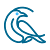
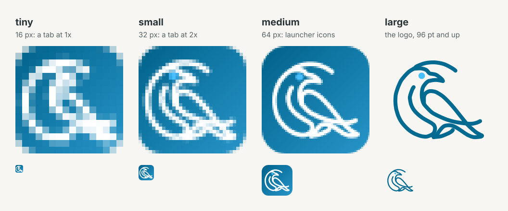
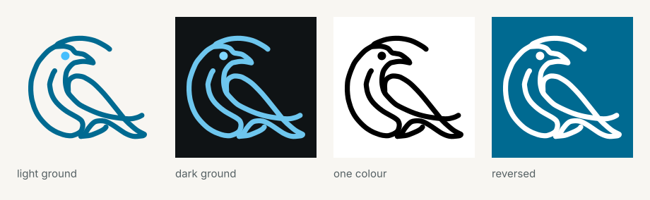
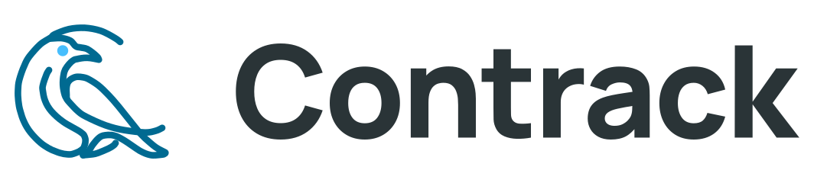
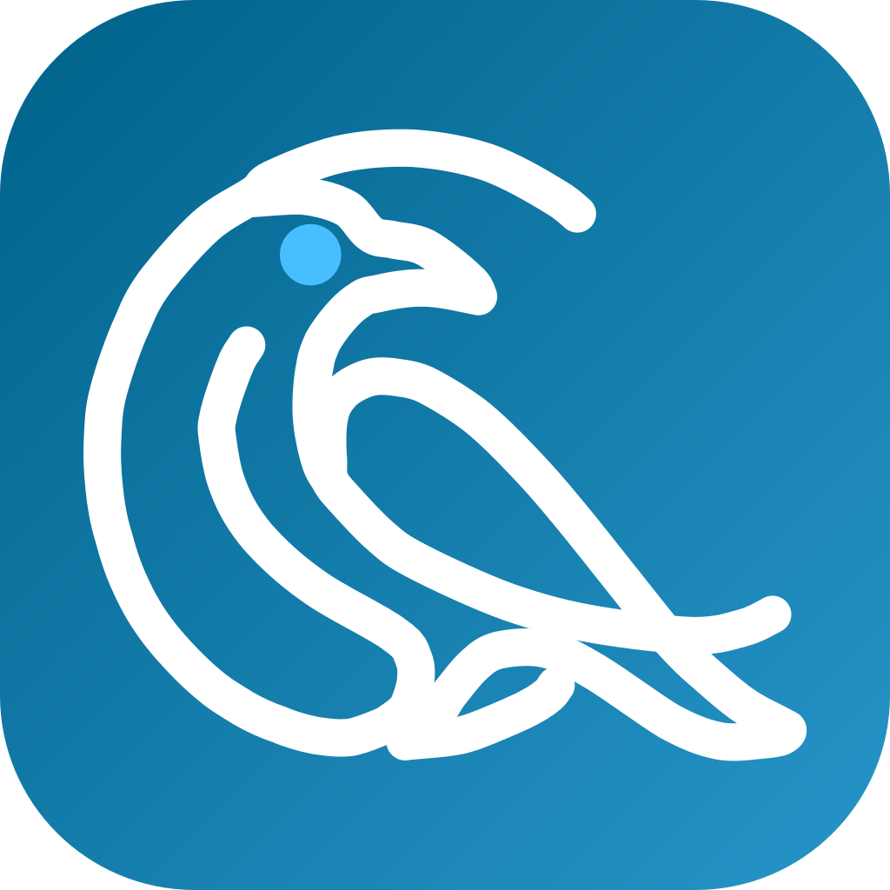
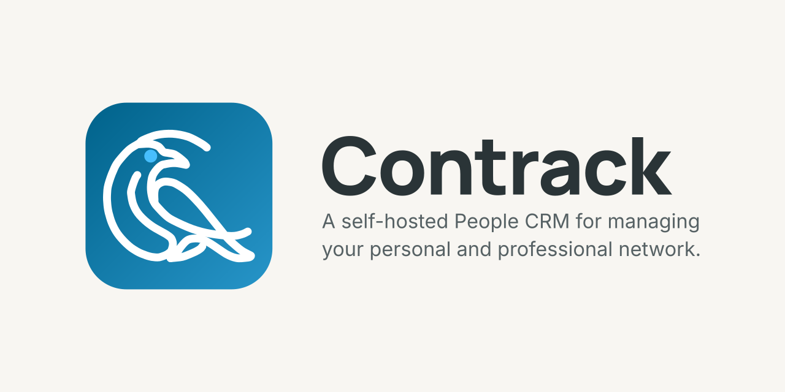

# The Contrack brand

This folder is the brand kit: the mark, its versions, the lockup, the app icon
and the cards a link or a repository shows. One script draws all of it from
one drawing, and a unit test holds every file to that drawing.

```bash
npm run brand:icons   # writes public/ and docs/brand/, then commit what it writes
```

Never edit a generated file by hand. Change the drawing, the sizes or the
colours in `src/assets/corvidPaths.ts`, run the script, and commit the result.
`tests/unit/brand.icons.test.ts` fails when a committed SVG differs from a
fresh render.

## The mark



The mark is a corvid inside a C. It is two things:

- **The ring** is the C. In the app nothing ever moves it.
- **The bird** is everything else: the head with its beak, the chest, the
  wing, two tail feathers and the eye.

The drawing is traced from `corvid-source.jpg`, a mono-line raven. Its paths
live in `src/assets/corvidPaths.ts`. The app's components, the rig that makes
the bird move, every icon and this kit read those paths. There is no second
drawing anywhere.

## Optical sizes

One stroke cannot serve every size. The logo's own stroke is a hairline in a
16 px tab. A stroke heavy enough for the tab fills in at 32 px and looks like
a slab on a home screen. So the mark has four masters. Each draws the same
paths, with a stroke, an eye and a margin for the size a person sees.



| Master   | Seen at                                 | Parts                        | Stroke | Eye  | Used by                                                 |
| -------- | --------------------------------------- | ---------------------------- | ------ | ---- | ------------------------------------------------------- |
| `tiny`   | 16 px on a 1x screen                    | ring, head, wing, outer tail | 7.5    | none | `favicon-16.png`                                        |
| `small`  | 16 to 47 pt, with two pixels to a point | all six                      | 5.2    | 4.2  | `favicon-32.png`, `favicon-48.png`, the thinking bird   |
| `medium` | 48 to 95 pt                             | all six                      | 4.4    | 3.6  | the app icon, launcher and home screen icons, the cards |
| `large`  | 96 pt and up                            | all six                      | 3.6    | 3    | the logo, the lockup                                    |

Strokes are in the mark's 100-unit box.

- **The size a person sees picks the master, not the file's pixels.** A
  512 px launcher icon shows at about 48 dp, so it takes `medium`.
- **`tiny` keeps the silhouette.** At 16 pixels there is room for the C, the
  head with its beak, the wing and the long outer tail. The chest and the
  inner feather merge with their neighbours, and the eye is less than a pixel.
- **The two smallest favicons are fitted to the pixel grid.** The script
  tries the bird at every eighth of a pixel and keeps the shift that leaves
  the least blur.
- The mark in the app keeps the logo's own weight, because the rig animates
  those strokes. The thinking bird, at 16 to 20 px, is `small`.

## Colour

| Colour             | Hex       | Token                        | Use                                        |
| ------------------ | --------- | ---------------------------- | ------------------------------------------ |
| Primary            | `#006a91` | `--color-primary`, light     | The mark on a light ground                 |
| Primary, dark      | `#6ec6ee` | `--color-primary`, dark      | The mark on a dark ground                  |
| Eye                | `#47befd` | `--color-corvid-eye`, light  | The eye, on a light ground and on the tile |
| Eye, dark          | `#7fd6ff` | `--color-corvid-eye`, dark   | The eye on a dark ground                   |
| Primary dim        | `#00628a` | `--color-primary-dim`        | The tile's first stop                      |
| Tile end           | `#2795c9` | none                         | The tile's last stop                       |
| Primary container  | `#47befd` | `--color-primary-container`  | The branding gradient's end                |
| Surface            | `#f8f6f2` | `--color-surface`, light     | The ground of the cards                    |
| Surface, dark      | `#0f1315` | `--color-surface`, dark      | A dark ground                              |
| On surface         | `#2a3437` | `--color-on-surface`, light  | The name                                   |
| On surface, dark   | `#dfe4e6` | `--color-on-surface`, dark   | The name on a dark ground                  |
| On surface variant | `#566164` | `--color-on-surface-variant` | The line under the name                    |

`BRAND` and `TILE` in `src/assets/corvidPaths.ts` hold these as literals,
because a favicon cannot read a CSS token. `tests/unit/brand.paths.test.ts`
holds each literal to its token.

**The tile runs from primary dim to 55 percent of the branding gradient.** The
branding gradient ends at `#47befd`, and white on `#47befd` is 2.1:1. The
tail, the part that says "bird", sat in that corner. WCAG 1.4.11 asks 3:1 of a
graphic a person must make out. White on `#2795c9` is 3.37:1, with room for
the soft edge of a thin stroke.

| Pair                                     | Contrast |
| ---------------------------------------- | -------- |
| White bird on the tile's lightest corner | 3.37:1   |
| White bird on the tile's darkest corner  | 6.74:1   |
| Primary mark on the light surface        | 5.61:1   |
| Dark mark on the dark surface            | 9.76:1   |
| Dark mark on GitHub's dark page          | 9.89:1   |
| White mark, reversed, on the primary     | 6.05:1   |

## Versions of the mark



| File                    | Use                                                   |
| ----------------------- | ----------------------------------------------------- |
| `corvid-mark.svg`       | A light ground. The primary, with the cyan eye.       |
| `corvid-mark-dark.svg`  | A dark ground. The dark primary and the dark eye.     |
| `corvid-mark-black.svg` | One colour: print, embossing, a surface with one ink. |
| `corvid-mark-white.svg` | One colour, reversed out of a photograph or a colour. |

`corvid-mark.png` and `corvid-mark-dark.png` are the first two at 512 px.

## The lockup



The mark and the name, for a surface wide enough to carry the word: a page
header, a slide, a partner page. `contrack-lockup.svg` is for a light ground
and `contrack-lockup-dark.svg` for a dark one. Each has a PNG at 240 px tall.

- The name is set in Manrope ExtraBold, tracked at -0.025 em, as every
  heading in the app.
- The name is 0.7 of the mark's height, and its ink is centred on the mark.
- The gap between the mark's box and the name is 0.29 of the mark's height.
  These are the proportions of `<Wordmark>` in the app.
- The words are outlines, not text, so the lockup looks the same on every
  machine.

## The app icon



`corvid-app-icon.svg` is the master of every launcher, home screen and store
icon: the `medium` bird in white on the tile.

- The tile is a 64-unit square with 14-unit corners, 22 percent of the side,
  the corner of an iOS icon.
- The bird's ink keeps 6 units from every edge.
- **The touch icon is square and opaque.** iOS rounds its corners itself and
  fills any transparency with black.
- **The maskable icons are full bleed, and the bird keeps inside the safe
  circle.** A launcher may crop to any shape that holds the circle of 40
  percent of the icon's width about its middle. The script finds the smallest
  margin that keeps every point of the ink inside it.

## Clear space and minimum size

- **Clear space.** Keep other elements at least a quarter of the mark's
  height from its ink, on every side. The SVG's box already holds 8 percent.
- **Minimum size.** The logo reads down to 20 px, the size of the smallest
  mark in the app. A smaller picture uses the favicons, which have their own
  masters. The lockup reads down to 24 px of mark height.

## Type

| Role      | Face    | Weight | Files                              |
| --------- | ------- | ------ | ---------------------------------- |
| The name  | Manrope | 800    | `public/fonts/manrope-latin.woff2` |
| Body text | Inter   | 400    | `public/fonts/inter-latin.woff2`   |
| Labels    | Inter   | 700    | `public/fonts/inter-latin.woff2`   |

The images read the fonts the app serves, so an image cannot drift from the
page. `scripts/brand/type.ts` turns each word into outlines.

## Files

What the app serves, from `public/`:

| File                    | Size       | Master   | For                                      |
| ----------------------- | ---------- | -------- | ---------------------------------------- |
| `favicon-16.png`        | 16         | `tiny`   | A tab at 1x                              |
| `favicon-32.png`        | 32         | `small`  | A tab at 2x                              |
| `favicon-48.png`        | 48         | `small`  | A tab at 3x, and search results          |
| `favicon.ico`           | 16, 32, 48 | as above | Anything that asks for `/favicon.ico`    |
| `apple-touch-icon.png`  | 180        | `medium` | The iOS home screen                      |
| `icon-192.png`          | 192        | `medium` | A launcher                               |
| `icon-512.png`          | 512        | `medium` | A launcher and an install dialog         |
| `icon-maskable-192.png` | 192        | `medium` | An Android launcher that masks its icons |
| `icon-maskable-512.png` | 512        | `medium` | The same, larger                         |
| `og-image.png`          | 1200 × 630 | `medium` | The link preview                         |

There is no SVG favicon. A browser takes an SVG favicon over every sized one,
and one weight scaled to every size is what made the tab's bird hard to read.

The kit, in this folder:

| File                           | For                                                   |
| ------------------------------ | ----------------------------------------------------- |
| `corvid-mark*.svg`, `.png`     | The logo, in four versions                            |
| `corvid-app-icon.svg`          | The app icon's master                                 |
| `corvid-app-icon-1024.png`     | App stores and press kits                             |
| `contrack-lockup*.svg`, `.png` | The mark and the name                                 |
| `social-preview.png`           | The repository's card, 1280 × 640                     |
| `corvid-optical-sizes.png`     | The four masters, for this guide                      |
| `corvid-mark-variants.png`     | The four versions on their grounds, for this guide    |
| `corvid-poses.svg`, `.png`     | The model sheet: the bird in every pose its rig takes |
| `corvid-source.jpg`            | The drawing the paths were traced from                |

**The repository's card is set by hand.** GitHub has no API for it. Upload
`social-preview.png` in the repository's Settings, General, Social preview.



## Do and do not

- ✅ Use the generated files, at the size their master is for.
- ✅ Use the dark version on a dark ground, and the white one on a photograph.
- ✅ Keep the eye cyan in the colour versions.
- ❌ Do not redraw, stretch, rotate or slant the mark.
- ❌ Do not recolour the eye, or add a shadow, an outline or a gradient to
  the mark.
- ❌ Do not put the colour mark on a busy photograph. Use the white one.
- ❌ Do not put white on the branding gradient's end, `#47befd`. The tile
  stops at `#2795c9` for that reason.
- ❌ Do not scale one weight to every size. Each size has its master.
