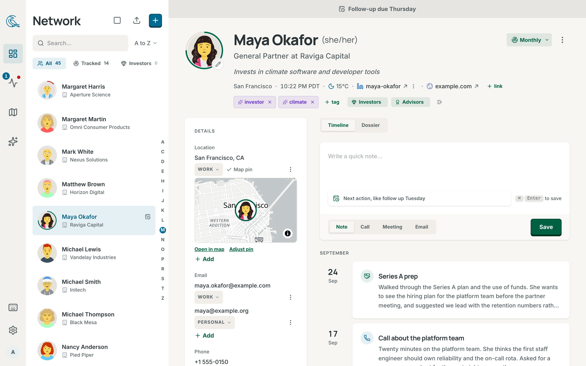
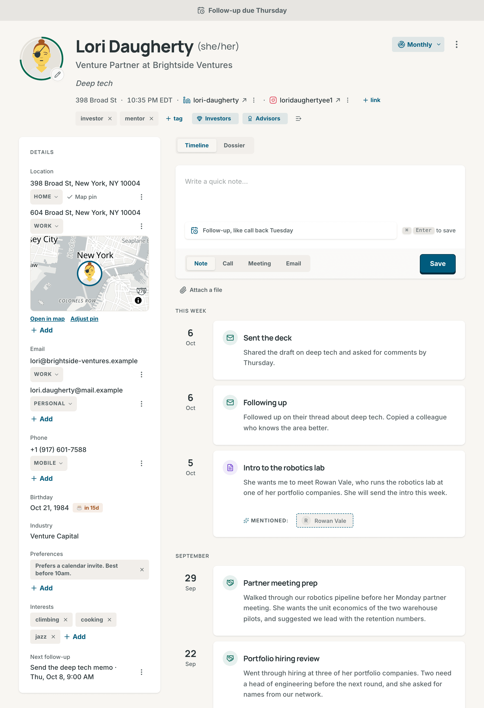
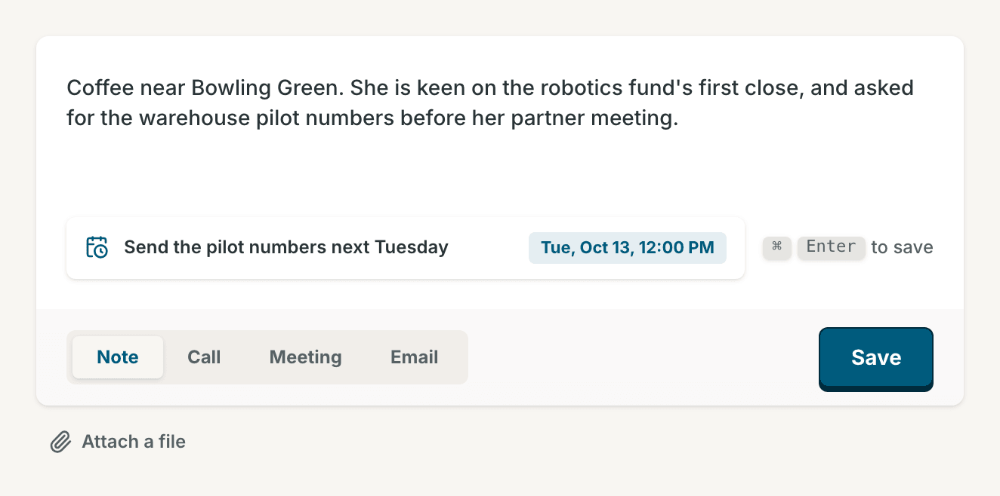
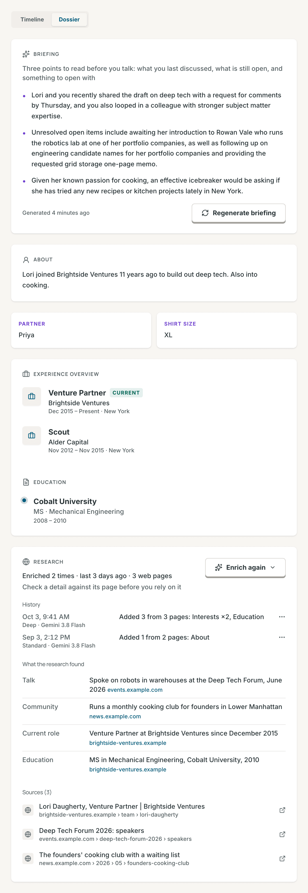

# Contacts

Your contacts live on the **Network** page. This page covers the list, the
contact page, notes and follow-ups, and the tools that keep a network tidy:
lists, tags, the archive and the trash.

## The Network list

Open **Network** from the sidebar or the tab bar. On a wide screen the list
sits beside the open contact, and you can drag its edge to resize it. On a
phone, a contact opens over the list.

- **Search**: type in the search box, or press `/`. It matches names,
  companies, roles, places, industries, tags, emails and phones, and shows the
  count, such as "12 matches". `Esc` clears it. Filters such as `company:Acme`
  or `tracked:no` work here too. See [Facets](search.md#facets).
- **Chips**: **All**, **Tracked** and one chip for each list, each with a
  count. Press a pressed chip again to show everyone. **Manage**, beside
  **Tracked**, opens **Settings → Tracked contacts**. Drag a list's chip to
  reorder your lists.
- **Sort**: **A to Z** and **Z to A** by name, **Newest** and **Oldest** by
  the day you added the contact, until you close the browser tab.
  **Default sort** in **Settings → Network and contacts** sets the first one.
- **Recent**: the contacts you opened last, at the top. **Recent contacts**
  on the same settings page sets how many, and 0 hides the row.
- **Letter rail**: in a list sorted by name, with no search and 15 or more
  people. Tap or drag a letter to jump to it.
- **Row menu**: right-click a row for **View contact**, **Copy email** and
  **Archive**. For the list's keys, see
  [Keyboard shortcuts](keyboard-shortcuts.md#network).
- **Command palette**: on a touch screen, the first button above the list
  opens the [command palette](search.md#command-palette).

### Select several contacts

1. Press **Select**, the square button above the list. On a touch screen,
   you can also press and hold a row: that row is the first one selected,
   and the rows stay where they are.
2. Press the rows you want. Shift-click selects every row between two rows,
   and **Select all** selects every contact the list shows.
3. Press a button in the bar at the bottom, then **Done** or `Esc`.

| Button                   | What it does                                                                                         |
| ------------------------ | ---------------------------------------------------------------------------------------------------- |
| **Track** or **Untrack** | Tracks the selection at your default cadence, with **Undo**. **Untrack** shows when all are tracked. |
| **Archive**              | Archives the selection, with **Undo**.                                                               |
| **List**                 | Adds the selection to a list.                                                                        |
| **Field**                | Sets **Role / title**, **Company**, **Industry** or **Location** for all of them, with **Undo**.     |
| **Color**                | Sets the page colour of each contact.                                                                |
| **CSV**                  | Copies the name, role, company, location, first email and first phone to the clipboard.              |
| **Delete**               | Moves the selection to the trash, with **Undo**.                                                     |

## Add a contact

Press **New**, the plus button above the list.

- **New contact** opens a form. Only **Full name** is required. Press
  **Save contact**. In the list, `N` opens the form too.
- **Add from text**: paste an email signature, a bio or rough notes, and
  press **Extract contact**. AI fills in the **New contact** form for you to
  check. `V` opens it too. It needs an AI provider. See
  [Connect a provider](ai.md#connect-a-provider).
- **New list**: see [Lists](#lists).

A contact you add by hand starts tracked when **Track new contacts** is on in
**Settings → Network and contacts**. To bring in many people, see
[Import a file](import-and-sync.md#import-a-file) and
[Connectors](import-and-sync.md#connectors).

## The contact page

In a wide pane, the page shows the header, the **Details** card on the left,
and **Timeline** and **Dossier** on the right. In a narrow pane, such as a
phone, it shows a short header and three tabs: **Timeline**, **Details** and
**Dossier**. Under 1024 px wide, **Back** names the page it returns to, and
returns to the same place in the list.

### The header

- **Name, role and company**: click one to edit it. `Enter` saves and `Esc`
  cancels. Pronouns show after the name when research found them.
- **Meta line**: the place, the local time with its time zone, and the links.
  Each link has a menu with **Copy link** and **Remove link**. To add one,
  press **+ link**, paste the link and press `Enter`.
- **Weather**: follows the time in the wide layout, when **Weather** is on in
  **Settings → Network and contacts**. It is off by default. Your browser then
  asks Open-Meteo for the weather at the contact's place.
- **Track**: reads **Track**, or the cadence, such as **Quarterly**. See
  [Track a contact](pulse.md#track-a-contact). On a tracked contact, press the
  ring around the picture to see
  [how the score works](pulse.md#how-the-score-works).
- **Follow-up band**: a band across the top shows a follow-up that is late,
  due today or due within 7 days, such as "Follow-up due Friday".
- **Duplicate band**: shows when another contact looks like the same person.
  Press **Review match**, then **Merge contacts** or **Keep separate**. See
  [Review possible duplicates](duplicates.md#review-possible-duplicates).
- **Quick actions**: in the narrow layout, a row of buttons ends the header.
  **Call** and **Message** use the first phone, **Email** the first email,
  and **Log note** opens the quick note dialog. A button shows only when the
  contact has the phone or the email it needs.

The **Contact actions** menu, the three dots, holds these items in order:

1. **Change colour**: paints this contact's page only, in Blue, Emerald,
   Amber, Rose, Pink or Teal.
2. **Enrich contact** and **Enrich deeply**: contact research at the Standard
   or the Deep depth, when AI is on for you. See
   [Research contacts](ai.md#research-contacts).
3. **Copy basic details** and **Copy full details**: the name, emails and
   phones, or also the role, company, birthday and addresses.
4. **Share contact**: sends the contact as a card (a `.vcf` file) through
   your phone's share sheet, for example to Messages or to your phone's
   contacts. Where the sheet takes no card, as on Android, it gets the name,
   the phones and the emails as text. A browser with no share sheet shows
   **Save contact card**, which downloads the card.
5. **Archive** or **Unarchive**, and **Delete**. See
   [Archive and trash](#archive-and-trash).

### The Details card

| Field              | What it holds                                                                   |
| ------------------ | ------------------------------------------------------------------------------- |
| **Location**       | Addresses, each labelled home, work or other. The first one places the map pin. |
| **Email**          | Email addresses, each labelled work, personal or other.                         |
| **Phone**          | Phone numbers, each labelled mobile, work, home or other.                       |
| **Birthday**       | A date. A badge shows when the birthday is within 30 days.                      |
| **Industry**       | One industry. The box suggests common ones.                                     |
| **Preferences**    | Short notes, such as "Tea" or "Morning calls".                                  |
| **Interests**      | Topics the person cares about.                                                  |
| **Next follow-up** | The date of the next open follow-up, when there is one.                         |

- **Edit**: click a value, or give it focus and press `Enter`. `Enter` saves
  and `Esc` cancels. Press a row's label to change the label.
- **Call and write**: on a touch screen, an email and a phone are links.
  Press an email to write to it in your mail app, and a phone to call it. To
  edit one, press the pencil after it. The phone field opens the phone
  keyboard on a phone. With a mouse, a click on the value edits it.
- **Row menu**: **Message** (a phone, on a touch screen), **Make primary**,
  **Show on map** and **Remove**, with **Undo** for 7 seconds. The first
  email and phone are the primary ones, and the first address places the pin
  and says **Map pin**.
- **Order**: open a row's menu and drag the row by its handle, or press
  `Alt+↑` or `Alt+↓` (`Option` on a Mac) on the value.
- **+ Add**: adds a value. For preferences and interests, `Enter` adds a chip
  and keeps the box open for the next one.

A placed contact shows a small map with **Open in map** and **Adjust pin**.
One the map could not place says "Not on the map yet" and offers
**Set location**. See [Move a pin by hand](map.md#move-a-pin-by-hand). The
About text, the website, schools and past jobs come from imports,
**Add from text** and research, and have no box to type them in.

## Notes and the timeline

The **Timeline** tab lists every interaction with the contact, newest first,
under **This week** and then one heading per month. The week starts on the
day set in **Week starts on**, in **Settings → Network and contacts**.

1. Open the contact. The composer is at the top of the **Timeline** tab. On a
   phone it is one line, "Write a quick note...", until you tap it.
2. Write the note. Type `@` to mention someone.
3. Optional: write the next step with a date in the next action line, such as
   "Send the deck next Tuesday".
4. Choose **Note**, **Call**, **Meeting** or **Email**.
5. Press **Save**, or `Cmd+Enter` (`Ctrl+Enter` on Windows and Linux).

The entry takes a title from its type, such as "Quick Note" or "Logged call".
Until you save, your draft stays on this device for up to 30 days. To log from
any page, press **Log note** on Pulse, or `Cmd+Shift+I` (`Ctrl+Alt+I` on
Windows and Linux), and choose the contact in the **Log an interaction**
dialog.

- **Open**: press an entry's title to see the full text, its follow-ups,
  **Edit** and **Delete**. **Edit** changes the title and the text only.
- **Delete**: asks "Delete this interaction?". Press **Delete interaction**.
  The toast offers **Undo** for 10 seconds. After that the delete is final,
  and an attached file goes with the entry.
- **Files**: drop files on the **Timeline** tab to attach them, up to 50 MB
  each. Contrack takes PDFs, PNG, JPEG, GIF and WebP images, `.txt`, `.md`
  and `.csv` files, and `.eml` email files. An `.eml` file becomes an email
  entry. With AI on, AI writes a summary of the thread into it. With AI off,
  the entry holds the file with no summary.
- **Badges**: **via Calendar**, **via Email** and **via Google** mark entries
  from a connector. **via** and a name marks a note, logged on another
  contact, that mentions this person. Press it to open that contact.

## Follow-ups

A follow-up is a task with a due date for one contact. Write a next action
with a date in the composer, such as "Call about the offer on Friday". On
**Save**, Contrack makes the task "Call about the offer", due on Friday. A
line with only a date makes the task "Follow up". To give many people one
follow-up, [select them on the map](map.md#select-contacts-on-the-map).

- **Pulse** lists follow-ups under **Up next**. Complete and snooze them
  there. See [The Pulse page](pulse.md#the-pulse-page).
- The contact page shows the follow-up band, and **Next follow-up** in
  **Details**. A Network row with an open follow-up has a calendar mark.
- In an entry's dialog, press a follow-up under **Follow-up** to complete it.

## @mentions

In the composer, type `@` and the start of a name. A list shows up to five
contacts whose names start with what you typed, and marks a ghost **Ghost**.
Press `↑`, `↓` and `Enter`, or click a name. `Esc` closes the list. The note
then shows on the mentioned person's timeline too, with a **via** button that
opens the contact you logged it on.

## Ghosts

A ghost is a person Contrack has seen, but that you have not added yet.

- **From notes**: when an AI provider is set up, Contrack reads each note you
  save for the names of people. A name that matches one of your contacts
  links to that contact, and a name that matches nobody becomes a ghost. A
  name that only looks like a contact becomes a ghost, and the pair waits in
  **Possible duplicates** for you to decide.
- **From connectors**: a connector can add a ghost for a person in your
  calendar or mail. See [Connectors](import-and-sync.md#connectors).

A ghost's picture has a sparkle badge. Point at it to see where the ghost came
from. Ghosts stay out of the Network list and the map, and you cannot track or
research one. Under a note, the dashed names in **Mentioned:** are ghosts. To
make a ghost a full contact, open it and press **Promote to contact**, or
press its dashed name under a note.

## The Dossier tab

- **Briefing**: three points to read before you talk: what you last
  discussed, what is still open, and something to open with. Press
  **Generate briefing**, or **Regenerate briefing** to write it again. It
  reads the profile and the last 15 interactions. A briefing stays for three
  days, and a new, changed or deleted interaction clears it. It needs AI, and
  uses the [Fast model](ai.md#models).
- **About**, custom facts, **Experience overview** and **Education**: what
  imports and research found.
- **Research**: each research run and what it added, the facts it found with
  their pages, and every source. **Enrich again** runs it again. A contact
  with nothing to show says "No dossier yet" and offers **Enrich contact**.
  See [Research contacts](ai.md#research-contacts).

## Avatars

Press the pencil on the picture to open **Edit avatar**. **Choose avatar**
shows faces in the styles **Cartoon**, **Illustrated** and **Bot**.
**Upload image** takes a JPEG, PNG, GIF, WebP or AVIF photo of up to 10 MB.
Then press **Apply**.

A contact with no picture gets a cartoon face that your own server draws, so
no name leaves your server. The pronouns, a title or the first name choose the
look, and an unclear name gets a neutral one. A new name redraws this face.

## Lists

A list is a named group of contacts with an icon, and a contact can be on
many lists. To make one, press **New**, then **New list**, above the Network
list, or **New list** on **Settings → Lists**. Choose an icon, type the
**List name** and press **Create list**.

- **Add people**: on a contact page, press **Add to a list**, the list button
  after the tags. Or select several contacts and press **List** in the bar.
- **See who is on it**: press its chip in the Network list, or press
  **View in Network** on **Settings → Lists**.
- **Remove someone**: press the × on the list's chip on the contact page, or
  the remove button beside the person on **Settings → Lists**.
- **Change a list**: on **Settings → Lists**, drag a list to move it, or open
  it to change its icon and name and press **Save**. To delete it, press
  **Delete** beside **Delete this list**, then **Delete** again. The contacts
  stay.

## Tags

A tag is a short label on a contact, such as "investor". On the contact page,
press **+ tag**, type the tag and press `Enter`. Press the × on a tag to
remove it, and the toast offers **Undo** for 7 seconds.

**Settings → Tags** lists every tag with the number of contacts that have it,
not counting archived and deleted contacts. **Filter tags** narrows the list,
and a tag's name opens the Network list filtered to that tag.

- **Rename**: type a new name and save it. When another tag has that name,
  the two tags merge.
- **Merge into…**: choose or type the **Target tag** and press
  **Merge tags**. The first tag's contacts get the target tag instead.
- **Delete**: asks first, then removes the tag. The contacts stay.

## Archive and trash

**Archive**, in the actions menu, the bulk bar or a row's menu, hides a
contact and keeps its history. The toast offers **Undo** for 10 seconds. An
archived contact leaves the Network list,
the map, Pulse and Ask Contrack. **Settings → Archived contacts** lists them,
with **Restore** on each row, and **Select** to restore or delete several.

**Delete** moves a contact and its whole history to the trash. It does not
ask first, and the toast offers **Undo** for 10 seconds.

- **Settings → Trash** lists each deleted contact, with the days it has left.
- **Restore** brings the contact back, with its history and its pin.
- **Delete forever** asks first, then removes the contact and every
  interaction, note and follow-up it had. This cannot be undone.
- The trash removes a contact for good after 30 days. An admin can set 1 to
  365 days in **Trash** on **Settings → Administration → General**, unless
  the server's configuration sets the number.

## Related

- [Export](import-and-sync.md#export): vCard, CSV or JSON, from
  **Settings → Export**
- [Pulse and tracking](pulse.md)
- [Search and Ask Contrack](search.md)
- [Duplicates](duplicates.md)
- [Keyboard shortcuts](keyboard-shortcuts.md)
