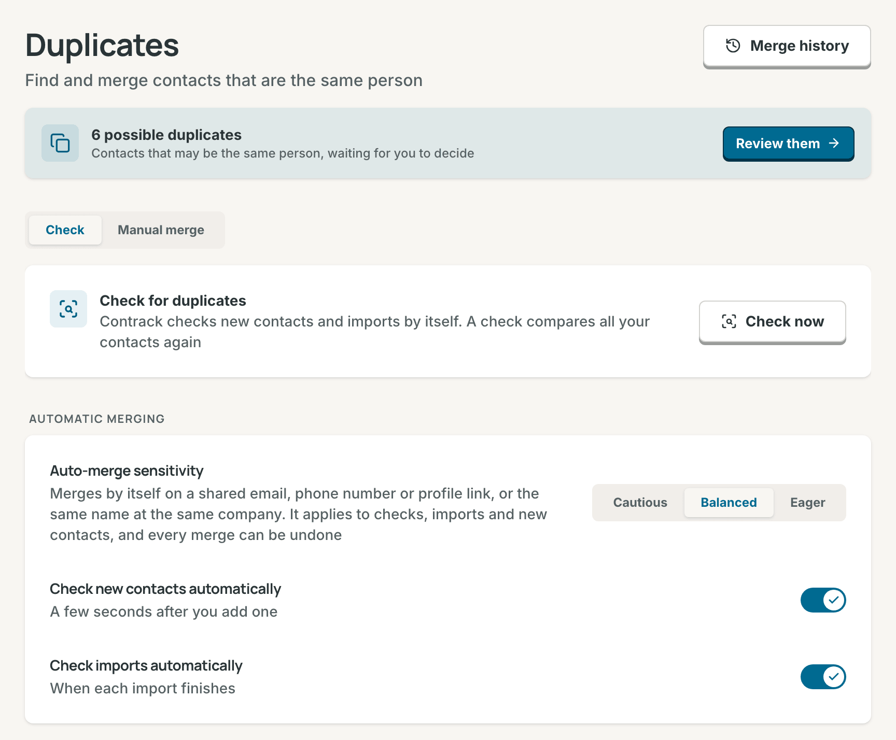
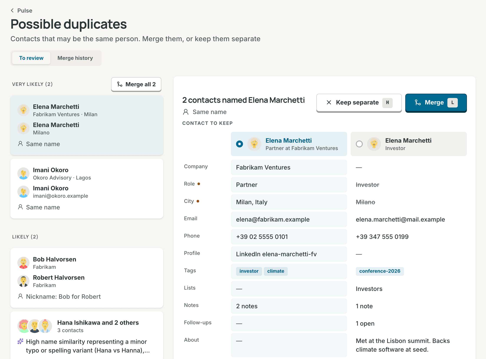

# Duplicates

Contrack finds contacts that are the same person and helps you merge them.
It merges the sure pairs by itself and asks you about the rest. This page
covers what counts as a duplicate, when Contrack checks, how you review a
possible duplicate, what a merge keeps, and how to undo a merge.

## What counts as a duplicate

Contrack compares the contacts in your own account. Contacts in other accounts
on the same instance never take part.

These matches are exact. Each one gives the pair a confidence:

| Match                             | Example                                         | Confidence |
| --------------------------------- | ----------------------------------------------- | ---------- |
| Same email address                | `ada@example.com` on both                       | 98%        |
| Same phone number                 | one number, written two ways                    | 95%        |
| Same name at the same company     | two "Ada Park" at Northwind                     | 95%        |
| Same profile link                 | one LinkedIn profile, with or without the `www` | 93%        |
| Same name from two import sources | "Ada Park" from Google and from LinkedIn        | 92%        |
| Same name and nothing else        | two "Ada Park"                                  | 90%        |
| Nickname                          | "Bob Hale" and "Robert Hale"                    | 88%        |
| Middle name added                 | "Anton Kovacs" and "Anton Peter Kovacs"         | 88%        |

A profile link matches however it is written: with or without `https://`,
`www.` or a slash at the end. Links to a company, a school or a group page do
not count.

A pair that is close but not exact gets a score from several signals:

- Names that are spelled nearly the same, or that sound the same, such as
  "Smith" and "Smyth". Two names sound the same only when the last names agree
  too.
- The same company, or a very similar company name.
- The same city.
- Two different import sources.
- Embeddings: how alike the two contacts read as a whole. By default Contrack
  makes embeddings on your machine with its built-in model. An admin can
  choose a provider model instead, see [Models](ai.md#models).

When AI is on, a check asks the [Strong model](ai.md#models) about the pairs
that stay unclear. Without AI, a check keeps the strongest of those pairs as
possible duplicates, at a lower confidence, so they always wait for you.

A note can also add a pair. With AI on, Contrack finds the people a note
names. When a name is close to one of your contacts, but not a sure match, the
pair waits as **Mentioned in a note**.

The screens never show the percentage. A possible duplicate shows the reason
in plain words, such as "Same phone number", and a caution when there is one.
See [Review possible duplicates](#review-possible-duplicates).

## When Contrack checks

- **A new contact.** A few seconds after you add one by hand. The switch is
  **Check new contacts automatically**, on by default. When the contact you
  added was already in your contacts and merges by itself, a message says so,
  such as "Ada Park was already in your contacts", with **Undo**.
- **An import.** When each import finishes. The switch is **Check imports
  automatically**, on by default. The check compares the new contacts with
  your other contacts and with each other.
- **A check you start.** See [Check for duplicates](#check-for-duplicates).

The two automatic checks do not ask an AI provider. A pair at or above your
auto-merge sensitivity merges by itself. A close pair that is not exact waits
only when it scores 75% or more, so an import does not fill the list with weak
guesses. Every pair that waits is in **Possible duplicates**.

## Check for duplicates

1. Open **Settings → Duplicates**.
2. Select **Check now**.

The card shows the check's steps: **Same email, phone or name**, **Close
matches, checked by AI**, and **Grouping**. You can leave the page, and the
check goes on. When it finishes, the card says how many contacts it checked,
how many pairs merged automatically, and how many possible duplicates wait.
**Review them** opens them.

A check reads your active contacts. It skips ghosts, archived contacts, and
contacts in the Trash. Its results replace the list in **Possible duplicates**.
Only one check runs at a time on an instance. If another account is checking,
yours waits and starts by itself.

> **Note:** With **Use AI for my account** off in **Settings → Privacy and
> AI**, or with AI off for the instance, a check finds exact matches only. The
> card says so. The automatic checks still run.

## Review possible duplicates

**Possible duplicates** is the one place where pairs wait for your decision.
It opens from:

- **Settings → Duplicates**: **Review them**, while pairs wait.
- Pulse: the **Inbox** card has a line with the count, such as "Review 4
  possible duplicates".
- The sidebar: the number on the Pulse icon.
- The command palette: when it opens empty, it can show a line such as "Review
  3 possible duplicates".
- The end of an import: the button with the count, such as **Review 3
  possible duplicates**.

Every count is the same number: the groups that wait. Two pairs that share a
contact are one group of three.

### The list

The list has three parts, the easy decisions first:

| Part                | What is in it                                                 |
| ------------------- | ------------------------------------------------------------- |
| **Very likely**     | Pairs with a strong match and nothing against it              |
| **Likely**          | Pairs with a good match, such as a nickname or an AI match    |
| **Check carefully** | Pairs with a caution, and close pairs with little behind them |

Each row shows the contacts with their company and city, the reason, and the
caution when there is one. A caution says why to look twice:

| Caution                              | Meaning                                                |
| ------------------------------------ | ------------------------------------------------------ |
| "First names differ: Ada and Ben"    | One phone or email, two first names: often a household |
| "One is Jr. and the other Sr."       | Two generations of one name                            |
| "Different companies and cities"     | The same name at two places, often two people          |
| "3 contacts share this phone number" | A value that several contacts carry                    |
| "A shared inbox"                     | An address such as `info@` that a team shares          |

A reason that a model wrote shows the AI glyph. A reason from a fixed rule,
such as "Same email address", does not.

### The open group

On a wide window, the list and the open group sit side by side. The first
group is open when the page opens. Select a row to open another. On a phone,
a row opens in a sheet.

The open group shows:

- **Contact to keep**: one column for each contact, each with a radio. The
  contact kept stays, and the others merge into it. Contrack chooses the most
  complete contact first: a photo you added, a full name over an initial, and
  more details.
- **Only the differences.** The rows where the contacts differ show first. A
  dot marks a field where the kept contact's value wins. A value the merge
  does not keep is struck through. The rows that every contact agrees on fold
  into one line, such as "Same: email, phone". **Show all fields** opens them.
- The caution, under the row it is about.
- **After the merge**: what moves to the kept contact, such as "3 notes,
  1 follow-up and 1 list", the values that are not kept, and that **Undo**
  brings everything back for 90 days.

A group of three or more also shows **How they connect**, the reason for each
pair in it. When one contact in the group is someone else, select **Different
person** under its name. The group then merges without it. A group of more
than 5 contacts asks you to check each one.

### Merge or keep separate

- **Merge** merges the group into the contact to keep.
- **Keep separate** marks the contacts as different people. The pair does not
  come back to **Possible duplicates**, and no check or import merges it.
- **Merge all**, at the top of **Very likely**, merges every group in that
  part, each into its contact to keep. A pair with a caution never merges in
  a batch.
- A group in **Check carefully** never merges from one press. On a phone, its
  row offers **Compare**, which opens the comparison, and **Merge** is in
  there. Its **Merge** is never the blue main button.

Each decision shows a message with **Undo**. **Undo** after a merge brings the
contacts back, and the pair waits in the list again. **Undo** after **Keep
separate** puts the pair back in the list. Focus then moves to the next group.

### Keys

| Keys       | What they do                   |
| ---------- | ------------------------------ |
| `↓` or `J` | Next group                     |
| `↑` or `K` | Previous group                 |
| `→` or `L` | Merge into the contact to keep |
| `←` or `H` | Keep them separate             |
| `Z`        | Undo the last decision         |

On a group in **Check carefully**, the first `→` or `L` opens its comparison
and moves focus to **Merge**, and the line "Check the differences, then press
L again or Enter" shows. A second `L` or `Enter` merges.

The letter keys are single-key shortcuts. They stop when you turn off
**Single-key shortcuts** in **Settings → Keyboard**. The arrows always work.
The letters work with Caps Lock on, and they do nothing while a menu or a
dialog is open. In **Contact to keep**, the arrows choose the contact, and
only the letters decide.

## On a contact's page

When a pair waits for a contact, its page shows a banner, such as "Ada Park may
be the same person as A. Park", with the reason and any caution. **Compare**
opens the same comparison as **Possible duplicates**, with this page's contact
as the one to keep. **Merge** and **Keep separate** work as they do there, with
**Undo**. When the merge keeps the other contact, the page moves to it.

A link to a contact that merged into another one opens the kept contact. A
message says so, with **Undo**.

## Merge contacts by hand

1. Open **Settings → Duplicates** and select **Manual merge**.
2. Search for the contacts and choose 2 to 5 of them. Select **Compare**. The
   button shows how many contacts you chose. From the search box, `↓` goes to
   the first contact. The list is one `Tab` stop: `↑`/`↓` move, and `Space`
   or `Enter` chooses.
3. Choose the contact to keep, and check **After the merge**. Select **Merge 2
   contacts**, or the number you chose.

The list shows your active contacts. Ghosts and archived contacts are not in
it. The message after the merge has **Undo**.

## What a merge keeps

- The kept contact keeps its own name, company, role, and other fields. A
  field that is empty on it takes the other contact's value.
- Email addresses and phone numbers are combined. A value that both contacts
  hold appears once.
- Addresses, profile links, tags, interests, work history, education, and
  custom fields move to the kept contact. A custom field that the kept contact
  already has keeps its value.
- Every note and interaction on the timeline moves to the kept contact, and so
  do mentions in notes.
- Every follow-up moves, the done ones too.
- The kept contact joins every list the other contact was on.
- The earlier of the two "added" dates is kept.
- Tracking stays as the kept contact had it. If only the other contact was
  tracked, track the merged contact again.

The other contact is hidden, not deleted, so you can undo the merge for 90
days.

## Merge history and Undo

**Merge history** lists your latest 50 merges under **Today**, **Yesterday**,
**This week**, and **Older**. Open it with the **Merge history** tab on
**Possible duplicates**, or with the **Merge history** button on **Settings →
Duplicates**.

Each entry says **Merged automatically** or **Merged by you**, when it
happened, both contacts with their company and city, and the reason.

1. Find the merge.
2. Select **Undo**.

**Undo** in **Merge history** brings back the other contact with its own
records, and marks the two as different people, as **Keep separate** does. No
check or import merges them again. An undone entry shows **Undone**. A group
merge adds one entry for each contact that merged in, so you undo it one
contact at a time there. The message right after a merge undoes the whole
group at once.

If you changed a moved record after the merge, your change stays on the kept
contact, and the restored contact gets the record as it was. The message after
the undo says how many records this happened to.

After 90 days the entry leaves **Merge history**, and Contrack deletes the
hidden contact and the files that only it used. The kept contact keeps
everything the merge gave it, a photo too.

## Automatic merging

The **Automatic merging** section on **Settings → Duplicates** holds three
settings. They apply to checks, imports, and new contacts.

**Auto-merge sensitivity** says which pairs merge with no one asked:

| Setting                | What merges by itself                                                                 | Confidence  |
| ---------------------- | ------------------------------------------------------------------------------------- | ----------- |
| **Cautious**           | Only a shared email address                                                           | 97% or more |
| **Balanced** (default) | A shared email, phone number or profile link, or the same name at the same company    | 93% or more |
| **Eager**              | Also the same name, a nickname or a middle name added, when nothing argues against it | 88% or more |

A pair with a caution merges under no setting. **Check new contacts
automatically** and **Check imports automatically** turn the two automatic
checks on or off. While a setting differs from its default, **Reset to
defaults** appears at the end of the page.

## What weakens a match

- **A value that many contacts hold.** A phone number on three contacts is
  often one household. Each contact beyond the pair takes 3 points off the
  match. A number on three contacts drops from 95% to 92%, so under
  **Balanced** it waits for you, with the caution "3 contacts share this phone
  number". An email address on three contacts drops from 98% to 95% and still
  merges. No match drops below 60%.
- **Names that disagree.** "Ada Twin" and "Ben Twin" with one phone number are
  two people. So are "Robert Hale Sr." and "Robert Hale Jr.". A pair like this
  stops at 85%, below every setting, and waits for you with the caution. A
  nickname, an initial, a short form such as "Sue" for "Susanna", a near
  spelling, or the same sound is not a disagreement. Last names are not
  compared, so a married name changes nothing. Two different first names with
  no shared email, phone number or profile link are never suggested.
- **The same name at different places.** A match on the name alone (the same
  name, two imports, a nickname or a middle name) stops at 85% when both
  contacts name a company and the companies differ, or both name a city and
  the cities differ. "Contoso" and "Contoso Ltd", or "Austin" and "Austin, TX",
  are the same. The same name at the same company stays at 95%.
- **A shared mailbox.** An address such as `team@`, `info@`, `sales@`, or a
  household address such as `park.family@` is not proof of one person. It
  counts like a shared company.
- **A known pair.** Once you mark two contacts as different people, with
  **Keep separate** or with **Undo** in **Merge history**, the pair does not
  come back to **Possible duplicates**, and nothing merges it, even when the
  two share an email address or a phone number. Every check also leaves alone
  two people mentioned in the same note.

A pair whose contact is archived, in the Trash, or already merged leaves
**Possible duplicates** and its counts.

Scripts can start a check, merge contacts, undo a merge and keep a pair
separate too. See the [REST API reference](api-reference.md).

## Related

- [Contacts](contacts.md)
- [Ghosts](contacts.md#ghosts)
- [Import a file](import-and-sync.md#import-a-file)
- [Models](ai.md#models)
- [Keyboard shortcuts](keyboard-shortcuts.md)
