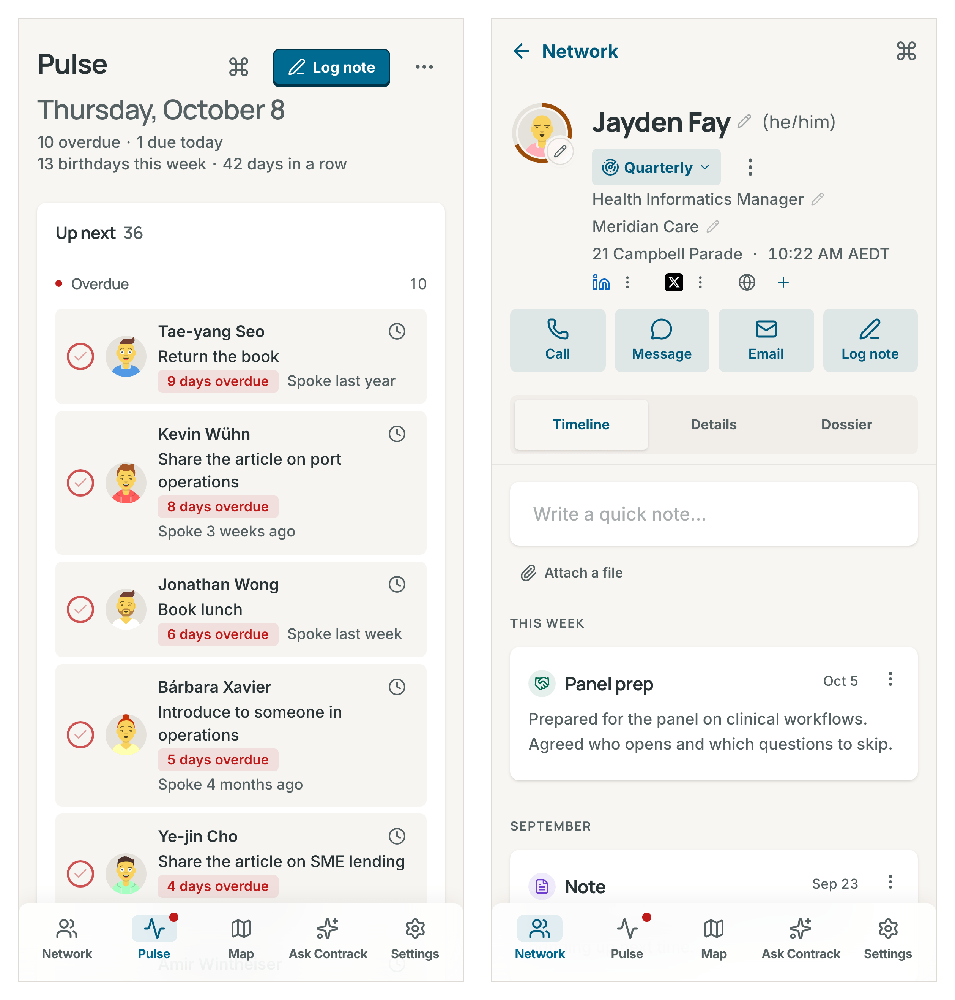
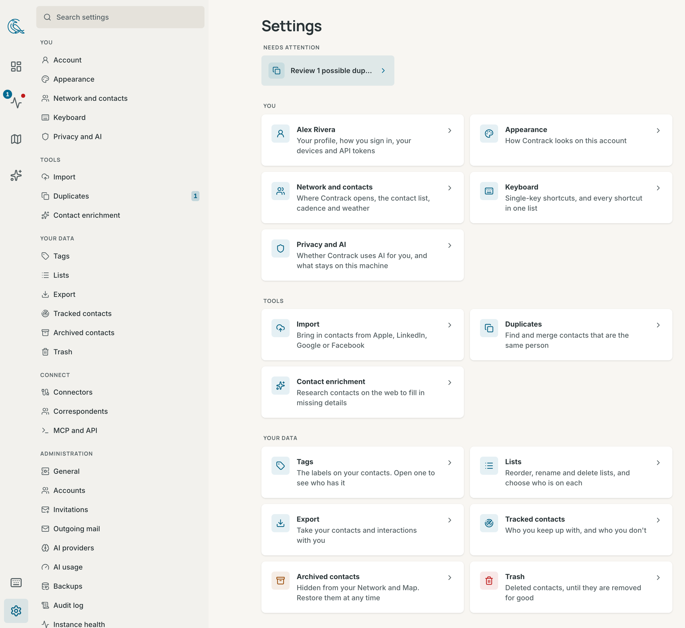

# Getting started

This page takes you from the install to your first note and follow-up. It
also shows the main screens and the words Contrack uses.

## Install Contrack

On a machine with Docker, run this command:

```bash
docker run -d --name contrack \
  -p 127.0.0.1:3210:3210 \
  -v "$PWD/contrack-data":/app/data \
  ghcr.io/arvarik/contrack:latest
```

Then open `http://localhost:3210` in your browser.

- The `contrack-data` folder holds everything Contrack keeps: the database,
  your uploads, the backups and the key that encrypts the credentials
  Contrack stores. Back it up. See
  [Where your data lives](self-hosting.md#where-your-data-lives).
- The port is open to this machine only.
- You need no AI key to start. You can connect one later, in the app.

To install with Docker Compose or without Docker, see
[Install with Docker](self-hosting.md#install-with-docker) and
[Install without Docker](self-hosting.md#install-without-docker).

## Open Contrack and create your account

Sign-in is off by default. Contrack opens on the **Network** page, and
everything you add belongs to the one account of this device. That is safe
while only this machine can reach Contrack.

To ask for an account, add `-e AUTH_REQUIRED=true` to the `docker run`
command. Turn on sign-in before other devices can reach Contrack. See
[Turn on sign-in](accounts.md#turn-on-sign-in).


With sign-in on, the first visit shows **Secure this instance**:

1. Optional: choose a photo, and type **Your name**.
2. Type your **Email**. Contrack suggests a **Username** from it, which you
   can change.
3. Choose a **Password** of at least 8 characters.
4. Press **Secure this instance**. The first account is the admin, and every
   contact already in Contrack stays with it.
5. When your browser supports passkeys, Contrack offers **Add a passkey**.
   Press **Not now** to skip it. See [Passkeys](accounts.md#passkeys).

## Find your way around


The sidebar on a wide screen, and the tab bar on a phone, lead to five places:

| Place            | What it is for                                          |
| ---------------- | ------------------------------------------------------- |
| **Network**      | Everyone you keep in touch with                         |
| **Pulse**        | Follow-ups that are due and relationships that need you |
| **Map**          | Your network by where people live and work              |
| **Ask Contrack** | Ask a question about your network in plain words        |
| **Settings**     | Your preferences, your data and this instance           |

- The Pulse icon shows a red dot when a follow-up is due today or late, and a
  number when possible duplicates wait for you.
- The foot of the sidebar holds **Keyboard shortcuts**, **Settings** and,
  when sign-in is on, your account with **Sign out**.
- The corvid at the top of the sidebar is Contrack's mark. Press it to let
  the bird fly. **Corvid motion** in **Settings → Appearance** sets how much
  it moves.
- Contrack opens on **Network**. To open on **Pulse**, change
  **Where Contrack opens** in **Settings → Network and contacts**.

### On a phone



- The tab bar at the bottom holds the same five places.
- A contact opens full screen, with **Timeline**, **Details** and **Dossier**
  tabs, and **Call**, **Message**, **Email** and **Log note** under its name.
  It slides in over the list, and **Back** slides it out to the same place
  in the list.
- Dialogs rise from the bottom of the screen.
- Pull the Network list down to refresh it.

### Settings



Settings is one list of pages in five groups. Type in **Search settings** to
find a single setting.

| Group              | Pages                                                                                                                                   |
| ------------------ | --------------------------------------------------------------------------------------------------------------------------------------- |
| **You**            | **Account**, **Appearance**, **Network and contacts**, **Keyboard**, **Privacy and AI** and **AI usage**                                |
| **Tools**          | **Import**, **Duplicates** and **Contact enrichment**                                                                                   |
| **Your data**      | **Tags**, **Lists**, **Export**, **Tracked contacts**, **Archived contacts** and **Trash**                                              |
| **Connect**        | **Connectors**, **Correspondents** and **MCP and API**                                                                                  |
| **Administration** | **General**, **Accounts**, **Invitations**, **Outgoing mail**, **AI**, **AI usage**, **Backups**, **Audit log** and **Instance health** |

- **Account** shows only when sign-in is on.
- **Administration** shows only to an admin. With sign-in off, you are the
  admin.
- An admin finds **AI usage** under **Administration**, where it covers every
  account.

## Add your first contacts

- **Import a file**: press **Import**, the upload button above the Network
  list, or open **Settings → Import**. Choose **Apple**, **LinkedIn**,
  **Google** or **Facebook**, and drop the file you exported. The page says
  how to export from each. See [Import a file](import-and-sync.md#import-a-file).
- **Connect a calendar, a mailbox or Google**: open **Settings → Connectors**.
  Contrack then adds the people you meet and write to. See
  [Connectors](import-and-sync.md#connectors).
- **Add one person**: press **New**, the plus button above the list, then
  **New contact**. Or press `N` in the list.
- **Add from text**: press **New**, then **Add from text**, and paste an email
  signature or a bio. AI fills in the form for you. Or press `V`.

Contacts from an import or a connector start untracked. See
[Contacts](contacts.md) for everything you can do with a contact.

## Choose who to track

Track the people you want to keep up with. A tracked contact gets a score,
and Pulse tells you when you are due to talk.

1. Open a contact.
2. Press **Track**, beside the actions menu.
3. Under **Keep up**, choose **Weekly**, **Monthly**, **Quarterly** or
   **Yearly**.

On a contact page, `T` tracks the contact at your default cadence, which is
**Quarterly** until you change **Default cadence** in
**Settings → Network and contacts**. To track many people at once, select
them in the Network list and press **Track**. See
[Track a contact](pulse.md#track-a-contact).

## Log a note and a follow-up

1. Open a contact. The composer is at the top of the **Timeline** tab.
2. Write what you talked about.
3. In the next action line, write the next step with a date, such as
   "Send the deck next Tuesday".
4. Press **Save**, or `Cmd+Enter` (`Ctrl+Enter` on Windows and Linux).

The note joins the timeline. The next action becomes a follow-up due next
Tuesday, and Pulse lists it under **Up next**. See
[Notes and the timeline](contacts.md#notes-and-the-timeline) and
[Follow-ups](contacts.md#follow-ups).

## Ask a question

Open **Ask Contrack**, type a question in plain words, such as "Who do I know
in Sydney?", and press `Enter`. Contrack answers from your own contacts. You
can also press `Cmd+K` (`Ctrl+K` on Windows and Linux) and start with `?`.

Search works without AI. With an AI provider, Contrack also checks the answer
and says why each person matches. See [Ask Contrack](search.md#ask-contrack).

## Turn on AI

AI is optional. Your contacts, notes, search, tracking and the map all work
without it. AI adds briefings before a meeting, research on the web, reading
of pasted text, and checked answers in Ask Contrack.

1. Open **Settings → Administration → AI**. You need to be an admin.
2. Press **Add Google Gemini key**, **Add OpenAI key** or
   **Add Anthropic key**.
3. Paste the key and press **Connect**.

You can also connect an OpenAI-compatible server, such as Ollama. See
[Connect a provider](ai.md#connect-a-provider). To turn AI off for your
account, see [Turn AI off](ai.md#turn-ai-off).

## Keyboard basics

| Keys          | What they do                                                      |
| ------------- | ----------------------------------------------------------------- |
| `Cmd+K`       | Open the command palette, to find a person or run an action       |
| `Cmd+Shift+I` | Open the **Log an interaction** dialog from any page              |
| `?`           | Show the keyboard shortcuts for the page you are on               |
| `/`           | Go to the search box on **Network**, **Map** and **Ask Contrack** |

On Windows and Linux, `Cmd+K` is `Ctrl+K`, and `Cmd+Shift+I` is
`Ctrl+Alt+I`. Contrack shows the keys of your computer. See
[Keyboard shortcuts](keyboard-shortcuts.md#windows-and-linux).

## Key ideas

- **Contact**: a person in your network.
- **Ghost**: a person Contrack saw in a note, a calendar or a mailbox, but
  that you have not added. Promote a ghost to make it a contact. See
  [Ghosts](contacts.md#ghosts).
- **Tracked**: a contact you chose to keep up with. Only tracked contacts get
  a score and a place in Pulse's catch-ups. Everyone else is **Not tracked**.
- **Cadence**: how often you want to talk to a tracked contact, such as
  **Monthly**.
- **Score ring**: the ring around a tracked contact's picture. Its length is
  the score, from 0 to 100. Its colour is the band: **Strong** from 70,
  **Fading** from 40 to 69, and **At risk** under 40. A tracked contact with
  nothing logged says "No interactions yet". See
  [How the score works](pulse.md#how-the-score-works).
- **Interaction**: an entry on a contact's timeline, such as a note, a call, a
  meeting or an email. You log them in the composer, and connectors add them
  by themselves.
- **Follow-up**: a task with a due date for one contact. Pulse lists it until
  you complete it.
- **List**: a named group of contacts that you make, such as "Investors". A
  contact can be on many lists.
- **Tag**: a short label on a contact, such as "advisor".
- **Research record**: what a contact research run found and added to a
  contact.
  It shows on the **Research** card of the **Dossier** tab.

## Next steps

- Bring in the rest of your people with
  [Import a file](import-and-sync.md#import-a-file).
- Work through your day on [The Pulse page](pulse.md#the-pulse-page).
- Find people by place on the [Map](map.md).
- Learn the search filters in [Facets](search.md#facets).

## Related

- [Contacts](contacts.md)
- [Self-hosting](self-hosting.md)
- [Accounts and sign-in](accounts.md)
- [Accessibility](accessibility.md)
