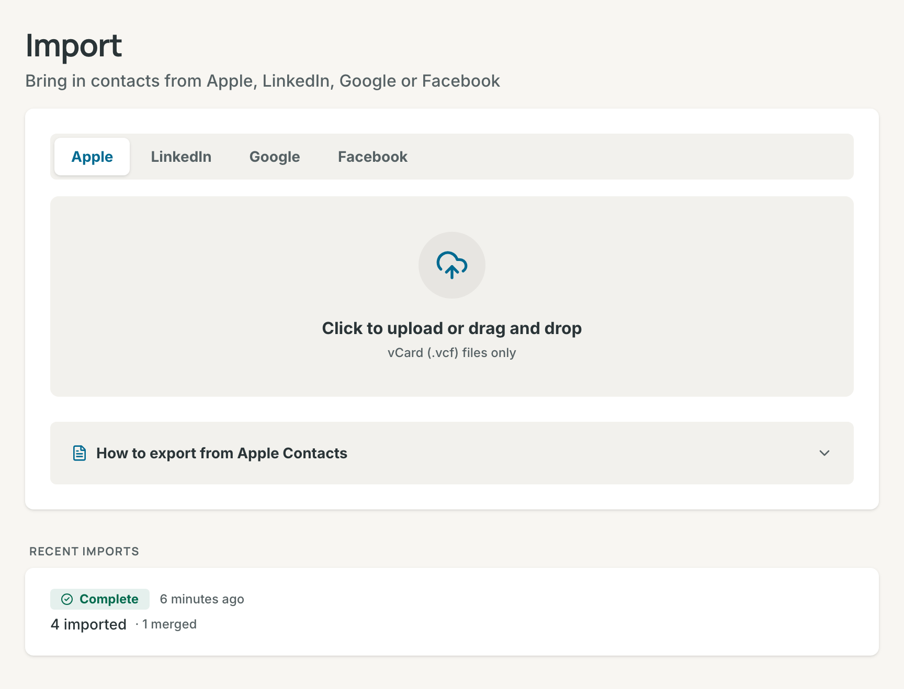
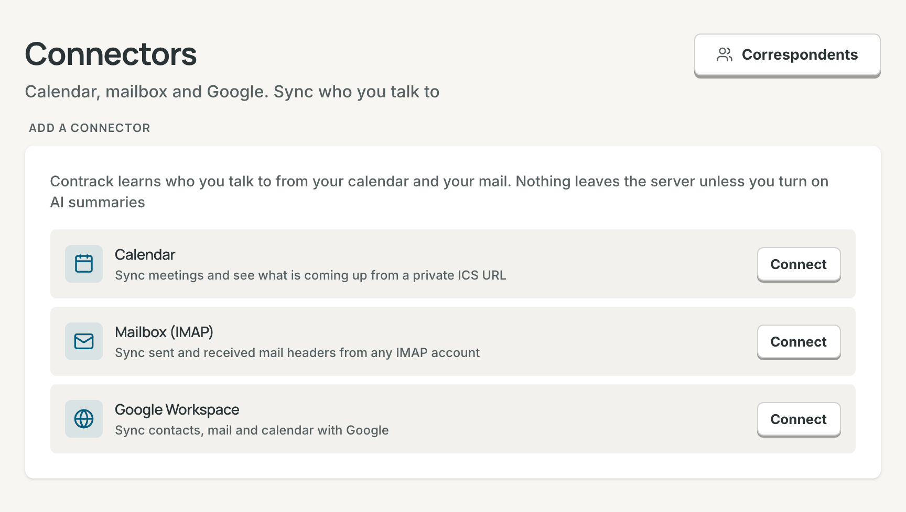

# Import, sync, and export

This page covers three ways data moves: import a contacts file, sync your
calendar, mail, and Google account with connectors, and export your data.

## Import a file

1. Open **Settings → Import**, or select **Import** (the upload button) in the
   Network list's header.
2. Choose the tab for your source: **Apple**, **LinkedIn**, **Google**, or
   **Facebook**.
3. Drop the file on the box, or select the box to choose the file.

Contrack remembers the tab you used last in this browser.

### Supported files

| Tab          | File                | What comes in                                                                                                                |
| ------------ | ------------------- | ---------------------------------------------------------------------------------------------------------------------------- |
| **Apple**    | vCard (`.vcf`)      | Names, emails, phones, addresses, company, job title, birthday, notes, websites, social profiles, groups as tags, and photos |
| **LinkedIn** | `Connections.csv`   | Name, company, position, email, profile URL, and the date you connected                                                      |
| **Google**   | Google CSV (`.csv`) | Name, emails and phones, company, role, address, birthday, notes, and website                                                |
| **Facebook** | `friends.json`      | Friend names and the date you connected. Facebook exports no emails or phone numbers                                         |

A vCard from any other address book, such as Outlook or an Android phone,
works on the **Apple** tab. One import holds up to 5,000 contacts. Split a
larger file.

### Export from your address book

Select **How to export from** under the drop zone to see these steps in the
app.

- **Apple Contacts:** open the Contacts app on your Mac. Select the contacts,
  or press `Cmd+A` for all. Choose **File > Export > Export vCard...**, and
  save the `.vcf` file.
- **LinkedIn:** open **Settings & Privacy**, then **Data Privacy** > **Get a
  copy of your data**. Choose **Connections** and request the archive.
  Download it, extract it, and use `Connections.csv`.
- **Google Contacts:** go to contacts.google.com. Select **Export**, choose
  **Google CSV**, and select **Export**.
- **Facebook:** open **Settings & Privacy** > **Settings** > **Accounts
  Center** > **Your information and permissions** > **Download your
  information**. Choose the **JSON** format and the **Friends and Followers**
  category. Download, extract, and use `friends.json`.

### What happens during an import

Your browser reads the file and sends the contacts to your Contrack server.
The import then runs in up to three steps:

1. **Importing contacts.** Contrack saves each contact.
2. **Generating contact fingerprints.** Contrack makes the embeddings that
   the duplicate check uses.
3. **Looking for duplicates.** This step runs when **Check imports
   automatically** is on in **Settings → Duplicates**.

The summary counts the contacts processed and the duplicates that merged by
themselves. It also counts the likely matches to review and the new unique
contacts. Imported contacts start untracked, see
[Track a contact](pulse.md#track-a-contact).

If the connection drops, the import goes on, and nothing is imported twice.
Contrack shows **Reconnecting to your import**, or **Lost contact with the
server** with **Check again**. If you leave the page, open the import again to
see where it got to. If nothing could be saved, the panel shows **Import did
not finish**, with **Try again**. If the import stopped part way, the
contacts it saved stay, and the rest wait for **Retry failed rows**.

### Retry failed rows

A row that cannot be saved stays on the server with its reason, and the
summary lists it. **Retry failed rows** runs these rows again, with no need
for the file. **Settings → Import** also lists **Recent imports**, newest
first, with each status (**Complete**, **Checking**, **Running**, or
**Failed**) and its counts. Select **Retry** on a row with failed rows. If an
import saved nothing, import the file again.

### Duplicates at import

The import's duplicate check compares the new contacts with your other
contacts and with each other. A pair at or above your auto-merge sensitivity
merges by itself. Every other pair waits in **Possible duplicates**. The
summary's button with the count, such as **Review 3 possible duplicates**, goes there,
see [Review possible duplicates](duplicates.md#review-possible-duplicates).

## Connectors

A connector syncs who you talk to. It reads your calendar, a mailbox, or a
Google account on a schedule, and adds meetings and email to your contacts'
timelines. Contrack connects from your own server.

To add a connector:

1. Open **Settings → Connectors**.
2. Select **Connect** beside **Calendar**, **Mailbox (IMAP)**, or **Google
   Workspace**. If you already have a connector, select **Add connector** and
   choose the kind.
3. Fill in the form. For a calendar or a mailbox, select **Test connection**
   to check it.
4. Select **Connect**. Google has its own steps, see
   [Google Workspace](#google-workspace).

The first sync starts within about a minute. **Sync now** starts one at once.

### Calendar (ICS)

The Calendar connector reads a private calendar address in iCalendar format.
Past meetings with your contacts become meetings on their timelines. Upcoming
meetings appear in the **Coming up** card on Pulse.

Find the private address:

- **Google Calendar:** on the web, open **Settings**, choose the calendar
  under **Settings for my calendars**, and go to **Integrate calendar**. Copy
  **Secret address in iCal format**.
- **Apple iCloud:** in the Calendar app, share the calendar and turn on
  **Public Calendar**. Copy the address, and change `webcal://` at the start
  to `https://`. Anyone with this address can read the calendar.
- **Fastmail:** in the calendar settings, copy the calendar's private
  iCalendar address.
- **Outlook:** on the web, open the calendar settings, then **Shared
  calendars** > **Publish a calendar**. Copy the ICS link.

Paste it into **Private ICS calendar URL**. Contrack reads only `http://` and
`https://` addresses. It refuses a private network address, such as a server
in your home, unless the server sets `CONNECTORS_ALLOW_PRIVATE_HOSTS=true`,
see the [Configuration reference](configuration.md#environment-variables).
That variable turns the check off for every connector.

### Mailbox (IMAP)

The Mailbox connector reads mail headers from any IMAP account. Each message
with a contact becomes an email on that contact's timeline.

1. In your mail provider's settings, create an app password, so your main
   password stays out of Contrack. Gmail and iCloud offer one once two-step
   verification is on.
2. Enter **IMAP host**, **Port**, **Username / email**, and **App password**.
   Port 993 connects over TLS.
3. In **Folders to sync**, list the folders to read, separated by commas. The
   default is `INBOX` only. Add your sent folder, such as `INBOX, Sent`, so the
   mail you send counts too. **Test connection** names the folders it finds.
4. In **Also treat these addresses as mine**, list your other addresses and
   aliases. Mail from them counts as sent by you.

Common hosts are `imap.gmail.com`, `imap.mail.me.com` (iCloud), and
`imap.fastmail.com`, each on port 993.

### Google Workspace

The Google connector syncs your Google Contacts, Gmail, and Google Calendar.
An admin sets it up once for the instance. Then each person connects their own
Google account.

**For an admin: set up the Google OAuth client.**

1. Open Contrack at the address people use, then **Settings →
   Administration → General**, and go to **Integrations**. Copy the
   **Authorized redirect URI** from the **Google OAuth client** row.
2. In the Google Cloud Console, create a project. Turn on the People API, the
   Gmail API, and the Google Calendar API.
3. Set up the OAuth consent screen. For a Google Workspace domain, choose an
   Internal app, which Google does not need to verify. For personal Gmail,
   choose an External app and set it to In production. It takes up to 100
   users.
4. Create an OAuth client of type **Web application**. Paste the redirect URI
   under **Authorized redirect URIs**.
5. Copy the client ID and the client secret into **Client ID** and **Client
   secret** in Contrack, and select **Save**.

`GOOGLE_OAUTH_CLIENT_ID` and `GOOGLE_OAUTH_CLIENT_SECRET` can set the client
instead. Behind a reverse proxy, set `PUBLIC_URL`, see
[Remote access](self-hosting.md#remote-access). **Remove** on the same row
stops every Google connector on the instance.

**For everyone: connect your Google account.**

1. Open **Settings → Connectors** and choose **Google Workspace**.
2. Turn on **Generate AI summaries** now if you want them. Google then gives
   Contrack read access to message bodies. Without it, Contrack asks only for
   message headers.
3. Select **Connect Google Workspace** and sign in with Google.
4. If Google warns that it has not verified the app, select **Advanced**, then
   the link to go to the app. This is normal for a self-hosted server.

Contrack asks for read-only access to your contacts, calendar events, email
address, and Gmail headers, or whole messages with summaries. Each account has
one Google connector. To add summaries later, connect again with **Generate AI
summaries** on, and Contrack updates the connector you have. **Edit** sets
**Synced data types** (**Google Contacts (People API)**, **Gmail messages**,
**Google Calendar events**) and the options below. Google Contacts become
untracked contacts, with their photos copied to your server.

### Sync options

| Option                                                                           | Connectors      | Default |
| -------------------------------------------------------------------------------- | --------------- | ------- |
| **Sync schedule**: 15 min, 30 min, Hourly, or Daily                              | All             | 30 min  |
| **First sync goes back**: 30 days, 90 days, or 1 year                            | All             | 90 days |
| **Skip events with more than** a number of attendees                             | Calendar        | 25      |
| **Include event descriptions**: copy agenda and notes into the meeting           | Calendar        | Off     |
| **Roll up emails per contact per day**: one timeline entry a day for each person | Mailbox, Google | On      |
| **Suggest a new person after** a number of meetings or messages                  | All             | 3       |
| **Generate AI summaries** (Google: **AI message summaries**)                     | Mailbox, Google | Off     |

An AI summary is a note of one or two sentences about a message with one of
your contacts. It needs the connector's summary switch and an AI provider. AI
must also be on for your account and for the instance, see
[Turn AI off](ai.md#turn-ai-off). Otherwise the sync downloads no message
body and sends nothing to a provider. A sync writes at most 50 summaries.

### Who becomes a contact

- Contrack matches each person in a meeting or message to your contacts by
  email address or phone number. The first match owns the meeting or email.
  Other matched contacts are mentioned in it.
- Your own addresses never become a contact: your account's email, and the
  addresses you list as yours.
- When a meeting or message has none of your contacts in it, Contrack counts
  the people in it. After the number of times set in **Suggest a new person
  after**, the person becomes a ghost, see [Ghosts](contacts.md#ghosts).
- Meetings and email from a connector carry a badge on the timeline, such as
  "via Calendar", "via Email", or "via Google".

The people Contrack counts are on **Settings → Correspondents**, most often
seen first. The **Correspondents** button on the Connectors page shows how
many wait. For each person:

- **Add as contact** makes a contact with their name, email, and phone.
- **Ignore** hides them. They do not come back, and they never become a
  ghost.

### Status and run history

Each connector card shows a status:

| Status         | Meaning                                                                                                                     |
| -------------- | --------------------------------------------------------------------------------------------------------------------------- |
| **Active**     | It syncs on its schedule.                                                                                                   |
| **Paused**     | It does not sync until you select **Resume**.                                                                               |
| **Error**      | The last sync failed. The card shows why, with **Retry now**. Each failure waits longer before the next try, up to 4 hours. |
| **Signed out** | The service refused the password or the sign-in. Select **Reconnect**.                                                      |

The card's menu holds **Sync now**, **Pause** or **Resume**, **Edit**, **Run
history**, and **Remove**. **Run history** lists the last 20 syncs: how and
when each started, how long it took, what it brought in, and any error.
**Remove** stops the connector and keeps what it brought in. To delete that
too, tick "Also delete the interactions it brought in, and the people it found
who are not contacts".

### What connectors read and store

- **Calendar:** event times, titles, and attendee email addresses.
  Descriptions only with **Include event descriptions**.
- **Mailbox:** the From, To, Cc, Date, and Subject headers. A message body
  only for an AI summary of a message with one of your contacts.
- **Google:** contacts with their photos, calendar events, and Gmail headers.
  Message bodies only for AI summaries.

Contrack stores the mailbox password and the Google sign-in encrypted with the
instance's key. The key is the file `secret.key` in the data folder, or the
`CONTRACK_SECRET_KEY` variable. Backups hold the database but not the key, so
keep a copy of `secret.key` with them, see
[Backups and restore](self-hosting.md#backups-and-restore). Without the key,
connectors cannot read their stored credentials. The private calendar address
is stored in the database as it is. Treat it like a password.

## Export

Open **Settings → Export** and select a format. Each file holds your own data
only, never another account's on the instance.

| Format                 | What it holds                                                                                            | Use it for                                                                         |
| ---------------------- | -------------------------------------------------------------------------------------------------------- | ---------------------------------------------------------------------------------- |
| **vCard (.vcf)**       | Your contacts, archived ones included. Not the Trash, ghosts, or contacts merged into another            | Apple Contacts, Google Contacts, Outlook, a phone, or an import back into Contrack |
| **Spreadsheet (.csv)** | The same contacts as the vCard file, one row each. Emails, phones, and tags are joined into single cells | A spreadsheet                                                                      |
| **Everything (.json)** | Every contact, including archived and trashed ones, with interactions, lists, follow-ups, and merges     | A record of your contacts and notes                                                |

The CSV has the columns Name, First Name, Last Name, Company, Role, Location,
Industry, Website, Emails, Phones, and Tags. Then come Archived, Tracked,
Cadence Days, Tracked At, Added At, and Last Contacted At.

The JSON file holds your contacts with every field, their notes and
interactions, your lists and who is on them, your follow-ups, and the merges
you can still undo. It does not hold your search history, saved map views,
settings, connectors, imports, AI usage, or API tokens. Attached files and
photos appear as their addresses on the server, not as the files.

vCard is the only format that Contrack imports again. The JSON file is a
record to keep, not a restore: to restore an instance, use a backup. An admin
also sees a link to the **Backups** page, for a copy of the whole database.
Scripts can download the same files with a personal token, see the
[REST API reference](api-reference.md).

## Related

- [Duplicates](duplicates.md)
- [Contacts](contacts.md)
- [AI](ai.md)
- [Self-hosting](self-hosting.md)
- [Configuration reference](configuration.md)
