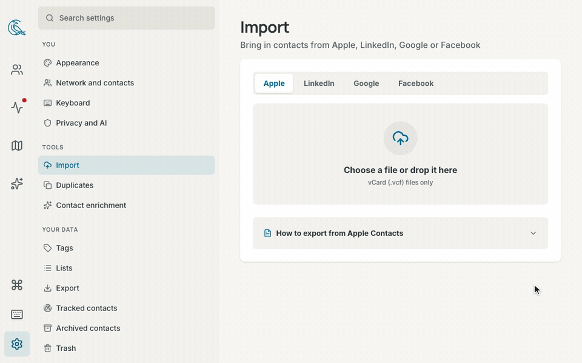

# Import, sync, and export

This page covers three ways data moves: import a contacts file, sync your
calendar, mail, and Google account with connectors, and export your data.

## Import a file

1. Open **Settings → Import**, or select **Import** (the upload button) in the
   Network list's header.
2. Choose the tab for your source: **Apple**, **LinkedIn**, **Google**, or
   **Facebook**.
3. Select the box to choose the file. On a computer, you can also drop the
   file on the box.

Contrack remembers the tab you used last in this browser. The tabs take the
arrow keys. Contrack reads the file type in any case, so `Contacts.VCF` works.

### Supported files

| Tab          | File                | What comes in                                                                                                                                    |
| ------------ | ------------------- | ------------------------------------------------------------------------------------------------------------------------------------------------ |
| **Apple**    | vCard (`.vcf`)      | Names, emails, phones, addresses, company, job title, birthday, the note as **About**, websites, social profiles, categories as tags, and photos |
| **LinkedIn** | `Connections.csv`   | Name, company, position, email, profile URL, and the date you connected                                                                          |
| **Google**   | Google CSV (`.csv`) | Name, emails and phones, company, role, addresses, birthday, notes as **About**, website, and labels as tags                                     |
| **Facebook** | `friends.json`      | Friend names and the date you connected. Facebook exports no emails or phone numbers                                                             |

A vCard from any other address book, such as Outlook or an Android phone,
works on the **Apple** tab. The **Google** tab reads the current Google CSV
(with **First Name** and **Last Name** columns) and the older one (with
**Given Name** and **Family Name**).

- One import holds up to 5,000 contacts, and up to 50 MB with the photos.
  Split a larger file.
- Contrack skips an entry with no name, and the summary counts these
  entries. A Google entry with no name takes its nickname or its company as
  its name.
- A photo inside a vCard is saved on your server. A photo that the vCard
  gives as a web address stays a link to that site, see
  [Privacy](privacy.md#what-leaves-the-server).

### Export from your address book

Select **How to export from** under the drop zone to see these steps in the
app.

- **Apple Contacts:** open the Contacts app on your Mac. Select the contacts,
  or press `⌘A` for all. Choose **File > Export > Export vCard…**, and save
  the `.vcf` file.
- **LinkedIn:** open **Settings & Privacy**, then **Data privacy** > **Get a
  copy of your data**. Choose **Connections** and request the archive.
  Download it, extract it, and use `Connections.csv`.
- **Google Contacts:** go to contacts.google.com. Select **Export**, choose
  **Google CSV**, and select **Export**.
- **Facebook:** open **Settings & Privacy** > **Settings** > **Accounts
  Center** > **Your information and permissions** > **Download your
  information**. Choose the **JSON** format and the **Friends and Followers**
  category. Download, extract, and use `friends.json`.

### What happens during an import

Your browser reads the file and sends the contacts to your Contrack server.
The import then runs in up to three steps:

1. **Importing contacts.** Contrack saves each photo in the file on your
   server, then saves the contacts.
2. **Preparing the contacts for search.** Contrack makes the embeddings that
   the duplicate check compares. This step shows only when an embedding model
   is ready.
3. **Looking for duplicates.** This step runs when **Check imports
   automatically** is on in **Settings → Duplicates**.

The summary counts the contacts imported, the duplicates that merged by
themselves, the possible duplicates to review, and the new contacts. If the
duplicate check did not finish, the summary says so, and the contacts stay
saved. Select **Check now** in **Settings → Duplicates** to look for
duplicates again.

Imported contacts start untracked, see
[Track a contact](pulse.md#track-a-contact). **Enrich new contacts
automatically** does not research them.

If the connection drops, the import goes on, and nothing is imported twice.
Contrack shows **Reconnecting to your import**, or **Lost contact with the
server** with **Check again**. If you leave the page, open the import again
to see where it got to.

If nothing could be saved, the panel shows **Import did not finish**. **Try
again** sends the file again while the page still holds it. After a reload,
choose the file again. If the import stopped part way, the contacts it saved
stay, and the rest wait for **Retry failed rows**.

### Retry failed rows

A row that cannot be saved stays on the server with its reason, and the
summary lists it. **Retry failed rows** runs these rows again, with no need
for the file.

**Settings → Import** also lists **Recent imports**, newest first, with each
status and its counts. **Checking** means that the contacts are saved and the
duplicate check still runs. The other statuses are **Complete**, **Running**,
and **Failed**. Select **Try again** on a row with failed rows. If an import
saved nothing, import the file again. Contrack keeps an import's record for
30 days after the import ends.

### Duplicates at import

The import's duplicate check compares the new contacts with your other
contacts and with each other. It sends no pair to an AI model. A pair at or
above your auto-merge sensitivity merges by itself, and
[Merge history](duplicates.md#merge-history-and-undo) can undo each merge.
The other pairs it finds wait in **Possible duplicates**. The summary's
button with the count, such as **Review 3 possible duplicates**, goes there,
see [Review possible duplicates](duplicates.md#review-possible-duplicates).

## Connectors

A connector syncs who you talk to. It reads your calendar, a mailbox, or a
Google account on a schedule, and adds meetings and email to your contacts'
timelines. Contrack connects from your own server.

To add a connector:

1. Open **Settings → Connectors**.
2. Select **Connect** beside **Calendar**, **Mailbox (IMAP)**, or **Google
   Workspace**. If you already have a connector, select **Add connector** and
   choose the kind.
3. Fill in the form. For a calendar or a mailbox, select **Test connection**
   to check it.
4. Select **Connect**. Google has its own steps, see
   [Google Workspace](#google-workspace).

The first sync starts within about a minute. **Sync now** starts one at once.

The **Calendar** and **Mailbox (IMAP)** connectors refuse an address on a
private network, such as a server in your home. The server variable
`CONNECTORS_ALLOW_PRIVATE_HOSTS=true` turns this check off for both, see the
[Configuration reference](configuration.md#environment-variables).

### Calendar (ICS)

The Calendar connector reads a private calendar address in iCalendar format.
Past meetings with your contacts become meetings on their timelines. Upcoming
meetings appear in the **Coming up** card on Pulse.

Find the private address:

- **Google Calendar:** on the web, open **Settings**, choose the calendar
  under **Settings for my calendars**, and go to **Integrate calendar**. Copy
  **Secret address in iCal format**.
- **Apple iCloud:** in the Calendar app, share the calendar and turn on
  **Public Calendar**. Copy the address, and change `webcal://` at the start
  to `https://`. Anyone with this address can read the calendar.
- **Fastmail:** in the calendar settings, copy the calendar's private
  iCalendar address.
- **Outlook:** on the web, open the calendar settings, then **Shared
  calendars** > **Publish a calendar**. Copy the ICS link.

Paste it into **Private ICS calendar URL**. Contrack reads only `http://` and
`https://` addresses, and a feed of up to 5 MB.

### Mailbox (IMAP)

The Mailbox connector reads mail headers from any IMAP account. Each message
with a contact becomes an email on that contact's timeline.

1. In your mail provider's settings, create an app password, so your main
   password stays out of Contrack. Gmail and iCloud offer one once two-step
   verification is on.
2. Enter **IMAP host**, **Port**, **Username / email**, and **App password**.
   Port 993 connects over TLS.
3. In **Folders to sync**, list the folders to read, separated by commas. The
   default is `INBOX` only. Add your sent folder, such as `INBOX, Sent`, so
   the mail you send counts too. **Test connection** names the folders it
   finds.
4. In **Also treat these addresses as mine**, list your other addresses and
   aliases. Mail from them counts as sent by you.

Common hosts are `imap.gmail.com`, `imap.mail.me.com` (iCloud), and
`imap.fastmail.com`, each on port 993.

### Google Workspace

The Google connector syncs your Google Contacts, Gmail, and Google Calendar.
An admin sets it up once for the instance. Then each person connects their own
Google account.

**For an admin: set up the Google OAuth client.**

1. Open Contrack at the address people use, then **Settings →
   Administration → General**, and go to **Integrations**. Copy the
   **Authorized redirect URI** from the **Google OAuth client** row.
2. In the Google Cloud Console, create a project. Turn on the People API, the
   Gmail API, and the Google Calendar API.
3. Set up the OAuth consent screen. For a Google Workspace domain, choose an
   Internal app, which Google does not need to verify. For personal Gmail,
   choose an External app and set it to In production. It takes up to 100
   users.
4. Create an OAuth client of type **Web application**. Paste the redirect URI
   under **Authorized redirect URIs**.
5. Copy the client ID and the client secret into **Client ID** and **Client
   secret** in Contrack, and select **Save**.

`GOOGLE_OAUTH_CLIENT_ID` and `GOOGLE_OAUTH_CLIENT_SECRET` can set the client
instead. Behind a reverse proxy, set `PUBLIC_URL`, see
[Remote access](self-hosting.md#remote-access). **Remove** on the same row
stops every Google connector on the instance.

**For everyone: connect your Google account.**

1. Open **Settings → Connectors** and choose **Google Workspace**.
2. Turn on **Generate AI summaries** now if you want them. Google then gives
   Contrack read access to message bodies. Without it, Contrack asks only for
   message headers.
3. Select **Connect Google Workspace** and sign in with Google.
4. If Google warns that it has not verified the app, select **Advanced**, then
   the link to go to the app. This is normal for a self-hosted server.

Contrack asks for read-only access to your contacts, calendar events, email
address, and Gmail headers, or whole messages with summaries. A sign-in can
fail, for example when you do not give access or take longer than 15 minutes.
The Connectors page then says why, and nothing changes.

Each Google account has its own connector: connect a second account and it
gets a second connector, and the first keeps its own access. To add summaries
later, connect the same account again with **Generate AI summaries** on, and
Contrack updates its connector. The **AI message summaries** switch under
**Edit** works only after such a sign-in. Without one, Google refuses the
message bodies, and the sync writes no summary.

**Edit** also sets **Synced data types** (**Google Contacts (People API)**,
**Gmail messages**, **Google Calendar events**) and the options below.

Google Contacts become untracked contacts, with their photos copied to your
server. A Google contact that shares an email address or a phone number with
one of your contacts is linked to that contact, not added again. When Google
sends a synced person again, such as after a change in Google, the sync
writes Google's details over the linked contact, its emails and phones
included. Change those details in Google, not in Contrack. A new contact from
Google gets the same duplicate check as a contact you add, when **Check new
contacts automatically** is on.

### Sync options

| Option                                                                           | Connectors      | Default |
| -------------------------------------------------------------------------------- | --------------- | ------- |
| **Sync schedule**: 15 min, 30 min, Hourly, or Daily                              | All             | 30 min  |
| **First sync goes back**: 30 days, 90 days, or 1 year                            | All             | 90 days |
| **Skip events with more than** a number of attendees                             | Calendar        | 25      |
| **Include event descriptions**: copy agenda and notes into the meeting           | Calendar        | Off     |
| **Roll up emails per contact per day**: one timeline entry a day for each person | Mailbox, Google | On      |
| **Suggest a new person after** a number of meetings or messages, from 1 to 10    | All             | 3       |
| **Generate AI summaries** (Google: **AI message summaries**)                     | Mailbox, Google | Off     |

An AI summary is one or two sentences about a message with one of your
contacts. The [Fast model](ai.md#models) writes it into the message's timeline
entry. It needs the connector's summary switch and an AI provider. AI must
also be on for your account and for the instance, see
[Turn AI off](ai.md#turn-ai-off). Otherwise the sync downloads no message body
and sends nothing to a provider. A sync writes at most 50 summaries.

### Who becomes a contact

- Contrack matches each person in a meeting or message to your contacts by
  email address or phone number. The first match owns the meeting or email.
  Other matched contacts are mentioned in it.
- Your own addresses never become a contact: your account's email, the
  address of the connected mailbox or Google account, and the addresses you
  list as yours.
- A meeting or message with none of your contacts in it goes on no timeline.
  Contrack counts the people in it. After the number of times set in
  **Suggest a new person after**, the person becomes a ghost, see
  [Ghosts](contacts.md#ghosts).
- Meetings and email from a connector carry a badge on the timeline, such as
  "via Calendar", "via Email", or "via Google".

The people Contrack counts are on **Settings → Correspondents**, most often
seen first. The **Correspondents** button on the Connectors page shows how
many wait. For each person:

- **Add as contact** makes a contact with their email or phone and the name
  their mail or meeting gave, for example "Rowan Vale". When there was only an
  address, it asks for the name first, filled in from the address, for
  example "Rowan Vale" for `rowan.vale@example.com`.
- **Ignore** hides them. They do not come back, and they never become a
  ghost.

### Status and run history

Each connector card shows a status:

| Status         | Meaning                                                                                                                     |
| -------------- | --------------------------------------------------------------------------------------------------------------------------- |
| **Active**     | It syncs on its schedule.                                                                                                   |
| **Paused**     | It does not sync until you select **Resume**.                                                                               |
| **Error**      | The last sync failed. The card shows why, with **Retry now**. Each failure waits longer before the next try, up to 4 hours. |
| **Signed out** | The service refused the password or the sign-in, or the server cannot open the stored credentials. Select **Reconnect**.    |

The card's menu holds **Sync now**, **Pause** or **Resume**, **Edit**, **Run
history**, and **Remove**. **Run history** lists the last 20 syncs: how and
when each started, how long it took, what it brought in, and any error.

**Remove** stops the connector and keeps what it brought in. To delete that
too, tick "Also delete the interactions it brought in, and the people it found
who are not contacts". The contacts that a Google connector brought in from
Google Contacts stay either way.

### What connectors read and store

- **Calendar:** event times, titles, and attendee email addresses.
  Descriptions only with **Include event descriptions**.
- **Mailbox:** the From, To, Cc, Date, and Subject headers. A message body
  only for an AI summary of a message with one of your contacts.
- **Google:** contacts with their photos, calendar events, and Gmail headers.
  Message bodies only for AI summaries.

Contrack stores the mailbox password and the Google sign-in encrypted with the
instance's key. The key is the file `secret.key` in the data folder, or the
`CONTRACK_SECRET_KEY` variable. Backups hold the database but not the key, so
keep a copy of `secret.key` with them, see
[Backups and restore](self-hosting.md#backups-and-restore). Without the key,
connectors cannot read their stored credentials, and they show **Signed out**.
Contrack stores the private calendar address in the database as it is. Treat
it like a password.

## Export

Open **Settings → Export** and select a format. Each file holds your own data
only, never another account's on the instance.

| Format                 | What it holds                                                                                                       | Use it for                                                                         |
| ---------------------- | ------------------------------------------------------------------------------------------------------------------- | ---------------------------------------------------------------------------------- |
| **vCard (.vcf)**       | Your contacts, archived ones included. Not the Trash, ghosts, or contacts merged into another                       | Apple Contacts, Google Contacts, Outlook, a phone, or an import back into Contrack |
| **Spreadsheet (.csv)** | The same contacts as the vCard file, one row each                                                                   | A spreadsheet                                                                      |
| **Everything (.json)** | Every contact, archived, trashed, ghost, and merged ones included, with interactions, lists, follow-ups, and merges | A record of your contacts and notes                                                |

The CSV has the columns Name, First Name, Last Name, Company, Role, Location,
Industry, Website, Emails, Phones, Addresses, Social Links, Birthday, About,
and Tags. Then come Archived, Tracked, Cadence Days, Tracked At, Added At, and
Last Contacted At. A contact's emails, phones, addresses, links, and tags each
share one cell, separated by semicolons. A cell that starts with `=`, `+`, `-`,
or `@`, such as the phone number `+1 555 0100`, gets a `'` in front, so a
spreadsheet does not run it as a formula.

The JSON file holds your contacts with every field, their notes and
interactions, your lists and who is on them, your follow-ups, and the merges
you can still undo. It does not hold your search history, saved map views,
settings, connectors, imports, AI usage, or API tokens. Attached files and
photos appear as their addresses on the server, not as the files.

vCard is the only format that Contrack imports again, on the **Apple** tab.
The JSON file is a record to keep, not a restore: to restore an instance, use
a backup. An admin also sees a link to the **Backups** page, for a copy of the
whole database. Scripts can download the same files with a personal token, see
the [REST API reference](api-reference.md).

## Related

- [Duplicates](duplicates.md)
- [Contacts](contacts.md)
- [AI](ai.md)
- [Self-hosting](self-hosting.md)
- [Configuration reference](configuration.md)
