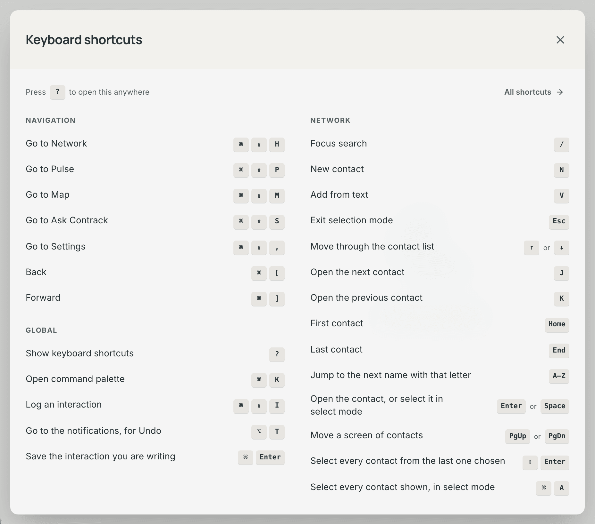

# Keyboard shortcuts

Contrack works from the keyboard on every page. This page lists every
shortcut, grouped by the page where it works.

## Open the shortcuts dialog

- Press `?` on any page, when focus is not in a text field.
- Or press **Keyboard shortcuts**, the keyboard button at the foot of the
  sidebar.

The dialog has two columns. The left column holds **Navigation** and
**Global**, which work on every page. The right column, **This page**, holds
the shortcuts of the page you are on. On a contact page the contact's keys
come first, then the keys of the Network list beside it. A page with no keys
of its own says "No shortcuts of its own".

Press **All shortcuts** at the foot of the dialog to open
**Settings → Keyboard**, which lists every shortcut in the app. Press `Esc` to
close the dialog.

## Read the keys

- Keys shown together, such as `⌘ ⇧ H`, are one combination. Hold the first
  keys, then press the last one.
- Keys joined by "or", such as `↓` or `J`, are alternatives. Either key does
  the same thing.
- `⌘` is the Command key and `⇧` is the Shift key. For the keys on Windows
  and Linux, see [Windows and Linux](#windows-and-linux).
- `⌥` is the Option key. On Windows and Linux it is the `Alt` key.
- A single-key shortcut never fires while focus is in a text field. There, a
  letter you type is only a letter.

## Windows and Linux

This page shows the keys of a Mac. On Windows and Linux, Contrack shows the
keys of your computer in the shortcuts dialog, in **Settings → Keyboard** and
in the hints beside buttons.

- Press `Ctrl` in place of `⌘`: `Ctrl K` opens the command palette,
  `Ctrl Enter` saves the interaction you are writing, and `Ctrl Z` undoes the
  last skip on the Duplicates page.
- Press `Ctrl Alt` in place of `⌘ ⇧`: `Ctrl Alt H` goes to Network,
  `Ctrl Alt P` to Pulse, `Ctrl Alt M` to Map, `Ctrl Alt S` to Ask Contrack,
  `Ctrl Alt ,` to Settings, and `Ctrl Alt I` opens the
  **Log an interaction** dialog.
- Press `Alt ←` and `Alt →` to go back and forward. These are the browser's
  own keys.

The navigation keys do not use `Ctrl ⇧`, because the browser keeps
`Ctrl ⇧ I` (developer tools), `Ctrl ⇧ P` (a private window in Firefox) and
`Ctrl ⇧ M` (the profile menu in Chrome) for itself, and a page cannot use
them. Some keyboard layouts type a character with `Ctrl Alt` (the `AltGr`
key), for example `ś` or `@`. That character goes into the field, and the
page stays where it is.

## Turn off single-key shortcuts

A single-key shortcut is one key with no modifier, such as `N` or `/`. You can
set one off by mistake when focus is not where you think it is.

1. Open **Settings → Keyboard**.
2. Turn off **Single-key shortcuts**.

The switch turns off every shortcut that **Settings → Keyboard** marks
**Single key**. The tables below mark them "Yes". While the switch is off,
the settings page marks them **Off** and the shortcuts dialog dims them. The
switch is saved to your account, so it follows you to every device.

- Two single keys stay on, marked **Always on**: `?` and the letter keys in
  the Network list.
- For a shortcut with an arrow or a letter, such as `→` or `L`, the switch
  turns off the letter. The arrow keeps working.
- The arrow keys, `Enter`, `Esc`, `Space`, `Home`, `End` and every shortcut
  with `⌘` or `⌥` stay on.

## Navigation

These work on every page.

| Keys    | What it does       | Single key |
| ------- | ------------------ | ---------- |
| `⌘ ⇧ H` | Go to Network      | No         |
| `⌘ ⇧ P` | Go to Pulse        | No         |
| `⌘ ⇧ M` | Go to Map          | No         |
| `⌘ ⇧ S` | Go to Ask Contrack | No         |
| `⌘ ⇧ ,` | Go to Settings     | No         |
| `⌘ [`   | Back               | No         |
| `⌘ ]`   | Forward            | No         |

## Global

These work on every page. `⌘ ⇧ I` opens the **Log an interaction** dialog,
and pressing it again closes the dialog. `⌘ Enter` saves the note you are
writing, on a contact's **Timeline** and in the **Log an interaction** dialog.

| Keys      | What it does                         | Single key |
| --------- | ------------------------------------ | ---------- |
| `?`       | Show keyboard shortcuts              | Always on  |
| `⌘ K`     | Open command palette                 | No         |
| `⌘ ⇧ I`   | Quick interaction                    | No         |
| `⌘ Enter` | Save the interaction you are writing | No         |

## Pulse

These work on the **Pulse** page. `↑` and `↓` work once a row in **Up next**
has focus, so press `Tab` to reach the queue first. `Enter` on a focused row
opens its contact. On a button, a link or a menu item, `Enter` does what that
control does. See [The Pulse page](pulse.md#the-pulse-page).

| Keys       | What it does                  | Single key |
| ---------- | ----------------------------- | ---------- |
| `J`        | Next item in Up next          | Yes        |
| `K`        | Previous item in Up next      | Yes        |
| `↑` or `↓` | Move between items in Up next | No         |
| `D`        | Mark item done                | Yes        |
| `S`        | Snooze item                   | Yes        |
| `L`        | Log note for contact          | Yes        |
| `C`        | Toggle customize layout       | Yes        |
| `Enter`    | Open the highlighted contact  | No         |

## Network

These work on the **Network** page, and in the list beside an open contact.
`/`, `N`, `V`, `J` and `K` work when focus is not in a field. `N` opens
**New contact** and `V` opens **Add from text**. `J` and `K` open the next
and the previous contact in the list. The arrow keys, `Home`, `End`, the
letters and `Enter` work once the list has focus. There, `J` and `K` are
letters like the others. The list is one `Tab` stop. See
[The Network list](contacts.md#the-network-list).

| Keys       | What it does                           | Single key |
| ---------- | -------------------------------------- | ---------- |
| `/`        | Focus search                           | Yes        |
| `N`        | New contact                            | Yes        |
| `V`        | Smart paste (AI parse)                 | Yes        |
| `Esc`      | Exit selection mode                    | No         |
| `↑` or `↓` | Move through the contact list          | No         |
| `J`        | Open the next contact                  | Yes        |
| `K`        | Open the previous contact              | Yes        |
| `Home`     | First contact                          | No         |
| `End`      | Last contact                           | No         |
| `A–Z`      | Jump to the next name with that letter | Always on  |
| `Enter`    | Open the contact                       | No         |

## Map

These work on the **Map** page, also while a contact is open over the map.
`Enter` and `Space` work on a pin that has focus: `Enter` opens the contact,
and `Space` keeps its card open. See
[Select contacts on the map](map.md#select-contacts-on-the-map).

| Keys    | What it does                  | Single key |
| ------- | ----------------------------- | ---------- |
| `/`     | Focus search                  | Yes        |
| `F`     | Fit all in view               | Yes        |
| `I`     | Toggle insights pane          | Yes        |
| `L`     | Lasso select                  | Yes        |
| `Esc`   | Clear selection or close card | No         |
| `Enter` | Open contact                  | No         |
| `Space` | Pin card                      | No         |

## Contact

These work on a contact page, also on a contact open over the map. `T` tracks
the contact at your default cadence, or stops tracking it, and the toast
offers **Undo**. `Enter` and `Esc` work on a value in the header or in the
**Details** card. `⌥ ↑` and `⌥ ↓` move an address, an email or a phone. The
first one in each field is the primary one. See
[The contact page](contacts.md#the-contact-page).

| Keys    | What it does                  | Single key |
| ------- | ----------------------------- | ---------- |
| `T`     | Track or untrack this contact | Yes        |
| `Enter` | Edit the value that has focus | No         |
| `Esc`   | Cancel the edit               | No         |
| `⌥ ↑`   | Move the value up one place   | No         |
| `⌥ ↓`   | Move the value down one place | No         |

## Ask Contrack

These work on the **Ask Contrack** page, in **People** and in **Notes** mode.
`H` shows or hides the history. `Esc` clears the search box. See
[History](search.md#history).

| Keys  | What it does          | Single key |
| ----- | --------------------- | ---------- |
| `/`   | Focus search          | Yes        |
| `H`   | Toggle search history | Yes        |
| `Esc` | Clear the search      | No         |

## Duplicates

These work on **Settings → Duplicates**, on the **Scan** tab, while the
results of a scan show in the **Swipe** view. See
[Review possible duplicates](duplicates.md#review-possible-duplicates).

| Keys       | What it does           | Single key |
| ---------- | ---------------------- | ---------- |
| `→` or `L` | Merge into the primary | The letter |
| `←` or `H` | Keep separate          | The letter |
| `↓` or `J` | Next group             | The letter |
| `↑` or `K` | Previous group         | The letter |
| `⌘ Z`      | Undo the last skip     | No         |

## Possible duplicates

These work on the **Possible duplicates** page. Open it with **Review them**
on **Settings → Duplicates**, or with the number on the **Pulse** icon in the
sidebar.

| Keys       | What it does       | Single key |
| ---------- | ------------------ | ---------- |
| `↓` or `J` | Next pair          | The letter |
| `↑` or `K` | Previous pair      | The letter |
| `→` or `L` | Merge the pair     | The letter |
| `←` or `H` | Keep them separate | The letter |
| `Space`    | Select the pair    | No         |

## Other keys

These keys are not in the shortcuts dialog, because they belong to one
control.

- **Command palette**: the palette has keys of its own for results, filters
  and actions. See [Command palette](search.md#command-palette).
- **@mentions**: in a note, type `@` and the start of a name. `↑` and `↓`
  move through the names, `Enter` picks one, and `Esc` closes the list.
- **Select mode**: in the Network list, `⌘ A` selects every contact the list
  shows, when focus is not in a field. On Windows and Linux, press `Ctrl` in
  place of `⌘`.
- **Menus**: `↑` and `↓` move through the items, `Home` and `End` jump to the
  ends, and a letter moves to the next item that starts with it. `Esc`
  closes the menu and returns focus to its button.
- **Dialogs**: `Tab` stays inside an open dialog. `Esc` closes it, and focus
  returns to the control that opened it.

## Related

- [Getting started](getting-started.md#find-your-way-around)
- [Contacts](contacts.md)
- [Pulse and tracking](pulse.md)
- [Search and Ask Contrack](search.md)
- [Accessibility](accessibility.md)
