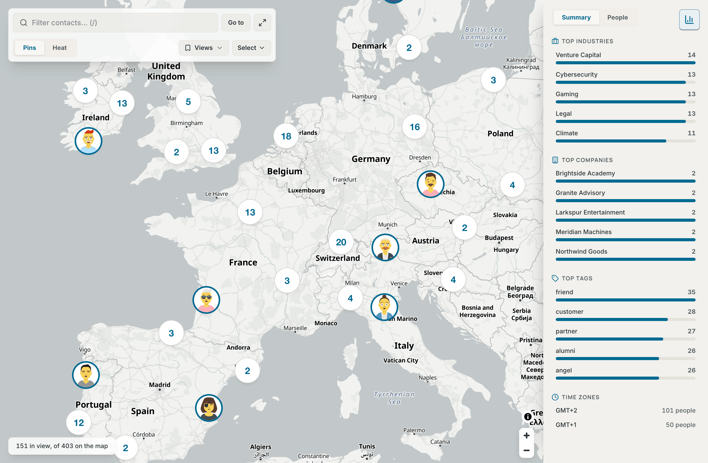
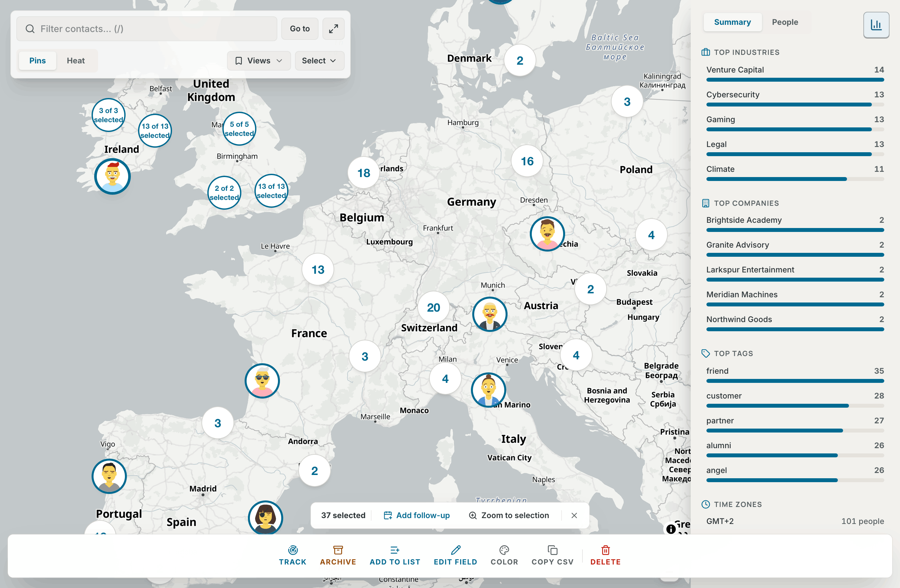
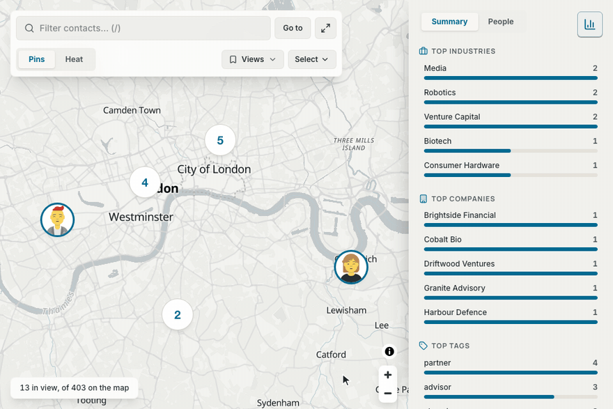
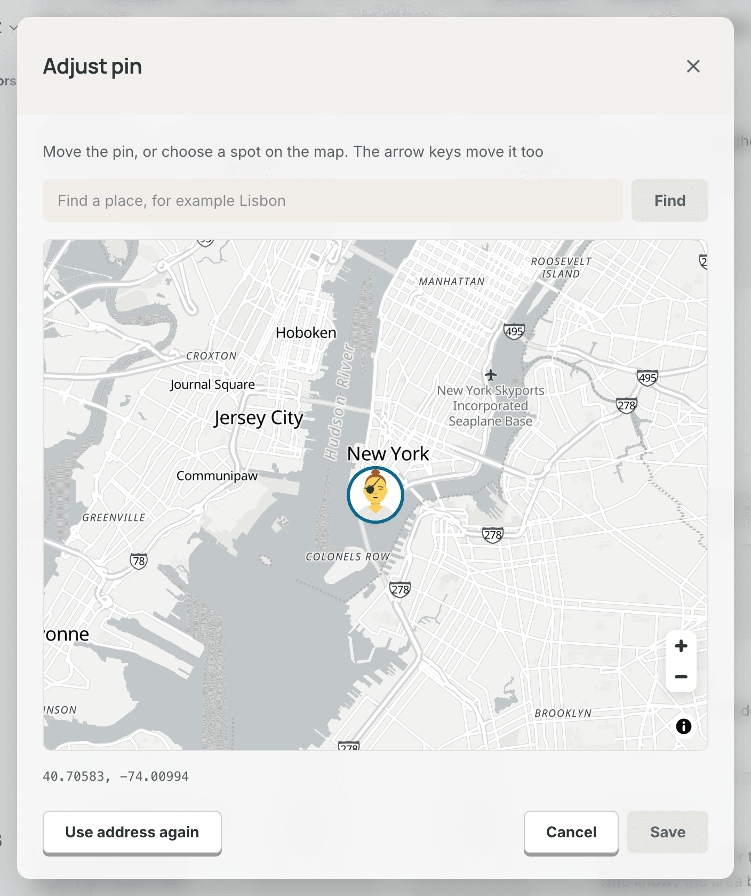

# Map

The **Map** shows your contacts where they live and work. Use it to filter people by place, to select people by area, and to fix a pin that is in the wrong place.

Open **Map** in the sidebar or the tab bar, or press `Cmd+Shift+M` (`Ctrl+Alt+M` on Windows and Linux).

## Who is on the map

A contact is on the map when it has a pin. Contrack places the pin from the contact's first address, or from its location when it has no address. You can also place the pin by hand.

- Archived contacts, contacts in the trash, merged duplicates and ghosts are not on the map.
- Contrack looks up addresses in the background, so a new pin can take a few seconds (see [How Contrack places pins](#how-contrack-places-pins)). After you add or change an address, the app checks again a few seconds later, so the map and the contact page show the new pin without a reload.
- A contact with an address but no pin shows "Not on the map yet" on its page. See [Move a pin by hand](#move-a-pin-by-hand).
- When some contacts have an address and no pin, the bottom line shows a button such as **6 not on the map**. Select it to see each person, the address and the reason: "Waiting for the geocoder", "The geocoder found no place for this address" or "Address lookups are off on this instance". **Set location** beside a person opens the pin dialog.

## Pins, clusters and stacks

- **A pin** is the contact's picture. Select it to open the contact over the map. Select the map, or press `Esc`, to close the contact. A red dot on a pin means that the contact's follow-up is overdue.
- **A cluster** is a circle with a number. It holds contacts that are too close to tell apart at this zoom. Point at it, or move to it with `Tab`, to see up to five of its people, the ones with the most logged interactions first. Select it to zoom in until it splits. A red dot means that some of its people have an overdue follow-up, and a screen reader says how many.
- **A stack** is a cluster that never splits, because its people have the same point, such as a city. It stays a stack at every zoom, and its name says, for example, "12 contacts at one place, list them". People a few meters apart split at the closest zooms. Select a stack to see a list of the people, up to 50, under a line such as "12 people here". Select a name to open the contact. The list marks the open contact and stays open, so you can go through the people. `Esc` closes the list.

When the map opens a contact, it moves the pin to the middle of the part of the map that you can still see. The open contact's pin gets a halo, and the other pins fade until you point at one.

## The hover card

Point at a pin to see its card after a moment. The next pin's card opens at once, so you can move from pin to pin. The card shows:

- the name, the role and company, and the score when the contact has one, for example "Score 72"
- the location and the local time there
- the most urgent fact: a follow-up that is overdue or due within seven days, else the last contact, for example "Last contact 3 weeks ago", or "No contact logged yet"
- up to three tags and the first list, and how many more there are

Move the pointer into the card to use its buttons: **Open contact**, **Call** (when the contact has a phone), **Log interaction**, **Add follow-up**, **Add to list** and **Adjust pin**. A button closes the card. The card closes a moment after the pointer leaves it.

The card stays inside the part of the map that you can see. It opens away from the toolbar, the bottom line, the open contact and **Map insights**, and it changes side when the map moves. The pin of an open card has a halo.

With the keyboard, move to a pin with `Tab` to see its card, and press `Space` to move into its buttons. `Enter` on a pin opens the contact. `Esc` closes the card and puts the focus back on the pin. A second `Esc` closes the open contact, and the focus goes back to that contact's pin. After `Enter` on a cluster, the map zooms in and the focus moves to the pin nearest the cluster's place.

On a touch screen, the first tap on a pin shows its card at the bottom of the map. Its buttons are **Open**, **Call**, **Log**, **Follow-up**, **List** and **Pin**. Tap the pin again, or tap **Open**, to open the contact. Tap the map, or **Close**, to close the card.

## Filter the map

Type in **Filter contacts** at the top left, or press `/` to go there. Words match the name, company, role, location, industry, tags, email addresses and phone numbers. A facet becomes a pill when a space follows it, when you press `Enter`, or when you pick it from the list under the box. The page address keeps your filter, so you can share the link, and it keeps it while a contact is open.

The filter reads these [facets](search.md#facets): `role:`, `company:`, `location:`, `industry:`, `tag:`, `list:`, `score:`, `updated:`, `contacted:`, `tracked:`, `missing:` and `near:`. A value with a space goes in double quotes, for example `industry:"Venture Capital"` or `near:"San Francisco"/50km`.

To find the people around a place:

1. Type `near:` and a place, for example `near:Paris` or `near:London/50km`. With no distance, the distance is 25 km.
2. Type a space, or press `Enter`. The pill says "(resolving…)" while Contrack looks up the place. The pill turns red when Contrack finds no such place, and `Enter` tries again.

**Clear all**, beside the pills, clears the whole filter: the text, the overdue filter and the people from Ask. It shows whenever a filter is on. When nobody matches, the toolbar also says, for example, "0 of 240 match". The **X** in the box, or `Esc` in the box, clears the filter text and all its pills. The list of facet values shows only while the box has the focus.

On a narrow window, or when an open contact leaves little room, `/` opens **Filters** with the focus in the box.

### Go to a place

1. Select **Go to**. The box becomes a place search, and the focus moves into it.
2. Type a place, for example "Lisbon", and press `Enter`.
3. The map flies to the place, and a message names the place that the lookup found, for example "Showing Lisbon, Portugal".

When the lookup fails, a line under the box says why. "Nothing found for that place" means that the lookup found no match. "Place search is busy or unavailable" means that the geocoder did not answer, so try again in a moment.

Select **Filter**, or press `Esc`, to go back to the filter. After a place is found, the focus goes back to the filter box too.

### Fit all

**Fit all** (`F`) fits the map to every contact that the filter keeps. When your network is wider than the map can show, it shows the part with the most people.

The map flies to a contact, a place or a view. With **Reduced** in **Settings → Appearance → Motion**, or with reduced motion on your device, it jumps there instead.

## The bottom line

The line in the bottom left corner says who is on the map and in view. Only people with a place are on the map, so its count can be lower than the count on the Network page.

- "30 on the map" when all of them are in view, "12 in view, of 30 on the map" when some of the people who match are off the screen, or "No one in view".
- While the contacts load, it says "Loading contacts…". When they do not load, it says "Could not load your contacts", and the map offers **Try again**. With no pins at all, it says "No one is on the map yet", and the middle of the map says how a contact gets a place, with **Go to Network**.
- **4 overdue** counts the people in view whose follow-up day has passed. Select it to show only them, and select it again to show everyone. **Clear all** turns it off too.
- **6 not on the map** opens the list of contacts with an address and no pin (see [Who is on the map](#who-is-on-the-map)).
- **Fit all** shows when no one is in view.
- With the **Heat** layer on, the line shows the heat's legend, from "Fewer" to "More". When you zoom in past the heat, it offers **Zoom out for heat**.

While you have people selected, the selection bars take the line's place.

## Layers

The **Pins** and **Heat** switch sets what the map draws.

- **Pins** draws the pins, the clusters and the stacks.
- **Heat** shows where your network gathers, as a field of color. Every person counts, and a person with many logged interactions counts up to twice as much. The colors scale to your busiest place, so a small network and a large one both use the whole range. The heat sits under the place names.

As you zoom in toward one city, the heat fades and the pins come back. While the heat hides the pins, a mouse over the map says how many people are near it, for example "About 12 people here". Contrack saves your layer to your account.

## Saved views

A saved view keeps the map's position, zoom, filter and layer under a name.

1. Set up the map as you want it.
2. Open **Views** and choose **Save current view…**.
3. Type a **View name**, up to 60 characters, and select **Save view**.

To go back to a view, open **Views** and choose it. While a view is active, the **Views** button shows its name. Each view in the menu has a rename button and a delete button. After a delete, **Undo** in the message saves the view again for 10 seconds. You can keep up to 100 views.

To change a view, choose it, change the map, and choose **Update “name” to this map** in **Views**. The view takes the filter, the layer and the box that the map shows now. The item names the view that you chose or saved last.

To put the views in a new order, drag a view in the menu with a mouse. With the keyboard, press `⌥ ↑` or `⌥ ↓` on a view (`Alt` on Windows and Linux).

The overdue filter and the people from Ask are not part of a view. When one of them is on, the save dialog says so. Choosing a view turns both off.

A view has its own link, so you can bookmark it. When you change the filter or the layer, the map leaves the view. A link to a view that was deleted opens the map without it, and says so.

## Show Ask results on the map

On the Ask page, **Show on map** above the results opens the map on the people that Ask found. A pill such as **12 people from Ask** says that the map shows only them, and selecting it removes that filter. When the question is a list of facets, such as `tag:investor`, the map gets the facets instead and shows every match. The map fits itself to the people when it opens from such a link.

## Map insights

**Map insights** sums up the people in view. On a wide screen, select the **Map insights** button in the top right corner, or press `I`. On a phone, select **Insights**. Switch between **Summary** and **People** at the top of the panel.

- **Summary** shows the **Top industries**, **Top companies** and **Top tags** of the people in view, five of each, as bars. Select a bar to add it to the filter, for example `industry:"Venture Capital"`. A bar whose filter is on is tinted and shows an ×, and selecting it again removes the filter. **Time zones** lists the time zones of the people in view, with how many people are in each.
- **People** lists everyone in view, the overdue first and then by name. Each row shows the picture with its score ring, the name, the company and the score. Pointing at a person marks their pin with a halo. Selecting a person flies the map to their pin and opens their card. On a phone the panel closes first, and the card opens at the bottom of the map.

With no one in view, the panel says why: "No one in view", "Loading contacts…", "Could not load your contacts", or "No one is on the map yet" with "Add a location to a contact" under it. `Esc` in the panel closes it. On a wide screen, Contrack remembers whether you left the panel open.

## Select contacts on the map

Select people by area, then act on all of them at once.

- **All in view**: choose **Select** → **All in view**. On a phone, open **Filters** and select **Select all in view**. With the keyboard, move the map to the people with the arrow keys, `+` and `-`, then choose **All in view**. It picks the people the "in view" count shows, so it leaves out anyone under the open contact or the Map insights panel.
- **Box**: hold `Shift` and drag across the map. **Select** → **Box select** tells you how.
- **Lasso**: press `L`, or choose **Select** → **Lasso select**. Then drag a shape around the people. The lasso ends when you let go. `Esc`, or `L` again, cancels it.

Each selection adds to the people you already selected. It picks only people who match the filter. Box and lasso need a mouse or a trackpad, so a touch screen shows only **All in view**.

A selection stays when you change the filter. The bar then says how many are hidden, for example "12 selected (3 hidden by filter)". A cluster shows how many of its people you selected, for example "3 of 12 selected".

### The selection bars

Two bars open at the bottom of the map:

- The first bar shows the count, **Add follow-up**, **Zoom to selection** and a button that clears the selection. `Esc` clears the selection too.
- The second bar is the bulk bar of the Network list: **Track** (or **Stop tracking** when everyone selected is tracked), **Archive**, **Add to list**, **Edit field**, **Color**, **Copy CSV** and **Delete**. See [Select several contacts](contacts.md#select-several-contacts).

### Add a follow-up to many people

1. Select the people.
2. Select **Add follow-up**.
3. Type the **Follow-up**, for example "Catch up over coffee".
4. Choose a due date: **Tomorrow**, **3 days**, **Next week** or **Pick date**.
5. Select the add button, for example **Add to 12 contacts**.

Each contact gets its own follow-up, which shows in **Up next** on Pulse (see [The Pulse page](pulse.md#the-pulse-page)). Contrack saves the follow-ups together, for every person or for none. One follow-up goes to 500 contacts at most. With more people selected, the dialog says so.

## The map on a contact page

A contact's **Details** card shows where the person is, under their addresses.

| The contact has       | The card shows                                  |
| --------------------- | ----------------------------------------------- |
| A pin                 | A small map, **Open in map** and **Adjust pin** |
| An address but no pin | "Not on the map yet" and **Set location**       |
| Neither               | Nothing                                         |

- When the contact has a pin, the menu of every address row has **Show on map**.
- The first address places the pin, and its row says **Map pin**. Move another address to the top to move the pin there.
- A pin that you placed yourself shows **Placed by hand**.
- When the contact is open over the Map page, the small map and **Open in map** are hidden, and **Adjust pin** stays.
- **Open in map** and **Show on map** open the contact beside the map when the window has room for both. In a narrower window, such as a phone or a tablet, the contact would cover the map, so they show the map with the person's pin and card instead.

## Move a pin by hand

The geocoder can put a pin in the wrong place, for example in another town with the same name. You can move the pin yourself.

1. Open the contact.
2. Under the small map, select **Adjust pin**. For a contact with no pin, select **Set location**. On the map, the hover card's **Adjust pin** and **Set location** in the not-on-the-map list open the same dialog.
3. Move the pin in one of four ways:
   - Type a place or an address in **Find a place** and press `Enter` or **Find**. The pin and the map move there.
   - Drag the pin with the mouse or a finger.
   - Choose the spot on the map where the pin belongs.
   - Move to the pin with `Tab` and press the arrow keys. `Shift` with an arrow key moves it five times as far.
4. Check the coordinates under the map.
5. Select **Save**. The button works only after the pin has moved.

**Cancel** closes the dialog and keeps the pin in its old place. For a contact with no pin, **Find a place** starts with the address that the geocoder could not place.

After you save, the contact shows **Placed by hand**. The geocoder does not move a pin that you placed. It reads the address again only when you change the address, or when you choose **Use address again**.

**Use address again**, in the same dialog, gives the pin back to the geocoder. It shows only when the contact has an address, so a pin with nothing to read stays where you put it. The contact shows "Not on the map yet" until the geocoder places the pin again, which usually takes a few seconds.

## Basemaps

- The map follows the app's theme: a light basemap with the light theme, and a dark basemap with the dark theme.
- The default basemap comes from OpenFreeMap. It needs no key and no account. Your browser loads the map tiles from it.
- The credit for the basemap is behind the "i" button in the bottom right corner.
- When the basemap does not load, the map says "The basemap did not load. Pins still work".
- An operator can serve the basemap from the instance itself, also for offline use. See [Map in the configuration reference](configuration.md#map).

## The map remembers where you left it

The map opens where you left it in this browser, also after a reload. This position stays in the browser, so it does not follow you to other devices, and signing out clears it. A link to a saved view opens that view instead.

## Keyboard

| Key     | What it does                                                    |
| ------- | --------------------------------------------------------------- |
| `/`     | Focus the filter box                                            |
| `F`     | Fit all in view                                                 |
| `I`     | Toggle insights pane                                            |
| `L`     | Lasso select                                                    |
| `Esc`   | Clear the filter box, close the contact, or clear the selection |
| `Enter` | Open contact                                                    |
| `Space` | Card actions                                                    |
| `⌥ ↑`   | Move a view up, in Views                                        |
| `⌥ ↓`   | Move a view down, in Views                                      |

`Tab` moves to the pins. When the map has focus, the arrow keys pan it, and `+` and `-` zoom. `Esc` closes an open card or a stack's list first. `/`, `F`, `I` and `L` are single-key shortcuts, so the **Single-key shortcuts** switch in **Settings → Keyboard** turns them off. They do nothing while a menu is open, or while a dialog has the focus. See [Keyboard shortcuts](keyboard-shortcuts.md#map).

## On a phone

- On a phone, and in any window under 1024 px wide, the toolbar becomes three buttons: **Filters**, **Fit all** and **Insights**. A touch screen also gets the **Command palette** button. **Filters** opens a sheet with the filter, **Go to**, the **Map layer** switch, **Saved views** and **Select all in view**.
- A tap on a pin shows its card at the bottom, and its pin gets a halo. A second tap opens the contact over the whole map. When you close the contact, its pin is in the middle of the map. See [The hover card](#the-hover-card).
- A tap on a person in **Insights** → **People** closes the panel, flies to the pin and shows the card at the bottom.
- The card's **Call** calls the contact's first phone.
- Pinch to zoom. The map does not rotate.
- Box and lasso selection do not work with a finger. Use **Select all in view**.

## How Contrack places pins

Contrack finds the place for an address with Nominatim, the OpenStreetMap geocoder. Nominatim needs no key, and Contrack sends it only the address text. The first address places the pin, and the location places it when there is no address.

- The lookups run in the background. Every call to Nominatim, from these lookups and from place searches such as **Go to**, keeps to one a second.
- When Nominatim finds nothing for an address, Contrack drops the part before the first comma and tries the rest, up to four tries. So a street that Nominatim does not know can still place the pin in the right town.
- Contrack keeps each answer while a contact uses that address, and it does not try an address that found nothing again for seven days.
- When Nominatim does not answer, Contrack does not remember that as "nothing found". It tries again after 30 seconds, then waits twice as long each time, up to 15 minutes, until Nominatim answers.
- When the server starts, it queues every contact that has an address or a location and no pin.
- An admin can turn the lookups off with **Look up addresses for the map** in **Settings → Administration → General**. Then no address leaves the server: a pin comes from an earlier answer or by hand, and **Go to** finds only places looked up before. An operator can also point the lookups at a Nominatim server of their own. See [Geocoding](configuration.md#geocoding).

## Automate it

The Map page reads its contacts from `GET /api/contacts?view=slim`. `GET /api/contacts/map` lists your placed contacts for scripts and other API clients. It leaves out archived, trashed, merged and ghost contacts. `PATCH /api/contacts/:id/location` moves a pin, or gives the pin back to the geocoder. `GET /api/geo/status` lists the contacts with an address and no pin, and `GET /api/geo/search` finds a place by name. `GET /api/map/views` lists your saved views, and `POST /api/map/views` saves one. See [Map and places in the REST API reference](api-reference.md#map-and-places).

## Related

- [Search and Ask Contrack](search.md#facets)
- [Pulse and tracking](pulse.md#track-a-contact)
- [Contacts](contacts.md#the-contact-page)
- [Configuration reference](configuration.md#map)
