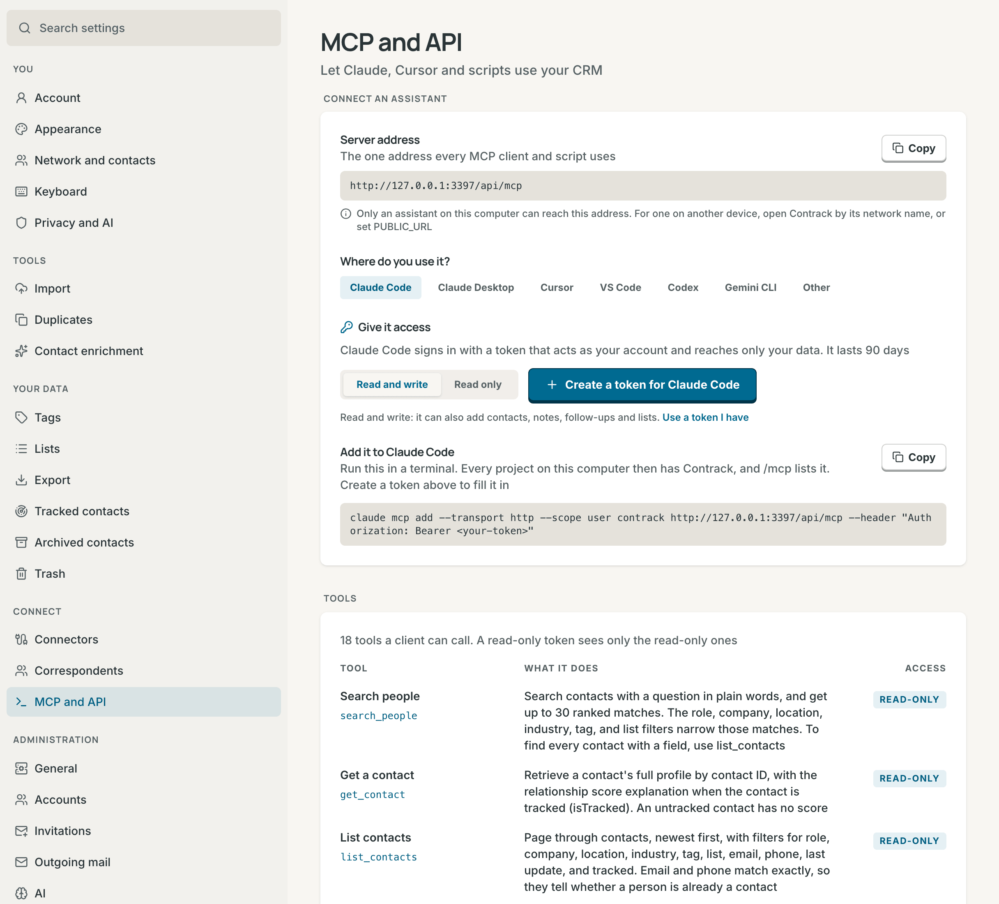

# MCP and API tokens

Contrack has an MCP server, so an AI assistant such as Claude or Cursor can
use your CRM. This page covers personal API tokens, how to connect a client,
and the tools, resources, and prompts the server offers.



## What MCP gives an assistant

MCP, the Model Context Protocol, is an open standard for connecting AI
assistants to other apps. With Contrack connected, an assistant can search
your contacts, read a timeline, log a note, and add a follow-up while you
talk to it. It works as your account and sees only your data.

**Settings → MCP and API** sets up a client step by step:

1. **Server address**, the one address every client uses. It is your
   Contrack's address with `/api/mcp` after it, such as
   `http://localhost:3210/api/mcp`. When `PUBLIC_URL` is set, the page uses
   it. When the address works only on this computer, the page says so.
2. **Where do you use it?**: Claude Code, Claude, ChatGPT, Claude Desktop,
   Cursor, VS Code, Codex, Gemini CLI, or another client.
3. **Give it access**, when your Contrack asks people to sign in. When OAuth
   is on, a client can **Sign in with the browser**, and you copy no token.
   Otherwise, or with **Use a token**, select **Create a token for** the
   client, as **Read and write** or **Read only**.
   The token lasts 90 days and is named after the client. It fills in the
   setup, and the page shows it only once. **Use a token I have** takes a
   token you made before. The page never saves a token.
4. **Add it** shows the command or the config for that client, with the
   address and the token in it, and **Copy**. For Cursor and VS Code, **Add
   to Cursor** and **Add to VS Code** add the server in one press. Copy and
   the install button wait until the setup has a token.

**Tools** lists every tool a client can call.

The server speaks MCP over streamable HTTP. Each request stands alone, with no
session to keep open.

## Create a token

A client needs a personal API token when your Contrack asks people to sign
in.

1. Open **Settings → Account** and go to **API tokens**. The **MCP and API**
   page also makes one for the client you set up, as above.
2. Select **Create token**.
3. In **What is it for**, name the machine or the script, such as "Claude
   Desktop on the laptop".
4. Choose when it expires: **30 days**, **90 days**, **1 year**, or **Never**.
   The default is 90 days.
5. Choose its **Access**: **Read and write**, the default, or **Read only**.
   A read-only token can search and read your data, and cannot change
   anything. Its MCP client sees only the read-only tools.
6. Select **Create token**, and copy the token. It starts with `ctk_`.
   Contrack shows it only once. Then select **I've copied it**.

The **API tokens** list shows each token's name, its state, and its first
characters. The state is active, revoked, or expired. A read-only token also
shows **Read-only**. The list also shows when each token was last used and
when it expires.

To revoke a token, select **Revoke** on its row, then **Revoke token**. It
stops working at once. The row stays, marked revoked, so you can see later why
a script stopped.

- You create tokens while signed in. A token cannot create another token.
- An account with a temporary password must choose its own password first.
- An account can create 10 tokens an hour.

When your Contrack does not ask anyone to sign in, a client connects without a
token, and **Settings → Account** is not shown. See
[Accounts and sign-in](accounts.md#turn-on-sign-in).

## Connect Claude or ChatGPT

Claude on the web, Claude Desktop, the Claude app on your phone, and ChatGPT
connect by address and sign in with OAuth. You copy no token. They connect
from the internet, so your Contrack needs sign-in on, `PUBLIC_URL` set to its
`https` address, and that address open to the internet. See
[Claude on the web, Claude on your phone, and ChatGPT](self-hosting.md#claude-on-the-web-claude-on-your-phone-and-chatgpt).

In Claude:

1. Open **Customize → Connectors**, and select **Add custom connector**.
2. Paste `https://<your address>/api/mcp` and select **Add**. Keep **Use
   Claude's published identity** if Claude asks.
3. Claude opens Contrack. Sign in if you are not signed in.
4. Contrack shows the app, where you go back to, and the account. Choose
   **Read and write** or **Read only**, and select **Allow**.

On a Team or Enterprise plan, an Owner adds the connector for the
organization. Once added, it works in Claude on the web, in Claude Desktop
and on your phone.

In ChatGPT, turn on developer mode in the settings, add a connector with the
same address and OAuth sign-in, and approve it the same way.

### What an app sees, and how to disconnect it

- An approved app shows in **Settings → Account → API tokens** with an
  **app** badge and the host it signs in from. **Disconnect** stops it at
  once. Connect it again from the app to use it again.
- **Read only** gives the app the read-only tools only, as a read-only token
  does.
- The consent page says when an app named itself, which any app can do, and
  when its details come from its own web address, which a name cannot fake.
  It always says where your browser goes after you choose.
- An app's access token lasts an hour and works on `/api/mcp` only. Its
  refresh token lasts 30 days from its last use and works once. A used
  refresh token that comes back within a minute is a retry, and gets a
  pair of its own. Later, someone else has it, and Contrack disconnects the
  app.

Claude Code, Cursor, VS Code, Gemini CLI and the Claude Desktop config can
sign in with OAuth too, when it is on. On **Settings → MCP and API**, choose
**Sign in with the browser** instead of **Use a token**. The command then has
no token, and the client opens Contrack in your browser the first time it
connects.

## Connect a client

**Settings → MCP and API** builds each of these for you. The examples below
use `http://localhost:3210` and `<your-token>`. Use your own address and
token instead. When your Contrack does not ask anyone to sign in, leave out
the token and the `Authorization` header.

### Claude Code

Run this in a terminal:

```bash
claude mcp add --transport http --scope user contrack http://localhost:3210/api/mcp --header "Authorization: Bearer <your-token>"
```

`--scope user` adds Contrack to every project on the computer. Without it,
Claude Code adds it to the current project only. `/mcp` in Claude Code lists
it.

### Claude Desktop

In Claude Desktop, open **Settings → Developer → Edit Config**. In
`claude_desktop_config.json`, add the `contrack` entry inside `mcpServers`:

```json
{
  "mcpServers": {
    "contrack": {
      "command": "npx",
      "args": [
        "-y",
        "mcp-remote",
        "http://localhost:3210/api/mcp",
        "--header",
        "Authorization:${AUTH_HEADER}"
      ],
      "env": { "AUTH_HEADER": "Bearer <your-token>" }
    }
  }
}
```

The config runs the `mcp-remote` bridge with `npx`, so the machine needs
Node.js. For a plain `http` address on another computer, the settings page
adds `--allow-http`, because `mcp-remote` refuses one without it. The token
goes in `env`, because Claude Desktop on Windows passes each argument to
`npx` without quotes, and a space would split it. Restart Claude Desktop
after you change the file.

### Cursor

Select **Add to Cursor** on the settings page. Or add the `contrack` entry
inside `mcpServers` in `~/.cursor/mcp.json` for every project, or in
`.cursor/mcp.json` in one project:

```json
{
  "mcpServers": {
    "contrack": {
      "url": "http://localhost:3210/api/mcp",
      "headers": { "Authorization": "Bearer <your-token>" }
    }
  }
}
```

### VS Code

Select **Add to VS Code** on the settings page. Or run **MCP: Open User
Configuration** from the Command Palette, and add the `contrack` entry inside
`servers`. Keep a token out of a project's `.vscode/mcp.json`, which is often
committed and shared:

```json
{
  "servers": {
    "contrack": {
      "type": "http",
      "url": "http://localhost:3210/api/mcp",
      "headers": { "Authorization": "Bearer <your-token>" }
    }
  }
}
```

### Codex

Codex reads the token from an environment variable. Run this in a terminal,
and put the `export` line in your shell profile too:

```bash
export CONTRACK_TOKEN=<your-token>
codex mcp add contrack --url http://localhost:3210/api/mcp --bearer-token-env-var CONTRACK_TOKEN
```

### Gemini CLI

```bash
gemini mcp add --transport http --scope user --header "Authorization: Bearer <your-token>" contrack http://localhost:3210/api/mcp
```

### Other clients

A client that speaks MCP over streamable HTTP can use the endpoint URL
directly. Send the token in the header `Authorization: Bearer <your-token>`.
A client that can only start a local command can use the `mcp-remote` bridge
above.

### Check the endpoint with curl

```bash
curl -X POST http://localhost:3210/api/mcp \
  -H "Authorization: Bearer <your-token>" \
  -H "Content-Type: application/json" \
  -H "Accept: application/json, text/event-stream" \
  -d '{"jsonrpc":"2.0","id":1,"method":"initialize","params":{"protocolVersion":"2025-11-25","capabilities":{},"clientInfo":{"name":"curl","version":"1.0"}}}'
```

A working endpoint answers with the server's details, which include
`"name":"contrack"`. The endpoint takes `POST` only.

### A client on another computer

An address such as `http://localhost:3210` works only on the computer that
runs Contrack. A client on another computer needs an address it can reach,
such as the server's name on your network or a `PUBLIC_URL` behind a reverse
proxy. While sign-in is off, Contrack answers only local names, so add any
other name to `ALLOWED_HOSTS`. See
[Configuration](configuration.md#environment-variables).

## Tools

The server offers 18 tools. A read-only tool changes nothing. A read-only
token sees only the read-only tools. Each tool has a title, such as "Search
people", and hints that tell a client whether it reads, only adds, or can
overwrite or remove. A client may ask you before it runs a tool that can
overwrite: `update_contact`, `update_action_item`, and `remove_from_list`.

| Tool                   | What it does                                                                                                                                                                  | Access         |
| ---------------------- | ----------------------------------------------------------------------------------------------------------------------------------------------------------------------------- | -------------- |
| `search_people`        | Searches contacts with a question in plain words, and returns up to 30 ranked matches. Filters for role, company, location, industry, tag, and list narrow those matches      | Read-only      |
| `get_contact`          | Returns one contact's full profile, with the score explanation when the contact is tracked                                                                                    | Read-only      |
| `list_contacts`        | Pages through contacts, with filters for role, company, location, industry, tag, list, email, phone, last update, and tracked. Email and phone match exactly                  | Read-only      |
| `get_timeline`         | Returns a contact's interactions and timeline                                                                                                                                 | Read-only      |
| `search_notes`         | Searches notes and interactions by words, date range, and type                                                                                                                | Read-only      |
| `list_action_items`    | Lists open follow-ups: overdue, today, this week, or all                                                                                                                      | Read-only      |
| `get_pulse`            | Returns the Pulse figures: tracked contacts and their bands, catch-ups past their cadence, and follow-ups due                                                                 | Read-only      |
| `list_tags`            | Lists the tags used in your network                                                                                                                                           | Read-only      |
| `list_lists`           | Lists your lists and how many contacts each holds                                                                                                                             | Read-only      |
| `create_contact`       | Creates a contact with profile and contact details. It refuses an email or phone that a contact already has, unless `allowDuplicate` is set                                   | Read and write |
| `update_contact`       | Changes a contact's fields, including whether it is tracked and its cadence. It adds or removes emails, phones, and tags, and keeps the others                                | Read and write |
| `log_interaction`      | Logs a meeting, call, email, or note that has happened. `mentionContactIds` links the other people in it. Without them, and with AI on, it finds the people the text mentions | Read and write |
| `create_action_item`   | Adds a follow-up with a due date to a contact                                                                                                                                 | Read and write |
| `update_action_item`   | Changes a follow-up's title or due date                                                                                                                                       | Read and write |
| `complete_action_item` | Marks a follow-up as done                                                                                                                                                     | Read and write |
| `create_list`          | Creates a list. It refuses a name that one of your lists already has                                                                                                          | Read and write |
| `add_to_list`          | Adds one or more contacts to a list                                                                                                                                           | Read and write |
| `remove_from_list`     | Removes one or more contacts from a list                                                                                                                                      | Read and write |

`search_people` returns up to 30 results, and `search_notes` up to 50.
`list_contacts`, `get_timeline`, and `list_action_items` return up to 100
entries at a time. A result with more has a `nextCursor`. Pass it as `cursor`
for the next page. `search_notes` pages the same way.

`search_people` and `list_contacts` return the main profile fields of each
contact, and `get_contact` returns the whole profile. No tool returns the
fields only the server reads, such as the search index and the research
record. Each result has one line for a person to read, then the same data as
JSON.

Dates are ISO 8601: a day, such as `2026-11-03`, or a date and time.
`log_interaction` refuses a date in the future, because an interaction has
already happened. A follow-up can be due on any date.

A tool checks each field with the rule of the REST route that does the same
write, from the same contract in `shared/contracts/`. For example, a contact
name has 1 to 300 characters, `add_to_list` takes up to 5,000 contact IDs, and
`search_notes` takes a day, or an ISO 8601 date and time with `Z` or an
offset, for `from` and `to`.

When a client connects, the server also sends instructions for its model.
They say where contact IDs come from, to check for a contact with
`list_contacts` before `create_contact`, how to write dates, and how to get
the next page.

With AI off for your account or for the instance, `search_people` answers from
the local index, as Ask Contrack does. **Enrich new contacts automatically**
does not research a contact that `create_contact` adds.

## Resources and prompts

The server also offers two resources, each as JSON:

- `contrack://pulse`: the Pulse data, with network figures, contacts at risk,
  and follow-ups.
- `contrack://contacts/{id}`: one contact's full profile and score
  explanation.

And two prompts, which a client can offer you as commands:

- `catch_me_up`: a briefing on one contact. It takes the contact's name or
  ID, and a client completes the name as you type. It includes the profile
  and the latest 20 timeline entries. A name that more than one contact holds
  gets a list of them, so you can give the whole name.
- `weekly_review`: a weekly review of overdue follow-ups, follow-ups due this
  week, and the tracked contacts to catch up with.

## Limits and errors

- Each account can send 120 requests a minute. Past that, the server answers
  `429` with a `Retry-After` header that says how many seconds to wait.
- A request with no token, on a Contrack that asks people to sign in, gets
  `401` with `WWW-Authenticate: Bearer`. A token that is revoked or expired
  gets `401` with `error="invalid_token"` and a message that says so.
- A request from a web page gets `403` unless the page is Contrack itself or
  `CORS_ORIGIN`. An MCP client sends no `Origin` header, so this never
  stops one.
- A tool that refuses returns a result with `isError` set. Its text says why
  and, where it can, what to do next. Its `structuredContent.error` holds
  Contrack's error code, such as `NOT_FOUND` for a contact that is not in
  your account. `create_contact` answers `DUPLICATE_CONTACT`, and
  `create_list` answers `DUPLICATE_LIST`. The message names the contact or
  the list that already exists.
- A tool called with arguments that break its rules, such as a date in the
  future, also returns `isError`, with the field and the rule in its text.
- A fault in the server returns `isError` with the request ID. The server
  log has the cause.
- A prompt that cannot find its contact returns an MCP error with the code in
  its data.

## Keep your tokens safe

- A token acts as your account. Anyone who holds it can read your data. A
  token with read and write access can also change your contacts, notes,
  lists, and follow-ups. Give a client that only reads a read-only token.
- A token has your role. An admin's token can also use the administration
  API.
- A token cannot change your password, create tokens, or manage passkeys and
  devices. Those need you signed in.
- Give each client its own token. Then you can revoke one without the others.
- Revoke a token you no longer use, or one you think someone else has seen.
- A password reset stops every token of the account. Changing your own
  password in **Settings → Account** does not.
- Disabling an account stops its tokens until an admin enables it again.

> **Note:** The `API_TOKEN` environment variable is an older,
> instance-wide token. It acts as the first administrator for anyone who
> holds it, and it goes away in 3.0. Create a personal token, point your
> scripts at it, and remove the variable. **API tokens** shows a warning while
> the variable is set.

The same tokens work for the REST API, see the
[REST API reference](api-reference.md#authentication).

## Related

- [Accounts and sign-in](accounts.md)
- [REST API reference](api-reference.md)
- [Search and Ask Contrack](search.md)
- [Pulse and tracking](pulse.md)
