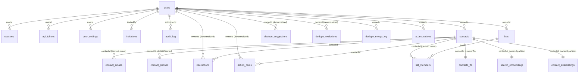
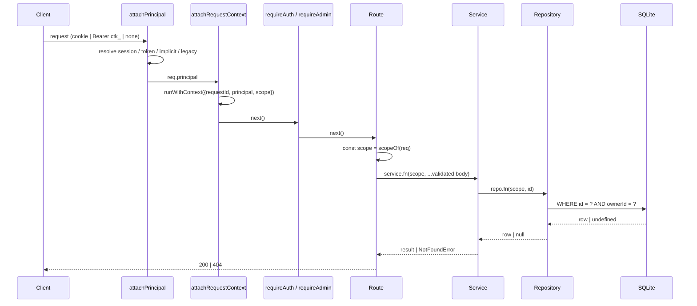

# 03. Target Architecture

This document states the architecture decisions for multi-tenant Contrack. Every
phase document refers back to the names and rules defined here. Read this
document before any phase document.

The plan uses the word **owner** for the tenant. One owner is one row in the
`users` table. One owner has one private CRM. Nothing is shared between owners
in this plan. See [11-future.md](11-future.md) for shared workspaces.

---

## 1. Decision summary

| # | Decision | Choice | Why |
| - | -------- | ------ | --- |
| D1 | Tenancy model | Shared database, shared schema, `ownerId` discriminator column | One SQLite file. No cross-database joins. The `ownerId` column already exists on four tables. |
| D2 | Tenant unit | `ownerId` = `users.id` (one owner per user) | Simplest model. Upgradable to workspaces later without a data migration (see section 12). |
| D3 | Always an owner | Every row has a non-null `ownerId`. Auth-off mode uses an implicit **local owner account** | Removes `ownerId IS NULL` from every query. One query shape, one index shape. |
| D4 | Enforcement | Explicit `Scope` parameter at the repository and service boundary, plus an `AsyncLocalStorage` request context for attribution | A forgotten `WHERE ownerId = ?` must be a compile error or a failing test, never a silent leak. |
| D5 | Denormalization | Add `ownerId` to `interactions`, `action_items`, `dedupe_suggestions`, `dedupe_exclusions`. Keep the ten `contact_*` child tables derived. | Those four tables are queried without starting from a contact. The ten child tables are only read through a contact id. |
| D6 | Full-text search | Add two indexed token columns to `contacts_fts`, `ownerTok` and `cidTok`, both with BM25 weight 0. Query with `ownerTok:<token> AND (<query>)`. Triggers delete with `cidTok:<token>` | FTS5 intersects posting lists in the index. No post-filter, no JOIN. The contact token turns the trigger delete from a table scan into an index probe (measured 400 times faster). |
| D7 | Vector search | Rebuild both `vec0` tables with `ownerId TEXT PARTITION KEY` | KNN scans only the owner's partition. Correct top-k for small owners. |
| D8 | Indexes | Composite indexes that lead with `ownerId` on every owned table | The owner column is the most selective predicate on a multi-owner instance. |
| D9 | Cross-owner access | Return `404 NOT_FOUND`, never `403` | A `403` confirms the row exists. `404` gives no information. |
| D10 | Admin data visibility | An admin manages accounts. An admin cannot read a member's contacts. | Personal CRM. Privacy is a core belief in `.agent/PHILOSOPHY.md`. |
| D11 | Machine credentials | Per-user API tokens, hashed at rest. The env `API_TOKEN` maps to the primary admin and is deprecated. | A shared secret has no owner, so it cannot scope a query. |
| D12 | Settings | `app_settings` stays instance-level and admin-only for writes. New `user_settings` table for per-user values. | AI provider keys are paid by the operator. Preferences belong to the person. |
| D13 | Background work | One process, one writer. Global concurrency locks stay. Job **state** becomes per-owner. | SQLite has one writer. Provider rate limits are per API key, which is instance-level. |
| D14 | Uploads | Per-owner directory `uploads/u/<ownerId>/`. An ownership guard runs before `express.static`. | Static serving stays fast. The guard is a string compare with no database read. |
| D15 | Version | Ship as `2.0.0` | The `API_TOKEN` principal changes meaning. That is a breaking change for scripts. |

---

## 2. Why shared schema with a discriminator column

Three models exist for multi-tenancy:

1. **Database per tenant.** Each owner gets a SQLite file. Isolation is perfect. Cost: N open connections, N sets of prepared statements, N FTS indexes, N vector stores, N embedding backfills, N backup files, and no cross-owner admin queries. The background jobs in `server.ts` would loop over N databases. `better-sqlite3` is synchronous, so N databases means N times the boot work on one thread.
2. **Schema per tenant.** SQLite has no schemas. `ATTACH DATABASE` is limited to 10 databases by default and 125 at compile time. This model does not fit.
3. **Shared schema with a discriminator column.** One file, one connection, one set of prepared statements. Isolation is enforced in application code. This is the model the codebase already started with `ownerId`.

The user asked for one database. Model 3 is the only model that keeps one file and stays fast on one thread. The cost of model 3 is discipline. Section 5 turns that discipline into structure.

---

## 3. Data model at a glance



### 3.1 Table classes

| Class | Tables | Rule |
| ----- | ------ | ---- |
| **Owned** (carry `ownerId`) | `contacts`, `lists`, `interactions`, `action_items`, `dedupe_suggestions`, `dedupe_exclusions`, `dedupe_merge_log`, `ai_invocations` | Every read filters on `ownerId`. Every insert sets `ownerId`. |
| **Derived** (owner through a parent) | `contact_emails`, `contact_phones`, `contact_addresses`, `contact_social_links`, `contact_education`, `contact_experience`, `contact_sources`, `contact_tags`, `contact_interests`, `contact_attributes`, `interaction_mentions`, `list_members`, `dedupe_embedding_meta` | Read only through a parent id that was already owner-checked. Never queried by a user-supplied id alone. |
| **Virtual** | `contacts_fts` (`ownerTok` column), `search_embeddings` and `contact_embeddings` (`ownerId PARTITION KEY`) | Filter inside the virtual table, not after it. |
| **Identity** | `users`, `sessions`, `api_tokens`, `invitations`, `user_settings`, `audit_log` | Keyed by `userId`. Admin endpoints read across users. |
| **Instance** | `app_settings`, `__drizzle_migrations`, geocode cache | No owner. Admin writes. |

The complete DDL is in [04-data-model-and-migration.md](04-data-model-and-migration.md).

### 3.2 Why `interactions` and `action_items` get their own `ownerId`

The current schema comment argues that a child table should derive its owner
through the foreign key. That argument holds for the ten `contact_*` tables.
Every read of those tables starts from a contact id that the caller already
loaded. See `contactRepository.hydrate` and `hydrateMany`.

It does not hold for these four tables. Each of them has queries that start
from the table itself:

| Table | Queries that do not start from a contact |
| ----- | ---------------------------------------- |
| `interactions` | `mcpService.getGlobalTimeline`, `mcpService.searchInteractions`, dashboard interaction velocity and recent activity (`dashboardService.ts:80`, `:168-178`), the mention graph in `loadNegativeConstraints` |
| `action_items` | `actionItemService.getAllPending`, `getRecentlyCompleted`, `getUrgentCount`, the Pulse swimlane |
| `dedupe_suggestions` | `getPendingSuggestions`, `getPendingCount`, `getPendingClusterCount`, the sidebar badge |
| `dedupe_exclusions` | `loadNegativeConstraints` loads the full table into a `Set` for every scan |

Without a column, each of those queries needs `JOIN contacts c ON c.id = x.contactId WHERE c.ownerId = ?`. The join is cheap per row, but the planner then has two paths and neither path has a covering index. With the column, each query is `WHERE ownerId = ? AND ...` on a composite index. The column costs 36 bytes per row. Drift is prevented by triggers (section 4 of the data model document).

---

## 4. Identity and principals

### 4.1 The principal

Every request that passes `requireAuth` carries a user. The `anonymous` and
`service` principal kinds are removed.

```ts
// server/middleware/auth.ts
export type Principal =
  | { kind: "user"; user: User; via: "session"; sessionId: string }
  | { kind: "user"; user: User; via: "token"; tokenId: string }
  | { kind: "user"; user: User; via: "implicit" }
  | { kind: "user"; user: User; via: "legacy-env-token" };
```

| `via` | Source | Can change password or manage sessions | Notes |
| ----- | ------ | -------------------------------------- | ----- |
| `session` | Cookie `contrack_session` | Yes | Unchanged behavior. |
| `token` | `Authorization: Bearer ctk_...` | No (`403 SESSION_REQUIRED`) | Per-user token from the `api_tokens` table. |
| `implicit` | Auth is off | No | The local owner account. See 4.2. |
| `legacy-env-token` | `Authorization: Bearer <API_TOKEN>` | No | Maps to the primary admin. Deprecated. Logged once at boot. |

Three gates replace the current two:

| Gate | Passes when | Failure |
| ---- | ----------- | ------- |
| `requireAuth` | `req.principal` is set | `401 UNAUTHORIZED` |
| `requireSession` (renamed from `requireUser`) | `via === "session"` | `403 SESSION_REQUIRED` (was `USER_REQUIRED`, a documented breaking change; seven call sites in `server/routes/auth.ts`) |
| `requireAdmin` (new) | `user.role === "admin"` | `403 ADMIN_REQUIRED` |

A disabled account (`users.status = 'disabled'`) fails at sign-in with `403 ACCOUNT_DISABLED`. `resolveSession` and token lookup also reject a disabled user, so disabling an account ends its live sessions on the next request.

### 4.2 The local owner account (auth off)

Today, auth-off mode has zero users and every row has `ownerId = NULL`. The
boot reconcile claims those rows only when exactly one account exists. That
model cannot survive a second user.

The plan replaces `NULL` with an implicit account:

- On boot, if `users` is empty, the server inserts one row: `username = 'local'`, `email = 'local@contrack.local'`, `role = 'admin'`, `credentialState = 'none'`, `passwordHash = 'none$'`. The hash never verifies because `parseHash` rejects the algorithm. Nobody can sign in as this account.
- The boot reconcile assigns every `NULL` owner row to this account. It runs on every boot. It is idempotent.
- With `AUTH_REQUIRED=false`, `attachPrincipal` sets `{ kind: "user", user: localOwner, via: "implicit" }` for a request with no credential.
- The first-run setup screen becomes "secure this instance". `POST /api/auth/setup` **converts** the local owner account: it sets email, username, password, and `credentialState = 'password'`. Ownership does not move. `existingContacts` still counts what the account owns.
- Rule: **auth-off mode is valid only while the local owner is the only account.** If `AUTH_REQUIRED=false` and a second account exists, the server logs an error at boot and behaves as if `AUTH_REQUIRED=true`. This removes the ambiguity of "who is the anonymous caller".

Result: every row has an owner at all times. Every query is `WHERE ownerId = ?`. No query has an `IS NULL` branch.

### 4.3 Roles

Two roles: `admin` and `member`. This is enough for a self-hosted personal CRM.
The `role` column already exists.

| Capability | member | admin |
| ---------- | ------ | ----- |
| Own contacts, lists, interactions, search, dedupe, AI features | Yes | Yes |
| Own profile, password, sessions, API tokens, per-user settings | Yes | Yes |
| Own AI usage stats | Yes | Yes (plus instance totals) |
| Export own data | Yes | Yes |
| Read another user's contacts | No | **No** (D10) |
| Create, invite, disable, delete users. Change roles. Reset passwords. | No | Yes |
| Instance settings: AI providers, capabilities, custom endpoints, SearXNG, session policy, registration | No | Yes |
| Backups (list, create) | No | Yes |
| Audit log | No | Yes |
| Export another user's data (as a file, for offboarding) | No | Yes, logged in the audit log |

Last-admin protection: the server refuses to demote, disable, or delete the last active admin. `409 LAST_ADMIN`.

### 4.4 Per-user API tokens

```
ctk_<43 chars base64url>         format shown once at creation
api_tokens.tokenHash = sha256(token)   stored
api_tokens.tokenPrefix = first 12 chars  shown in lists for identification
```

- `attachPrincipal` checks `Bearer ctk_` first. It hashes the presented token and looks it up by `tokenHash` (unique index, one probe). It rejects revoked, expired, or disabled-user tokens.
- A token acts as its user for every scoped endpoint. It cannot call `requireSession` endpoints.
- `lastUsedAt` is updated at most once per hour, same pattern as `sessions.lastSeenAt`.
- Endpoints: `GET /api/auth/tokens`, `POST /api/auth/tokens`, `DELETE /api/auth/tokens/:id`. All need `requireSession`.
- The env `API_TOKEN` keeps working. It resolves to the **primary admin** (the admin with the earliest `createdAt`). A warning is logged once at boot: "API_TOKEN is deprecated. Create a personal token in Settings → Account → API tokens." It is removed in a later major version.

---

## 5. Scope: how isolation is enforced

### 5.1 The `Scope` type

```ts
// server/tenancy/scope.ts
declare const ownerIdBrand: unique symbol;
export type OwnerId = string & { readonly [ownerIdBrand]: true };

export interface Scope {
  readonly ownerId: OwnerId;
}

/** The only constructors. Nothing else may build a Scope. */
export function scopeOf(req: Request): Scope;          // throws 401 when no principal
export function scopeForUser(user: User): Scope;
export function scopeForOwnerId(id: string): Scope;    // background jobs only
```

Rules:

1. Every repository function that reads or writes an owned table takes `scope: Scope` as its **first** parameter. The type system rejects a call without it.
2. Every service function that a route calls takes `scope: Scope` first. Routes call `scopeOf(req)` once and pass it down.
3. A function that receives a user-supplied id **and** a scope must put both in the same SQL statement: `WHERE id = ? AND ownerId = ?`. It must not select by id and compare in JavaScript. One statement is one index probe. Two statements are two probes and a race.
4. Derived tables are read only through a parent id that came from a scoped statement in the same call. This is the only place a query without `ownerId` is allowed on user data.
5. A repository never accepts a raw `ownerId: string`. It accepts a `Scope`. The brand prevents passing a contact id or a session id by mistake.

### 5.2 Request context (`AsyncLocalStorage`)

Some code is too deep to thread a `Scope` through. The 25 `recordInvocation`
call sites in the AI layer are the clearest case. The cache key builders in
`aiCache` are another.

```ts
// server/tenancy/requestContext.ts
export interface RequestContext {
  requestId: string;
  principal: Principal | null;
  scope: Scope | null;
}
export function runWithContext<T>(ctx: RequestContext, fn: () => T): T;
export function getContext(): RequestContext | null;
export function currentScope(): Scope;   // throws AppError 500 NO_SCOPE when absent
```

- Middleware `attachRequestContext` runs directly after `attachPrincipal` in `server/app.ts`. It wraps `next()` in `runWithContext`.
- Background jobs call `runWithContext({ scope: scopeForOwnerId(id), principal: null, requestId: "job-..." }, fn)` per owner.
- The context is for **attribution and defaults**: AI invocation logging, cache key prefixes, log lines, per-user rate limits. It is **not** the primary isolation mechanism. The explicit `Scope` parameter is. A repository must not read the context to find its owner. This keeps repositories testable and keeps the leak surface visible in signatures.

The overhead of `AsyncLocalStorage` is microseconds per request. One published HTTP benchmark puts the throughput cost at 7 to 10 percent for a router-bound workload; this app is bound by SQLite and AI calls, and the Phase 0 baseline measures the real number.

One rule that the review verified by test: an `EventEmitter` listener runs in the context of the code that calls `emit`, not the code that subscribed. The dedupe and AI Search SSE handlers subscribe to a queue that emits from a background job, so inside those listeners `currentScope()` returns the job's scope or `null`. Every SSE and NDJSON handler captures `const scope = scopeOf(req)` in its closure before it subscribes and never reads the context inside a listener.

### 5.3 Three structural guards

Discipline fails at scale. The plan adds three guards that fail a build or a
test run, not a code review.

1. **Tenant lint** (`scripts/tenant-lint.mjs`, wired into `npm run lint`). It scans every template literal and string in `server/**` that contains `FROM <owned table>`, `UPDATE <owned table>`, or `DELETE FROM <owned table>`. It fails when the same statement does not contain `ownerId`. An allowlist comment `// tenant-lint: allow <reason>` on the line above permits an exception. Exceptions are for: boot migrations in `server/db.ts`, the claim routine, admin cross-user reports, and derived-table reads by parent id.
2. **Route manifest test** (`tests/integration/tenancy.routeManifest.test.ts`). The test lists every `method + path` the app registers. Each entry must appear in `server/tenancy/routeManifest.ts` with a class: `scoped`, `admin`, `session-self`, `public`, or `instance-read`. A new route that is not classified fails the test. The manifest is the single list a reviewer reads. Express 5's router does not store mount path strings (see Phase 0 task 0.3), so the test records mount paths by wrapping `use` while `createApp()` runs, then walks `app.router.stack`.
3. **Cross-owner matrix test** (`tests/integration/tenancy.isolation.test.ts`). Two users, each with seeded contacts, lists, interactions, action items, suggestions, and uploads. For every `scoped` route in the manifest, user B calls it with user A's ids and expects `404`. Every list endpoint is asserted to contain zero rows of user A. Search, vector search, dedupe scan, dashboard, zero-state, export, and MCP are asserted the same way.

Together these three make a leak a red CI run.

### 5.4 Error semantics

| Situation | Status | `code` |
| --------- | ------ | ------ |
| Row belongs to another owner, or does not exist | 404 | `NOT_FOUND` |
| Endpoint needs admin | 403 | `ADMIN_REQUIRED` |
| Endpoint needs a browser session, caller used a token | 403 | `SESSION_REQUIRED` |
| Account is disabled | 403 | `ACCOUNT_DISABLED` |
| Last active admin would be removed | 409 | `LAST_ADMIN` |
| Delete a user who still owns data without a data decision | 409 | `USER_HAS_DATA` |
| Programmer error: scoped code ran with no scope | 500 | `NO_SCOPE` |

`404` for cross-owner access is deliberate. See D9.

---

## 6. Search: FTS5 with an owner token

### 6.1 Design

`contacts_fts` gains one more **indexed** column, `ownerTok`, placed last.

```sql
CREATE VIRTUAL TABLE contacts_fts USING fts5(
  contactId UNINDEXED,
  name, company, role, headline, location, about, industry, extras, searchExpansion,
  ownerTok,
  prefix='2 3 4'
);
```

> **Corrected in Phase 1.** This section originally added a second column,
> `cidTok`, to make the trigger deletes indexed. PR #18 landed first and made
> them `WHERE rowid = old.rowid`, which FTS5 already pushes down, so `cidTok`
> would be a redundant column and measurably slower (46 ms against 40 ms for
> 1,000 updates over 5,000 contacts). It is not built. The data model
> document, section 5.5, has the numbers.

`ownerTok` is `'o' || replace(ownerId, '-', '')` and `cidTok` is
`'c' || replace(id, '-', '')`. The default `unicode61` tokenizer splits on
`-`, so a raw UUID becomes five tokens. Removing the hyphens and adding a
letter prefix produces one alphanumeric token, for example
`o3f2c1d0e9a84b7c8d6e5f4a3b2c1d0e9`. Verified with `fts5vocab`: the
33-character token is stored as one term.

Every FTS query becomes:

```
ownerTok:o3f2c1d0... AND ("original query" strategy)
```

Every trigger delete stays as PR #18 wrote it:

```sql
DELETE FROM contacts_fts WHERE rowid = old.rowid;
```

BM25 weights are positional and count every column, including `contactId
UNINDEXED` at position 0. The table has eleven columns, so the string has
eleven values, the last `0.0`. The exact string, and the decision about
the offset in today's nine-value string, are in the data model document,
section 5.4, and in the risks document, Q13. Ranking is unchanged by the two
token columns.

### 6.2 Why not an `UNINDEXED` column or a JOIN

FTS5's `xBestIndex` pushes down only `MATCH`, `rowid`, and `rank` constraints. A
`WHERE ownerId = ?` on an `UNINDEXED` column is evaluated by the SQLite core
after the virtual table returns each row. A `JOIN contacts` is the same cost
plus an index probe per row. Both are post-filters. For a common token across
50,000 contacts, both touch every match.

With an indexed token, FTS5 intersects the posting list for `o3f2c1d0...` with
the posting lists of the query tokens inside the index. Only the owner's
matches are produced. FTS5 evaluates `AND` as a leapfrog intersection, so
the cost is driven by the rarer side plus seeks into the owner's list. It
also keeps the three retry strategies in `hybridRetrieval.ftsRetrieval`
unchanged, because the owner clause wraps the strategy expression.

Measured in the review at 50,000 contacts, one owner of 5,000, `LIMIT 50`:
the indexed token answered in 1.0 to 2.7 ms p50, the `UNINDEXED` post-filter
in 5.0 to 11.3 ms, and a `JOIN contacts` in 10.7 to 22.2 ms. Today's
unfiltered query takes 3.3 to 8.4 ms, so the scoped query is faster than the
current one.

**The same rule applies to the trigger delete.**
`DELETE FROM contacts_fts WHERE contactId = ?` on an `UNINDEXED` column scans
the whole virtual table: 4 ms per firing at 40,000 rows. Every contact update
and every child-row insert or delete fired it once, which is what made the bulk
ownership claim and the owner purge take minutes in the benchmark. `rowid` is a
pushed-down constraint, so the deletes PR #18 wrote are index probes and the
cost is gone without a second token column.

### 6.3 What changes

- All eleven FTS triggers in `server/db.ts` (`contacts_ai`, `contacts_au`, `contacts_ad`, and the eight child-table triggers) write `ownerTok` and `cidTok`, and delete by `cidTok`. The bulk purge in Phase 3 can also delete an owner's index rows in one statement with `MATCH 'ownerTok:...'` (17 ms per 5,000 rows measured).
- `FTS_SCHEMA_VERSION` becomes `2`. The existing versioned rebuild gate drops and re-indexes on the first boot after upgrade.
- `searchService`, `hybridRetrieval.ftsRetrieval`, and the command palette instant search server handover pass the owner token.
- Helpers `ownerToken(scope)` and `contactToken(id)` in `server/tenancy/scope.ts` build the tokens. The FTS trigger SQL and the helpers must agree. A unit test pins both against SQLite's `replace()`.

---

## 7. Vector search: `vec0` partition keys

sqlite-vec `0.1.9` is installed. The binary in `node_modules` contains the
partition-key and metadata-column code paths. Partition keys were introduced
in sqlite-vec 0.1.6.

```sql
CREATE VIRTUAL TABLE search_embeddings USING vec0(
  contactId TEXT PRIMARY KEY,
  ownerId   TEXT PARTITION KEY,
  embedding FLOAT[384]
);

SELECT contactId, distance
FROM search_embeddings
WHERE embedding MATCH ? AND k = ? AND ownerId = ?
ORDER BY distance;
```

A partition key stores vectors in separate chunks per key. A KNN query with
`ownerId = ?` reads only that owner's chunks. This fixes two problems at once:

- **Correctness.** Today `findSearchNeighbors` fetches the global top `k` and then filters by `preFilterIds` in JavaScript. An owner with 200 contacts on an instance with 40,000 contacts would rarely appear in the global top 100. Their vector channel would return nothing.
- **Performance.** Brute-force KNN cost is linear in the rows scanned. Partitioning makes it linear in the owner's rows.

`contact_embeddings` (dedupe) gets the same shape. Both `upsert` transactions
insert `ownerId`. Both rebuild helpers (`rebuildSearchEmbeddingTable`,
`rebuildDedupeEmbeddingTable`) include the partition key. The migration copies
existing vectors instead of re-embedding, so no provider API calls are spent on
upgrade. See the data model document, section 6.

Verification at the start of Phase 1: `SELECT vec_version()` must be `>= 0.1.6`,
and a smoke test must create a partitioned table, insert two owners, and assert
a KNN with `ownerId = ?` returns only that owner's rows. The review ran that
smoke test on 0.1.9 (`bench/review-2026-09-08/01-vec-fts-smoke.cjs`) and it
passes. Measured at 50,000 vectors: partitioned KNN 1.0 ms p50, flat KNN
10.4 ms, and today's `k = 500` then JavaScript filter 23.5 ms. Of the global
top 100, only 4 rows belonged to the queried owner of 5,000, which is the
correctness problem above in numbers.

Rules that sqlite-vec 0.1.9 imposes on a partitioned table, all verified:

- `UPDATE` of the partition key column is refused. Owner reassignment of a vector is `DELETE` then `INSERT`. The `contacts_owner_propagate` trigger cannot touch `vec0`; a future reassign feature re-inserts the two vector rows in code.
- An `UPDATE` of any column whose `WHERE` contains `EXISTS` trips the same error (issue #261). Every upsert is `DELETE` then `INSERT`, which the search store already does.
- `ownerId IN (...)` is not supported. Query one owner per statement.
- `k` has a maximum of 4096.
- An `INSERT` that omits `ownerId` succeeds with a `NULL` partition and no error. The verification script counts `NULL` partitions.
- `ALTER TABLE ... RENAME` returns OK and breaks the table. Never rename a `vec0` table.
- The rebuild helpers `rebuildSearchEmbeddingTable` and `rebuildDedupeEmbeddingTable` emit the partition key from Phase 1 on, so a later model change keeps it.

---

## 8. Indexes

Every owned table gets composite indexes that lead with `ownerId`. The
single-column `idx_<table>_owner` indexes become redundant prefixes and are
dropped after `EXPLAIN QUERY PLAN` confirms the composites are used.

| Index | Serves |
| ----- | ------ |
| `contacts(ownerId, isGhost, isArchived, canonicalId)` | slim list, map, archived, dedupe corpus, hard-filter corpus |
| `contacts(ownerId, deletedAt)` | trash list, active gate |
| `contacts(ownerId, lastContactedAt)` | dashboard at-risk, temporal filters, MCP action items |
| `contacts(ownerId, addedAt)` | network growth, MCP default order |
| `contacts(ownerId, relationshipScore)` | health distribution |
| `contacts(ownerId, phoneticHash)` | dedupe phonetic blocking |
| `contacts(ownerId, canonicalId)` | soft-merge lookups |
| `interactions(ownerId, date)` | global timeline, velocity, MCP search |
| `action_items(ownerId, dueAt) WHERE completedAt IS NULL` | pending swimlane, urgent count |
| `action_items(ownerId, completedAt)` | recently completed |
| `lists(ownerId, sortOrder)` | list panel |
| `dedupe_suggestions(ownerId, status)` | pending list and counts |
| `dedupe_suggestions(ownerId, confidence DESC)` | ranked review queue |
| `dedupe_exclusions(ownerId)` | negative constraints per scan |
| `dedupe_merge_log(ownerId, mergedAt DESC)` | merge history |
| `ai_invocations(ownerId, createdAt DESC)` | AI stats feed |
| `api_tokens(tokenHash)` UNIQUE, `api_tokens(userId)` | bearer lookup, token list |
| `invitations(tokenHash)` UNIQUE | accept flow |
| `audit_log(createdAt DESC)`, `audit_log(actorUserId, createdAt DESC)` | admin views |

Existing per-contact indexes (`idx_contact_emails_contact` and the rest) stay.
Hydration by `contactId` does not need an owner column.

---

## 9. Shared in-process state

The server is one process. Several modules hold state in module scope. Each one
is classified below.

| State | File | Today | Plan |
| ----- | ---- | ----- | ---- |
| `aiCache` tiers `rerank`, `synthesis`, `dailyInsight`, `briefing` | `server/utils/aiCache.ts` | Keyed by query text or contact id. The `rerank` key is built in `aiCache.getCachedSearch` and `setCachedSearch`, called from seven sites in `searchService.ts`, not in `searchIntel.ts`. | Key prefix `${ownerId}::`. `dailyInsight` `maxEntries` 1 → 100. `invalidateForOwner(tier, ownerId)` uses the existing prefix match. `mergeEngine.invalidateSearchCache()` (`aiSearch/mergeEngine.ts:298`), which flushes the whole `rerank` tier today, becomes an owner-prefix invalidation. |
| `aiCache` tiers `queryParse`, `hyde`, `mentions` | same | Keyed by query text or a content hash of the note text | Unchanged. Pure functions of the input. Sharing is safe and saves AI calls. `mentions` stays shared on the condition in the risks document, Q14. |
| `dedupeQueue` | `server/services/dedupe/jobQueue.ts` | One global `processing` flag, one active scan | `Map<ownerId, scanId>` for active scans. A global run lock keeps one scan executing at a time. Others queue FIFO. Status and SSE are per owner. Scan ids are checked against the owner. |
| AI Search `jobQueue` | `server/services/aiSearch/jobQueue.ts` | One global lock, one global 5-minute cooldown | Per-owner cooldown. Global lock stays (provider rate limits are per API key). Batches carry `ownerId`. `getActiveBatches(ownerId)`. |
| Geocode cache and queue | `server/services/geocoding/` | Address → coordinates | Unchanged. An address is not user data. Sharing helps. |
| `settingsService` cache | `server/services/settingsService.ts` | Instance key → value | Unchanged for `app_settings`. A second cache for `user_settings` keyed `${userId}::${key}`. |
| `QuotaTracker`, `ParallelQueue` | `server/ai/routing/` | Per provider model | Unchanged. Keys are instance-level, so limits are instance-level. |
| Rate limiters | `server/middleware/rateLimit.ts` | Per IP. `aiEndpointRateLimit` mounts at `server/app.ts:142`, before `attachPrincipal` at `:170` and before `req.requestId` at `:145`. | Per IP stays for pre-auth routes. New per-user limiter on AI-cost routes keyed by `principal.user.id`, mounted after `attachPrincipal`. The request id moves above the AI limiter so a `429` carries one. |
| `_dedupeTimers` | `server/services/contactService.ts` | Per contact id | Unchanged. Contact ids are globally unique. |
| `relationshipService.recomputeAll` | `server/services/relationshipService.ts` | All contacts | Unchanged. Uniform work per row. No owner needed. |

---

## 10. Uploads

```
DATA_DIR/uploads/
  logos/                      shared, domain-keyed cache (unchanged)
  u/<ownerId>/avatars/        contact avatars
  u/<ownerId>/files/          interaction attachments
```

- `server/utils/paths.ts` adds `ownerUploadDir(scope, "avatars" | "files")`.
- Multer `destination` callbacks in `server/routes/contacts.ts` and `server/routes/interactions.ts` use the owner directory from `scopeOf(req)`.
- Stored URLs become `/uploads/u/<ownerId>/avatars/<file>` and `/uploads/u/<ownerId>/files/<file>`.
- A guard middleware runs on `/uploads` before `express.static`. For a path under `/uploads/u/<id>/`, it compares `<id>` with `principal.user.id` and returns `404` on mismatch. No database read. For `/uploads/logos/`, any authenticated principal passes. For any other `/uploads/` path, `404`.
- `resolveUploadPath` stays the containment check for every filesystem read and unlink. It is unchanged.
- The migration moves existing flat files into the owner directory of the contact that references them, and rewrites `avatarUrl` and `fileUrl`. See the data model document, section 7.

---

## 11. Settings

| Setting | Level | Who writes |
| ------- | ----- | ---------- |
| `ai.providerKeys`, `ai.customEndpoints`, `ai.capabilities`, `ai.modelCache`, `ai.searxng`, `ai.embeddingsState`, `ai.embeddingsState.dedupe` | instance (`app_settings`) | admin |
| `auth.sessionTtlDays` | instance | admin |
| `auth.registrationOpen` (new, default `false`) | instance | admin |
| Weather unit, list density, dedupe threshold preset | browser `localStorage` today | unchanged in this plan |
| Future per-user server settings | `user_settings` | the user |

`GET /api/settings/ai` stays readable by members so the UI can show which AI
capabilities are available. Provider keys are already redacted in that view.
Every write under `/api/settings/ai` requires `requireAdmin`.

---

## 12. Upgrade path to shared workspaces

This plan does not build sharing. It keeps the door open at zero cost:

- Later, add `workspaces(id, name)` and `workspace_members(workspaceId, userId, role)`.
- Create one personal workspace per user with `workspaces.id = users.id`.
- `ownerId` now means "workspace id". Every existing row already points at a valid workspace id without a data migration.
- `Scope` becomes `{ ownerId, actorUserId }`. Repositories do not change. Access checks move into `scopeOf(req)`, which resolves the workspace from the URL or a header.

This is why `Scope` is an object and not a bare string, and why nothing else is added now.

---

## 13. Request flow after the change



---

## 14. Canonical names

Phase documents use these names exactly.

| Name | Kind | Location |
| ---- | ---- | -------- |
| `Scope`, `OwnerId`, `scopeOf`, `scopeForUser`, `scopeForOwnerId`, `ownerToken`, `contactToken` | types and functions | `server/tenancy/scope.ts` |
| `RequestContext`, `runWithContext`, `getContext`, `currentScope` | functions | `server/tenancy/requestContext.ts` |
| `attachRequestContext` | middleware | `server/tenancy/requestContext.ts` |
| `requireAdmin`, `requireSession` | middleware | `server/middleware/auth.ts` |
| `ROUTE_MANIFEST` | const | `server/tenancy/routeManifest.ts` |
| `OWNED_TABLES` (extended) | const | `server/db.ts` |
| `ensureLocalOwner`, `primaryAdminId`, `claimUnownedData` | functions, raw SQL, exported | `server/db.ts` (not `authService`: `authService` imports from `db.ts`, so the reverse import is a cycle) |
| `reconcileOwnership` (rewritten), `convertLocalOwner` | functions | `server/services/authService.ts` |
| `adminService` | service | `server/services/adminService.ts` |
| `apiTokenService` | service | `server/services/apiTokenService.ts` |
| `invitationService` | service | `server/services/invitationService.ts` |
| `auditService` | service | `server/services/auditService.ts` |
| `userSettingsService` | service | `server/services/userSettingsService.ts` |
| `ownerUploadDir`, `guardUploads` | function, middleware | `server/utils/paths.ts`, `server/middleware/uploads.ts` |
| `tenant-lint` | script | `scripts/tenant-lint.mjs` |
| `bench-tenancy` | script | `scripts/bench-tenancy.ts` |
| `TENANCY_SCHEMA_VERSION` | const | `server/db.ts` (stored in `app_settings` under `schema.tenancy`; `PRAGMA user_version` belongs to the FTS gate, see data model doc §1.1) |
