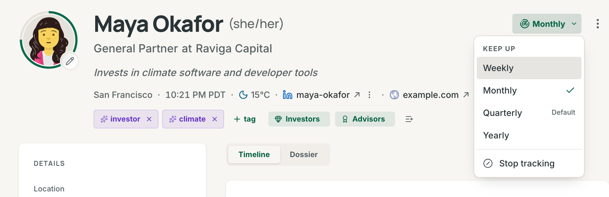
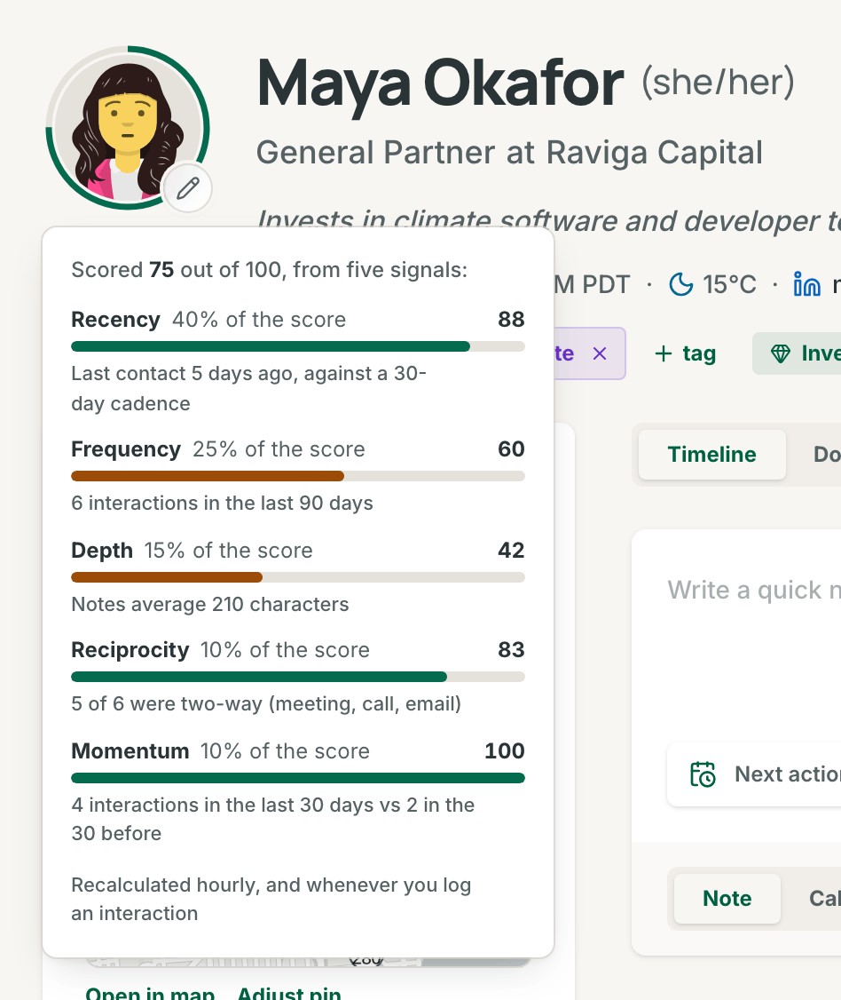
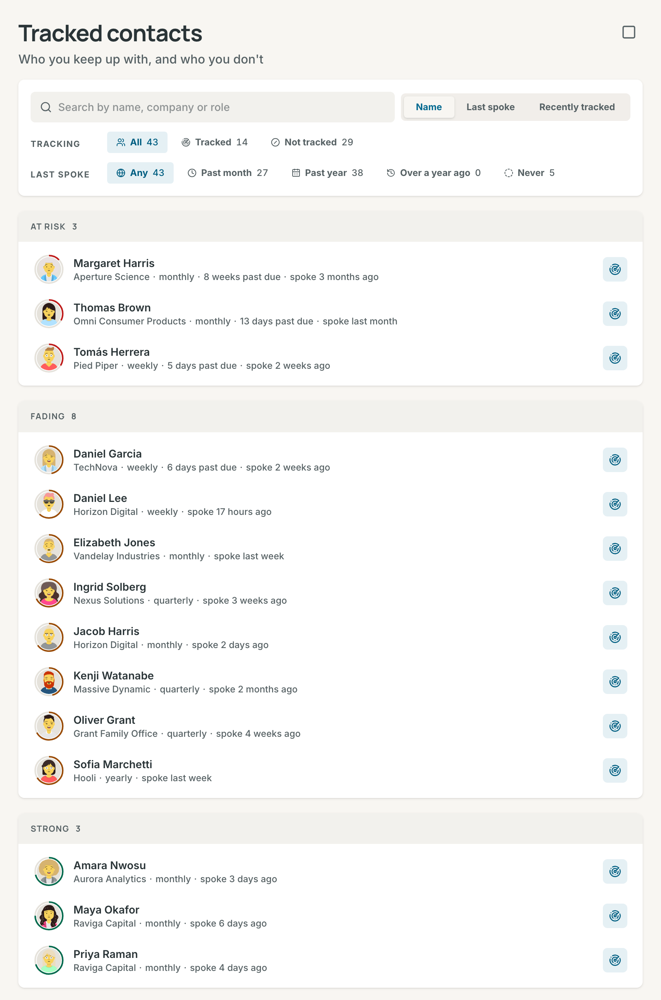

# Pulse and tracking

Pulse is your daily page. It shows the follow-ups that are due, the tracked people you need to catch up with, and the state of your network. Tracking decides who Pulse and the relationship score are about.

## What tracking means

Track a contact when you want to keep up with that person. A tracked contact gets a cadence, which says how often you want to be in touch. It also gets a relationship score and a ring around its picture.

- **Track** is the action and **Tracked** is the state. **Untrack** is the reverse, and everybody else is **Not tracked**.
- A contact from an import or a connector always starts not tracked.
- A contact you add by hand starts tracked only when **Track new contacts** is on (see [Tracking settings](#tracking-settings)).
- A ghost cannot be tracked. Promote it to a contact first (see [Ghosts](contacts.md#ghosts)).
- When a tracked contact goes past its cadence, Pulse lists it under **Catch up**.

## Track a contact

1. Open the contact.
2. Select **Track** in the header, beside the actions menu.
3. In the **Keep up** menu, choose **Weekly**, **Monthly**, **Quarterly** or **Yearly**.

The ring appears around the picture. A toast says, for example, "Tracking Ada Lovelace, quarterly" and offers **Undo**. In the menu, your default cadence carries the hint "Default".

### Change the cadence or stop tracking

On a tracked contact, the button shows the cadence, for example **Quarterly**. Open it and choose another cadence. The current cadence has a check mark.

To stop, choose **Stop tracking** at the end of the menu. The ring goes away, and the toast "Stopped tracking Ada Lovelace" offers **Undo**. **Undo** tracks the contact again at the cadence it had.

A contact can have a cadence that is not one of the four, for example one set through the API. The menu then shows it as one more checked row, such as **Every 2 months**. The button shows it in short, as "2 months".

In the narrow layout of the contact page, for example on a phone, the button shows only its icon. The cadence is then in its name and its tooltip.

### Track with the T key

On a contact page, press `T` to track or untrack the contact. The key tracks at your **Default cadence**, with the same toast and **Undo**. `T` is a single-key shortcut, so the **Single-key shortcuts** switch in **Settings → Keyboard** turns it off.

### Track many contacts at once

- **Network list.** Select **Select**, choose the contacts, and select **Track** in the bar at the bottom. The button reads **Untrack** when every selected contact is tracked. See [The Network list](contacts.md#the-network-list).
- **Map.** Select people by area and use the same bar. See [Select contacts on the map](map.md#select-contacts-on-the-map).
- **Tracked contacts page.** Use its select mode (see [Change many at once](#change-many-at-once)).
- **Command palette.** Press `→` on a result, then `T` (see [Command palette](search.md#command-palette)).

**Track** changes only the selected contacts that are not tracked yet. It keeps the cadence of the others. The toast names the count, for example "Tracking 12 contacts", and offers **Undo**. When you undo an **Untrack**, the contacts come back at your default cadence.

The **Tracked** chip on the Network list shows only the people you track, with their count. To group them and change tracking in bulk, open the [Tracked contacts](#tracked-contacts) page.

### Tracking settings

Open **Settings → Network and contacts**.

| Setting                | What it does                                                                                                                                                                                       | Default   |
| ---------------------- | -------------------------------------------------------------------------------------------------------------------------------------------------------------------------------------------------- | --------- |
| **Default cadence**    | The cadence a contact gets when you track it without choosing one: with the `T` key, the bulk bar, the palette, or the toggle on the Tracked contacts page. Each contact can have its own cadence. | Quarterly |
| **Track new contacts** | Contacts you add by hand start tracked. Imports and connectors never do.                                                                                                                           | Off       |

## How the score works

The relationship score is a number from 0 to 100. Only tracked contacts have one. The ring around the picture shows it:

- The length of the arc is the score. A score of 72 fills 72 percent of the ring, clockwise from the top.
- The colour of the arc is the band.

| Band        | Score     | Colour |
| ----------- | --------- | ------ |
| **Strong**  | 70 to 100 | Green  |
| **Fading**  | 40 to 69  | Amber  |
| **At risk** | 0 to 39   | Red    |

- A contact that nobody tracks has no ring. The picture fills the whole circle.
- A tracked contact with no logged interaction shows an empty ring. Its tooltip says "No interactions yet".
- Colour is never the only sign. The tooltip says the score in words, for example "Score 72, strong".

### See why a contact has its score

1. Open a tracked contact that has a score.
2. Select the ring around the picture.
3. Read the panel. It says, for example, "Scored 72 out of 100, from five signals", and it lists each signal with its share and what it measured.

A pinned card on the Map opens the same panel from its score chip.

| Signal          | Share | What it measures                                                                                                                                                                                          |
| --------------- | ----- | --------------------------------------------------------------------------------------------------------------------------------------------------------------------------------------------------------- |
| **Recency**     | 40%   | The days since your last interaction, against the contact's cadence. It is high soon after you talk, half on the day the cadence runs out, and under 10 a month after that. With no interaction, it is 0. |
| **Frequency**   | 25%   | The interactions in the last 90 days. Ten or more give full marks.                                                                                                                                        |
| **Depth**       | 15%   | The average length of your notes in the last 90 days. 500 characters or more give full marks.                                                                                                             |
| **Reciprocity** | 10%   | The share of meetings, calls and emails among the interactions of the last 90 days. With nothing in that time, it counts as half.                                                                         |
| **Momentum**    | 10%   | The interactions in the last 30 days against the 30 days before. A rise of a fifth or more gives full marks. Half as much activity, or none at all, gives nothing.                                        |

Interactions from imports and connectors count too. Contrack calculates the score again when you log an interaction, every hour for contacts that changed, and every day for all tracked contacts.

## The Pulse page

Open **Pulse** in the sidebar, or press `Cmd+Shift+P` (`Ctrl+Alt+P` on Windows and Linux). To open Contrack on Pulse, set **Where Contrack opens** to **Pulse** in **Settings → Network and contacts**.

### The top of the page

The title shows today's date. Under it, one line sums up the day, for example "2 overdue · 2 due today · 3 birthdays this week · 12 days in a row".

- The line says "Nothing due today" when no follow-up is due but the queue holds other rows. It says "All caught up" when the queue is empty.
- "12 days in a row" is your streak: the days in a row on which you logged at least one interaction yourself. Imports and connectors do not count. The streak shows from two days.
- On a wider screen, each count is a link to its group in **Up next**.

**Log note** opens the **Log an interaction** dialog. **More** holds **New contact** and **Customize layout**.

With no contacts yet, Pulse shows **Welcome to Pulse** with four first steps: **Import contacts**, **Log your first note**, **Connect AI** and **Connect a calendar**.

### Up next

**Up next** ranks everything that needs you, in five groups:

| Group         | What it holds                                                        | The chip says           |
| ------------- | -------------------------------------------------------------------- | ----------------------- |
| **Overdue**   | Follow-ups whose due day has passed, the oldest first                | "3 days overdue"        |
| **Today**     | Follow-ups due today                                                 | "Today"                 |
| **This week** | Follow-ups due in the next seven days                                | "Tomorrow", "Wednesday" |
| **Birthdays** | Birthdays in the next seven days                                     | "Today", "Friday"       |
| **Catch up**  | Tracked contacts past their cadence, the furthest first, ten at most | "3 weeks past due"      |

The **Catch up** clock starts at your last interaction with the contact. With nothing logged, it starts on the day you tracked the contact. When more than ten contacts are past due, the heading shows the total, for example "10 of 14".

Each row shows the name, the chip, what to do, and "Last spoke 12 days ago" when Contrack knows it. Select a row to open the contact. The round button at the start of the row does the row's job:

- On a follow-up, the check marks it done.
- On a birthday ("Wish Ada Lovelace a happy birthday"), the cake opens a note to log.
- On a catch-up ("Check in with Ada Lovelace"), the button opens a note to log.

A follow-up row also has a snooze button. It opens **Snooze until** with **Tomorrow**, **In 3 days**, **Next week** and **Next month**. A toast says the new day, for example "Follow-up snoozed to Thursday, Oct 8", and **Undo** puts the old date back. On a computer, the button shows when you point at the row or focus it. On a touch screen, it always shows. Birthday and catch-up rows have no snooze.

On a wider screen, **Up next** scrolls inside its card. On a phone or a narrow window, it shows its first eight rows and **Show all**, so the other cards are not far down the page. When the queue is empty, it says "Nothing due today" and offers **Log note**. To add follow-ups, see [Follow-ups](contacts.md#follow-ups).

### Work through Up next with the keyboard

| Key | What it does               |
| --- | -------------------------- |
| `J` | Next item in Up next       |
| `K` | Previous item in Up next   |
| `D` | Mark item done             |
| `S` | Snooze item until tomorrow |
| `L` | Log note for contact       |
| `C` | Toggle customize layout    |

The first press of `J`, `K`, `D`, `S` or `L` only shows which row is highlighted. It does nothing else, so `D` never completes a row you cannot see. `D` and `S` work on follow-up rows only.

`D`, or the check on a row, takes the follow-up out of the queue at once. The toast "Follow-up done" offers **Undo** for 10 seconds, and the follow-up is marked done when the toast closes.

You can also press `Tab` to move into the list. The list is one `Tab` stop. Then:

- `↑`/`↓` move between items in Up next.
- `Enter` opens the highlighted contact.
- `Space` does the row's action. It completes a follow-up, or it opens a note for a birthday or a catch-up.
- `Tab` goes to the highlighted row's check, its name and its snooze, and then out of the list.

The letter keys do nothing while a dialog or a menu is open, or while you type in a field. The **Single-key shortcuts** switch in **Settings → Keyboard** turns them off. See [Keyboard shortcuts](keyboard-shortcuts.md).

### Completed

The **Completed** line says "Nothing completed yet", or for example "3 completed recently". **Show** lists your last 50 completed follow-ups: each title struck through, the contact, and when you finished it. **Hide** closes the list.

### The cards

**Keeping up** shows the people you track. A bar splits them into **Strong**, **Fading**, **At risk** and **No interactions yet**, and each part of the legend opens that group on the Tracked contacts page. The large number says how many are within their cadence, for example "31 of 42 within cadence". When anybody is past cadence, **11 to catch up** jumps to **Catch up**. After four weeks of weekly score records, **Rising** and **Cooling** each show up to three tracked contacts whose score moved by 3 or more in four weeks. **Manage** opens the Tracked contacts page. With no one tracked, the card says "No one is tracked yet" and offers **Choose people**.

**Activity** shows the last 12 weeks as squares, one for each day. A stronger colour means more interactions. The columns start on the day that **Week starts on** sets in **Settings → Network and contacts**. Point at a square, or tap it, to read the day, for example "Wed, Sep 17: 2 notes, 1 call". Under the squares, a line shows the weekly totals, the last four weeks against the four before, and this week by type.

**Daily insight** shows one observation that AI writes about your network. AI writes a new one each day, and again after your contacts change. Without an insight, the card says why. With no Fast model set up, an admin reads "Set up a Fast model to get one" and a member reads "Your admin has not set up AI yet". When the provider fails, the card reads "Could not write today's insight" and offers **Try again**. An account with AI off reads "AI is off for your account". See [Connect a provider](ai.md#connect-a-provider).

**Inbox** lists clean-up jobs. Each row opens the place where you do the job:

- "6 new this month, 2 untracked" opens the Network list at `added:<30d tracked:no`, the untracked people added in the last 30 days.
- "Review 3 possible duplicates" opens **Possible duplicates**.
- "2 contacts have stale data" opens the contacts that nobody updated in six months (`updated:>6m`).
- "1 person is mentioned but not in your network" shows the names of the ghosts. Each name opens the ghost.
- "4 without a company", "2 without a location" and "1 without an email" open the list at `missing:company`, `missing:location` and `missing:email`.
- "5 people you talk to are not contacts" opens **Correspondents** (see [Connectors](import-and-sync.md#connectors)).

With nothing to do, the card says "Nothing to clean up".

**Coming up** lists the birthdays eight to fourteen days away and the meetings in the next seven days from a connected calendar, in date order. Each row has a chip such as "Tomorrow", "Thursday" or "In 10 days". A birthday row says, for example, "Turns 34". A meeting row shows its title, its time and the people in it. An all-day event shows its day and "all day". With nothing to show, the card says "Nothing coming up". When no calendar is connected, it also offers **Connect a calendar**.

**Composition** is a ring chart of your network by **Industry**, **Role** or **Location**. It shows the six largest groups and **Other**. Each group opens the Network list filtered to it. **See all** or **Other** opens **Network composition** with every group.

### Customize the layout

1. Open **More** and choose **Customize layout**, or press `C`. A bar with **Reset layout** and **Done** shows under the top line, and each column shows its name.
2. Move a card in one of three ways:
   - Drag it by its handle. On a phone, hold the handle for a moment, then drag.
   - Open the menu beside the eye and choose **Move up**, **Move down**, **Move to Focus column**, **Move to Network column** or **Move to Intelligence column**.
   - Focus the handle and press `Space` to lift the card. Move it with the arrow keys, and press `Space` again to put it down. `Esc` returns it to its old place.
3. To hide a card, select its eye button. A hidden card goes to the **Hidden cards** tray at the top. Select the eye in the tray to show the card again.
4. Select **Done**. **Reset layout** puts every card back in its first place, and its toast offers **Undo**.

Contrack saves your layout to your account, so it is the same on every device.

### Pulse on different screens

- On a wide screen, Pulse has three columns: the **Focus column** (Up next and Completed), the **Intelligence column** (Daily insight, Inbox, Coming up and Composition) and the **Network column** (Keeping up and Activity).
- On a medium screen, Focus and Network share the first row. The Intelligence cards sit two across under them.
- On a phone, the cards form one column in the order Focus, Network, Intelligence. The counts in the top line are plain text, not links.

## Tracked contacts

The **Tracked contacts** page lists everybody, grouped by the state of each relationship. Open it from **Settings → Tracked contacts** (under **Your data**), from **Manage** on the **Keeping up** card, or from **Manage** beside the **Tracked** chip on the Network list.

### Find people to track

- The search box finds contacts by name, company or role.
- **Tracking** shows **All**, **Tracked** or **Not tracked**.
- **Last spoke** reads the date of your last logged interaction. Its pills are **Any**, **Past month** (the last 30 days), **Past year** (the last 365 days), **Over a year ago** and **Never**.
- A contact shows when it matches both rows. Each pill shows how many contacts it would show with the choice in the other row.
- The order is **Name**, **Last spoke** or **Recently tracked**. **Name** runs from A to Z. **Last spoke** puts the newest first and never last. **Recently tracked** puts the newest first, and keeps the **Not tracked** group from A to Z.

Combine the two rows to find who to track next. **Not tracked** with **Past month** lists the people you spoke to this month and do not track yet.

The page keeps your choices in its address. The browser's Back button, and the Back button on a contact you opened from the list, return you to the same list.

### The groups

The groups come in this order: **At risk**, **Fading**, **Strong**, **No interactions yet** and **Not tracked**. The first four hold the tracked contacts by their band. An empty group is left out. Archived contacts and ghosts are not listed.

Each row shows the ring, the name and the company. It also shows the cadence ("quarterly"), how far past due the contact is ("3 weeks past due"), and when you last spoke ("spoke 3 weeks ago"). The button at the end of the row tracks the contact at your default cadence, or untracks it.

### Change many at once

1. Select **Select** in the page header.
2. Choose the contacts, or select **Select all** in a group heading.
3. Use the bar: **Track**, **Stop tracking**, or **Cadence** to give every selected contact one cadence.
4. Select **Done** to leave select mode.

The bar shows the same toasts with **Undo** as the Network list. A new filter clears the selection, so the bar never acts on a contact you cannot see.

With no one tracked, the page says "No one is tracked yet". With **Tracked** chosen, **Show people to track** switches to **Not tracked**. When the filters leave no one, **Clear filters** resets them.

## Possible duplicates

Pairs that may be the same person wait on the **Possible duplicates** page. The Inbox row "Review 3 possible duplicates" opens it. See [Review possible duplicates](duplicates.md#review-possible-duplicates).

## Automate it

Track a contact with `PATCH /api/contacts/:id` and the fields `isTracked` and `cadenceDays`. Read what Pulse shows with `GET /api/dashboard`. See the [REST API reference](api-reference.md#contacts).

## Related

- [Contacts](contacts.md#the-contact-page)
- [Search and Ask Contrack](search.md#facets)
- [Map](map.md#select-contacts-on-the-map)
- [Keyboard shortcuts](keyboard-shortcuts.md)
- [AI](ai.md)
