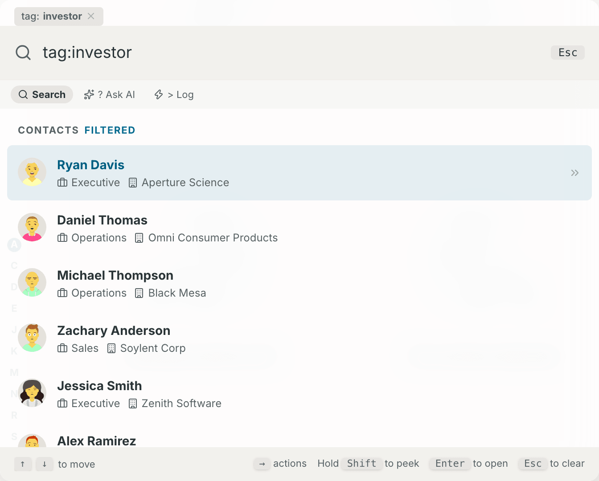
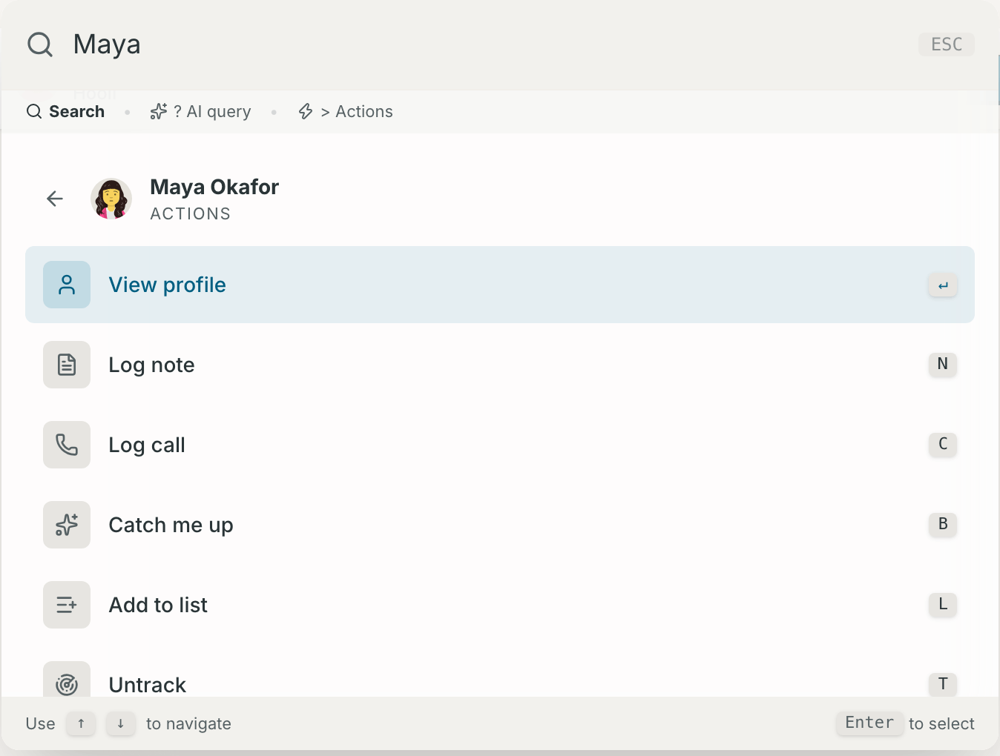
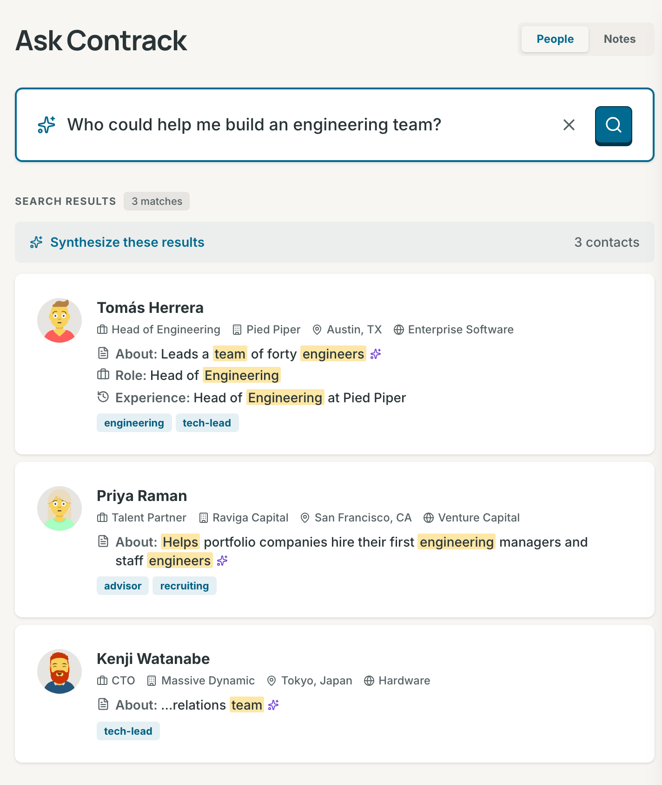
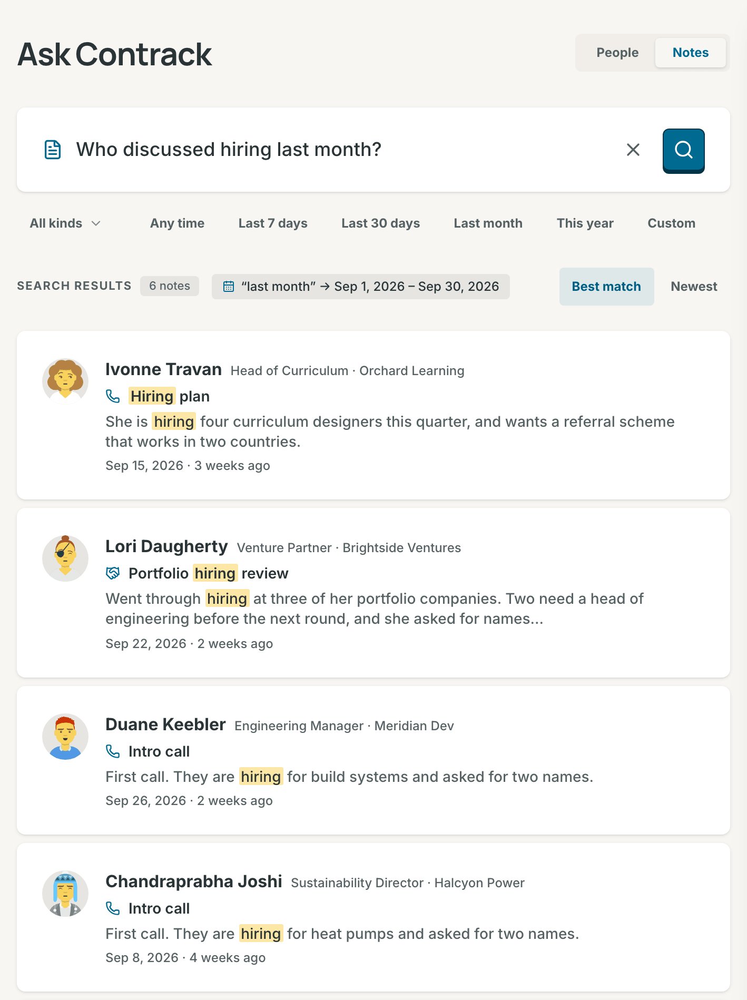
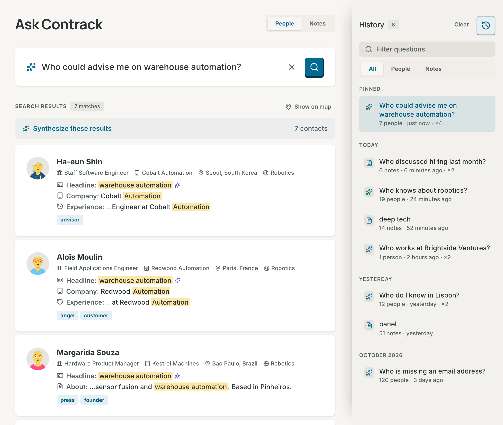

# Search and Ask Contrack

Contrack has three ways to find people: the search box on the Network list, the command palette, and the **Ask Contrack** page. Ask Contrack also searches what you wrote in your notes.



## Choose where to search

| Where                      | How to open it                                                                                     | Use it to                                           |
| -------------------------- | -------------------------------------------------------------------------------------------------- | --------------------------------------------------- |
| The **Network** search box | Select the box, or press `/` on the Network list                                                   | Narrow the list you are looking at                  |
| The command palette        | Press `Cmd+K` (`Ctrl+K` on Windows and Linux) on any page                                          | Jump to a person and act on them                    |
| **Ask Contrack**           | Select **Ask Contrack** in the sidebar, or press `Cmd+Shift+S` (`Ctrl+Alt+S` on Windows and Linux) | Ask a question in plain words, or search your notes |

All three read the same [facets](#facets), such as `tag:investor` or `tracked:no`.

## Search the Network list

Type in the search box at the top of the **Network** list. It matches names, companies, roles, locations, industries, tags, email addresses, phone numbers and street addresses. The best name matches come first, and an address ranks below every other field, so a street name finds a person without burying the people whose name or company matches, and the list shows the count, for example "12 matches".

The box reads facets too, except `near:`. The page address keeps your search, so the address `/?q=tracked:no` opens the list already filtered. See [The Network list](contacts.md#the-network-list).

## Command palette

Press `Cmd+K` on any page to open the palette. Press it again, or press `Esc`, to close it. The palette opens with an empty box each time. It opens only from the keyboard, so on a phone use the Network search box or Ask Contrack.

The first character you type sets the mode:

| You type           | Mode           | What happens                            |
| ------------------ | -------------- | --------------------------------------- |
| Words              | **Search**     | Contacts appear as you type             |
| `?` and a question | **? AI query** | Ask Contrack answers inside the palette |
| `>` and a command  | **> Actions**  | You log an interaction in one line      |

With `?` and nothing after it, the palette shows four questions drawn from the same pool as **Try asking** on the Ask Contrack page. Select one to ask it.

### Find a contact

Type part of a name, company, role, place, industry or tag. The first results come from your browser at once, marked "instant". A moment later, the server's keyword search replaces them. The server search also reads the headline, the about text, interests, email addresses, phone numbers and every address a contact has, at the lowest rank, and it finds:

- misspelled and sound-alike names, marked **Approximate**
- nicknames, so "Bob Castellanos" finds Robert Castellanos
- phone numbers in any common form, with or without the country code

Each result shows the name, a dot in the band colour for a tracked contact, the role and company, and how long ago you were last in touch. That time turns red after 60 days. A chip such as "7mo old" marks a contact that nobody has updated in six months or more. With AI on, the chip's refresh button researches the contact on the web (see [Research contacts](ai.md#research-contacts)).

Use `↑`/`↓` to move and `Enter` to open the contact. When nothing matches, **Create new contact** makes a contact with the name you typed.

### Act on a result

Press `→` on a result to open its actions. With a pointer, select the double arrow at the end of the row.



| Key     | Action                   | What it does                                                                                                                     |
| ------- | ------------------------ | -------------------------------------------------------------------------------------------------------------------------------- |
| `Enter` | **View profile**         | Opens the contact                                                                                                                |
| `N`     | **Log note**             | Opens a small composer in the palette. `Cmd+Enter` saves the note                                                                |
| `C`     | **Log call**             | The same, for a call                                                                                                             |
| `B`     | **Catch me up**          | Opens the contact on its **Dossier** tab, at the **Briefing** card. With AI on, it writes a briefing when there is no recent one |
| `L`     | **Add to list**          | Shows your lists, with a check on each list the contact is in. `Enter` adds or removes the contact                               |
| `T`     | **Track** or **Untrack** | Tracks the contact at your default cadence, or untracks it, with **Undo**. A ghost has no Track row                              |

`↑`/`↓` move through the actions. `←` or `Esc` goes back to the results.

### Peek at a result

Hold `Shift` while a result is highlighted. A card opens beside the palette. It shows the role and company, the score and its band (or "Not tracked"), the last contact and up to five tags. Let go of `Shift` to close it.

### Log an interaction in one line

Type `>`, the kind (`note`, `call`, `meeting` or `email`), a name, a colon and the text:

```text
> note Julian: Left a voicemail about the Q3 targets
```

The palette shows a row such as "Log note for Julian Moreau". It picks the first contact whose name contains what you typed, so check the name. Then press `Enter`.

### Before you type

With the box empty, the palette shows these groups:

- **Recently viewed**: the last three contacts you opened.
- **Recent searches**: your five latest searches from the palette and from Ask Contrack. Press `↑` in the empty box to step back through your searches, and `↓` to step forward.
- **Insights**: the follow-ups that are due, and the two tracked contacts furthest past their cadence. It also names a person you mention often who is not in your network, and it counts the contacts with stale data and the possible duplicates.
- **Go to**: the five destinations and every page in Settings.

### Ask from the palette

Type `?` and a question of three characters or more. The palette asks when you stop typing, and it shows "Asking AI…" while it waits. The answer is the same as on the [Ask Contrack](#ask-contrack) page, under **AI query results**. When AI did not check the list, the heading reads **Not verified by AI**, with one line that says why.

Facet pills go with the question. When you add or remove a pill, the palette asks again. Under the answer, **Search notes** opens the same words in Notes mode, and **Open in full-page search** opens the Ask Contrack page.

## Facets

A facet is a filter that you type as `name:value`. Type a facet and then a space, and it becomes a pill. `Backspace` in an empty box removes the last pill. Select a pill to remove it.

Type a facet name and its colon to see values to pick. The text facets list the values in your contacts. Use `↑`/`↓` to choose, `Enter` or `Tab` to pick a value, and `Esc` to close the list.

| Facet        | Example            | Keeps the contacts                                                                                       |
| ------------ | ------------------ | -------------------------------------------------------------------------------------------------------- |
| `role:`      | `role:engineer`    | whose role contains the word                                                                             |
| `company:`   | `company:stripe`   | whose company contains the word                                                                          |
| `location:`  | `location:lisbon`  | whose location contains the word                                                                         |
| `industry:`  | `industry:fintech` | whose industry contains the word                                                                         |
| `tag:`       | `tag:investor`     | with a tag that contains the word                                                                        |
| `score:`     | `score:>70`        | with a score of 70 or more. `score:<40` keeps 40 or less                                                 |
| `updated:`   | `updated:>6m`      | that nobody edited for more than six months. `updated:<1m` keeps the ones edited in the last month       |
| `contacted:` | `contacted:>90d`   | last contacted more than 90 days ago, or never. See [Last contact](#last-contact)                        |
| `missing:`   | `missing:email`    | with no `company`, `location`, `email` or `phone`                                                        |
| `list:`      | `list:investors`   | in a list. Name the list, or write its name with dashes for spaces (`list:board-members`), or use its id |
| `near:`      | `near:London/50km` | within a distance of a place, 25 km when you give none. It works on the Map only                         |
| `tracked:`   | `tracked:yes`      | that you track. `tracked:no` keeps everybody else                                                        |

- Text facets ignore case and match any part of the value: `company:acme` finds "Acme Corp".
- A value with a space goes in double quotes, for example `industry:"Venture Capital"` or `list:"Board members"`. The facet becomes a pill at the space after the closing quote.
- A contact must match every facet you add.
- `score:` reads the score a contact shows. Only a tracked contact with a logged interaction has one.
- `near:` needs the Map's place lookup, so it narrows only the Map (see [Filter the map](map.md#filter-the-map)).

### Last contact

`contacted:` reads the date of the last logged interaction.

| Value             | Keeps                                                                       |
| ----------------- | --------------------------------------------------------------------------- |
| `contacted:>90d`  | contacts last contacted more than 90 days ago, and contacts never contacted |
| `contacted:<30d`  | contacts contacted in the last 30 days                                      |
| `contacted:never` | contacts with no logged interaction                                         |

The units are `d` (days), `w` (weeks), `m` (30 days) and `y` (365 days). `updated:` takes the same units. A value with no `>` or `<` means `>`. The list of values offers **Within 30 days**, **Over 90 days ago, or never** and **Never**.

## Ask Contrack

Open **Ask Contrack** in the sidebar, or press `Cmd+Shift+S` (`Ctrl+Alt+S` on Windows and Linux). The switch at the top chooses **People** or **Notes**. `/` puts the cursor in the box, and `Esc` in the box clears the search.

### Ask about people

1. Type a question in the box, with at least three characters.
2. Press `Enter`, or select the search button.
3. Select a result to see the contact in a card over the page.



Before a search, **Try asking** shows six questions drawn from a pool of up to 500. The pool is built from your own contacts: industries, cities, companies, roles, interests and tags that two of them share, and an industry with a city. It also holds seven questions that any network can ask: who you have not contacted in over 3 months, who you track and who you do not, whose details are over 6 months old, and who is missing an email address, a phone number or a location. A question is in the pool only when it finds someone. A small network gets one question for each contact, and beside them every general question that finds some of its people and not all, such as who is missing an email address. Each set of six takes one question from each of six different kinds when it can, so the general questions show up among the long lists of companies and roles. A new set shows each time you open the page and after you clear the box. Select one to ask it.

Questions that work well:

- A place, a company or an industry: "Who do I know in Lisbon?", "Who works at Northwind Logistics?"
- A topic or a trait: "Find people interested in AI or machine learning", "Who likes espresso?"
- A name, even misspelled: "Jonathon Smyth" finds Jonathan Smith, marked **Approximate**.
- A nickname: "Peggy Ellington" finds Margaret Ellington.
- A phone number in any form: "+1 (415) 555-1234" or "4155551234".
- Facets, alone or with words: `tag:investor contacted:>90d`.

For a question about when you last spoke, the `contacted:` facet gives an exact answer.

### Questions Contrack answers without AI

Contrack answers these questions on your server, with no AI call, and every match is verified:

- a name, an email address, a phone number, or a phrase in quotes
- a question made only of facets, such as `tag:investor contacted:>90d`
- a place, a company or an industry from your contacts, with nothing else asked: "people in Lisbon", "who works at Northwind Logistics", "who works in fintech"
- one of the seven general questions, written exactly as **Try asking** writes it, such as "Who do I track?" or "Who is missing an email address?". Each is the same list as its facet: `tracked:yes`, `missing:email`

The answer lists 30 people at most. When a question made only of facets finds more, the count says so, for example "30 of 1,501 matches". **See all in Network** opens the whole list there, unless the question asks for a distance with `near:`, which the Network list cannot read.

Chips under the count narrow a long answer. Each chip is a facet that splits the list, with the number of people it keeps: tracking, the most common industries, cities, companies and tags, and a contact in the last 30 days. A press asks the question again with that facet added, for example "Who do I track? industry:Fintech".

For every other question, Contrack first finds candidates by their words and their meaning, on your server. Then AI checks which of them fit.

AI checks a contact's addresses too. A street or a postcode in a question, such as "Who lives on Kastanienallee?", finds the people whose address names it, and the reason names that address.

### Verified answers and reasons

An answer holds at most 30 people. Each match is verified: it passed a check. The check is an exact match, a filter, or evidence from AI that Contrack found in the contact's own fields.

Under each name, one line for each field that answers the question says why the person is there, with your words marked in the contact's own text. "Who is interested in machine learning?" can show **Interests:** Machine Learning for one person and **Role:** Machine Learning Engineer for another. A field that a filter or the AI check proved comes first, and a field that the AI check cited carries the sparkle. **(similar meaning)** marks a passage that matches in meaning but holds none of your words. A name match needs no line.

**Approximate** marks a name that matched by its spelling or its sound, not exactly.

### Not verified by AI

When AI is off for your account, or AI could not answer, you get the list that Contrack found by itself. **Not verified by AI** shows over the list, and each card has an orange question mark. Select the mark to read why: the person matches your words or their meaning, but AI did not check the match. When AI is on, **Ask AI again** beside the words asks once more.

### While AI works

If you leave Ask while it searches, the search goes on, and the answer is there when you come back. A quick answer shows nothing in between. A longer wait shows "Searching your network…" and "AI is checking who fits your question". The corvid leaves the search box and hunts beside or above the search column, never over the results, until the answer lands. With **Corvid motion** at **Subtle** or **Off** in **Settings → Appearance**, with reduced motion, or in a window with no room beside the column, the bird stays still.

### The index status line

People search reads an index of your contacts. One line shows under the box while contacts are missing from the index, while indexing runs, or after a contact failed. It says, for example, "12 of 30 contacts indexed" or "Indexing 12 of 30…". Failed contacts add, for example, "· 2 failed" to the line.

- **Index missing** adds the missing contacts to the index.
- **Retry failed** tries the failed contacts again.
- **Inspect failed** lists the failed contacts.

When your instance indexes with a paid AI provider, Contrack asks you to confirm first, because indexing can cost money. When the index is complete, the line goes away.

### The group brief

**Synthesize these results** writes two or three sentences about the people in an answer: who they are, where they are and what they share. It shows over a verified answer of three people or more, and it runs only when you press it. It needs AI. The palette offers the same button.

## Search your notes

Switch to **Notes** to search what you wrote. Notes search reads the title and the text of every timeline entry: notes, calls, meetings, emails and messages. It runs on your server and never calls AI, so the same question over the same notes always gives the same results.



1. Type words or a question, for example "Who discussed hiring last month?"
2. Press `Enter`, or select the search button.
3. Select a result to open the note on its contact's timeline.

Each result shows the contact, the title of the note, the passage that matched with your words marked, and the date.

### How words match

- Words match by their stem: `hire` finds "hiring" and "hired".
- Accents do not matter: `cafe` finds "café".
- A word also matches the start of a longer word: `berl` finds "Berlin".
- Question words are left out: who, what, when, did, discussed, talked, mentioned and others like them.

Contrack first looks for notes with every word. When no note has them all, it shows the notes with any of them, those with more of the words first. The page then says "No note has every word, showing notes with any of them". With two words or more, **All words** and **Any word** let you choose.

### Dates in the question

Contrack reads one date phrase from the question, the most specific one, in your own time zone. It shows what it understood, for example `“last month” → Aug 1, 2026 – Aug 31, 2026`.

| Phrase                                            | Period                                                    |
| ------------------------------------------------- | --------------------------------------------------------- |
| `today`, `yesterday`                              | That day                                                  |
| `this week`, `last week`                          | The calendar week, Monday to Sunday                       |
| `this month`, `last month`, `previous month`      | The calendar month                                        |
| `this quarter`, `last quarter`                    | The calendar quarter                                      |
| `this year`, `last year`                          | The calendar year                                         |
| `in the last 30 days`, `past two weeks`           | That many days, weeks, months or years, up to this moment |
| `in March`, `March 2026`, `in Sept 2025`          | That month. Without a year, the most recent one           |
| `in 2025`                                         | That year                                                 |
| `on 2026-08-12`                                   | That day                                                  |
| `since March`, `after March`, `before 2026-08-01` | A period open at one end                                  |
| `between March and May`, `from March to May`      | From the start of the first month to the end of the last  |

"May" on its own stays a word, because it is also a verb. Write "in May" or "May 2026" instead. A phrase that is not in the table stays in the question as words to search for.

### Filters and order

- **All kinds** narrows the search to **Notes**, **Calls**, **Meetings**, **Emails** or **Messages**.
- The period chips are **Any time**, **Last 7 days**, **Last 30 days**, **Last month**, **This year** and **Custom**. **Custom** opens a **From** date and a **To** date. A period you choose wins over a date phrase in the question. On a phone, the periods are one menu.
- **Best match** or **Newest** sets the order.
- Results come in pages of 20, for example "Showing 1–20 of 45".

With a kind or a period and no words, you get every note in it, the newest first. With no words and no filter, the page stays empty.

When nothing matches, the page says "No notes match" and gives a hint. When you chose a kind, **Search all kinds** widens the search again. The X in the box, or `Esc`, clears the words and every filter.

### What notes search leaves out

- Notes on archived, trashed or merged contacts, and notes on ghosts. When you restore a contact, its notes come back.
- Attachments. Contrack finds an imported email by the text of its timeline entry.
- Word stems in languages other than English. A note in another language matches by whole word and by the start of a word.
- The people a note mentions with @. A note belongs to the contact whose timeline holds it, and it shows under that contact only.

## History

Ask Contrack keeps the questions you ask. It keeps them on your account, so they follow you to every device.



- On a wide screen, the **History** button in the top right corner opens the panel beside the page. On a narrow screen, the **History** button beside the switch opens the history as a sheet.
- `H` opens and closes the history. `Esc` inside the panel closes it. Contrack remembers whether you left the panel open.
- The questions come in groups: **Pinned**, **Today**, **Yesterday**, **This week**, and then one group for each month.
- Each row shows the question and a line such as "7 people · 18 hours ago". The line says "no matches" when nothing matched, and "not verified by AI" when AI did not check the answer. "×3" means that you asked the question three times.
- Select a row to ask the question again.
- The pin and delete buttons show when you point at a row or focus it, and always on a touch screen. A pinned question stays at the top. Delete offers **Undo** for 10 seconds.
- **Filter questions** narrows the list by words. **All**, **People** and **Notes** narrow it by mode.
- **Clear** deletes every question in the mode you chose, after you confirm. You cannot undo it.

The command palette shares this history. A palette search goes into the history when you open a result from it, and it shows under **All**. A question you ask with `?` in the palette shows as a People question. Your Ask Contrack questions show in the palette under **Recent searches**.

To delete the whole history, open **Settings → Privacy and AI** and select **Clear history** under **Search history**.

## Search without AI

Most search works with no AI at all:

- The Network search box, the palette's search, the facets and Notes search never use AI.
- Ask Contrack answers names, email addresses, phone numbers, quoted phrases, facets, and known places, companies and industries by itself. See [Questions Contrack answers without AI](#questions-contrack-answers-without-ai).
- For every other question, you get the list that Contrack finds by words and meaning, marked **Not verified by AI**.
- A built-in model on your server finds people by meaning, with no key. When your instance indexes with a provider's model instead, AI off for your account leaves search with words only.

The AI check, **Synthesize these results** and the refresh button on stale contacts need AI. To turn AI off for your account, see [Turn AI off](ai.md#turn-ai-off). [Architecture](architecture.md#search) describes how people search works inside.

## Automate it

`GET /api/search` runs the keyword search, `POST /api/search/semantic` asks Ask Contrack about people, and `GET /api/search/interactions` searches notes. See [Search in the REST API reference](api-reference.md#search).

## Related

- [Pulse and tracking](pulse.md#how-the-score-works)
- [Contacts](contacts.md#the-network-list)
- [Map](map.md)
- [AI](ai.md)
- [Keyboard shortcuts](keyboard-shortcuts.md)
