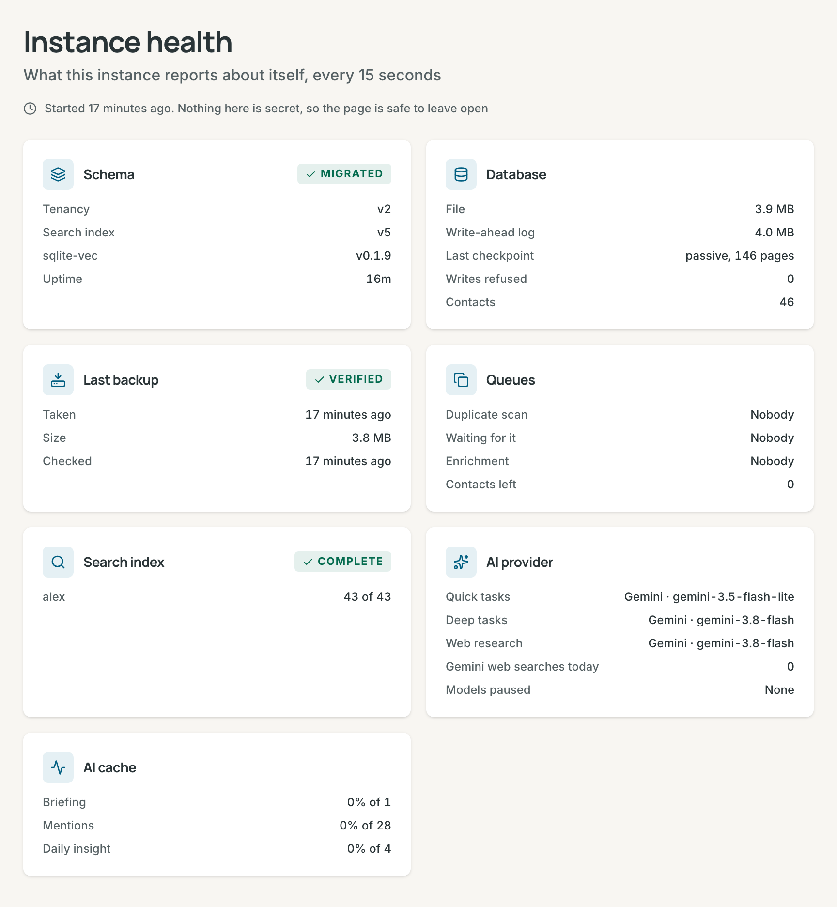

# Self-hosting

Run Contrack on your own machine or server. This page covers the install, your
data, remote access, backups, upgrades, health, and fixes for common problems.
Every variable is in the [Configuration reference](configuration.md).

## Requirements

- **With Docker:** Docker Engine or Docker Desktop. The image runs on
  `linux/amd64` and `linux/arm64`.
- **Without Docker:** Node.js 26.10 or later, npm 11.19 or later, and Git.
- Disk space for the data folder, which grows with your contacts, attachments
  and snapshots. AI is optional (see [AI](ai.md)).

## Install with Docker

```bash
docker run -d --name contrack \
  -p 127.0.0.1:3210:3210 \
  -v "$PWD/contrack-data":/app/data \
  --restart unless-stopped \
  ghcr.io/arvarik/contrack:latest
```

Open `http://localhost:3210`.

- The port is published on this machine only. Sign-in is off by default, so
  read [Remote access](#remote-access) before you publish it wider.
- `/app/data` holds everything that must survive a restart. Mount only that
  folder, never a folder over `/app`, which holds the app itself.
- The image holds the two local search models, so the container downloads
  nothing.
- `latest` follows the main branch. Each release also has version tags, such
  as `X.Y.Z` and `X.Y`.
- Add settings with `-e`, such as `-e GEMINI_API_KEY=your-key`, or set them in
  the app.

On Linux, the container runs as user ID 1000. When Docker creates
`contrack-data` for you, root owns it and the container cannot write there.
Create the folder first: `mkdir contrack-data && sudo chown 1000:1000 contrack-data`.

`docker ps` shows `healthy` once the app answers. `docker logs -f contrack`
shows the log, and `docker stop contrack` shuts Contrack down cleanly.

### Docker Compose

Compose builds the image from the source code:

```bash
git clone https://github.com/arvarik/contrack.git
cd contrack
cp .env.example .env
docker compose up -d --build
```

The data goes to `./data`, and the port is published on `127.0.0.1:3210`. Put
settings in `.env`. Compose passes most of them to the container
([Environment Variables](configuration.md#environment-variables) names the
eight that it does not). The first build installs the dependencies and
downloads the search models, so it takes a few minutes.

## Install without Docker

```bash
git clone https://github.com/arvarik/contrack.git
cd contrack
npm install
npm run models:fetch
npm run dev
```

Open `http://localhost:3210`.

- `npm run models:fetch` puts the two search models (about 29 MB) in `models/`
  and checks each file. Without it, the first start downloads them from
  huggingface.co. The script reads `.env`, so a `DATA_DIR` or `MODEL_DIR` set
  there moves the folder for the script and the server together.
- `npm run dev` runs the server in development mode, with the Vite dev server.
  It listens on this machine only, and it refuses to start when `HOST` is not
  `127.0.0.1`, `::1` or `localhost`. For other machines, run the production
  build below.
- To change a setting, run `cp .env.example .env` and edit `.env`. The server
  reads it from the folder you start it in. A variable set in the shell wins.

For production, or to serve other machines, build the app and start it in
production mode. Run it under a service manager, such as systemd, that stops
it with SIGTERM.

```bash
npm run build
NODE_ENV=production node server.ts
```

## What happens on first boot

1. Contrack checks `PUBLIC_URL`, `CONTRACK_SECRET_KEY` and `TRUST_PROXY_HOPS`.
   A bad value stops the start with a message.
2. It creates the database, or applies the migrations a newer release added,
   and limits its data files to its own user. A database it did not create,
   such as one from Contrack 1, stops the start, and nothing in it changes.
3. It starts to listen, and logs `Contrack CRM running on http://localhost:3210`.
4. In the background, it loads the search models and indexes your contacts,
   places addresses on the map, loads the AI model lists, starts connector
   syncs and scores contacts. About 15 seconds after the start, it takes a
   snapshot.

The app is usable while this runs. With `AUTH_REQUIRED=true` and no account
yet, the first visit shows the setup screen. The first account is an admin,
and it takes over the contacts already on the instance.

## Where your data lives

All data lives in one folder, `DATA_DIR`: the folder you start the server in,
or `/app/data` in Docker.

| Path                               | What it holds                                                                              |
| ---------------------------------- | ------------------------------------------------------------------------------------------ |
| `curator.db`                       | The database: every account's contacts, notes and settings                                 |
| `curator.db-wal`, `curator.db-shm` | SQLite's working files while the server runs. They belong with `curator.db`                |
| `uploads/`                         | Photos, attachments and link-preview images, in one folder per account, and company logos  |
| `backups/`                         | Snapshots of the database, each with a `.json` file that records its check                 |
| `models/`                          | Search models from `npm run models:fetch`. The Docker image keeps its own in `/app/models` |
| `.cache/`                          | Model files that the server downloaded itself, when `DATA_DIR` is set                      |
| `secret.key`                       | The key that encrypts stored credentials, unless `CONTRACK_SECRET_KEY` is set              |

- At start, Contrack limits these files to its own user: files `0600`, folders
  `0700`. When it cannot change one, the log names it.
- The database is not encrypted. Anyone who can read `curator.db` or a
  snapshot can read every contact. Use disk encryption when that matters.
- `secret.key` encrypts AI keys, the mail password, connector credentials and
  the Google client secret. Without it, you must enter them again. Keep it
  with your backups.

## Remote access

Sign-in is off by default, and then anyone who can reach the port has full
access. Turn on sign-in before other devices can reach Contrack.

1. Set `AUTH_REQUIRED=true` and restart Contrack. Create the admin account on
   the first visit (see [Turn on sign-in](accounts.md#turn-on-sign-in)).
2. Open the port. Without Docker, run the production build (see
   [Install without Docker](#install-without-docker)) and set `HOST=0.0.0.0`.
   With `docker run`, publish `-p 3210:3210`. With Compose, change
   `"127.0.0.1:3210:3210"` to `"3210:3210"` in `docker-compose.yml`.
3. From outside your network, use HTTPS through a reverse proxy, or a private
   network such as a VPN. Contrack itself serves plain HTTP.

The server logs a warning when it listens beyond this machine with sign-in
off.

### Behind a reverse proxy

Set two variables:

```bash
TRUST_PROXY_HOPS=1
PUBLIC_URL=https://crm.example.com
```

- `TRUST_PROXY_HOPS=1` makes Contrack trust the proxy's `X-Forwarded-*`
  headers. Rate limits and the audit log then see the real client address.
  HTTPS requests count as secure, so the session cookie is marked `Secure` and
  the server sends HSTS.
- `PUBLIC_URL` is the address people open, with no path. Passkeys, invitation
  links and the Google connector use it. Mail sends no sign-in, reset or
  invitation link without it (see [Outgoing mail](accounts.md#outgoing-mail)).
- A signed-in change must come from a page at this server's own address: the
  `Host` header the proxy forwards, or `PUBLIC_URL`. Otherwise it gets
  `403 CROSS_SITE_REQUEST`.

With the proxy on the same host, keep the port on `127.0.0.1`. Caddy gets a
certificate and sends the forwarded headers by itself:

```text
crm.example.com {
    reverse_proxy 127.0.0.1:3210
}
```

nginx needs the headers set, and a body limit for attachments and imports of
up to 50 MB:

```nginx
server {
    listen 443 ssl;
    server_name crm.example.com;
    ssl_certificate     /etc/ssl/crm.example.com.crt;
    ssl_certificate_key /etc/ssl/crm.example.com.key;
    client_max_body_size 50m;

    location / {
        proxy_pass http://127.0.0.1:3210;
        proxy_http_version 1.1;
        proxy_set_header Host $host;
        proxy_set_header X-Forwarded-For $proxy_add_x_forwarded_for;
        proxy_set_header X-Forwarded-Proto $scheme;
    }
}
```

Contrack keeps idle connections open for 65 seconds. Keep the proxy's
keep-alive to Contrack shorter than that.

Contrack compresses its answers with brotli or gzip, so the proxy needs no
compression setting. Ask Contrack's results and the progress of an import, a
duplicate scan or contact research arrive as streams, one line at a time.
Contrack sends those uncompressed and with `X-Accel-Buffering: no`, so each
line shows as soon as it is written, also behind nginx's default buffering. If
you turn on compression in the proxy anyway, leave out `text/event-stream` and
`application/x-ndjson`.

### Claude on the web, Claude on your phone, and ChatGPT

These assistants call Contrack from their own servers on the internet, and
they sign in with OAuth. Your computer is not the one that connects. So they
need three things:

1. Sign-in is on (`AUTH_REQUIRED=true`).
2. `PUBLIC_URL` is the `https` address of Contrack.
3. That address answers from the public internet, through a reverse proxy
   with a certificate, or a tunnel such as Cloudflare Tunnel or Tailscale
   Funnel. An address on a VPN or your home network only is not enough.

Then add `https://<your address>/api/mcp` in the assistant, as
[Connect Claude or ChatGPT](mcp.md#connect-claude-or-chatgpt) says, and sign
in to Contrack when it asks. The OAuth routes are `/.well-known/oauth-*`
and `/oauth/*`, so a proxy that forwards only `/api` must forward those too.

Claude's servers connect from the address range `160.79.104.0/21`. To allow
only that range at the proxy, limit `/api/mcp`, `/oauth/token`,
`/oauth/register` and `/oauth/revoke` to it. Leave the rest open to your
own browser: it opens `/oauth/authorize`, the consent page and the sign-in
page itself.

Claude Code, Cursor, VS Code and Gemini CLI run on your own computer. They
can sign in with OAuth too, and they need only an address that computer can
reach. For a local test, `PUBLIC_URL=http://localhost:3210` turns OAuth on
for them.

## Backups and restore

By default, Contrack takes a snapshot of the whole database every 24 hours,
and one about 15 seconds after each start. It keeps the newest 7. It checks each snapshot at
once: the file must pass SQLite's integrity check and hold rows in every
table.

- **Settings → Administration → Backups** lists each snapshot with its check:
  **Verified**, **Failed** or **Not checked**. **Snapshot now** takes one at
  once.
- **Settings → Administration → General** sets **Backups** (Off, 6 hours, 12
  hours, 24 hours or 7 days) and **Snapshots to keep** (3, 7, 14 or 30).
  `BACKUP_INTERVAL_HOURS` and `BACKUP_KEEP` set them from the environment.
- The files are `DATA_DIR/backups/curator-<date>T<time>.db`, in UTC. Scripts
  can call `POST /api/backups` as an admin (see the
  [REST API reference](api-reference.md)).

### Copy them to another machine

A snapshot on the same disk is not a backup, and it holds only the database.
Copy these to another machine on a schedule:

- the newest verified snapshot from `backups/`
- the `uploads/` folder
- `secret.key`, or a copy of `CONTRACK_SECRET_KEY`

To copy the whole data folder at once, stop Contrack first. Each account can
also [export](import-and-sync.md#export) its own contacts.

### Restore a snapshot

1. Stop Contrack: `docker stop contrack`, or stop the server process.
2. Copy the current `curator.db` aside, in case you need it again.
3. Copy the snapshot over `curator.db`.
4. Delete `curator.db-wal` and `curator.db-shm` when they are there. They
   belong to the old database.
5. Keep the `secret.key` that the snapshot was taken with.
6. Start Contrack, and check `/healthz` or **Instance health**.

```bash
cd contrack-data
cp curator.db curator.db.before-restore
cp backups/curator-2026-09-28T02-00-00.db curator.db
rm -f curator.db-wal curator.db-shm
```

In Docker on Linux, the file must belong to user ID 1000:
`sudo chown 1000:1000 curator.db`.

## Upgrade

Contrack applies new migrations when it starts. Back up first: choose
**Snapshot now**, and copy the snapshot or the data folder to another machine.
The [changelog](../CHANGELOG.md) lists what each release changes.

```bash
# Docker: pull, remove the container, then run the same docker run command
docker pull ghcr.io/arvarik/contrack:latest
docker stop contrack && docker rm contrack

# Docker Compose
git pull && docker compose up -d --build

# Without Docker: update, build for production, then restart the server
git pull && npm install && npm run models:fetch && npm run build
```

After the start, `/healthz` shows the last migration that the database applied
(`schema.migration`) beside the last migration that the build holds
(`schema.expects`). They match when the upgrade is complete. A migration that
fails stops the start, keeps nothing it changed, and names itself in the log.
A build refuses to start on a database that a newer build has migrated:
restore the backup that you took before the upgrade.

Contrack 2 is a new start. It does not open a data folder from Contrack 1:
it stops with a message and changes nothing. Give Contrack 2 an empty
`DATA_DIR`, and keep the old folder if you may go back to 1.x.

## Offline installs

Contrack works on a machine with no internet access, with a few limits.

- **Search models.** The Docker image holds them. Without Docker, run
  `npm run models:fetch` once while online, then set `MODEL_DOWNLOADS=false`.
  `npm run models:fetch -- --check` checks the files, and `HF_ENDPOINT` points
  the script at a mirror.
- **The script does not read `.env`.** When `.env` sets `DATA_DIR` or
  `MODEL_DIR`, give the script the folder:
  `npm run models:fetch -- /srv/contrack/models`.
- **npm install.** On Linux x64, `ONNXRUNTIME_NODE_INSTALL=skip npm install`
  skips GPU files that Contrack does not use.
- **These need the network:** AI providers (an OpenAI-compatible server on
  your network works), the basemap tiles (unless you [host your own](configuration.md#map)),
  placing addresses on the map, company logos, link previews in notes, the
  weather, connectors, and outgoing mail.

[Model files and offline installs](configuration.md#model-files-and-offline-installs)
lists the folders and the order in which the server reads them.

## Health and logs



- `GET /healthz` answers `200` with `"status":"ok"` when the server and the
  database respond, and `503` when the database does not. It needs no
  sign-in, so an uptime monitor can call it. The Docker image calls it every
  30 seconds, and gives the first start 60 seconds.
- **Settings → Administration → Instance health** shows the database and its
  write-ahead log, the last backup, the job queues, the search index, the AI
  provider for each task, and the AI cache. It refreshes every 15 seconds.
  - Its **Background jobs** card lists each recurring job (the connector
    sync, the score sweeps, the backup, the daily sweep, the trash purge, the
    expired merges, the unused files, the address cache, the model lists and
    the planner statistics) with its last run, its result
    and its next run, and the jobs that failed in the last 24 hours with
    their errors. `JOB_CONCURRENCY` sets how many jobs run at once.
- The server writes its log to standard output: the terminal, or
  `docker logs contrack`. Each line has the time, the level and the area, such
  as `[WARN] [Auth]`. Colours appear only in a terminal.
- `LOG_LEVEL` sets how much it writes: `error`, `warn`, `info` (the default)
  or `debug`. Each request is one `info` line, with the client's IP address,
  the path and no query string.
- The log says what happened, to which record id, how many and how long. It
  never holds a name, an email address, a phone number, a street address, a
  note or its title, a search or an Ask question, a file name, a pasted link
  or what a model wrote.
- Docker Compose keeps the log in three files of 10 MB. When they are full,
  Docker drops the oldest lines, so the log reaches back about 30 MB, however
  many days that is. Change `max-size` and `max-file` under `logging:` in
  `docker-compose.yml`. With `docker run`, add
  `--log-opt max-size=10m --log-opt max-file=3`, because Docker otherwise
  keeps every line for as long as the container exists.
- On SIGTERM or SIGINT (`docker stop`, or `Ctrl+C`), the server finishes open
  requests, closes the database and exits. After 8 seconds it forces the
  close. A second signal exits at once.

## Security checklist

- Turn on sign-in before anything but this machine can reach the port.
- Keep **Anyone can create an account** off, and use **Invitations** (see
  [Administration](accounts.md#administration)).
- Serve remote access over HTTPS, with `TRUST_PROXY_HOPS` and `PUBLIC_URL`
  set.
- Protect `secret.key` and the snapshots like the database. Together they
  open every stored credential.
- Encrypt the disk that holds the data folder, and run Contrack as its own
  user.
- Leave `CONNECTORS_ALLOW_PRIVATE_HOSTS` off when the internet can reach
  Contrack.
- Use a Gemini key from a Cloud project with billing (see
  [Privacy](ai.md#privacy)).
- Pull new images. A rebuilt image takes the latest Node 26 security release.

## Troubleshooting

### Port 3210 is already in use

The log shows `EADDRINUSE`, and the server exits. Stop the other program, or
use another port: set `PORT`, or with Docker change only the host side, as in
`-p 127.0.0.1:3310:3210`.

### The server refuses to start

The log names the variable:

- `DATA_DIR` holds tables that Contrack 2 did not create: start with an empty
  folder. A data folder from Contrack 1 is one of these.
- `PUBLIC_URL`: use an `http` or `https` origin with no path, such as
  `https://crm.example.com`.
- `TRUST_PROXY_HOPS`: use a whole number from 0 to 10.
- `CONTRACK_SECRET_KEY`: use 64 hex characters, from `openssl rand -hex 32`.

### Search models are missing on an offline install

With `MODEL_DOWNLOADS=false`, the log names the missing model, the folder, and
the fix. Search keeps working on keywords. Run `npm run models:fetch`, with
the folder when `.env` sets `DATA_DIR` or `MODEL_DIR`. Or set
`MODEL_DOWNLOADS=true` for one start.

To check that both models load and run, use `npm run models:smoke`, or
`docker exec contrack node scripts/model-smoke.ts` in a container. It embeds
one sentence and scores one pair, and fails with the reason when a model or
its runtime is missing.

### Passkeys fail on an IP address

Passkeys need a domain name or `localhost`. On an address such as
`http://192.168.1.50:3210`, Contrack says "Passkeys require a domain name or
localhost (IP addresses are not supported)." Serve Contrack under a host name
with HTTPS, and set `PUBLIC_URL` (see [Passkeys](accounts.md#passkeys)).

### Mail arrives without a link

Mail sends no sign-in, reset or invitation link until `PUBLIC_URL` is set, and
the server logs a warning at start. Set `PUBLIC_URL` and restart.

### HTTPS is not detected behind a proxy

The session cookie is not marked `Secure`, passkeys see the wrong address, or
the audit log shows the proxy's address. Set `TRUST_PROXY_HOPS` to the number
of proxies, and make the proxy send `X-Forwarded-Proto` and `X-Forwarded-For`.

### You forgot the only admin password

The reset command takes a username or an email address and prints a temporary
password. It also ends the account's sessions and revokes its API tokens (see
[Reset a password](accounts.md#reset-a-password)).

```bash
# Without Docker
npm run reset-password <username>

# Docker
docker exec -it contrack node scripts/reset-password.ts <username>
```

### Contrack asks for sign-in, but AUTH_REQUIRED is false

Accounts with a password exist, so Contrack enforces sign-in and logs an error
at start. Set `AUTH_REQUIRED=true` to match.

### The container cannot write to /app/data

Root owns the host folder, and the container runs as user ID 1000. Run
`sudo chown -R 1000:1000 contrack-data`, then start the container again.

### Uploads fail behind nginx with 413

nginx accepts 1 MB by default. Add `client_max_body_size 50m;` to the `server`
block, and reload nginx.

### AI keys or mail stop working after a move or a restore

`secret.key` is missing or different, or `CONTRACK_SECRET_KEY` changed. The
log says that a saved key "cannot be decrypted". Put the old `secret.key`
back. Or enter the credentials again in **Administration → AI**, in
**Outgoing mail**, and in each connector.

### npm fails with EBADDEVENGINES

The project needs Node 26.10 or later and npm 11.19 or later. Install them,
and run `npm install` again.

### docker ps shows unhealthy

The health check got no answer, or `503`. Read `docker logs contrack`. A `503`
from `/healthz` means that the database does not answer.

## Related

- [Configuration reference](configuration.md)
- [Accounts and sign-in](accounts.md#turn-on-sign-in)
- [AI](ai.md)
- [Getting started](getting-started.md)
- [Architecture](architecture.md)
